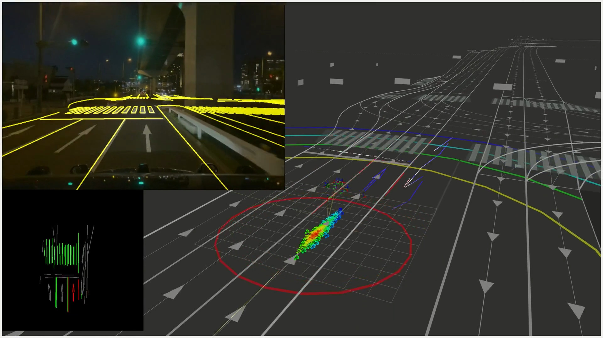

# YabLoc

**YabLoc** is vision-based localization with vector map. [https://youtu.be/Eaf6r_BNFfk](https://youtu.be/Eaf6r_BNFfk)

[](https://youtu.be/Eaf6r_BNFfk)

## Packages

- [yabloc_common](yabloc_common/README.md)
- [yabloc_image_processing](yabloc_image_processing/README.md)
- [yabloc_particle_filter](yabloc_particle_filter/README.md)
- [yabloc_pose_initializer](yabloc_pose_initializer/README.md)

## How to launch YabLoc instead of NDT

When launching autoware, if you set `localization_mode:=yabloc` as an argument, YabLoc will be launched instead of NDT.
By default, `localization_mode` is `ndt`.

A sample command to run YabLoc is as follows

```shell
ros2 launch autoware_launch logging_simulator.launch.xml \
  map_path:=$HOME/autoware_map/sample-map-rosbag\
  vehicle_model:=sample_vehicle \
  sensor_model:=sample_sensor_kit \
  localization_mode:=yabloc
```

## Architecture


