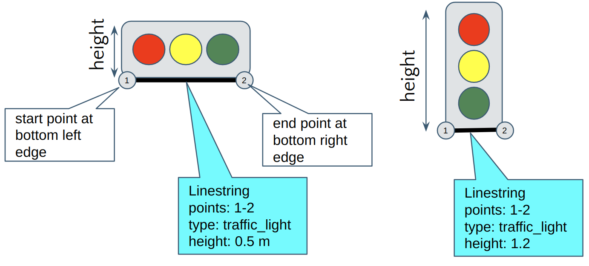
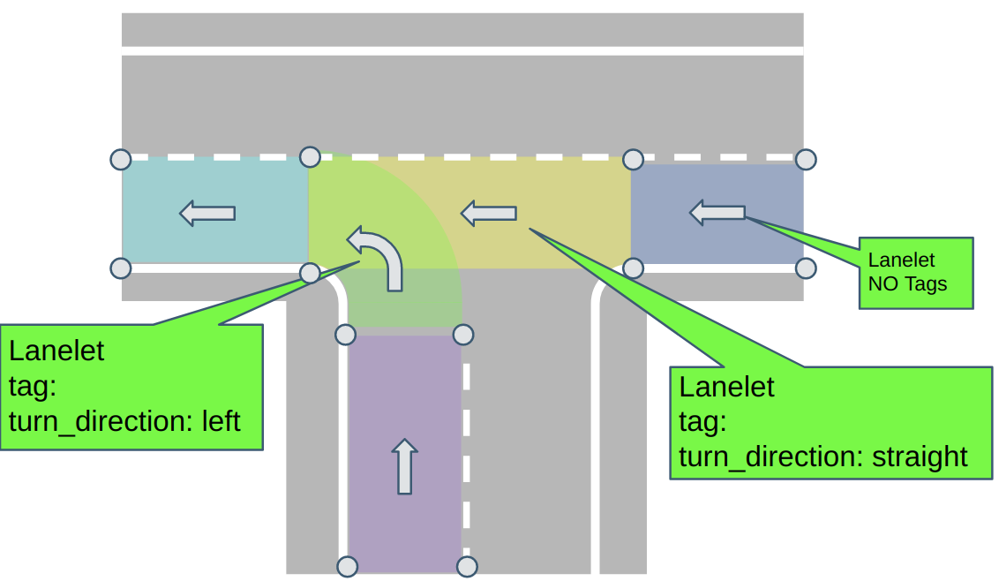
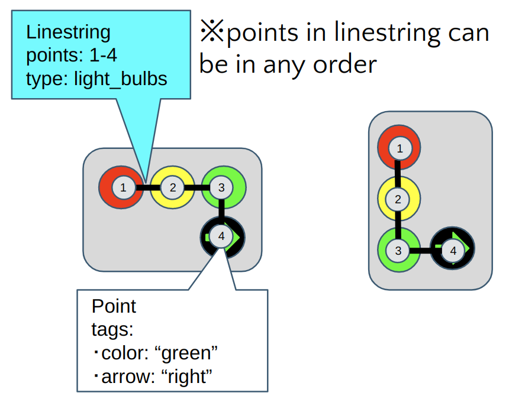
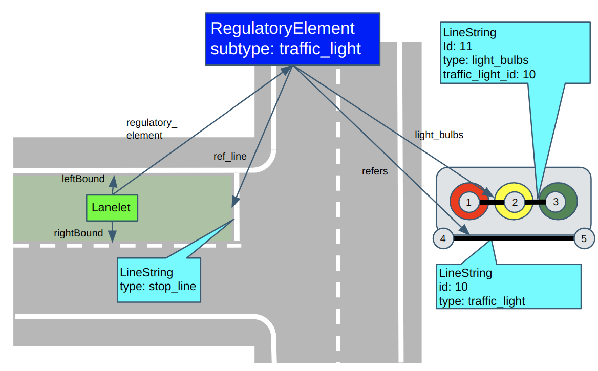

# Modifying Lanelet2 format for Autoware

## Overview

About the basics of the default format, please refer to main [Lanelet2 repository](https://github.com/fzi-forschungszentrum-informatik/Lanelet2). (see [here](https://github.com/fzi-forschungszentrum-informatik/Lanelet2/blob/master/lanelet2_core/doc/LaneletPrimitives.md) about primitives)

In addition to default Lanelet2 Format, users should add following mandatory/optional tags to their osm lanelet files as explained in reset of this document.
Users may use `autoware_lanelet2_validation` [node](../README.md#nodes) to check if their maps are valid.

The following is the extra format added for Autoware:

- [extra regulatory elements](extra_regulatory_elements.md)
  - Detection Area
  - Road Marking
- [extra lanelet subtype](extra_lanelet_subtypes.md)
  - Roadside Lane

## Mandatory Tags

### Elevation Tags

Elevation("ele") information for points(`node`) is optional in default Lanelet2 format.
However, some of Autoware packages(e.g. trafficlight_recognizer) need elevation to be included in HD map. Therefore, users must make sure that all points in their osm maps contain elevation tags.

Here is an example osm syntax for node object.

```xml
<node id='1' visible='true' version='1' lat='49.00501435943' lon='8.41687458512'>
  <tag k='ele' v='3.0'/> <!-- this tag is mandatory for Autoware!! -->
</node>
```

### TrafficLights

Default Lanelet2 format uses LineString(`way`) or Polygon class to represent the shape of a traffic light. For Autoware, traffic light objects must be represented only by LineString to avoid confusion, where start point is at bottom left edge and end point is at bottom right edge. Also, "height" tag must be added in order to represent the size in vertical direction (not the position).

The Following image illustrates how LineString is used to represent shape of Traffic Light in Autoware.


Here is an example osm syntax for traffic light object.

```xml
<way id='13' visible='true' version='1'>
  <nd ref='6' />
  <nd ref='5' />
  <tag k='type' v='traffic_light' />
  <tag k='subtype' v='red_yellow_green' />
  <tag k='height' v='0.5'/> <!-- this tag is mandatory for Autoware!! -->
</way>
```

### Turn Directions

Users must add "turn_direction" tags to lanelets within intersections to indicate vehicle's turning direction. You do not need this tags for lanelets that are not in intersections. If you do not have this tag, Autoware will not be able to light up turning indicators.
This tags only take following values:

- left
- right
- straight

Following image illustrates how lanelets should be tagged.



Here is an example of osm syntax for lanelets in intersections.

```xml
<relation id='1' visible='true' version='1'>
  <member type='way' ref='2' role='left' />
  <member type='way' ref='3' role='right' />
  <member type='relation' ref='4' role='regulatory_element' />
  <tag k='location' v='urban' />
  <tag k='one_way' v='yes' />
  <tag k='subtype' v='road' />
  <tag k='type' v='lanelet' />
  <tag k='turn_direction' v='left' /> <!-- this tag is mandatory for lanelets at intersections!! -->
</relation>
```

## Optional Taggings

Following tags are optional tags that you may want to add depending on how you want to use your map in Autoware.

### Meta Info

Users may add the `MetaInfo` element to their OSM file to indicate format version and map version of their OSM file. This information is not meant to influence Autoware vehicle's behavior, but is published as ROS message so that developers could know which map was used from ROSBAG log files. MetaInfo elements exists in the same hierarchy with `node`, `way`, and `relation` elements, otherwise JOSM wouldn't be able to load the file correctly.

Here is an example of MetaInfo in osm file:

```xml
<?xml version='1.0' encoding='UTF-8'?>
<osm version='0.6' generator='JOSM'>
  <MetaInfo format_version='1.0' map_version='1.0'/>
  <node>...</node>
  <way>...</way>
  <relation>...</relation>
</osm>
```

### Local Coordinate Expression

Sometimes users might want to create Lanelet2 maps that are not georeferenced.
In such a case, users may use "local_x", "local_y" taggings to express local positions instead of latitude and longitude.
Autoware Osm Parser will overwrite x,y positions with these tags when they are present.
For z values, use "ele" tags as default Lanelet2 Format.
You would still need to fill in lat and lon attributes so that parser does not crush, but their values could be anything.

Here is example `node` element in osm with "local_x", "local_y" taggings:

```xml
<!-- lat/lon attributes are required, but their values can be anything -->
<node id='40648' visible='true' version='1' lat='0' lon='0'>
  <tag k='local_x' v=2.54'/>
  <tag k='local_y' v=4.38'/>
  <tag k='ele' v='3.0'/>
</node>
```

### Light Bulbs in Traffic Lights

Default Lanelet format can only express shape (base + height) of traffic lights.
However, region_tlr node in Autoware uses positions of each light bulbs to recognize color of traffic light. If users may wish to use this node, "light_bulbs"(`way`) element must be registered to traffic_light regulatory_element object define position and color of each light bulb in traffic lights. If you are using other trafficlight_recognizer nodes(e.g. tlr_mxnet), which only uses bounding box of traffic light, then you do not need to add this object.

"light_bulbs" object is defined using LineString(`way`), and each node of line string is placed at the center of each light bulb. Also, each node should have "color" and optionally "arrow" tags to describe its type. Also, "traffic_light_id" tag is used to indicate which ID of relevant traffic_light element.

"color" tag is used to express the color of the light bulb. Currently only three values are used:

- red
- yellow
- green

"arrow" tag is used to express the direction of the arrow of light bulb:

- up
- right
- left
- up_right
- up_left

Following image illustrates how "light_bulbs" LineString should be created.



Here is an example of osm syntax for light_bulb object:

```xml
<node id=1 version='1' lat='49.00541994701' lon='8.41565013855'>
  <tag k='ele' v='5'/>
  <tag k='color' v='red'/>
</node>
<node id=2 version='1' lat='49.00542091657' lon='8.4156469497'>
  <tag k='ele' v='5'/>
  <tag k='color' v='yellow'/>
</node>
<node id=3 version='1' lat='49.00542180052' lon='8.41564400223'>
  <tag k='ele' v='5'/>
  <tag k='color' v='green'/>
</node>
<node id=3 version='1' lat='49.00542180052' lon='8.41564400223'>
  <tag k='ele' v='4.6'/>
  <tag k='color' v='green'/>
  <tag k=arrow v='right'/>
</node>
<way id=11 version='1'>
  <nd ref=1 />
  <nd ref=2 />
  <nd ref=3 />
  <tag k='traffic_light_id' v='10'/> <!-- id of linestring with type="traffic_light" -->
  <tag k='type' v='light_bulbs' />
</way>
```

After creating "light_bulbs" elements, you have to register them to traffic_light regulatory element as role "light_bulbs".
The following illustrates how light_bulbs are registered to traffic_light regulatory elements.



```xml
<relation id='8' visible='true' version='1'>
  <tag k='type' v='regulatory_element' />
  <tag k='subtype' v='traffic_light' />
  <member type='way' ref='9' role='ref_line' />
  <member type='way' ref='10' role='refers' /> <!-- refers to the traffic light line string -->
  <member type='way' ref='11' role='light_bulbs'/> <!-- refers to the light_bulb line string -->
</relation>
```
