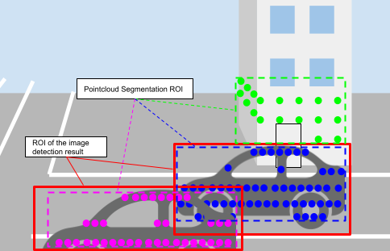

# roi_cluster_fusion

## Purpose

The `roi_cluster_fusion` is a package for filtering clusters that are less likely to be objects and overwriting labels of clusters with that of Region Of Interests (ROIs) by a 2D object detector.

## Inner-workings / Algorithms

The clusters are projected onto image planes, and then if the ROIs of clusters and ROIs by a detector are overlapped, the labels of clusters are overwritten with that of ROIs by detector. Intersection over Union (IoU) is used to determine if there are overlaps between them.

## Inputs / Outputs

### Input

| Name                     | Type                                                     | Description                                               |
| ------------------------ | -------------------------------------------------------- | --------------------------------------------------------- |
| `input`                  | `tier4_perception_msgs::msg::DetectedObjectsWithFeature` | clustered pointcloud                                      |
| `input/camera_info[0-7]` | `sensor_msgs::msg::CameraInfo`                           | camera information to project 3d points onto image planes |
| `input/rois[0-7]`        | `tier4_perception_msgs::msg::DetectedObjectsWithFeature` | ROIs from each image                                      |
| `input/image_raw[0-7]`   | `sensor_msgs::msg::Image`                                | images for visualization                                  |

### Output

| Name                     | Type                                                     | Description                |
| ------------------------ | -------------------------------------------------------- | -------------------------- |
| `output`                 | `tier4_perception_msgs::msg::DetectedObjectsWithFeature` | labeled cluster pointcloud |
| `~/debug/image_raw[0-7]` | `sensor_msgs::msg::Image`                                | images for visualization   |

## Parameters

The following figure is an inner pipeline overview of RoI cluster fusion node.
Please refer to it for your parameter settings.

### Core Parameters

| Name                        | Type   | Description                                                                                                                                                                                                                        |
| --------------------------- | ------ | ---------------------------------------------------------------------------------------------------------------------------------------------------------------------------------------------------------------------------------- |
| `fusion_distance`           | double | If the detected object's distance to frame_id is less than the threshold, the fusion will be processed                                                                                                                             |
| `trust_object_distance`     | double | if the detected object's distance is less than the `trust_object_distance`, `trust_object_iou_mode` will be used, otherwise `non_trust_object_iou_mode` will be used                                                               |
| `trust_object_iou_mode`     | string | select mode from 3 options {`iou`, `iou_x`, `iou_y`} to calculate IoU in range of [`0`, `trust_distance`].   &emsp;`iou`: IoU along x-axis and y-axis   &emsp;`iou_x`: IoU along x-axis   &emsp;`iou_y`: IoU along y-axis |
| `non_trust_object_iou_mode` | string | the IOU mode using in range of [`trust_distance`, `fusion_distance`] if `trust_distance` < `fusion_distance`                                                                                                                       |
| `use_cluster_semantic_type` | bool   | if `false`, the labels of clusters are overwritten by `UNKNOWN` before fusion                                                                                                                                                      |
| `only_allow_inside_cluster` | bool   | if `true`, the only clusters contained inside RoIs by a detector                                                                                                                                                                   |
| `roi_scale_factor`          | double | the scale factor for offset of detector RoIs if `only_allow_inside_cluster=true`                                                                                                                                                   |
| `iou_threshold`             | double | the IoU threshold to overwrite a label of clusters with a label of roi                                                                                                                                                             |
| `unknown_iou_threshold`     | double | the IoU threshold to fuse cluster with unknown label of roi                                                                                                                                                                        |
| `remove_unknown`            | bool   | if `true`, remove all `UNKNOWN` labeled objects from output                                                                                                                                                                        |
| `rois_number`               | int    | the number of input rois                                                                                                                                                                                                           |
| `debug_mode`                | bool   | If `true`, subscribe and publish images for visualization.                                                                                                                                                                         |

## Assumptions / Known limits

<!-- Write assumptions and limitations of your implementation.

Example:
  This algorithm assumes obstacles are not moving, so if they rapidly move after the vehicle started to avoid them, it might collide with them.
  Also, this algorithm doesn't care about blind spots. In general, since too close obstacles aren't visible due to the sensing performance limit, please take enough margin to obstacles.
-->

## (Optional) Error detection and handling

<!-- Write how to detect errors and how to recover from them.

Example:
  This package can handle up to 20 obstacles. If more obstacles found, this node will give up and raise diagnostic errors.
-->

## (Optional) Performance characterization

<!-- Write performance information like complexity. If it wouldn't be the bottleneck, not necessary.

Example:

  ### Complexity

  This algorithm is O(N).

  ### Processing time

  ...
-->

## (Optional) References/External links

<!-- Write links you referred to when you implemented.

Example:
  [1] {link_to_a_thesis}
  [2] {link_to_an_issue}
-->

## (Optional) Future extensions / Unimplemented parts

<!-- Write future extensions of this package.

Example:
  Currently, this package can't handle the chattering obstacles well. We plan to add some probabilistic filters in the perception layer to improve it.
  Also, there are some parameters that should be global(e.g. vehicle size, max steering, etc.). These will be refactored and defined as global parameters so that we can share the same parameters between different nodes.
-->
