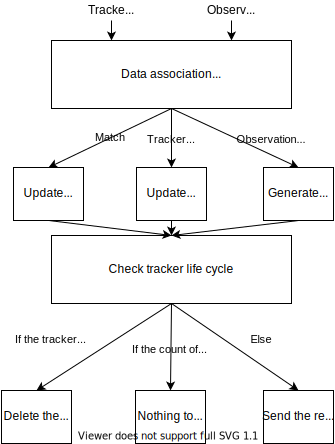
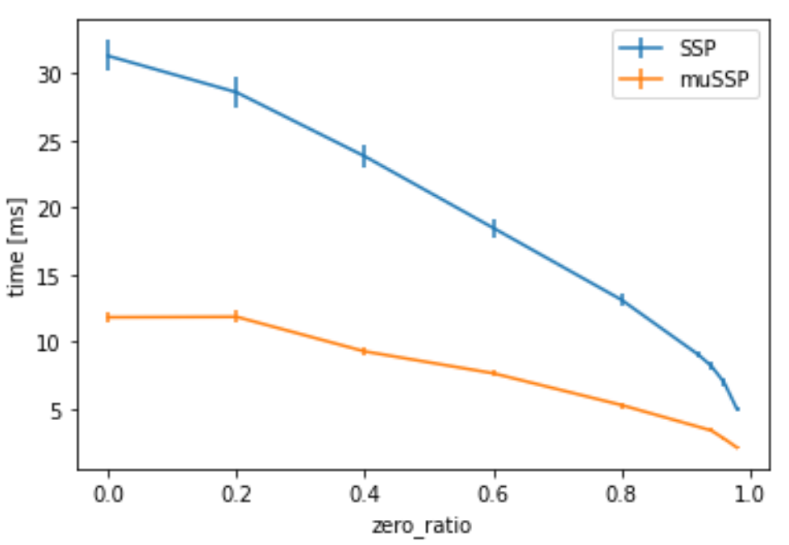

# multi_object_tracker

## Purpose

The results of the detection are processed by a time series. The main purpose is to give ID and estimate velocity.

## Inner-workings / Algorithms

This multi object tracker consists of data association and EKF.

### Data association

The data association performs maximum score matching, called min cost max flow problem.
In this package, mussp[1] is used as solver.
In addition, when associating observations to tracers, data association have gates such as the area of the object from the BEV, Mahalanobis distance, and maximum distance, depending on the class label.

### EKF Tracker

Models for pedestrians, bicycles (motorcycles), cars and unknown are available.
The pedestrian or bicycle tracker is running at the same time as the respective EKF model in order to enable the transition between pedestrian and bicycle tracking.
For big vehicles such as trucks and buses, we have separate models for passenger cars and large vehicles because they are difficult to distinguish from passenger cars and are not stable. Therefore, separate models are prepared for passenger cars and big vehicles, and these models are run at the same time as the respective EKF models to ensure stability.

<!-- Write how this package works. Flowcharts and figures are great. Add sub-sections as you like.

Example:
  ### Flowcharts

  ...(PlantUML or something)

  ### State Transitions

  ...(PlantUML or something)

  ### How to filter target obstacles

  ...

  ### How to optimize trajectory

  ...
-->

## Inputs / Outputs

### Input

Multiple inputs are pre-defined in the input channel parameters (described below) and the inputs can be configured

| Name                      | Type                       | Description            |
| ------------------------- | -------------------------- | ---------------------- |
| `selected_input_channels` | `std::vector<std::string>` | array of channel names |

- default value: `selected_input_channels:="['detected_objects']"`, merged DetectedObject message
- multi-input example: `selected_input_channels:="['lidar_centerpoint','camera_lidar_fusion','detection_by_tracker','radar_far']"`

### Output

| Name       | Type                                            | Description     |
| ---------- | ----------------------------------------------- | --------------- |
| `~/output` | `autoware_perception_msgs::msg::TrackedObjects` | tracked objects |

## Parameters

### Input Channel parameters

{{ json_to_markdown("perception/autoware_multi_object_tracker/schema/input_channels.schema.json") }}

### Core Parameters

{{ json_to_markdown("perception/autoware_multi_object_tracker/schema/multi_object_tracker_node.schema.json") }}
{{ json_to_markdown("perception/autoware_multi_object_tracker/schema/data_association_matrix.schema.json") }}

#### Simulation parameters

{{ json_to_markdown("perception/autoware_multi_object_tracker/schema/simulation_tracker.schema.json") }}

## Assumptions / Known limits

See the [model explanations](models.md).

## (Optional) Error detection and handling

<!-- Write how to detect errors and how to recover from them.

Example:
  This package can handle up to 20 obstacles. If more obstacles found, this node will give up and raise diagnostic errors.
-->

## (Optional) Performance characterization

### Evaluation of muSSP

According to our evaluation, muSSP is faster than normal [SSP](src/data_association/successive_shortest_path) when the matrix size is more than 100.

Execution time for varying matrix size at 95% sparsity. In real data, the sparsity was often around 95%.

Execution time for varying the sparsity with matrix size 100.

## (Optional) References/External links

This package makes use of external code.

| Name                                                      | License                                                   | Original Repository                  |
| --------------------------------------------------------- | --------------------------------------------------------- | ------------------------------------ |
| [muSSP](src/data_association/mu_successive_shortest_path) | [Apache-2.0](https://www.apache.org/licenses/LICENSE-2.0) | <https://github.com/yu-lab-vt/muSSP> |

[1] C. Wang, Y. Wang, Y. Wang, C.-t. Wu, and G. Yu, “muSSP: Efficient
Min-cost Flow Algorithm for Multi-object Tracking,” NeurIPS, 2019

## (Optional) Future extensions / Unimplemented parts

<!-- Write future extensions of this package.

Example:
  Currently, this package can't handle the chattering obstacles well. We plan to add some probabilistic filters in the perception layer to improve it.
  Also, there are some parameters that should be global(e.g. vehicle size, max steering, etc.). These will be refactored and defined as global parameters so that we can share the same parameters between different nodes.
-->
