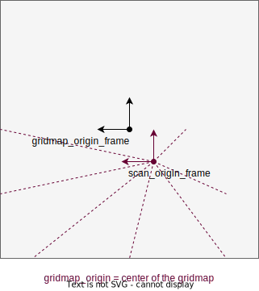

# autoware_probabilistic_occupancy_grid_map

## Purpose

This package outputs the probability of having an obstacle as occupancy grid map.


## References/External links

- [Pointcloud based occupancy grid map](pointcloud-based-occupancy-grid-map.md)
- [Laserscan based occupancy grid map](laserscan-based-occupancy-grid-map.md)
- [Grid map fusion](synchronized_grid_map_fusion.md)

## Settings

Occupancy grid map is generated on `map_frame`, and grid orientation is fixed.

You may need to choose `scan_origin_frame` and `gridmap_origin_frame` which means sensor origin and gridmap origin respectively. Especially, set your main LiDAR sensor frame (e.g. `velodyne_top` in sample_vehicle) as a `scan_origin_frame` would result in better performance.



### Parameters

{{ json_to_markdown("perception/autoware_probabilistic_occupancy_grid_map/schema/binary_bayes_filter_updater.schema.json") }}
{{ json_to_markdown("perception/autoware_probabilistic_occupancy_grid_map/schema/grid_map.schema.json") }}
{{ json_to_markdown("perception/autoware_probabilistic_occupancy_grid_map/schema/laserscan_based_occupancy_grid_map.schema.json") }}
{{ json_to_markdown("perception/autoware_probabilistic_occupancy_grid_map/schema/multi_lidar_pointcloud_based_occupancy_grid_map.schema.json") }}
{{ json_to_markdown("perception/autoware_probabilistic_occupancy_grid_map/schema/pointcloud_based_occupancy_grid_map.schema.json") }}
{{ json_to_markdown("perception/autoware_probabilistic_occupancy_grid_map/schema/synchronized_grid_map_fusion_node.schema.json") }}

### Downsample input pointcloud(Optional)

If you set `downsample_input_pointcloud` to `true`, the input pointcloud will be downsampled and following topics are also used. This feature is currently only for the pointcloud based occupancy grid map.

- pointcloud_based_occupancy_grid_map method

```yaml
# downsampled raw and obstacle pointcloud
/perception/occupancy_grid_map/obstacle/downsample/pointcloud
/perception/occupancy_grid_map/raw/downsample/pointcloud
```

- multi_lidar_pointcloud_based_point_cloud

```yaml
# downsampled raw and obstacle pointcloud
/perception/occupancy_grid_map/obstacle/downsample/pointcloud
/perception/occupancy_grid_map/<sensor_name>/raw/downsample/pointcloud
```

### Test

This package provides unit tests using `gtest`.
You can run the test by the following command.

```bash
colcon test --packages-select autoware_probabilistic_occupancy_grid_map --event-handlers console_direct+
```

Test contains the following.

- Unit test for cost value conversion function
- Unit test for utility functions
- Unit test for occupancy grid map fusion functions
- Input/Output test for pointcloud based occupancy grid map
