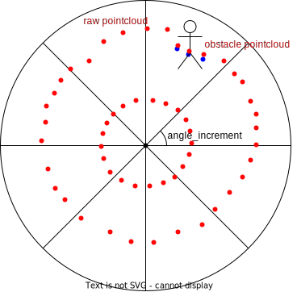
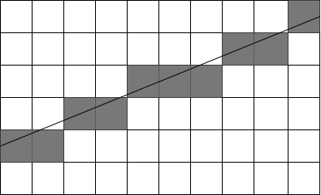

# pointcloud based occupancy grid map


## Inner-workings / Algorithms

### 1st step

First of all, input obstacle/raw pointcloud are transformed into the polar coordinate centered around `scan_origin` and divided int circular bins per angle_increment respectively.
At this time, each point belonging to each bin is stored as range data. In addition, the x,y information in the map coordinate is also stored for ray-tracing on the map coordinate.
The bin contains the following information for each point

- range data from origin of raytrace
- x on map coordinate
- y on map coordinate



The following figure shows each of the bins from side view.


### 2nd step

The ray trace is performed in three steps for each cell.
The ray trace is done by Bresenham's line algorithm.


1. Initialize freespace to the farthest point of each bin.

   

2. Fill in the unknown cells.
   Based on the assumption that `UNKNOWN` is behind the obstacle, the cells that are more than a distance margin from each obstacle point are filled with `UNKNOWN`

   

   There are three reasons for setting a distance margin.

   - It is unlikely that a point on the ground will be immediately behind an obstacle.
   - The obstacle point cloud is processed and may not match the raw pointcloud.
   - The input may be inaccurate and obstacle points may not be determined as obstacles.

   When the parameter `grid_map_type` is "OccupancyGridMapProjectiveBlindSpot" and the `scan_origin` is a sensor frame like `velodyne_top` for instance, for each obstacle pointcloud, if there are no _visible_ raw pointclouds that are located above the projected ray from the `scan_origin` to that obstacle pointcloud, the cells between the obstacle pointcloud and the `projected point` are filled with `UNKNOWN`. Note that the `scan_origin` should not be `base_link` if this flag is true because otherwise all the cells behind the obstacle point clouds would be filled with `UNKNOWN`.

   

3. Fill in the occupied cells.
   Fill in the point where the obstacle point is located with occupied.
   In addition, If the distance between obstacle points is less than or equal to the distance margin, that interval is filled with `OCCUPIED` because the input may be inaccurate and obstacle points may not be determined as obstacles.

   

### 3rd step

Using the previous occupancy grid map, update the existence probability using a binary Bayesian filter (1). Also, the unobserved cells are time-decayed like the system noise of the Kalman filter (2).

$$
\hat{P_{o}} = \frac{(P_{o} *P_{z})}{(P_{o}* P_{z} + (1 - P_{o}) * \bar{P_{z}})} \tag{1}
$$

$$
\hat{P_{o}} = \frac{(P_{o} + 0.5 * \frac{1}{ratio})}{(\frac{1}{ratio} + 1)} \tag{2}
$$

## Inputs / Outputs

### Input

| Name                          | Type                       | Description                                                    |
| ----------------------------- | -------------------------- | -------------------------------------------------------------- |
| `~/input/obstacle_pointcloud` | `sensor_msgs::PointCloud2` | obstacle pointcloud                                            |
| `~/input/raw_pointcloud`      | `sensor_msgs::PointCloud2` | The overall point cloud used to input the obstacle point cloud |

### Output

| Name                          | Type                      | Description        |
| ----------------------------- | ------------------------- | ------------------ |
| `~/output/occupancy_grid_map` | `nav_msgs::OccupancyGrid` | occupancy grid map |

### Related topics

If you set `downsample_input_pointcloud` to `true`, the input pointcloud will be downsampled and following topics are also used.

- pointcloud_based_occupancy_grid_map method

```yaml
# downsampled raw and obstacle pointcloud
/perception/occupancy_grid_map/obstacle/downsample/pointcloud
/perception/occupancy_grid_map/raw/downsample/pointcloud
```

## Parameters

### Node Parameters

| Name                          | Type   | Description                                                                                                                      |
| ----------------------------- | ------ | -------------------------------------------------------------------------------------------------------------------------------- |
| `map_frame`                   | string | map frame                                                                                                                        |
| `base_link_frame`             | string | base_link frame                                                                                                                  |
| `use_height_filter`           | bool   | whether to height filter for `~/input/obstacle_pointcloud` and `~/input/raw_pointcloud`? By default, the height is set to -1~2m. |
| `map_length`                  | double | The length of the map. -100 if it is 50~50[m]                                                                                    |
| `map_resolution`              | double | The map cell resolution [m]                                                                                                      |
| `grid_map_type`               | string | The type of grid map for estimating `UNKNOWN` region behind obstacle point clouds                                                |
| `scan_origin`                 | string | The origin of the scan. It should be a sensor frame.                                                                             |
| `pub_debug_grid`              | bool   | Whether to publish debug grid maps                                                                                               |
| `downsample_input_pointcloud` | bool   | Whether to downsample the input pointclouds. The downsampled pointclouds are used for the ray tracing.                           |
| `downsample_voxel_size`       | double | The voxel size for the downsampled pointclouds.                                                                                  |

## Assumptions / Known limits

In several places we have modified the external code written in BSD3 license.

- occupancy_grid_map.hpp
- cost_value.hpp
- occupancy_grid_map.cpp

## (Optional) Error detection and handling

## (Optional) Performance characterization

## (Optional) References/External links

## (Optional) Future extensions / Unimplemented parts

- The update probability of the binary Bayesian filter is currently hard-coded and requires a code change to be modified.
- Since there is no special support for moving objects, the probability of existence is not increased for fast objects.

## How to debug

If `grid_map_type` is "OccupancyGridMapProjectiveBlindSpot" and `pub_debug_grid` is `true`, it is possible to check the each process of grid map generation by running

```shell
ros2 launch autoware_probabilistic_occupancy_grid_map debug.launch.xml
```

and visualizing the following occupancy grid map topics (which are listed in config/grid_map_param.yaml):

- `/perception/occupancy_grid_map/grid_1st_step`: `FREE` cells are filled
- `/perception/occupancy_grid_map/grid_2nd_step`: `UNKNOWN` cells are filled
- `/perception/occupancy_grid_map/grid_3rd_step`: `OCCUPIED` cells are filled
