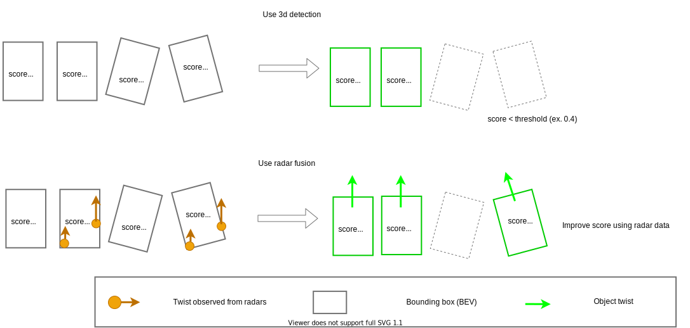

# `autoware_radar_fusion_to_detected_object`

This package contains a sensor fusion module for radar-detected objects and 3D detected objects.

The fusion node can:

- Attach velocity to 3D detections when successfully matching radar data. The tracking modules use the velocity information to enhance the tracking results while planning modules use it to execute actions like adaptive cruise control.
- Improve the low confidence 3D detections when corresponding radar detections are found.



## Design

### Background

This package is the fusion with LiDAR-based 3D detection output and radar data.
LiDAR based 3D detection can estimate position and size of objects with high precision, but it cannot estimate velocity of objects.
Radar data can estimate doppler velocity of objects, but it cannot estimate position and size of objects with high precision
This fusion package is aim to fuse these characteristic data, and to estimate position, size, velocity of objects with high precision.

### Algorithm

The document of core algorithm is [here](docs/algorithm.md)

## Interface for core algorithm

The parameters for core algorithm can be set as `core_params`.

### Parameters for sensor fusion

- `bounding_box_margin` (double) [m]
  - Default parameter is 2.0.

This parameter is the distance to extend the 2D bird's-eye view bounding box on each side.
This parameter is used as a threshold to find radar centroids falling inside the extended box.

- `split_threshold_velocity` (double) [m/s]
  - Default parameter is 5.0.

This parameter is the object's velocity threshold to decide to split for two objects from radar information.
Note that this feature is not currently implemented.

- `threshold_yaw_diff` (double) [rad]
  - Default parameter is 0.35.

This parameter is the yaw orientation threshold.
If the difference of yaw degree between from a LiDAR-based detection object and radar velocity, radar information is attached to output objects.

### Weight parameters for velocity estimation

To tune these weight parameters, please see [document](docs/algorithm.md) in detail.

- `velocity_weight_average` (double)
- Default parameter is 0.0.

This parameter is the twist coefficient of average twist of radar data in velocity estimation.

- `velocity_weight_median` (double)
- Default parameter is 0.0.

This parameter is the twist coefficient of median twist of radar data in velocity estimation.

- `velocity_weight_min_distance` (double)
- Default parameter is 1.0.

This parameter is the twist coefficient of radar data nearest to the center of bounding box in velocity estimation.

- `velocity_weight_target_value_average` (double)
- Default parameter is 0.0.

This parameter is the twist coefficient of target value weighted average in velocity estimation. Target value is amplitude if using radar pointcloud. Target value is probability if using radar objects.

- `velocity_weight_target_value_top` (double)
- Default parameter is 0.0.

This parameter is the twist coefficient of top target value radar data in velocity estimation. Target value is amplitude if using radar pointcloud. Target value is probability if using radar objects.

### Parameters for fixed object information

- `convert_doppler_to_twist` (bool)
  - Default parameter is false.

This parameter is the flag whether convert doppler velocity to twist using the yaw information of a detected object.

- `threshold_probability` (float)
  - Default parameter is 0.4.

This parameter is the threshold to filter output objects.
If the probability of an output object is lower than this parameter, and the output object does not have radar points/objects, then delete the object.

- `compensate_probability` (bool)
  - Default parameter is false.

This parameter is the flag to use probability compensation.
If this parameter is true, compensate probability of objects to threshold probability.

## Interface for `autoware_radar_object_fusion_to_detected_object`

Sensor fusion with radar objects and a detected object.

- Calculation cost is O(nm).
  - n: the number of radar objects.
  - m: the number of objects from 3d detection.

### How to launch

```sh
ros2 launch autoware_radar_fusion_to_detected_object radar_object_to_detected_object.launch.xml
```

### Input

- `~/input/objects` (`autoware_perception_msgs/msg/DetectedObjects.msg`)
  - 3D detected objects.
- `~/input/radar_objects` (`autoware_perception_msgs/msg/DetectedObjects.msg`)
  - Radar objects. Note that frame_id need to be same as `~/input/objects`

### Output

- `~/output/objects` (`autoware_perception_msgs/msg/DetectedObjects.msg`)
  - 3D detected object with twist.
- `~/debug/low_confidence_objects` (`autoware_perception_msgs/msg/DetectedObjects.msg`)
  - 3D detected object that doesn't output as `~/output/objects` because of low confidence

### Parameters

The parameters for core algorithm can be set as `node_params`.

- `update_rate_hz` (double) [hz]
  - Default parameter is 20.0

This parameter is update rate for the `onTimer` function.
This parameter should be same as the frame rate of input topics.

## Interface for radar_scan_fusion_to_detected_object (TBD)

Under implement
