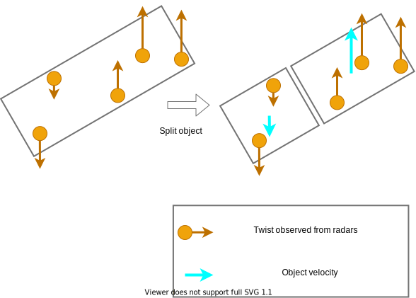
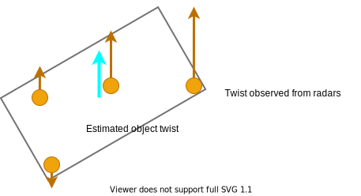
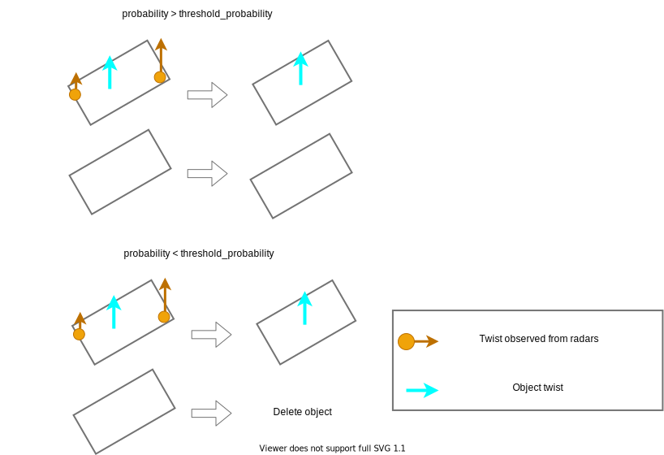

## Common Algorithm

### 1. Link between 3d bounding box and radar data

Choose radar pointcloud/objects within 3D bounding box from lidar-base detection with margin space from bird's-eye view.

### 2. [Feature support] Split the object going in a different direction

- Split two object for the low confidence object that can be estimated to derive two object.

### 3. Estimate twist of object

Estimate twist from chosen radar pointcloud/objects using twist and target value (Target value is amplitude if using radar pointcloud. Target value is probability if using radar objects).
First, the estimation function calculate

- Average twist for radar pointcloud/objects.
- Median twist for radar pointcloud/objects.
- Twist for radar pointcloud/objects nearest of the center of bounding box in velocity.
- Weighted average twist with target value of radar pointcloud/objects.
- Twist with max target value of radar pointcloud/objects.

Second, the estimation function calculate weighted average of these list.
Third, twist information of estimated twist is attached to an object.

### 4. [Feature support] [Option] Convert doppler velocity to twist

If the twist information of radars is doppler velocity, convert from doppler velocity to twist using yaw angle of DetectedObject.
Because radar pointcloud has only doppler velocity information, radar pointcloud fusion should use this feature.
On the other hand, because radar objects have twist information, radar object fusion should not use this feature.

### 5. Delete objects with low probability

- Delete low confidence objects that do not have some radar points/objects.

