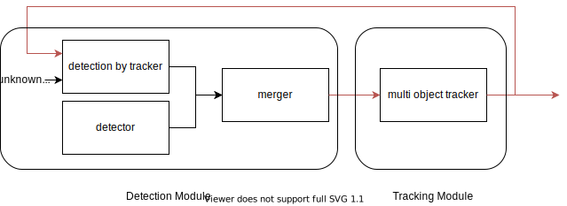
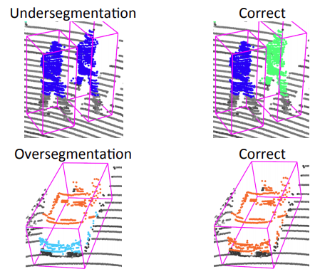

# detection_by_tracker

## Purpose

This package feeds back the tracked objects to the detection module to keep it stable and keep detecting objects.

The detection by tracker takes as input an unknown object containing a cluster of points and a tracker.
The unknown object is optimized to fit the size of the tracker so that it can continue to be detected.

## Inner-workings / Algorithms

The detection by tracker receives an unknown object containing a point cloud and a tracker, where the unknown object is mainly shape-fitted using euclidean clustering.
Shape fitting using euclidean clustering and other methods has a problem called under segmentation and over segmentation.

_Adapted from [3]_

Simply looking at the overlap between the unknown object and the tracker does not work. We need to take measures for under segmentation and over segmentation.

### Policy for dealing with over segmentation

1. Merge the unknown objects in the tracker as a single object.
2. Shape fitting using the tracker information such as angle and size as reference information.

### Policy for dealing with under segmentation

1. Compare the tracker and unknown objects, and determine that those with large recall and small precision are under segmented objects.
2. In order to divide the cluster of under segmented objects, it iterate the parameters to make small clusters.
3. Adjust the parameters several times and adopt the one with the highest IoU.

## Inputs / Outputs

### Input

| Name                      | Type                                                     | Description     |
| ------------------------- | -------------------------------------------------------- | --------------- |
| `~/input/initial_objects` | `tier4_perception_msgs::msg::DetectedObjectsWithFeature` | unknown objects |
| `~/input/tracked_objects` | `tier4_perception_msgs::msg::TrackedObjects`             | trackers        |

### Output

| Name       | Type                                                  | Description |
| ---------- | ----------------------------------------------------- | ----------- |
| `~/output` | `autoware_auto_perception_msgs::msg::DetectedObjects` | objects     |

## Parameters

## Assumptions / Known limits

## (Optional) Error detection and handling

## (Optional) Performance characterization

## (Optional) References/External links

[1] M. Himmelsbach, et al. "Tracking and classification of arbitrary objects with bottom-up/top-down detection." (2012).

[2] Arya Senna Abdul Rachman, Arya. "3D-LIDAR Multi Object Tracking for Autonomous Driving: Multi-target Detection and Tracking under Urban Road Uncertainties." (2017).

[3] David Held, et al. "A Probabilistic Framework for Real-time 3D Segmentation using Spatial, Temporal, and Semantic Cues." (2016).

## (Optional) Future extensions / Unimplemented parts
