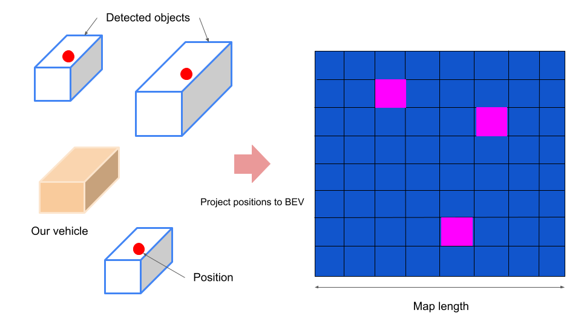

# heatmap_visualizer

## Purpose

heatmap_visualizer is a package for visualizing heatmap of detected 3D objects' positions on the BEV space.

This package is used for qualitative evaluation and trend analysis of the detector, it means, for instance, the heatmap shows "This detector performs good for near around of our vehicle, but far is bad".

### How to run

```shell
ros2 launch heatmap_visualizer heatmap_visualizer.launch.xml input/objects:=<DETECTED_OBJECTS_TOPIC>
```

## Inner-workings / Algorithms

In this implementation, create heatmap of the center position of detected objects for each classes, for instance, CAR, PEDESTRIAN, etc, and publish them as occupancy grid maps.


In the above figure, the pink represents high detection frequency area and blue one is low, or black represents there is no detection.



As inner-workings, add center positions of detected objects to index of each corresponding grid map cell in a buffer.
The created heatmap will be published by each specific frame, which can be specified with `frame_count`. Note that the buffer to be add the positions is not reset per publishing.
When publishing, firstly these values are normalized to [0, 1] using maximum and minimum values in the buffer. Secondly, they are scaled to integer in [0, 100] because `nav_msgs::msg::OccupancyGrid` only allow the value in [0, 100].

## Inputs / Outputs

### Input

| Name              | Type                                                  | Description      |
| ----------------- | ----------------------------------------------------- | ---------------- |
| `~/input/objects` | `autoware_auto_perception_msgs::msg::DetectedObjects` | detected objects |

### Output

| Name                            | Type                           | Description        |
| ------------------------------- | ------------------------------ | ------------------ |
| `~/output/objects/<CLASS_NAME>` | `nav_msgs::msg::OccupancyGrid` | visualized heatmap |

## Parameters

### Core Parameters

| Name                  | Type          | Default Value                                                                         | Description                                     |
| --------------------- | ------------- | ------------------------------------------------------------------------------------- | ----------------------------------------------- |
| `publish_frame_count` | int           | `50`                                                                                  | The number of frames to publish heatmap         |
| `heatmap_frame_id`    | string        | `base_link`                                                                           | The frame ID of heatmap to be respected         |
| `heatmap_length`      | float         | `200.0`                                                                               | A length of map in meter                        |
| `heatmap_resolution`  | float         | `0.8`                                                                                 | A resolution of map                             |
| `use_confidence`      | bool          | `false`                                                                               | A flag if use confidence score as heatmap value |
| `class_names`         | array<string> | `["UNKNOWN", "CAR", "TRUCK", "BUS", "TRAILER", "BICYCLE", "MOTORBIKE", "PEDESTRIAN"]` | An array of class names to be published         |
| `rename_to_car`       | bool          | `true`                                                                                | A flag if rename car like vehicle to car        |

## Assumptions / Known limits

The heatmap depends on the data to be used, so if the objects in data are sparse the heatmap will be sparse.

## (Optional) Error detection and handling

<!-- Write how to detect errors and how to recover from them.

Example:
  This package can handle up to 20 obstacles. If more obstacles found, this node will give up and raise diagnostic errors.
-->

## (Optional) Performance characterization

<!-- Write performance information like complexity. If it wouldn't be the bottleneck, not necessary.

Example:
  ### Complexity

  This algorithm is O(N).

  ### Processing time

  ...
-->

## References/External links

## (Optional) Future extensions / Unimplemented parts

<!-- Write future extensions of this package.

Example:
  Currently, this package can't handle the chattering obstacles well. We plan to add some probabilistic filters in the perception layer to improve it.
  Also, there are some parameters that should be global(e.g. vehicle size, max steering, etc.). These will be refactored and defined as global parameters so that we can share the same parameters between different nodes.
-->
