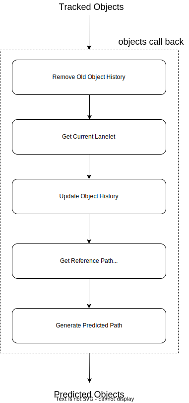
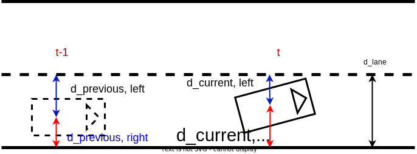
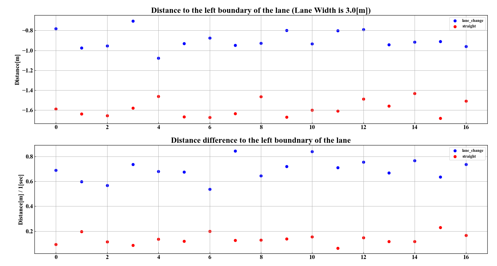

# map_based_prediction

## Role

`map_based_prediction` is a module to predict the future paths (and their probabilities) of other vehicles and pedestrians according to the shape of the map and the surrounding environment.

## Assumptions

- The following information about the target obstacle is needed
  - Label (type of person, car, etc.)
  - The object position in the current time and predicted position in the future time.
- The following information about the surrounding environment is needed
  - Road network information with Lanelet2 format

## Inner-workings / Algorithms

### Flow chart

<div align="center">
  
</div>

### Path prediction for road users

#### Remove old object history

Store time-series data of objects to determine the vehicle's route and to detect lane change for several duration. Object Data contains the object's position, speed, and time information.

#### Get current lanelet and update Object history

Search one or more lanelets satisfying the following conditions for each target object and store them in the ObjectData.

- The CoG of the object must be inside the lanelet.
- The centerline of the lanelet must have two or more points.
- The angle difference between the lanelet and the direction of the object must be within the threshold given by the parameters.
  - The angle flip is allowed, the condition is `diff_yaw < threshold or diff_yaw > pi - threshold`.
- The lanelet must be reachable from the lanelet recorded in the past history.

#### Get predicted reference path

- Get reference path
  - Create a reference path for the object from the associated lanelet.
- Predict Object Maneuver
  - Generate predicted paths for the object.
  - The probability is assigned to each maneuver of `Lane Follow`, `Left Lane Change`, and `Right Lane Chagne` based on the object history and the reference path obtained in the first step.
  - The following information is used to determine the maneuver.
    - The distance between the current center of gravity of the object and the left and right boundaries of the lane
    - The lateral velocity (distance moved to the lateral direction in `t` seconds)

The conditions for the lane change detection then becomes

```cpp
//  Left Lane Change Detection
(d_current_left / d_lane) > dl_ratio_threshold &&
(d_current_left - d_previous_left) > ddl_threshold

// Right Lane Change Detection
(d_current_right / d_lane) < dr_ratio_threshold &&
(d_current_right - d_previous_right) < ddr_threshold
```

where the parameter is explained in the picture below. An example of how to tune the parameters is described later.



- Calculate Object Probability
  - The path probability obtained above is calculated based on the current position and angle of the object.
- Refine predicted paths for smooth movement
  - The generated predicted paths are recomputed to take the vehicle dynamics into account.
  - The path is calculated with minimum jerk trajectory implemented by 4th/5th order spline for lateral/longitudinal motion.引く。

### Lane change detection logic

This is an example to tune the parameters for lane change detection.
The default parameters are set so that the lane change can be detected 1 second before the vehicle crosses the lane boundary. Here, 15 data in the lane change / non lane change cases are plotted.



On the top plot, blue dots are the distance from the lane boundary one second before the lane change, and red dots are the average distance from the lane boundary when driving straight. From this plot, the most conservative value where lane change can be detected for all of these data can be seen as `-1.1`. Note that the larger number makes the decision conservative (lane change may not be detected) and the lower number makes the decision aggressive (many false positive occurs).

On the bottom plot, blue dots are the lateral velocity one second before the lane change, and red dots are the average of the (absolute) lateral velocity when driving straight. In the same policy above, the parameter can be set as `0.5`.

#### Limitations

- This plot shows only for one environment data. The parameter/algorithm must consider lane width. (The default parameters are set roughly considering the generalization of the lane width for other environments.)

### Path prediction for crosswalk users

This module treats **Pedestrians** and **Bicycles** as objects using the crosswalk, and outputs prediction path based on map and estimated object's velocity, assuming the object has intention to cross the crosswalk, if the objects satisfies at least one of the following conditions:

- move toward the crosswalk
- stop near the crosswalk

<div align="center">
  
</div>

If there are a reachable crosswalk entry points within the `prediction_time_horizon` and the objects satisfies above condition, this module outputs additional predicted path to cross the opposite side via the crosswalk entry point.

<div align="center">
  
</div>

If the target object is inside the road or crosswalk, this module outputs one or two additional prediction path(s) to reach exit point of the crosswalk. The number of prediction paths are depend on whether object is moving or not. If the object is moving, this module outputs one prediction path toward an exit point that existed in the direction of object's movement. One the other hand, if the object has stopped, it is impossible to infer which exit points the object want to go, so this module outputs two prediction paths toward both side exit point.

<div align="center">
  
</div>

## Inputs / Outputs

### Input

| Name                                               | Type                                                 | Description                              |
| -------------------------------------------------- | ---------------------------------------------------- | ---------------------------------------- |
| `~/perception/object_recognition/tracking/objects` | `autoware_auto_perception_msgs::msg::TrackedObjects` | tracking objects without predicted path. |
| `~/vector_map`                                     | `autoware_auto_mapping_msgs::msg::HADMapBin`         | binary data of Lanelet2 Map.             |

### Output

| Name                     | Type                                                   | Description                           |
| ------------------------ | ------------------------------------------------------ | ------------------------------------- |
| `~/objects`              | `autoware_auto_perception_msgs::msg::PredictedObjects` | tracking objects with predicted path. |
| `~/objects_path_markers` | `visualization_msgs::msg::MarkerArray`                 | marker for visualization.             |

## Parameters

| Parameter                                   | Type   | Description                                                                                                  |
| ------------------------------------------- | ------ | ------------------------------------------------------------------------------------------------------------ |
| `enable_delay_compensation`                 | bool   | flag to enable the time delay compensation for the position of the object                                    |
| `prediction_time_horizon`                   | double | predict time duration for predicted path [s]                                                                 |
| `prediction_sampling_delta_time`            | double | sampling time for points in predicted path [s]                                                               |
| `min_velocity_for_map_based_prediction`     | double | apply map-based prediction to the objects with higher velocity than this value                               |
| `min_crosswalk_user_velocity`               | double | minimum velocity use in path prediction for crosswalk users                                                  |
| `dist_threshold_for_searching_lanelet`      | double | The threshold of the angle used when searching for the lane to which the object belongs [rad]                |
| `delta_yaw_threshold_for_searching_lanelet` | double | The threshold of the distance used when searching for the lane to which the object belongs [m]               |
| `sigma_lateral_offset`                      | double | Standard deviation for lateral position of objects [m]                                                       |
| `sigma_yaw_angle`                           | double | Standard deviation yaw angle of objects [rad]                                                                |
| `object_buffer_time_length`                 | double | Time span of object history to store the information [s]                                                     |
| `history_time_length`                       | double | Time span of object information used for prediction [s]                                                      |
| `dist_ratio_threshold_to_left_bound`        | double | Conditions for using lane change detection of objects. Distance to the left bound of lanelet.                |
| `dist_ratio_threshold_to_right_bound`       | double | Conditions for using lane change detection of objects. Distance to the right bound of lanelet.               |
| `diff_dist_threshold_to_left_bound`         | double | Conditions for using lane change detection of objects. Differential value of horizontal position of objects. |
| `diff_dist_threshold_to_right_bound`        | double | Conditions for using lane change detection of objects. Differential value of horizontal position of objects. |

## Assumptions / Known limits

- For object types of passenger car, bus, and truck
  - The predicted path of the object follows the road structure.
  - For the object not being on any roads, the predicted path is generated by just a straight line prediction.
  - For the object on a lanelet but moving in a different direction of the road, the predicted path is just straight.
  - Vehicle dynamics may not be properly considered in the predicted path.
- For object types of person and motorcycle
  - The predicted path is generated by just a straight line in all situations except for "around crosswalk".
- For all obstacles
  - In the prediction, the vehicle motion is assumed to be a constant velocity due to a lack of acceleration information.

## Reference

1. M. Werling, J. Ziegler, S. Kammel, and S. Thrun, “Optimal trajectory generation for dynamic street scenario in a frenet frame,” IEEE International Conference on Robotics and Automation, Anchorage, Alaska, USA, May 2010.
2. A. Houenou, P. Bonnifait, V. Cherfaoui, and Wen Yao, “Vehicle trajectory prediction based on motion model and maneuver recognition,” in 2013 IEEE/RSJ International Conference on Intelligent Robots and Systems. IEEE, nov 2013, pp. 4363-4369.
