# Models used in this module

## Tracking model

<!-- cspell:ignore CTRV -->

### CTRV model [1]

CTRV model is a model that assumes constant turn rate and velocity magnitude.

- state transition equation

$$
\begin{align*}
x_{k+1}   &= x_k + v_{x_k} \cos(\psi_k) \cdot dt \\
y_{k+1}   &= y_k + v_{x_k} \sin(\psi_k) \cdot dt \\
\psi_{k+1} &= \psi_k + \dot{\psi}_k \cdot dt \\
v_{x_{k+1}}  &= v_{x_k} \\
\dot{\psi}_{k+1}  &= \dot{\psi}_k \\
\end{align*}
$$

- jacobian

$$
A = \begin{bmatrix}
1 & 0 & -v_x \sin(\psi) \cdot dt & \cos(\psi) \cdot dt & 0 \\
0 & 1 & v_x \cos(\psi) \cdot dt & \sin(\psi) \cdot dt & 0 \\
0 & 0 & 1 & 0 & dt \\
0 & 0 & 0 & 1 & 0 \\
0 & 0 & 0 & 0 & 1 \\
\end{bmatrix}
$$

### Kinematic bicycle model [2]

Kinematic bicycle model uses slip angle $\beta$ and velocity $v$ to calculate yaw update.
The merit of using this model is that it can prevent unintended yaw rotation when the vehicle is stopped.

- **state variable**
  - pose( $x,y$ ), velocity( $v$ ), yaw( $\psi$ ), and slip angle ( $\beta$ )
  - $[x_{k} ,y_{k} , v_{k} , \psi_{k} , \beta_{k} ]^\mathrm{T}$
- **Prediction Equation**
  - $dt$: sampling time

$$
\begin{aligned}
x_{k+1} & =x_{k}+v_{k} \cos \left(\psi_{k}+\beta_{k}\right) d t \\
y_{k+1} & =y_{k}+v_{k} \sin \left(\psi_{k}+\beta_{k}\right) d t \\
v_{k+1} & =v_{k} \\
\psi_{k+1} & =\psi_{k}+\frac{v_{k}}{l_{r}} \sin \beta_{k} d t \\
\beta_{k+1} & =\beta_{k}
\end{aligned}
$$

- **Jacobian**

$$
\frac{\partial f}{\partial \mathrm x}=\left[\begin{array}{ccccc}
1 & 0 & -v \sin (\psi+\beta) d t & v \cos (\psi+\beta) & -v \sin (\psi+\beta) d t \\
0 & 1 & v \cos (\psi+\beta) d t & v \sin (\psi+\beta) & v \cos (\psi+\beta) d t \\
0 & 0 & 1 & \frac{1}{l_r} \sin \beta d t & \frac{v}{l_r} \cos \beta d t \\
0 & 0 & 0 & 1 & 0 \\
0 & 0 & 0 & 0 & 1
\end{array}\right]
$$

#### remarks on the output twist

Remarks that the velocity $v_{k}$ is the norm of velocity of vehicle, not the longitudinal velocity.
So the output twist in the object coordinate $(x,y)$ is calculated as follows.

$$
\begin{aligned}
v_{x} &= v_{k} \cos \left(\beta_{k}\right) \\
v_{y} &= v_{k} \sin \left(\beta_{k}\right)
\end{aligned}
$$

## Anchor point based estimation

To separate the estimation of the position and the shape, we use anchor point based position estimation.

### Anchor point and tracking relationships

Anchor point is set when the tracking is initialized.
Its position is equal to the center of the bounding box of the first tracking bounding box.

Here show how anchor point is used in tracking.

Raw detection is converted to anchor point coordinate, and tracking

### Manage anchor point offset

Anchor point should be kept in the same position of the object.
In other words, the offset value must be adjusted so that the input BBOX and the output BBOX's closest plane to the ego vehicle are at the same position.

<!--  -->

### Known limits, drawbacks

- When the anchor point is further than the detection center, the tracking will be more affected by the yaw detection noise.
  - This can be result in unintended yaw rotation or position drift.

## References

<!-- cspell:ignore Wanielik, Gerd, ICIF -->

[1] Schubert, Robin & Richter, Eric & Wanielik, Gerd. (2008). Comparison and evaluation of advanced motion models for vehicle tracking. 1 - 6. 10.1109/ICIF.2008.4632283.

<!-- cspell:ignore Pfeiffer, Schildbach, Georg, Borrelli, Francesco -->

[2] Kong, Jason & Pfeiffer, Mark & Schildbach, Georg & Borrelli, Francesco. (2015). Kinematic and dynamic vehicle models for autonomous driving control design. 1094-1099. 10.1109/IVS.2015.7225830.
