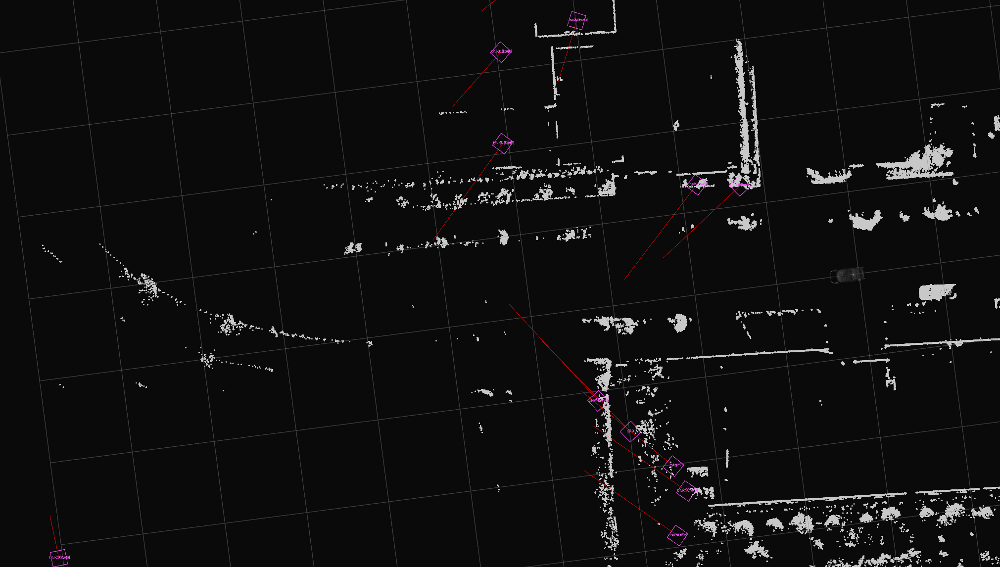
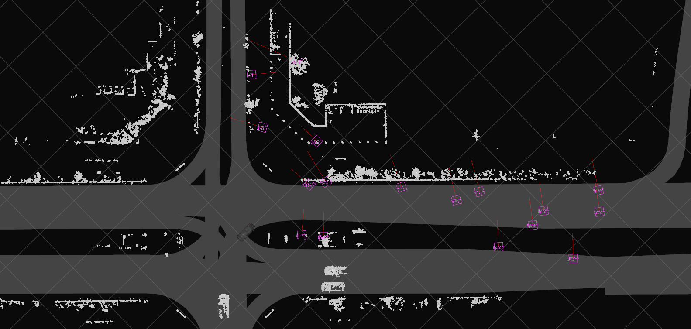

# radar_crossing_objects_noise_filter

This package contains a radar noise filter module for [autoware_auto_perception_msgs/msg/DetectedObject](https://gitlab.com/autowarefoundation/autoware.auto/autoware_auto_msgs/-/blob/master/autoware_auto_perception_msgs/msg/DetectedObject.idl).
This package can filter the noise objects which cross to the ego vehicle.

## Algorithm

### Background

This package aim to filter the noise objects which cross from the ego vehicle.
The reason why these objects are noise is as below.

- 1. The objects with doppler velocity can be trusted more than those with vertical velocity to it.

Radars can get velocity information of objects as doppler velocity, but cannot get vertical velocity to doppler velocity directory.
Some radars can output the objects with not only doppler velocity but also vertical velocity by estimation.
If the vertical velocity estimation is poor, it leads to output noise objects.
In other words, the above situation is that the objects which has vertical twist viewed from ego vehicle can tend to be noise objects.

The example is below figure.
Velocity estimation fails on static objects, resulting in ghost objects crossing in front of ego vehicles.



- 2. Turning around by ego vehicle affect the output from radar.

When the ego vehicle turns around, the radars outputting at the object level sometimes fail to estimate the twist of objects correctly even if [radar_tracks_msgs_converter](https://github.com/autowarefoundation/autoware.universe/tree/main/perception/radar_tracks_msgs_converter) compensates by the ego vehicle twist.
So if an object detected by radars has circular motion viewing from base_link, it is likely that the speed is estimated incorrectly and that the object is a static object.

The example is below figure.
When the ego vehicle turn right, the surrounding objects have left circular motion.



### Detail Algorithm

To filter the objects crossing to ego vehicle, this package filter the objects as below algorithm.


```cpp
  // If velocity of an object is rather than the velocity_threshold,
  // and crossing_yaw is near to vertical
  // angle_threshold < crossing_yaw < pi - angle_threshold
  if (
    velocity > node_param_.velocity_threshold &&
    abs(std::cos(crossing_yaw)) < abs(std::cos(node_param_.angle_threshold))) {
    // Object is noise object;
  } else {
    // Object is not noise object;
  }
```

## Input

| Name              | Type                                                  | Description    |
| ----------------- | ----------------------------------------------------- | -------------- |
| `~/input/objects` | autoware_auto_perception_msgs/msg/DetectedObjects.msg | Radar objects. |

## Output

| Name                        | Type                                                  | Description      |
| --------------------------- | ----------------------------------------------------- | ---------------- |
| `~/output/noise_objects`    | autoware_auto_perception_msgs/msg/DetectedObjects.msg | Noise objects    |
| `~/output/filtered_objects` | autoware_auto_perception_msgs/msg/DetectedObjects.msg | Filtered objects |

## Parameters

| Name                 | Type   | Description                                                                                                                                         | Default value |
| :------------------- | :----- | :-------------------------------------------------------------------------------------------------------------------------------------------------- | :------------ |
| `angle_threshold`    | double | The angle threshold parameter to filter [rad]. This parameter has condition that 0 < `angle_threshold` < pi / 2. See algorithm chapter for details. | 1.0472        |
| `velocity_threshold` | double | The velocity threshold parameter to filter [m/s]. See algorithm chapter for details.                                                                | 3.0           |
