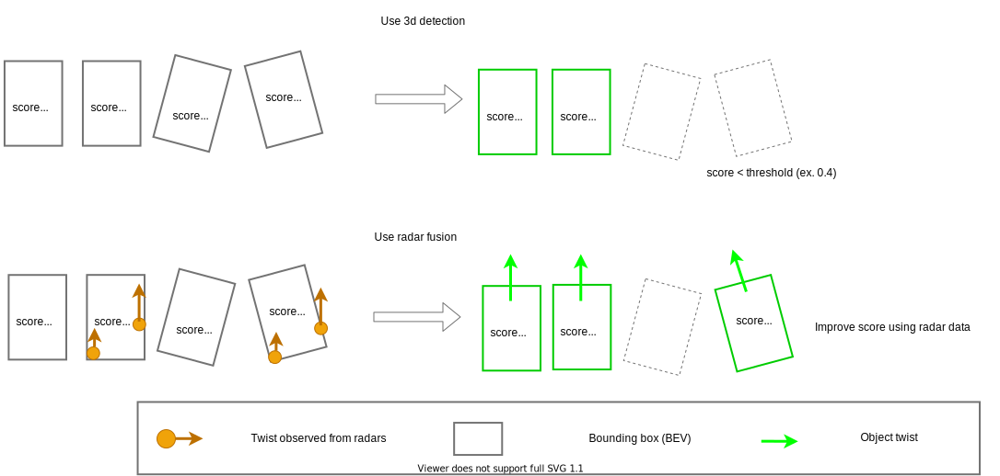

# radar_fusion_to_detected_object

This package contains a sensor fusion module for radar-detected objects and 3D detected objects. The fusion node can:

- Attach velocity to 3D detections when successfully matching radar data. The tracking modules use the velocity information to enhance the tracking results while planning modules use it to execute actions like adaptive cruise control.
- Improve the low confidence 3D detections when corresponding radar detections are found.



## Core algorithm

The document of core algorithm is [here](docs/algorithm.md)

### Parameters for sensor fusion

| Name                     | Type   | Description                                                                                                                                                                                                                                                                      | Default value |
| :----------------------- | :----- | :------------------------------------------------------------------------------------------------------------------------------------------------------------------------------------------------------------------------------------------------------------------------------- | :------------ |
| bounding_box_margin      | double | The distance to extend the 2D bird's-eye view Bounding Box on each side. This distance is used as a threshold to find radar centroids falling inside the extended box. [m]                                                                                                       | 2.0           |
| split_threshold_velocity | double | The object's velocity threshold to decide to split for two objects from radar information (currently not implemented) [m/s]                                                                                                                                                      | 5.0           |
| threshold_yaw_diff       | double | The yaw orientation threshold. If $ \vert \theta _{ob} - \theta_ {ra} \vert < threshold*yaw_diff $ attached to radar information include estimated velocity, where $ \theta*{ob} $ is yaw angle from 3d detected object, $ \theta\_ {ra} $ is yaw angle from radar object. [rad] | 0.35          |

### Weight parameters for velocity estimation

To tune these weight parameters, please see [document](docs/algorithm.md) in detail.

| Name                                 | Type   | Description                                                                                                                                                                             | Default value |
| :----------------------------------- | :----- | :-------------------------------------------------------------------------------------------------------------------------------------------------------------------------------------- | :------------ |
| velocity_weight_average              | double | The twist coefficient of average twist of radar data in velocity estimation.                                                                                                            | 0.0           |
| velocity_weight_median               | double | The twist coefficient of median twist of radar data in velocity estimation.                                                                                                             | 0.0           |
| velocity_weight_min_distance         | double | The twist coefficient of radar data nearest to the center of bounding box in velocity estimation.                                                                                       | 1.0           |
| velocity_weight_target_value_average | double | The twist coefficient of target value weighted average in velocity estimation. Target value is amplitude if using radar pointcloud. Target value is probability if using radar objects. |
| 0.0                                  |
| velocity_weight_target_value_top     | double | The twist coefficient of top target value radar data in velocity estimation. Target value is amplitude if using radar pointcloud. Target value is probability if using radar objects.   | 0.0           |

### Parameters for fixed object information

| Name                     | Type  | Description                                                                                                                                            | Default value |
| :----------------------- | :---- | :----------------------------------------------------------------------------------------------------------------------------------------------------- | :------------ |
| convert_doppler_to_twist | bool  | Convert doppler velocity to twist using the yaw information of a detected object.                                                                      | false         |
| threshold_probability    | float | If the probability of an output object is lower than this parameter, and the output object does not have radar points/objects, then delete the object. | 0.4           |
| compensate_probability   | bool  | If this parameter is true, compensate probability of objects to threshold probability.                                                                 | false         |

## radar_object_fusion_to_detected_object

Sensor fusion with radar objects and a detected object.

- Calculation cost is O(nm).
  - n: the number of radar objects.
  - m: the number of objects from 3d detection.

### How to launch

```sh
ros2 launch radar_fusion_to_detected_object radar_object_to_detected_object.launch.xml
```

### Input

| Name                    | Type                                                 | Description                                                            |
| ----------------------- | ---------------------------------------------------- | ---------------------------------------------------------------------- |
| `~/input/objects`       | autoware_auto_perception_msgs/msg/DetectedObject.msg | 3D detected objects.                                                   |
| `~/input/radar_objects` | autoware_auto_perception_msgs/msg/TrackedObjects.msg | Radar objects. Note that frame_id need to be same as `~/input/objects` |

### Output

| Name                             | Type                                                  | Description                                                                            |
| -------------------------------- | ----------------------------------------------------- | -------------------------------------------------------------------------------------- |
| `~/output/objects`               | autoware_auto_perception_msgs/msg/DetectedObjects.msg | 3D detected object with twist.                                                         |
| `~/debug/low_confidence_objects` | autoware_auto_perception_msgs/msg/DetectedObjects.msg | 3D detected object that doesn't output as `~/output/objects` because of low confidence |

### Parameters

| Name           | Type   | Description           | Default value |
| :------------- | :----- | :-------------------- | :------------ |
| update_rate_hz | double | The update rate [hz]. | 20.0          |

## radar_scan_fusion_to_detected_object (TBD)

TBD
