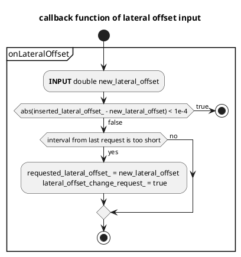
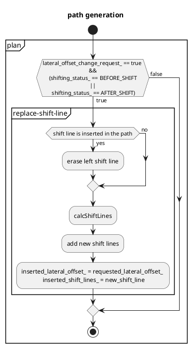
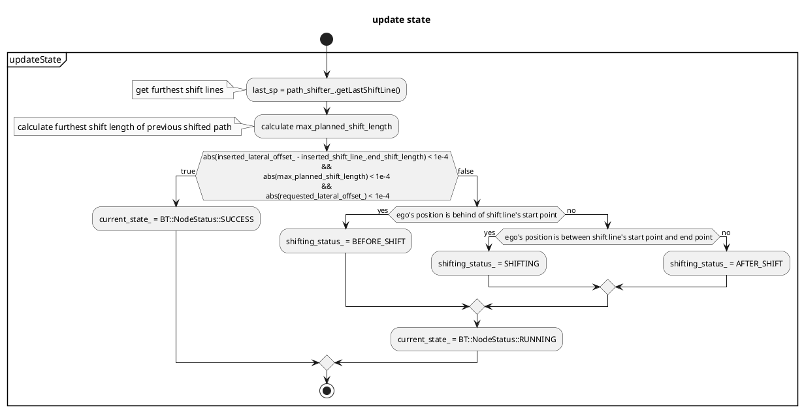

# Side Shift design

(For remote control) Shift the path to left or right according to an external instruction.

## Overview of the Side Shift Module Process

1. Receive the required lateral offset input.
2. Update the `requested_lateral_offset_` under the following conditions:
   a. Verify if the last update time has elapsed.
   b. Ensure the required lateral offset value is different from the previous one.
3. Insert the shift points into the path if the side shift module's status is not in the SHIFTING status.

Please be aware that `requested_lateral_offset_` is continuously updated with the latest values and is not queued.

## Statuses of the Side Shift

The side shift has three distinct statuses. Note that during the SHIFTING status, the path cannot be updated:

1. BEFORE_SHIFT: Preparing for shift.
2. SHIFTING: Currently in the process of shifting.
3. AFTER_SHIFT: Shift completed.

<figure markdown>
  {width=1000}
  <figcaption>side shift status</figcaption>
</figure>

## Flowchart

