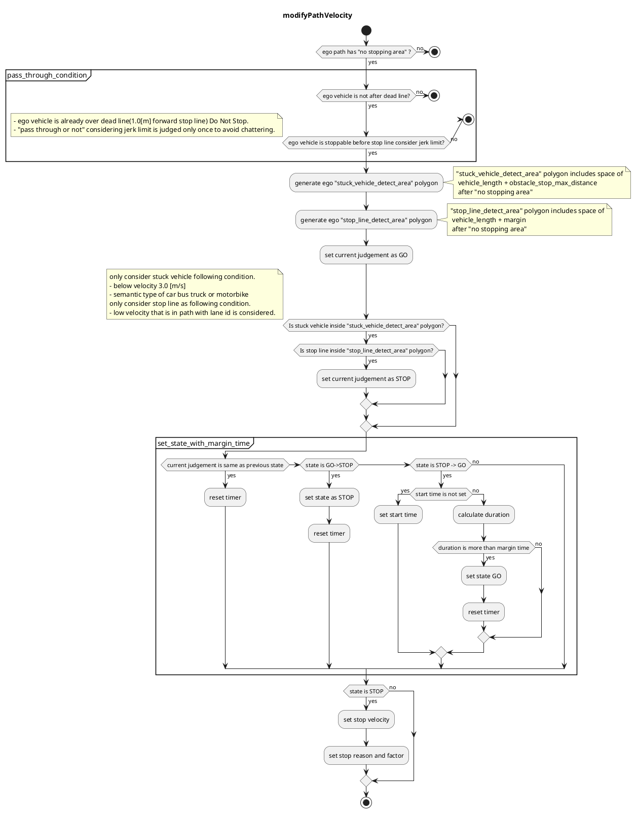

### No Stopping Area

#### Role

This module plans to avoid stop in 'no stopping area`.

- PassThrough case
  - if ego vehicle go through pass judge point, then ego vehicle can't stop with maximum jerk and acceleration, so this module doesn't insert stop velocity. In this case override or external operation is necessary.
- STOP case
  - If there is a stuck vehicle or stop velocity around `no_stopping_area`, then vehicle stops inside `no_stopping_area` so this module makes stop velocity in front of `no_stopping_area`
- GO case
  - else

### Limitation

This module allows developers to design vehicle velocity in `no_stopping_area` module using specific rules. Once ego vehicle go through pass through point, ego vehicle does't insert stop velocity and does't change decision from GO. Also this module only considers dynamic object in order to avoid unnecessarily stop.

#### ModelParameter

| Parameter                    | Type   | Description                                                         |
| ---------------------------- | ------ | ------------------------------------------------------------------- |
| `state_clear_time`           | double | [s] time to clear stop state                                        |
| `stuck_vehicle_vel_thr`      | double | [m/s] vehicles below this velocity are considered as stuck vehicle. |
| `stop_margin`                | double | [m] margin to stop line at no stopping area                         |
| `dead_line_margin`           | double | [m] if ego pass this position GO                                    |
| `stop_line_margin`           | double | [m] margin to auto-gen stop line at no stopping area                |
| `detection_area_length`      | double | [m] length of searching polygon                                     |
| `stuck_vehicle_front_margin` | double | [m] obstacle stop max distance                                      |

#### Flowchart

