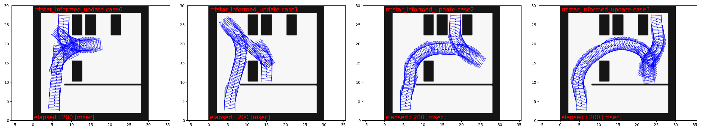

# freespace planning algorithms

## Role

This package is for development of path planning algorithms in free space.

### Implemented algorithms

- Hybrid A\* and RRT\* (includes RRT and informed RRT\*)

Please see [rrtstar.md](rrtstar.md) for a note on the implementation for informed-RRT\*.

<!-- cspell:ignore Gammell -->

NOTE: As for RRT\*, one can choose whether update after feasible solution found in RRT\*.
If not doing so, the algorithm is the almost (but exactly because of rewiring procedure) same as vanilla RRT.
If you choose update, then you have option if the sampling after feasible solution found is "informed".
If set true, then the algorithm is equivalent to `informed RRT\* of Gammell et al. 2014`.

## Algorithm selection

There is a trade-off between algorithm speed and resulting solution quality.
When we sort the algorithms by the spectrum of (high quality solution/ slow) -> (low quality solution / fast) it would be
A\* -> informed RRT\* -> RRT. Note that in almost all case informed RRT\* is
better than RRT\* for solution quality given the same computational time budget. So, RRT\* is omitted in the comparison.

Some selection criteria would be:

- If obstacle geometry is complex: -> avoid RRT and RRT\*. The resulting path could be too messy.
- If goal location is far from the start: -> avoid A\*. Take too long time because it based on grid discretization.

## Guide to implement a new algorithm

- All planning algorithm class in this package must inherit `AbstractPlanningAlgorithm`
  class. If necessary, please overwrite the virtual functions.
- All algorithms must use `nav_msgs::OccupancyGrid`-typed costmap.
  Thus, `AbstractPlanningAlgorithm` class mainly implements the collision checking
  using the costmap, grid-based indexing, and coordinate transformation related to
  costmap.
- All algorithms must take both `PlannerCommonParam`-typed and algorithm-specific-
  type structs as inputs of the constructor. For example, `AstarSearch` class's
  constructor takes both `PlannerCommonParam` and `AstarParam`.

## Running the standalone tests and visualization

Building the package with ros-test and run tests:

```sh
colcon build --packages-select autoware_freespace_planning_algorithms
colcon test --packages-select autoware_freespace_planning_algorithms
```

<!-- cspell: ignore fpalgos -->
<!-- "fpalgos" means Free space Planning ALGOrithmS -->

Inside the test, simulation results are stored in `/tmp/fpalgos-{algorithm_type}-case{scenario_number}` as a rosbag.
Loading these resulting files, by using [test/debug_plot.py](test/debug_plot.py),
one can create plots visualizing the path and obstacles as shown
in the figures below. The created figures are then again saved in `/tmp`.

### A\* (single curvature case)


### informed RRT\* with 200 msec time budget



### RRT\* without update (almost same as RRT)


The black cells, green box, and red box, respectively, indicate obstacles,
start configuration, and goal configuration.
The sequence of the blue boxes indicate the solution path.

## Extension to Python module (only A\* supported)

There is an implementation of the extension to the python module.
You can try A\* search via Python by setting follows:

- parameters,
- costmap,
- start pose,
- goal pose.

Then, you can get

- success or failure,
- searched trajectory.

The example code is [scripts/example/example.py](scripts/example/example.py).
Note that you need to build this package and source the setup shell script in advance.

## License notice

Files `src/reeds_shepp.cpp` and `include/astar_search/reeds_shepp.h`
are fetched from [pyReedsShepp](https://github.com/ghliu/pyReedsShepp).
Note that the implementation in `pyReedsShepp` is also heavily based on
the code in [ompl](https://github.com/ompl/ompl).
Both `pyReedsShepp` and `ompl` are distributed under 3-clause BSD license.
