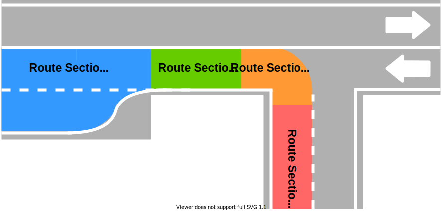
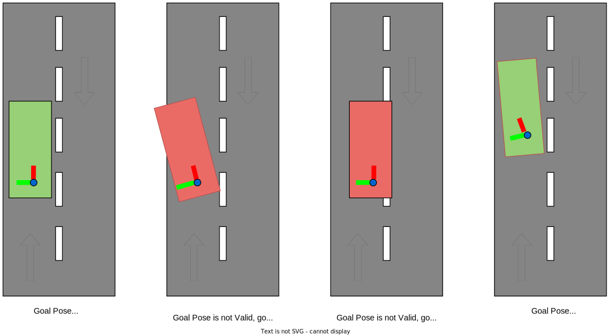
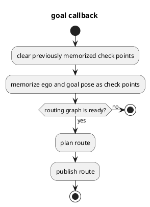
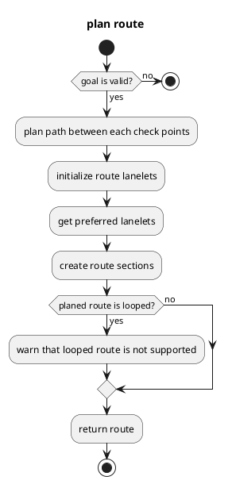

# Mission Planner

## Purpose

`Mission Planner` calculates a route that navigates from the current ego pose to the goal pose following the given check points.
The route is made of a sequence of lanes on a static map.
Dynamic objects (e.g. pedestrians and other vehicles) and dynamic map information (e.g. road construction which blocks some lanes) are not considered during route planning.
Therefore, the output topic is only published when the goal pose or check points are given and will be latched until the new goal pose or check points are given.

The core implementation does not depend on a map format. Any planning algorithms can be added as plugin modules.
In current Autoware.universe, only the plugin for Lanelet2 map format is supported.

This package also manages routes for MRM. The `route_selector` node duplicates the `mission_planner` interface and provides it for normal and MRM respectively.
It distributes route requests and planning results according to current MRM operation state.

## Interfaces

### Parameters

| Name                               | Type   | Description                                                                                                                |
| ---------------------------------- | ------ | -------------------------------------------------------------------------------------------------------------------------- |
| `map_frame`                        | string | The frame name for map                                                                                                     |
| `arrival_check_angle_deg`          | double | Angle threshold for goal check                                                                                             |
| `arrival_check_distance`           | double | Distance threshold for goal check                                                                                          |
| `arrival_check_duration`           | double | Duration threshold for goal check                                                                                          |
| `goal_angle_threshold`             | double | Max goal pose angle for goal approve                                                                                       |
| `enable_correct_goal_pose`         | bool   | Enabling correction of goal pose according to the closest lanelet orientation                                              |
| `reroute_time_threshold`           | double | If the time to the rerouting point at the current velocity is greater than this threshold, rerouting is possible           |
| `minimum_reroute_length`           | double | Minimum Length for publishing a new route                                                                                  |
| `consider_no_drivable_lanes`       | bool   | This flag is for considering no_drivable_lanes in planning or not.                                                         |
| `allow_reroute_in_autonomous_mode` | bool   | This is a flag to allow reroute in autonomous driving mode. If false, reroute fails. If true, only safe reroute is allowed |

### Services

| Name                                                                | Type                                     | Description                                |
| ------------------------------------------------------------------- | ---------------------------------------- | ------------------------------------------ |
| `/planning/mission_planning/mission_planner/clear_route`            | tier4_planning_msgs/srv/ClearRoute       | route clear request                        |
| `/planning/mission_planning/mission_planner/set_waypoint_route`     | tier4_planning_msgs/srv/SetWaypointRoute | route request with lanelet waypoints.      |
| `/planning/mission_planning/mission_planner/set_lanelet_route`      | tier4_planning_msgs/srv/SetLaneletRoute  | route request with pose waypoints.         |
| `/planning/mission_planning/route_selector/main/clear_route`        | tier4_planning_msgs/srv/ClearRoute       | main route clear request                   |
| `/planning/mission_planning/route_selector/main/set_waypoint_route` | tier4_planning_msgs/srv/SetWaypointRoute | main route request with lanelet waypoints. |
| `/planning/mission_planning/route_selector/main/set_lanelet_route`  | tier4_planning_msgs/srv/SetLaneletRoute  | main route request with pose waypoints.    |
| `/planning/mission_planning/route_selector/mrm/clear_route`         | tier4_planning_msgs/srv/ClearRoute       | mrm route clear request                    |
| `/planning/mission_planning/route_selector/mrm/set_waypoint_route`  | tier4_planning_msgs/srv/SetWaypointRoute | mrm route request with lanelet waypoints.  |
| `/planning/mission_planning/route_selector/mrm/set_lanelet_route`   | tier4_planning_msgs/srv/SetLaneletRoute  | mrm route request with pose waypoints.     |

### Subscriptions

| Name                         | Type                                      | Description            |
| ---------------------------- | ----------------------------------------- | ---------------------- |
| `input/vector_map`           | autoware_map_msgs/msg/LaneletMapBin       | vector map of Lanelet2 |
| `input/modified_goal`        | geometry_msgs/PoseWithUuidStamped         | modified goal pose     |
| `input/operation_mode_state` | autoware_adapi_v1_msgs/OperationModeState | operation mode state   |

### Publications

| Name                                                   | Type                                | Description              |
| ------------------------------------------------------ | ----------------------------------- | ------------------------ |
| `/planning/mission_planning/state`                     | tier4_planning_msgs/msg/RouteState  | route state              |
| `/planning/mission_planning/route`                     | autoware_planning_msgs/LaneletRoute | route                    |
| `/planning/mission_planning/route_selector/main/state` | tier4_planning_msgs/msg/RouteState  | main route state         |
| `/planning/mission_planning/route_selector/main/route` | autoware_planning_msgs/LaneletRoute | main route               |
| `/planning/mission_planning/route_selector/mrm/state`  | tier4_planning_msgs/msg/RouteState  | mrm route state          |
| `/planning/mission_planning/route_selector/mrm/route`  | autoware_planning_msgs/LaneletRoute | mrm route                |
| `~/debug/route_marker`                                 | visualization_msgs/msg/MarkerArray  | route marker for debug   |
| `~/debug/goal_footprint`                               | visualization_msgs/msg/MarkerArray  | goal footprint for debug |

## Route section

Route section, whose type is `autoware_planning_msgs/LaneletSegment`, is a "slice" of a road that bundles lane changeable lanes.
Note that the most atomic unit of route is `autoware_planning_msgs/LaneletPrimitive`, which has the unique id of a lane in a vector map and its type.
Therefore, route message does not contain geometric information about the lane since we did not want to have planning module’s message to have dependency on map data structure.

The ROS message of route section contains following three elements for each route section.

- `preferred_primitive`: Preferred lane to follow towards the goal.
- `primitives`: All neighbor lanes in the same direction including the preferred lane.

## Goal Validation

The mission planner has control mechanism to validate the given goal pose and create a route. If goal pose angle between goal pose lanelet and goal pose' yaw is greater than `goal_angle_threshold` parameter, the goal is rejected.
Another control mechanism is the creation of a footprint of the goal pose according to the dimensions of the vehicle and checking whether this footprint is within the lanelets. If goal footprint exceeds lanelets, then the goal is rejected.

At the image below, there are sample goal pose validation cases.

## Implementation

### Mission Planner

Two callbacks (goal and check points) are a trigger for route planning.
Routing graph, which plans route in Lanelet2, must be created before those callbacks, and this routing graph is created in vector map callback.

`plan route` is explained in detail in the following section.

### Route Planner

`plan route` is executed with check points including current ego pose and goal pose.

`plan path between each check points` firstly calculates closest lanes to start and goal pose.
Then routing graph of Lanelet2 plans the shortest path from start and goal pose.

`initialize route lanelets` initializes route handler, and calculates `route_lanelets`.
`route_lanelets`, all of which will be registered in route sections, are lanelets next to the lanelets in the planned path, and used when planning lane change.
To calculate `route_lanelets`,

1. All the neighbor (right and left) lanes for the planned path which is lane-changeable is memorized as `route_lanelets`.
2. All the neighbor (right and left) lanes for the planned path which is not lane-changeable is memorized as `candidate_lanelets`.
3. If the following and previous lanelets of each `candidate_lanelets` are `route_lanelets`, the `candidate_lanelet` is registered as `route_lanelets`
   - This is because even though `candidate_lanelet` (an adjacent lane) is not lane-changeable, we can pass the `candidate_lanelet` without lane change if the following and previous lanelets of the `candidate_lanelet` are `route_lanelets`

`get preferred lanelets` extracts `preferred_primitive` from `route_lanelets` with the route handler.

`create route sections` extracts `primitives` from `route_lanelets` for each route section with the route handler, and creates route sections.

### Rerouting

Reroute here means changing the route while driving. Unlike route setting, it is required to keep a certain distance from vehicle to the point where the route is changed.
If the ego vehicle is not on autonomous driving state, the safety checking process will be skipped.

And there are three use cases that require reroute.

- Route change API
- Emergency route
- Goal modification

#### Route change API

It is used when changing the destination while driving or when driving a divided loop route. When the vehicle is driving on a MRM route, normal rerouting by this interface is not allowed.

#### Emergency route

The interface for the MRM that pulls over the road shoulder. It has to be stopped as soon as possible, so a reroute is required. The MRM route has priority over the normal route. And if MRM route is cleared, try to return to the normal route also with a rerouting safety check.

##### Goal modification

This is a goal change to pull over, avoid parked vehicles, and so on by a planning component. If the modified goal is outside the calculated route, a reroute is required. This goal modification is executed by checking the local environment and path safety as the vehicle actually approaches the destination. And this modification is allowed for both normal_route and mrm_route.
The new route generated here is sent to the AD API so that it can also be referenced by the application. Note, however, that the specifications here are subject to change in the future.

#### Rerouting Limitations

- The safety judgment of rerouting is not guaranteed to the level of trajectory or control. Therefore, the distance to the reroute change must be large for the safety.
- The validity of the `modified_goal` needs to be guaranteed by the behavior_path_planner, e.g., that it is not placed in the wrong lane, that it can be safely rerouted, etc.

## Limitations

- Dynamic objects (e.g. pedestrians and other vehicles) and dynamic map information (e.g. road construction which blocks some lanes) are not considered during route planning.
- Looped route is not supported.
