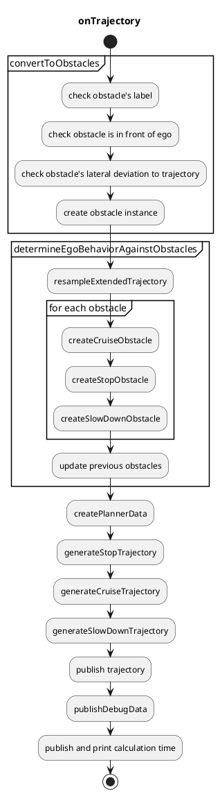

# Obstacle Cruise Planner

## Overview

The `autoware_obstacle_cruise_planner` package has following modules.

- Stop planning
  - stop when there is a static obstacle near the trajectory.
- Cruise planning
  - cruise a dynamic obstacle in front of the ego.
- Slow down planning
  - slow down when there is a static/dynamic obstacle near the trajectory.

## Interfaces

### Input topics

| Name                 | Type                                       | Description      |
| -------------------- | ------------------------------------------ | ---------------- |
| `~/input/trajectory` | autoware_planning_msgs::Trajectory         | input trajectory |
| `~/input/objects`    | autoware_perception_msgs::PredictedObjects | dynamic objects  |
| `~/input/odometry`   | nav_msgs::msg::Odometry                    | ego odometry     |

### Output topics

| Name                            | Type                                           | Description                           |
| ------------------------------- | ---------------------------------------------- | ------------------------------------- |
| `~/output/trajectory`           | autoware_planning_msgs::Trajectory             | output trajectory                     |
| `~/output/velocity_limit`       | tier4_planning_msgs::VelocityLimit             | velocity limit for cruising           |
| `~/output/clear_velocity_limit` | tier4_planning_msgs::VelocityLimitClearCommand | clear command for velocity limit      |
| `~/output/stop_reasons`         | tier4_planning_msgs::StopReasonArray           | reasons that make the vehicle to stop |

## Design

Design for the following functions is defined here.

- Behavior determination against obstacles
- Stop planning
- Cruise planning
- Slow down planning

A data structure for cruise and stop planning is as follows.
This planner data is created first, and then sent to the planning algorithm.

```cpp
struct PlannerData
{
  rclcpp::Time current_time;
  autoware_planning_msgs::msg::Trajectory traj;
  geometry_msgs::msg::Pose current_pose;
  double ego_vel;
  double current_acc;
  std::vector<Obstacle> target_obstacles;
};
```

```cpp
struct Obstacle
{
  rclcpp::Time stamp;  // This is not the current stamp, but when the object was observed.
  geometry_msgs::msg::Pose pose;  // interpolated with the current stamp
  bool orientation_reliable;
  Twist twist;
  bool twist_reliable;
  ObjectClassification classification;
  std::string uuid;
  Shape shape;
  std::vector<PredictedPath> predicted_paths;
};
```

### Behavior determination against obstacles

Obstacles for cruising, stopping and slowing down are selected in this order based on their pose and velocity.
The obstacles not in front of the ego will be ignored.


#### Determine cruise vehicles

The obstacles meeting the following condition are determined as obstacles for cruising.

- The lateral distance from the object to the ego's trajectory is smaller than `behavior_determination.cruise.max_lat_margin`.

- The object type is for cruising according to `common.cruise_obstacle_type.*`.
- The object is not crossing the ego's trajectory (\*1).
- If the object is inside the trajectory.
  - The object type is for inside cruising according to `common.cruise_obstacle_type.inside.*`.
  - The object velocity is larger than `behavior_determination.obstacle_velocity_threshold_from_cruise_to_stop`.
- If the object is outside the trajectory.
  - The object type is for outside cruising according to `common.cruise_obstacle_type.outside.*`.
  - The object velocity is larger than `behavior_determination.cruise.outside_obstacle.obstacle_velocity_threshold`.
  - The highest confident predicted path collides with the ego's trajectory.
  - Its collision's period is larger than `behavior_determination.cruise.outside_obstacle.ego_obstacle_overlap_time_threshold`.

| Parameter                                                                            | Type   | Description                                                          |
| ------------------------------------------------------------------------------------ | ------ | -------------------------------------------------------------------- |
| `common.cruise_obstacle_type.inside.unknown`                                         | bool   | flag to consider unknown objects for cruising                        |
| `common.cruise_obstacle_type.inside.car`                                             | bool   | flag to consider unknown objects for cruising                        |
| `common.cruise_obstacle_type.inside.truck`                                           | bool   | flag to consider unknown objects for cruising                        |
| ...                                                                                  | bool   | ...                                                                  |
| `common.cruise_obstacle_type.outside.unknown`                                        | bool   | flag to consider unknown objects for cruising                        |
| `common.cruise_obstacle_type.outside.car`                                            | bool   | flag to consider unknown objects for cruising                        |
| `common.cruise_obstacle_type.outside.truck`                                          | bool   | flag to consider unknown objects for cruising                        |
| ...                                                                                  | bool   | ...                                                                  |
| `behavior_determination.cruise.max_lat_margin`                                       | double | maximum lateral margin for cruise obstacles                          |
| `behavior_determination.obstacle_velocity_threshold_from_cruise_to_stop`             | double | maximum obstacle velocity for cruise obstacle inside the trajectory  |
| `behavior_determination.cruise.outside_obstacle.obstacle_velocity_threshold`         | double | maximum obstacle velocity for cruise obstacle outside the trajectory |
| `behavior_determination.cruise.outside_obstacle.ego_obstacle_overlap_time_threshold` | double | maximum overlap time of the collision between the ego and obstacle   |

##### Yield for vehicles that might cut in into the ego's lane

It is also possible to yield (cruise) behind vehicles in neighbor lanes if said vehicles might cut in the ego vehicle's current lane.

The obstacles meeting the following condition are determined as obstacles for yielding (cruising).

- The object type is for cruising according to `common.cruise_obstacle_type.*` and it is moving with a speed greater than `behavior_determination.cruise.yield.stopped_obstacle_velocity_threshold`.
- The object is not crossing the ego's trajectory (\*1).
- There is another object of type `common.cruise_obstacle_type.*` stopped in front of the moving obstacle.
- The lateral distance (using the ego's trajectory as reference) between both obstacles is less than `behavior_determination.cruise.yield.max_lat_dist_between_obstacles`
- Both obstacles, moving and stopped, are within `behavior_determination.cruise.yield.lat_distance_threshold` and `behavior_determination.cruise.yield.lat_distance_threshold` + `behavior_determination.cruise.yield.max_lat_dist_between_obstacles` lateral distance from the ego's trajectory respectively.

If the above conditions are met, the ego vehicle will cruise behind the moving obstacle, yielding to it so it can cut in into the ego's lane to avoid the stopped obstacle.

#### Determine stop vehicles

Among obstacles which are not for cruising, the obstacles meeting the following condition are determined as obstacles for stopping.

- The object type is for stopping according to `common.stop_obstacle_type.*`.
- The lateral distance from the object to the ego's trajectory is smaller than `behavior_determination.stop.max_lat_margin`.
- The object velocity along the ego's trajectory is smaller than `behavior_determination.obstacle_velocity_threshold_from_stop_to_cruise`.
- The object
  - does not cross the ego's trajectory (\*1)
  - with the velocity smaller than `behavior_determination.crossing_obstacle.obstacle_velocity_threshold`
  - and its collision time margin is large enough (\*2).

| Parameter                                                                | Type   | Description                                   |
| ------------------------------------------------------------------------ | ------ | --------------------------------------------- |
| `common.stop_obstacle_type.unknown`                                      | bool   | flag to consider unknown objects for stopping |
| `common.stop_obstacle_type.car`                                          | bool   | flag to consider unknown objects for stopping |
| `common.stop_obstacle_type.truck`                                        | bool   | flag to consider unknown objects for stopping |
| ...                                                                      | bool   | ...                                           |
| `behavior_determination.stop.max_lat_margin`                             | double | maximum lateral margin for stop obstacles     |
| `behavior_determination.crossing_obstacle.obstacle_velocity_threshold`   | double | maximum crossing obstacle velocity to ignore  |
| `behavior_determination.obstacle_velocity_threshold_from_stop_to_cruise` | double | maximum obstacle velocity for stop            |

#### Determine slow down vehicles

Among obstacles which are not for cruising and stopping, the obstacles meeting the following condition are determined as obstacles for slowing down.

- The object type is for slowing down according to `common.slow_down_obstacle_type.*`.
- The lateral distance from the object to the ego's trajectory is smaller than `behavior_determination.slow_down.max_lat_margin`.

| Parameter                                         | Type   | Description                                       |
| ------------------------------------------------- | ------ | ------------------------------------------------- |
| `common.slow_down_obstacle_type.unknown`          | bool   | flag to consider unknown objects for slowing down |
| `common.slow_down_obstacle_type.car`              | bool   | flag to consider unknown objects for slowing down |
| `common.slow_down_obstacle_type.truck`            | bool   | flag to consider unknown objects for slowing down |
| ...                                               | bool   | ...                                               |
| `behavior_determination.slow_down.max_lat_margin` | double | maximum lateral margin for slow down obstacles    |

#### NOTE

##### \*1: Crossing obstacles

Crossing obstacle is the object whose orientation's yaw angle against the ego's trajectory is smaller than `behavior_determination.crossing_obstacle.obstacle_traj_angle_threshold`.

| Parameter                                                                | Type   | Description                                                                                       |
| ------------------------------------------------------------------------ | ------ | ------------------------------------------------------------------------------------------------- |
| `behavior_determination.crossing_obstacle.obstacle_traj_angle_threshold` | double | maximum angle against the ego's trajectory to judge the obstacle is crossing the trajectory [rad] |

##### \*2: Enough collision time margin

We predict the collision area and its time by the ego with a constant velocity motion and the obstacle with its predicted path.
Then, we calculate a collision time margin which is the difference of the time when the ego will be inside the collision area and the obstacle will be inside the collision area.
When this time margin is smaller than `behavior_determination.stop.crossing_obstacle.collision_time_margin`, the margin is not enough.

| Parameter                                                             | Type   | Description                                           |
| --------------------------------------------------------------------- | ------ | ----------------------------------------------------- |
| `behavior_determination.stop.crossing_obstacle.collision_time_margin` | double | maximum collision time margin of the ego and obstacle |

### Stop planning

| Parameter                              | Type   | Description                                                                                |
| -------------------------------------- | ------ | ------------------------------------------------------------------------------------------ |
| `common.min_strong_accel`              | double | ego's minimum acceleration to stop [m/ss]                                                  |
| `common.safe_distance_margin`          | double | distance with obstacles for stop [m]                                                       |
| `common.terminal_safe_distance_margin` | double | terminal_distance with obstacles for stop, which cannot be exceed safe distance margin [m] |

The role of the stop planning is keeping a safe distance with static vehicle objects or dynamic/static non vehicle objects.

The stop planning just inserts the stop point in the trajectory to keep a distance with obstacles.
The safe distance is parameterized as `common.safe_distance_margin`.
When it stops at the end of the trajectory, and obstacle is on the same point, the safe distance becomes `terminal_safe_distance_margin`.

When inserting the stop point, the required acceleration for the ego to stop in front of the stop point is calculated.
If the acceleration is less than `common.min_strong_accel`, the stop planning will be cancelled since this package does not assume a strong sudden brake for emergency.

### Cruise planning

| Parameter                     | Type   | Description                                    |
| ----------------------------- | ------ | ---------------------------------------------- |
| `common.safe_distance_margin` | double | minimum distance with obstacles for cruise [m] |

The role of the cruise planning is keeping a safe distance with dynamic vehicle objects with smoothed velocity transition.
This includes not only cruising a front vehicle, but also reacting a cut-in and cut-out vehicle.

The safe distance is calculated dynamically based on the Responsibility-Sensitive Safety (RSS) by the following equation.

$$
d_{rss} = v_{ego} t_{idling} + \frac{1}{2} a_{ego} t_{idling}^2 + \frac{v_{ego}^2}{2 a_{ego}} - \frac{v_{obstacle}^2}{2 a_{obstacle}},
$$

assuming that $d_{rss}$ is the calculated safe distance, $t_{idling}$ is the idling time for the ego to detect the front vehicle's deceleration, $v_{ego}$ is the ego's current velocity, $v_{obstacle}$ is the front obstacle's current velocity, $a_{ego}$ is the ego's acceleration, and $a_{obstacle}$ is the obstacle's acceleration.
These values are parameterized as follows. Other common values such as ego's minimum acceleration is defined in `common.param.yaml`.

| Parameter                         | Type   | Description                                                                   |
| --------------------------------- | ------ | ----------------------------------------------------------------------------- |
| `common.idling_time`              | double | idling time for the ego to detect the front vehicle starting deceleration [s] |
| `common.min_ego_accel_for_rss`    | double | ego's acceleration for RSS [m/ss]                                             |
| `common.min_object_accel_for_rss` | double | front obstacle's acceleration for RSS [m/ss]                                  |

The detailed formulation is as follows.

$$
\begin{align}
d_{error} & = d - d_{rss} \\
d_{normalized} & = lpf(d_{error} / d_{obstacle}) \\
d_{quad, normalized} & = sign(d_{normalized}) *d_{normalized}*d_{normalized} \\
v_{pid} & = pid(d_{quad, normalized}) \\
v_{add} & = v_{pid} > 0 ? v_{pid}* w_{acc} : v_{pid} \\
v_{target} & = max(v_{ego} + v_{add}, v_{min, cruise})
\end{align}
$$

| Variable          | Description                             |
| ----------------- | --------------------------------------- |
| `d`               | actual distance to obstacle             |
| `d_{rss}`         | ideal distance to obstacle based on RSS |
| `v_{min, cruise}` | `min_cruise_target_vel`                 |
| `w_{acc}`         | `output_ratio_during_accel`             |
| `lpf(val)`        | apply low-pass filter to `val`          |
| `pid(val)`        | apply pid to `val`                      |

### Slow down planning

| Parameter                                                         | Type           | Description                                                                                                                                                                                                                                                                                                  |
| ----------------------------------------------------------------- | -------------- | ------------------------------------------------------------------------------------------------------------------------------------------------------------------------------------------------------------------------------------------------------------------------------------------------------------ |
| `slow_down.labels`                                                | vector(string) | A vector of labels for customizing obstacle-label-based slow down behavior. Each label represents an obstacle type that will be treated differently when applying slow down. The possible labels are ("default" (Mandatory), "unknown","car","truck","bus","trailer","motorcycle","bicycle" or "pedestrian") |
| `slow_down.default.static.min_lat_velocity`                       | double         | minimum velocity to linearly calculate slow down velocity [m]. Note: This default value will be used when the detected obstacle label does not match any of the slow_down.labels and the obstacle is considered to be static, or not moving                                                                  |
| `slow_down.default.static.max_lat_velocity`                       | double         | maximum velocity to linearly calculate slow down velocity [m]. Note: This default value will be used when the detected obstacle label does not match any of the slow_down.labels and the obstacle is considered to be static, or not moving                                                                  |
| `slow_down.default.static.min_lat_margin`                         | double         | minimum lateral margin to linearly calculate slow down velocity [m]. Note: This default value will be used when the detected obstacle label does not match any of the slow_down.labels and the obstacle is considered to be static, or not moving                                                            |
| `slow_down.default.static.max_lat_margin`                         | double         | maximum lateral margin to linearly calculate slow down velocity [m]. Note: This default value will be used when the detected obstacle label does not match any of the slow_down.labels and the obstacle is considered to be static, or not moving                                                            |
| `slow_down.default.moving.min_lat_velocity`                       | double         | minimum velocity to linearly calculate slow down velocity [m]. Note: This default value will be used when the detected obstacle label does not match any of the slow_down.labels and the obstacle is considered to be moving                                                                                 |
| `slow_down.default.moving.max_lat_velocity`                       | double         | maximum velocity to linearly calculate slow down velocity [m]. Note: This default value will be used when the detected obstacle label does not match any of the slow_down.labels and the obstacle is considered to be moving                                                                                 |
| `slow_down.default.moving.min_lat_margin`                         | double         | minimum lateral margin to linearly calculate slow down velocity [m]. Note: This default value will be used when the detected obstacle label does not match any of the slow_down.labels and the obstacle is considered to be moving                                                                           |
| `slow_down.default.moving.max_lat_margin`                         | double         | maximum lateral margin to linearly calculate slow down velocity [m]. Note: This default value will be used when the detected obstacle label does not match any of the slow_down.labels and the obstacle is considered to be moving                                                                           |
| `(optional) slow_down."label".(static & moving).min_lat_velocity` | double         | minimum velocity to linearly calculate slow down velocity [m]. Note: only for obstacles specified in `slow_down.labels`. Requires a `static` and a `moving` value                                                                                                                                            |
| `(optional) slow_down."label".(static & moving).max_lat_velocity` | double         | maximum velocity to linearly calculate slow down velocity [m]. Note: only for obstacles specified in `slow_down.labels`. Requires a `static` and a `moving` value                                                                                                                                            |
| `(optional) slow_down."label".(static & moving).min_lat_margin`   | double         | minimum lateral margin to linearly calculate slow down velocity [m]. Note: only for obstacles specified in `slow_down.labels`. Requires a `static` and a `moving` value                                                                                                                                      |
| `(optional) slow_down."label".(static & moving).max_lat_margin`   | double         | maximum lateral margin to linearly calculate slow down velocity [m]. Note: only for obstacles specified in `slow_down.labels`. Requires a `static` and a `moving` value                                                                                                                                      |

The role of the slow down planning is inserting slow down velocity in the trajectory where the trajectory points are close to the obstacles. The parameters can be customized depending on the obstacle type (see `slow_down.labels`), making it possible to adjust the slow down behavior depending if the obstacle is a pedestrian, bicycle, car, etc. Each obstacle type has a `static` and a `moving` parameter set, so it is possible to customize the slow down response of the ego vehicle according to the obstacle type and if it is moving or not. If an obstacle is determined to be moving, the corresponding `moving` set of parameters will be used to compute the vehicle slow down, otherwise, the `static` parameters will be used. The `static` and `moving` separation is useful for customizing the ego vehicle slow down behavior to, for example, slow down more significantly when passing stopped vehicles that might cause occlusion or that might suddenly open its doors.

An obstacle is classified as `static` if its total speed is less than the `moving_object_speed_threshold` parameter. Furthermore, a hysteresis based approach is used to avoid chattering, it uses the `moving_object_hysteresis_range` parameter range and the obstacle's previous state (`moving` or `static`) to determine if the obstacle is moving or not. In other words, if an obstacle was previously classified as `static`, it will not change its classification to `moving` unless its total speed is greater than `moving_object_speed_threshold` + `moving_object_hysteresis_range`. Likewise, an obstacle previously classified as `moving`, will only change to `static` if its speed is lower than `moving_object_speed_threshold` - `moving_object_hysteresis_range`.

The closest point on the obstacle to the ego's trajectory is calculated.
Then, the slow down velocity is calculated by linear interpolation with the distance between the point and trajectory as follows.


| Variable   | Description                                       |
| ---------- | ------------------------------------------------- |
| `v_{out}`  | calculated velocity for slow down                 |
| `v_{min}`  | `slow_down.min_lat_velocity`                      |
| `v_{max}`  | `slow_down.max_lat_velocity`                      |
| `l_{min}`  | `slow_down.min_lat_margin`                        |
| `l_{max}`  | `slow_down.max_lat_margin`                        |
| `l'_{max}` | `behavior_determination.slow_down.max_lat_margin` |

The calculated velocity is inserted in the trajectory where the obstacle is inside the area with `behavior_determination.slow_down.max_lat_margin`.


## Implementation

### Flowchart

Successive functions consist of `autoware_obstacle_cruise_planner` as follows.

Various algorithms for stop and cruise planning will be implemented, and one of them is designated depending on the use cases.
The core algorithm implementation `generateTrajectory` depends on the designated algorithm.



### Algorithm selection for cruise planner

Currently, only a PID-based planner is supported.
Each planner will be explained in the following.

| Parameter                | Type   | Description                                                  |
| ------------------------ | ------ | ------------------------------------------------------------ |
| `common.planning_method` | string | cruise and stop planning algorithm, selected from "pid_base" |

### PID-based planner

#### Stop planning

In the `pid_based_planner` namespace,

| Parameter                                         | Type   | Description                                                  |
| ------------------------------------------------- | ------ | ------------------------------------------------------------ |
| `obstacle_velocity_threshold_from_cruise_to_stop` | double | obstacle velocity threshold to be stopped from cruised [m/s] |

Only one obstacle is targeted for the stop planning.
It is the obstacle among obstacle candidates whose velocity is less than `obstacle_velocity_threshold_from_cruise_to_stop`, and which is the nearest to the ego along the trajectory. A stop point is inserted keeping`common.safe_distance_margin` distance between the ego and obstacle.

Note that, as explained in the stop planning design, a stop planning which requires a strong acceleration (less than `common.min_strong_accel`) will be canceled.

#### Cruise planning

In the `pid_based_planner` namespace,

| Parameter                   | Type   | Description                                                                                              |
| --------------------------- | ------ | -------------------------------------------------------------------------------------------------------- |
| `kp`                        | double | p gain for pid control [-]                                                                               |
| `ki`                        | double | i gain for pid control [-]                                                                               |
| `kd`                        | double | d gain for pid control [-]                                                                               |
| `output_ratio_during_accel` | double | The output velocity will be multiplied by the ratio during acceleration to follow the front vehicle. [-] |
| `vel_to_acc_weight`         | double | target acceleration is target velocity \* `vel_to_acc_weight` [-]                                        |
| `min_cruise_target_vel`     | double | minimum target velocity during cruise [m/s]                                                              |

In order to keep the safe distance, the target velocity and acceleration is calculated and sent as an external velocity limit to the velocity smoothing package (`motion_velocity_smoother` by default).
The target velocity and acceleration is respectively calculated with the PID controller according to the error between the reference safe distance and the actual distance.

### Optimization-based planner

under construction

## Minor functions

### Prioritization of behavior module's stop point

When stopping for a pedestrian walking on the crosswalk, the behavior module inserts the zero velocity in the trajectory in front of the crosswalk.
Also `autoware_obstacle_cruise_planner`'s stop planning also works, and the ego may not reach the behavior module's stop point since the safe distance defined in `autoware_obstacle_cruise_planner` may be longer than the behavior module's safe distance.
To resolve this non-alignment of the stop point between the behavior module and `autoware_obstacle_cruise_planner`, `common.min_behavior_stop_margin` is defined.
In the case of the crosswalk described above, `autoware_obstacle_cruise_planner` inserts the stop point with a distance `common.min_behavior_stop_margin` at minimum between the ego and obstacle.

| Parameter                         | Type   | Description                                                            |
| --------------------------------- | ------ | ---------------------------------------------------------------------- |
| `common.min_behavior_stop_margin` | double | minimum stop margin when stopping with the behavior module enabled [m] |

### A function to keep the closest stop obstacle in target obstacles

In order to keep the closest stop obstacle in the target obstacles, we check whether it is disappeared or not from the target obstacles in the `checkConsistency` function.
If the previous closest stop obstacle is remove from the lists, we keep it in the lists for `stop_obstacle_hold_time_threshold` seconds.
Note that if a new stop obstacle appears and the previous closest obstacle removes from the lists, we do not add it to the target obstacles again.

| Parameter                                                  | Type   | Description                                        |
| ---------------------------------------------------------- | ------ | -------------------------------------------------- |
| `behavior_determination.stop_obstacle_hold_time_threshold` | double | maximum time for holding closest stop obstacle [s] |

## How To Debug

How to debug can be seen [here](docs/debug.md).

## Known Limits

- Common
  - When the obstacle pose or velocity estimation has a delay, the ego sometimes will go close to the front vehicle keeping deceleration.
  - Current implementation only uses predicted objects message for static/dynamic obstacles and does not use pointcloud. Therefore, if object recognition is lost, the ego cannot deal with the lost obstacle.
  - The current predicted paths for obstacle's lane change does not have enough precision for obstacle_cruise_planner. Therefore, we set `rough_detection_area` a small value.
- PID-based planner
  - The algorithm strongly depends on the velocity smoothing package (`motion_velocity_smoother` by default) whether or not the ego realizes the designated target speed. If the velocity smoothing package is updated, please take care of the vehicle's behavior as much as possible.
