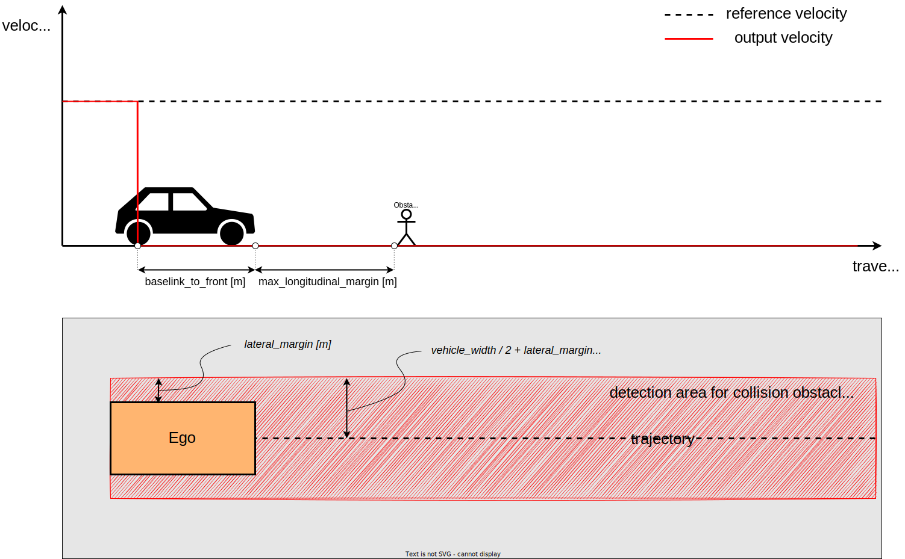
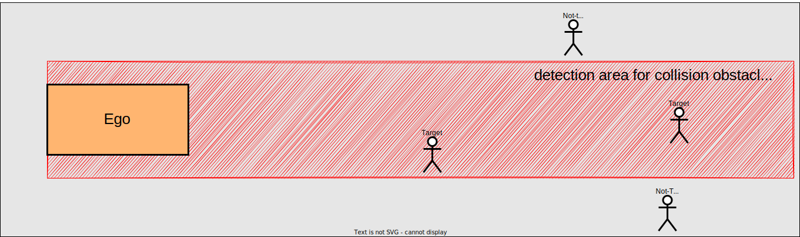
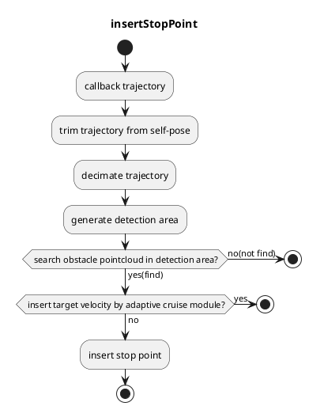
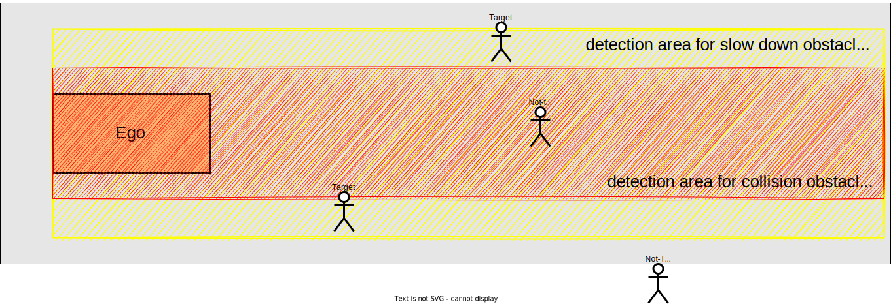
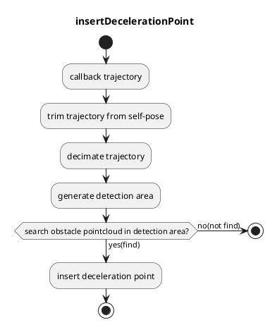
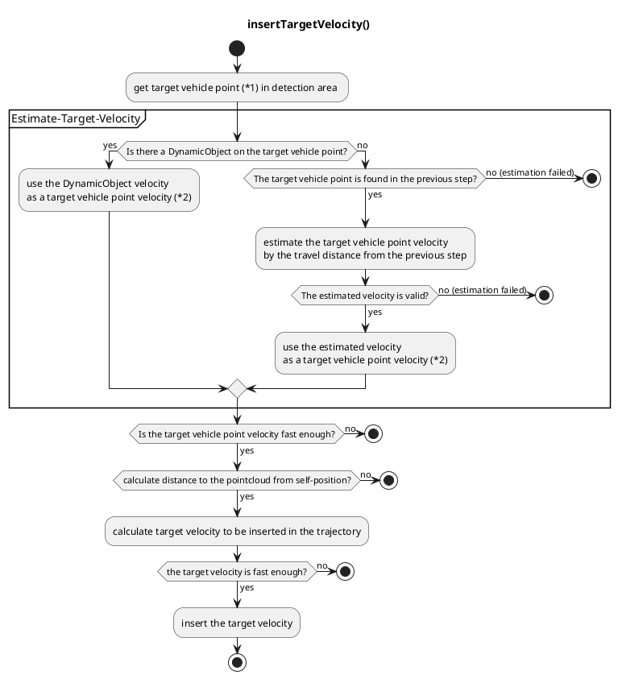

# Obstacle Stop Planner

## Overview

`obstacle_stop_planner` has following modules

- Obstacle Stop Planner
  - inserts a stop point in trajectory when there is a static point cloud on the trajectory.
- Slow Down Planner
  - inserts a deceleration section in trajectory when there is a point cloud near the trajectory.
- Adaptive Cruise Controller (ACC)
  - embeds target velocity in trajectory when there is a dynamic point cloud on the trajectory.

### Input topics

| Name                        | Type                                       | Description         |
| --------------------------- | ------------------------------------------ | ------------------- |
| `~/input/pointcloud`        | sensor_msgs::PointCloud2                   | obstacle pointcloud |
| `~/input/trajectory`        | autoware_planning_msgs::Trajectory         | trajectory          |
| `~/input/vector_map`        | autoware_map_msgs::msg::LaneletMapBin      | vector map          |
| `~/input/odometry`          | nav_msgs::Odometry                         | vehicle velocity    |
| `~/input/dynamic_objects`   | autoware_perception_msgs::PredictedObjects | dynamic objects     |
| `~/input/expand_stop_range` | tier4_planning_msgs::msg::ExpandStopRange  | expand stop range   |

### Output topics

| Name                   | Type                                 | Description                            |
| ---------------------- | ------------------------------------ | -------------------------------------- |
| `~output/trajectory`   | autoware_planning_msgs::Trajectory   | trajectory to be followed              |
| `~output/stop_reasons` | tier4_planning_msgs::StopReasonArray | reasons that cause the vehicle to stop |

### Common Parameter

{{ json_to_markdown("planning/autoware_obstacle_stop_planner/schema/common.schema.json") }}

| Parameter                              | Type   | Description                                                                               |
| -------------------------------------- | ------ | ----------------------------------------------------------------------------------------- |
| `enable_slow_down`                     | bool   | enable slow down planner [-]                                                              |
| `max_velocity`                         | double | max velocity [m/s]                                                                        |
| `chattering_threshold`                 | double | even if the obstacle disappears, the stop judgment continues for chattering_threshold [s] |
| `enable_z_axis_obstacle_filtering`     | bool   | filter obstacles in z axis (height) [-]                                                   |
| `z_axis_filtering_buffer`              | double | additional buffer for z axis filtering [m]                                                |
| `use_predicted_objects`                | bool   | whether to use predicted objects for collision and slowdown detection [-]                 |
| `predicted_object_filtering_threshold` | double | threshold for filtering predicted objects [valid only publish_obstacle_polygon true] [m]  |
| `publish_obstacle_polygon`             | bool   | if use_predicted_objects is true, node publishes collision polygon [-]                    |

## Obstacle Stop Planner

### Role

This module inserts the stop point before the obstacle with margin. In nominal case, the margin is the sum
of `baselink_to_front` and `max_longitudinal_margin`. The `baselink_to_front` means the distance between `baselink`(
center of rear-wheel axis) and front of the car. The detection area is generated along the processed trajectory as
following figure. (This module cut off the input trajectory behind the ego position and decimates the trajectory points
for reducing computational costs.)

<figure markdown>
  {width=1000}
  <figcaption>parameters for obstacle stop planner</figcaption>
</figure>

<figure markdown>
  {width=1000}
  <figcaption>target for obstacle stop planner</figcaption>
</figure>

If another stop point has already been inserted by other modules within `max_longitudinal_margin`, the margin is the sum
of `baselink_to_front` and `min_longitudinal_margin`. This feature exists to avoid stopping unnaturally position. (For
example, the ego stops unnaturally far away from stop line of crosswalk that pedestrians cross to without this feature.)

<figure markdown>
  {width=1000}
  <figcaption>minimum longitudinal margin</figcaption>
</figure>

The module searches the obstacle pointcloud within detection area. When the pointcloud is
found, `Adaptive Cruise Controller` modules starts to work. only when `Adaptive Cruise Controller` modules does not
insert target velocity, the stop point is inserted to the trajectory. The stop point means the point with 0 velocity.

### Restart prevention

If it needs X meters (e.g. 0.5 meters) to stop once the vehicle starts moving due to the poor vehicle control
performance, the vehicle goes over the stopping position that should be strictly observed when the vehicle starts to
moving in order to approach the near stop point (e.g. 0.3 meters away).

This module has parameter `hold_stop_margin_distance` in order to prevent from these redundant restart. If the vehicle
is stopped within `hold_stop_margin_distance` meters from stop point of the module, the module judges that the vehicle
has already stopped for the module's stop point and plans to keep stopping current position even if the vehicle is
stopped due to other factors.

<figure markdown>
  {width=1000}
  <figcaption>parameters</figcaption>
</figure>

<figure markdown>
  {width=1000}
  <figcaption>outside the hold_stop_margin_distance</figcaption>
</figure>

<figure markdown>
  {width=1000}
  <figcaption>inside the hold_stop_margin_distance</figcaption>
</figure>

### Parameters

{{ json_to_markdown("planning/autoware_obstacle_stop_planner/schema/obstacle_stop_planner.schema.json") }}

#### Stop position

| Parameter                             | Type   | Description                                                                                                                                    |
| ------------------------------------- | ------ | ---------------------------------------------------------------------------------------------------------------------------------------------- |
| `max_longitudinal_margin`             | double | margin between obstacle and the ego's front [m]                                                                                                |
| `max_longitudinal_margin_behind_goal` | double | margin between obstacle and the ego's front when the stop point is behind the goal[m]                                                          |
| `min_longitudinal_margin`             | double | if any obstacle exists within `max_longitudinal_margin`, this module set margin as the value of _stop margin_ to `min_longitudinal_margin` [m] |
| `hold_stop_margin_distance`           | double | parameter for restart prevention (See above section) [m]                                                                                       |

#### Obstacle detection area

| Parameter                              | Type   | Description                                                                         |
| -------------------------------------- | ------ | ----------------------------------------------------------------------------------- |
| `lateral_margin`                       | double | lateral margin from the vehicle footprint for collision obstacle detection area [m] |
| `step_length`                          | double | step length for pointcloud search range [m]                                         |
| `enable_stop_behind_goal_for_obstacle` | bool   | enabling extend trajectory after goal lane for obstacle detection                   |

### Flowchart

## Slow Down Planner

### Role

This module inserts the slow down section before the obstacle with forward margin and backward margin. The forward
margin is the sum of `baselink_to_front` and `longitudinal_forward_margin`, and the backward margin is the sum
of `baselink_to_front` and `longitudinal_backward_margin`. The ego keeps slow down velocity in slow down section. The
velocity is calculated the following equation.

$v_{target} = v_{min} + \frac{l_{ld} - l_{vw}/2}{l_{margin}} (v_{max} - v_{min} )$

- $v_{target}$ : slow down target velocity [m/s]
- $v_{min}$ : `min_slow_down_velocity` [m/s]
- $v_{max}$ : `max_slow_down_velocity` [m/s]
- $l_{ld}$ : lateral deviation between the obstacle and the ego footprint [m]
- $l_{margin}$ : `lateral_margin` [m]
- $l_{vw}$ : width of the ego footprint [m]

The above equation means that the smaller the lateral deviation of the pointcloud, the lower the velocity of the slow
down section.

<figure markdown>
  {width=1000}
  <figcaption>parameters for slow down planner</figcaption>
</figure>

<figure markdown>
  {width=1000}
  <figcaption>target for slow down planner</figcaption>
</figure>

### Parameters

{{ json_to_markdown("planning/autoware_obstacle_stop_planner/schema/adaptive_cruise_control.schema.json") }}

#### Slow down section

| Parameter                      | Type   | Description                                     |
| ------------------------------ | ------ | ----------------------------------------------- |
| `longitudinal_forward_margin`  | double | margin between obstacle and the ego's front [m] |
| `longitudinal_backward_margin` | double | margin between obstacle and the ego's rear [m]  |

#### Obstacle detection area

| Parameter        | Type   | Description                                                                         |
| ---------------- | ------ | ----------------------------------------------------------------------------------- |
| `lateral_margin` | double | lateral margin from the vehicle footprint for slow down obstacle detection area [m] |

#### Slow down target velocity

| Parameter                | Type   | Description                  |
| ------------------------ | ------ | ---------------------------- |
| `max_slow_down_velocity` | double | max slow down velocity [m/s] |
| `min_slow_down_velocity` | double | min slow down velocity [m/s] |

### Flowchart

## Adaptive Cruise Controller

### Role

`Adaptive Cruise Controller` module embeds maximum velocity in trajectory when there is a dynamic point cloud on the
trajectory. The value of maximum velocity depends on the own velocity, the velocity of the point cloud ( = velocity of
the front car), and the distance to the point cloud (= distance to the front car).

| Parameter                                                        | Type   | Description                                                                                                       |
| ---------------------------------------------------------------- | ------ | ----------------------------------------------------------------------------------------------------------------- |
| `adaptive_cruise_control.use_object_to_estimate_vel`             | bool   | use dynamic objects for estimating object velocity or not (valid only if osp.use_predicted_objects false)         |
| `adaptive_cruise_control.use_pcl_to_estimate_vel`                | bool   | use raw pointclouds for estimating object velocity or not (valid only if osp.use_predicted_objects false)         |
| `adaptive_cruise_control.consider_obj_velocity`                  | bool   | consider forward vehicle velocity to calculate target velocity in adaptive cruise or not                          |
| `adaptive_cruise_control.obstacle_velocity_thresh_to_start_acc`  | double | start adaptive cruise control when the velocity of the forward obstacle exceeds this value [m/s]                  |
| `adaptive_cruise_control.obstacle_velocity_thresh_to_stop_acc`   | double | stop acc when the velocity of the forward obstacle falls below this value [m/s]                                   |
| `adaptive_cruise_control.emergency_stop_acceleration`            | double | supposed minimum acceleration (deceleration) in emergency stop [m/ss]                                             |
| `adaptive_cruise_control.emergency_stop_idling_time`             | double | supposed idling time to start emergency stop [s]                                                                  |
| `adaptive_cruise_control.min_dist_stop`                          | double | minimum distance of emergency stop [m]                                                                            |
| `adaptive_cruise_control.obstacle_emergency_stop_acceleration`   | double | supposed minimum acceleration (deceleration) in emergency stop [m/ss]                                             |
| `adaptive_cruise_control.max_standard_acceleration`              | double | supposed maximum acceleration in active cruise control [m/ss]                                                     |
| `adaptive_cruise_control.min_standard_acceleration`              | double | supposed minimum acceleration (deceleration) in active cruise control [m/ss]                                      |
| `adaptive_cruise_control.standard_idling_time`                   | double | supposed idling time to react object in active cruise control [s]                                                 |
| `adaptive_cruise_control.min_dist_standard`                      | double | minimum distance in active cruise control [m]                                                                     |
| `adaptive_cruise_control.obstacle_min_standard_acceleration`     | double | supposed minimum acceleration of forward obstacle [m/ss]                                                          |
| `adaptive_cruise_control.margin_rate_to_change_vel`              | double | rate of margin distance to insert target velocity [-]                                                             |
| `adaptive_cruise_control.use_time_compensation_to_calc_distance` | bool   | use time-compensation to calculate distance to forward vehicle                                                    |
| `adaptive_cruise_control.p_coefficient_positive`                 | double | coefficient P in PID control (used when target dist -current_dist >=0) [-]                                        |
| `adaptive_cruise_control.p_coefficient_negative`                 | double | coefficient P in PID control (used when target dist -current_dist &lt;0) [-]                                      |
| `adaptive_cruise_control.d_coefficient_positive`                 | double | coefficient D in PID control (used when delta_dist >=0) [-]                                                       |
| `adaptive_cruise_control.d_coefficient_negative`                 | double | coefficient D in PID control (used when delta_dist &lt;0) [-]                                                     |
| `adaptive_cruise_control.object_polygon_length_margin`           | double | The distance to extend the polygon length the object in pointcloud-object matching [m]                            |
| `adaptive_cruise_control.object_polygon_width_margin`            | double | The distance to extend the polygon width the object in pointcloud-object matching [m]                             |
| `adaptive_cruise_control.valid_estimated_vel_diff_time`          | double | Maximum time difference treated as continuous points in speed estimation using a point cloud [s]                  |
| `adaptive_cruise_control.valid_vel_que_time`                     | double | Time width of information used for speed estimation in speed estimation using a point cloud [s]                   |
| `adaptive_cruise_control.valid_estimated_vel_max`                | double | Maximum value of valid speed estimation results in speed estimation using a point cloud [m/s]                     |
| `adaptive_cruise_control.valid_estimated_vel_min`                | double | Minimum value of valid speed estimation results in speed estimation using a point cloud [m/s]                     |
| `adaptive_cruise_control.thresh_vel_to_stop`                     | double | Embed a stop line if the maximum speed calculated by ACC is lower than this speed [m/s]                           |
| `adaptive_cruise_control.lowpass_gain_of_upper_velocity`         | double | Lowpass-gain of target velocity                                                                                   |
| `adaptive_cruise_control.use_rough_velocity_estimation:`         | bool   | Use rough estimated velocity if the velocity estimation is failed (valid only if osp.use_predicted_objects false) |
| `adaptive_cruise_control.rough_velocity_rate`                    | double | In the rough velocity estimation, the velocity of front car is estimated as self current velocity \* this value   |

### Flowchart

(\*1) The target vehicle point is calculated as a closest obstacle PointCloud from ego along the trajectory.

(\*2) The sources of velocity estimation can be changed by the following ROS parameters.

- `adaptive_cruise_control.use_object_to_estimate_vel`
- `adaptive_cruise_control.use_pcl_to_estimate_vel`

This module works only when the target point is found in the detection area of the `Obstacle stop planner` module.

The first process of this module is to estimate the velocity of the target vehicle point. The velocity estimation uses
the velocity information of dynamic objects or the travel distance of the target vehicle point from the previous step.
The dynamic object information is primal, and the travel distance estimation is used as a backup in case of the
perception failure.
If the target vehicle point is contained in the bounding box of a dynamic object geometrically, the velocity of the
dynamic object is used as the target point velocity.
Otherwise, the target point velocity is calculated by the travel distance of the target point from the previous step;
that is `(current_position - previous_position) / dt`. Note that this travel distance based estimation fails when the
target point is detected in the first time (it mainly happens in the cut-in situation). To improve the stability of the
estimation, the median of the calculation result for several steps is used.

If the calculated velocity is within the threshold range, it is used as the target point velocity.

Only when the estimation is succeeded and the estimated velocity exceeds the value of `obstacle_stop_velocity_thresh_*`,
the distance to the pointcloud from self-position is calculated. For prevent chattering in the mode
transition, `obstacle_velocity_thresh_to_start_acc` is used for the threshold to start adaptive cruise,
and `obstacle_velocity_thresh_to_stop_acc` is used for the threshold to stop adaptive cruise. When the calculated
distance value exceeds the emergency distance $d\_{emergency}$ calculated by emergency_stop parameters, target velocity
to insert is calculated.

The emergency distance $d\_{emergency}$ is calculated as follows.

$d_{emergency} = d_{margin_{emergency}} + t_{idling_{emergency}} \cdot v_{ego} + (-\frac{v_{ego}^2}{2 \cdot a_{ego_
{emergency}}}) - (-\frac{v_{obj}^2}{2 \cdot a_{obj_{emergency}}})$

- $d_{margin_{emergency}}$ is a minimum margin to the obstacle pointcloud. The value of $d_{margin_{emergency}}$ depends
  on the parameter `min_dist_stop`
- $t_{idling_{emergency}}$ is a supposed idling time. The value of $t_{idling_{emergency}}$ depends on the
  parameter `emergency_stop_idling_time`
- $v_{ego}$ is a current velocity of own vehicle
- $a_{ego_{_{emergency}}}$ is a minimum acceleration (maximum deceleration) of own vehicle. The value of $a_{ego_{_
  {emergency}}}$ depends on the parameter `emergency_stop_acceleration`
- $v_{obj}$ is a current velocity of obstacle pointcloud.
- $a_{obj_{_{emergency}}}$ is a supposed minimum acceleration of obstacle pointcloud. The value of $a_{obj_{_
  {emergency}}}$ depends on the parameter `obstacle_emergency_stop_acceleration`
- \*Above $X_{_{emergency}}$ parameters are used only in emergency situation.

The target velocity is determined to keep the distance to the obstacle pointcloud from own vehicle at the standard
distance $d\_{standard}$ calculated as following. Therefore, if the distance
to the obstacle pointcloud is longer than standard distance, The target velocity becomes higher than the current
velocity, and vice versa. For keeping the distance, a PID controller is used.

$d_{standard} = d_{margin_{standard}} + t_{idling_{standard}} \cdot v_{ego} + (-\frac{v_{ego}^2}{2 \cdot a_{ego_
{standard}}}) - (-\frac{v_{obj}^2}{2 \cdot a_{obj_{standard}}})$

- $d_{margin_{standard}}$ is a minimum margin to the obstacle pointcloud. The value of $d_{margin_{standard}}$ depends
  on the parameter `min_dist_stop`
- $t_{idling_{standard}}$ is a supposed idling time. The value of $t_{idling_{standard}}$ depends on the
  parameter `standard_stop_idling_time`
- $v_{ego}$ is a current velocity of own vehicle
- $a_{ego_{_{standard}}}$ is a minimum acceleration (maximum deceleration) of own vehicle. The value of $a_{ego_{_
  {standard}}}$ depends on the parameter `min_standard_acceleration`
- $v_{obj}$ is a current velocity of obstacle pointcloud.
- $a_{obj_{_{standard}}}$ is a supposed minimum acceleration of obstacle pointcloud. The value of $a_{obj_{_
  {standard}}}$ depends on the parameter `obstacle_min_standard_acceleration`
- \*Above $X_{_{standard}}$ parameters are used only in non-emergency situation.

If the target velocity exceeds the value of `thresh_vel_to_stop`, the target velocity is embedded in the trajectory.

## Known Limits

- It is strongly depends on velocity planning module whether or not it moves according to the target speed embedded
  by `Adaptive Cruise Controller` module. If the velocity planning module is updated, please take care of the vehicle's
  behavior as much as possible and always be ready for overriding.

- The velocity estimation algorithm in `Adaptive Cruise Controller` is depend on object tracking module. Please note
  that if the object-tracking fails or the tracking result is incorrect, it the possibility that the vehicle behaves
  dangerously.

- It does not work for backward driving, but publishes the path of the input as it is. Please
  use [obstacle_cruise_planner](../autoware_obstacle_cruise_planner/README.md) if you want to stop against an obstacle when
  backward driving.
