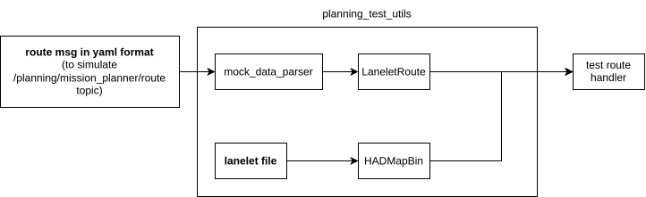

# route handler

`route_handler` is a library for calculating driving route on the lanelet map.

## Unit Testing

The unit testing depends on `autoware_test_utils` package.
`autoware_test_utils` is a library that provides several common functions to simplify unit test creating.

By default, route file is necessary to create tests. The following illustrates the route that are used in the unit test

### Lane change test route

- The route is based on map that can be obtained from `autoware_test_utils\test_map`
