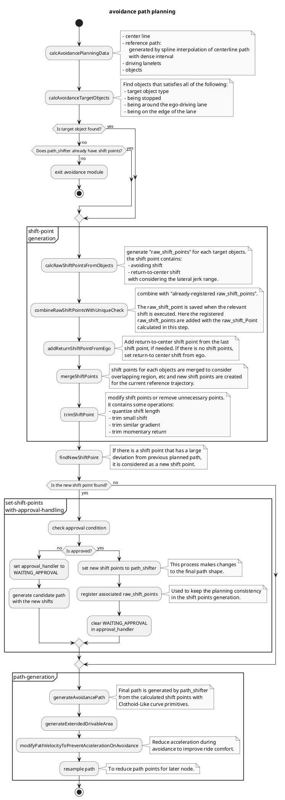
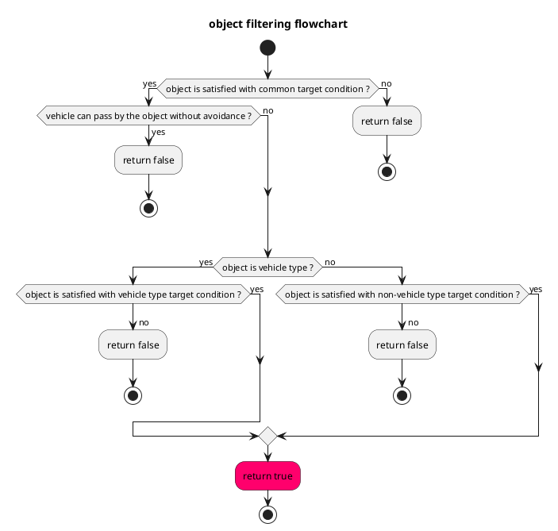
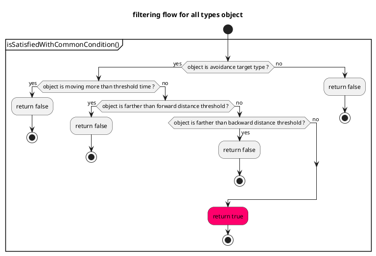
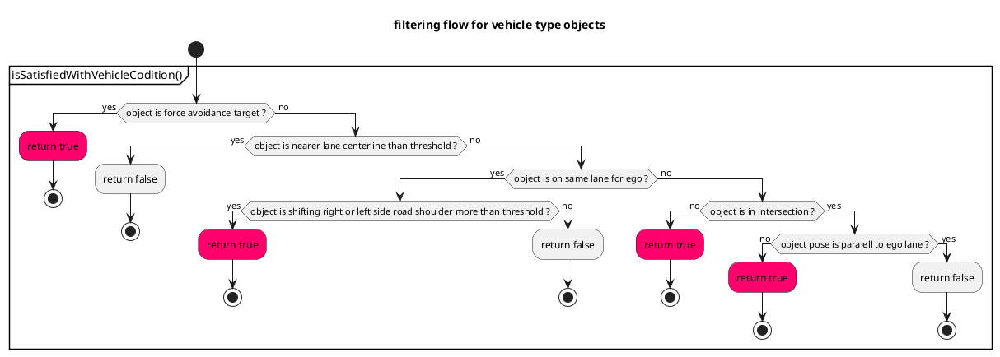
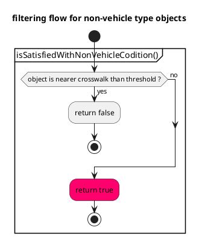
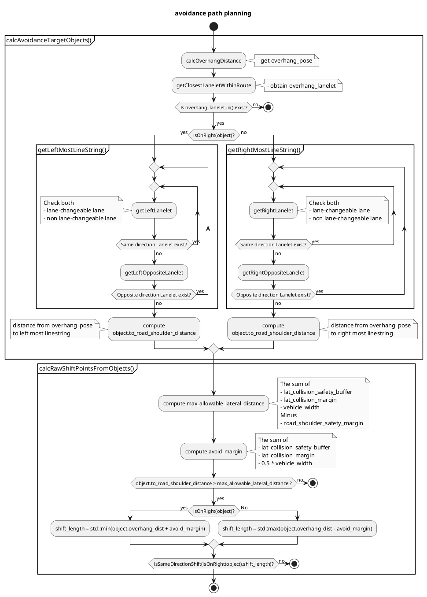
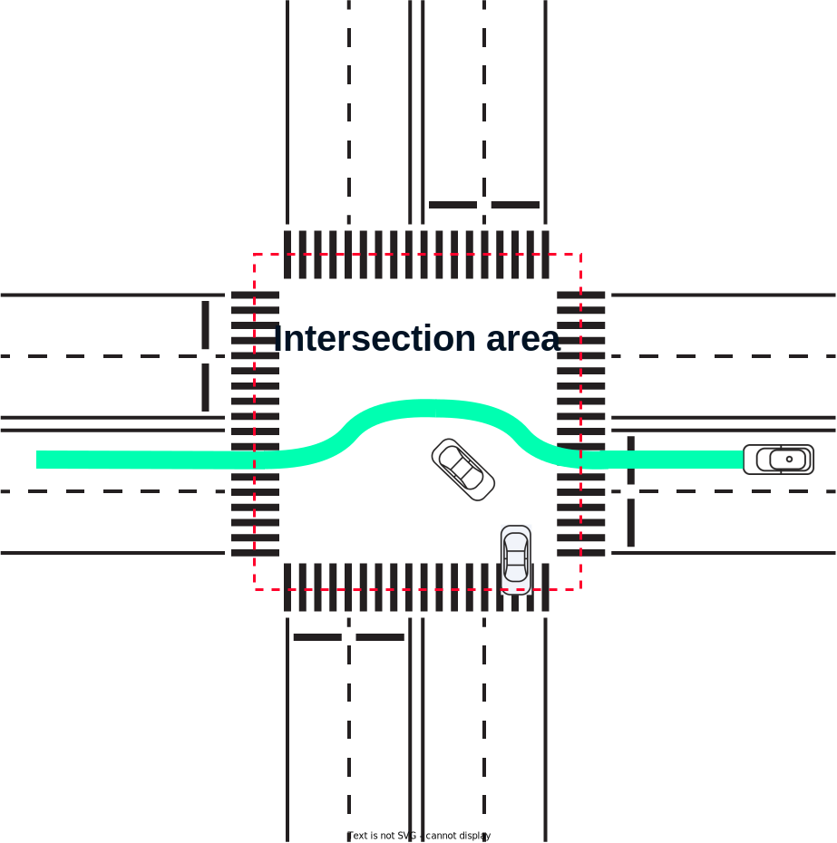
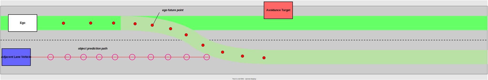
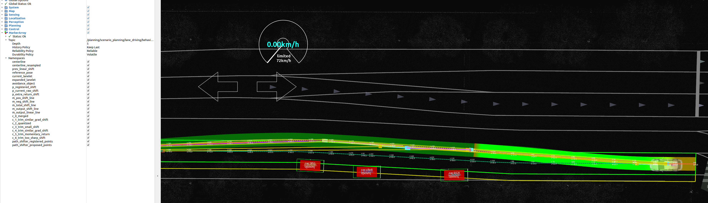
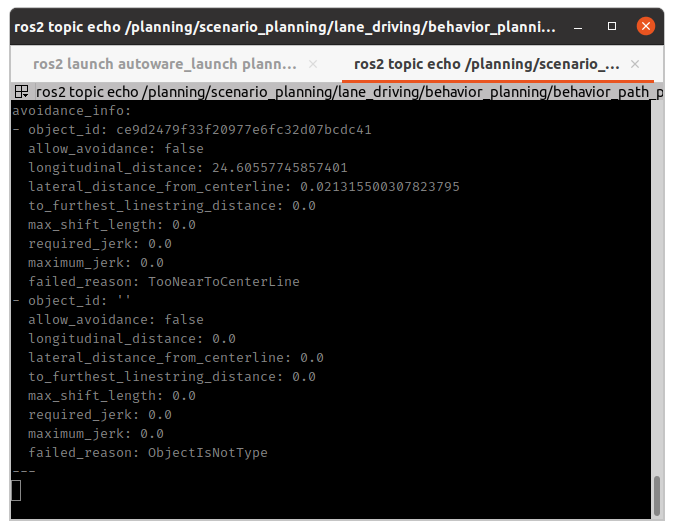

# Avoidance design

This is a rule-based path planning module designed for obstacle avoidance.

## Purpose / Role

This module is designed for rule-based avoidance that is easy for developers to design its behavior. It generates avoidance path parameterized by intuitive parameters such as lateral jerk and avoidance distance margin. This makes it possible to pre-define avoidance behavior.

In addition, the approval interface of behavior_path_planner allows external users / modules (e.g. remote operation) to intervene the decision of the vehicle behavior.　 This function is expected to be used, for example, for remote intervention in emergency situations or gathering information on operator decisions during development.

### Limitations

This module allows developers to design vehicle behavior in avoidance planning using specific rules. Due to the property of rule-based planning, the algorithm can not compensate for not colliding with obstacles in complex cases. This is a trade-off between "be intuitive and easy to design" and "be hard to tune but can handle many cases". This module adopts the former policy and therefore this output should be checked more strictly in the later stage. In the .iv reference implementation, there is another avoidance module in motion planning module that uses optimization to handle the avoidance in complex cases. (Note that, the motion planner needs to be adjusted so that the behavior result will not be changed much in the simple case and this is a typical challenge for the behavior-motion hierarchical architecture.)

### Why is avoidance in behavior module?

This module executes avoidance over lanes, and the decision requires the lane structure information to take care of traffic rules (e.g. it needs to send an indicator signal when the vehicle crosses a lane). The difference between motion and behavior module in the planning stack is whether the planner takes traffic rules into account, which is why this avoidance module exists in the behavior module.

## Inner-workings / Algorithms

The following figure shows a simple explanation of the logic for avoidance path generation. First, target objects are picked up, and shift requests are generated for each object. These shift requests are generated by taking into account the lateral jerk required for avoidance (red lines). Then these requests are merged and the shift points are created on the reference path (blue line). Filtering operations are performed on the shift points such as removing unnecessary shift points (yellow line), and finally a smooth avoidance path is generated by combining Clothoid-like curve primitives (green line).


### Flowchart



## Overview of algorithm for target object filtering

### How to decide the target obstacles

The avoidance target should be limited to stationary objects (you should not avoid a vehicle waiting at a traffic light even if it blocks your path). Therefore, target vehicles for avoidance should meet the following specific conditions.

- It is in the vicinity of your lane (parametrized)
- It is stopped
  - `threshold_speed_object_is_stopped`: parameter that be used for judge the object has stopped or not.
  - `threshold_time_object_is_moving`: parameter that be used for chattering prevention.
- It is a specific class.
  - User can limit avoidance targets.
  - Fo now, avoidance module supports only vehicle.
- It is not being in the center of the route
  - This means that the vehicle is parked on the edge of the lane. This prevents the vehicle from avoiding a vehicle waiting at a traffic light in the middle of the lane. However, this is not an appropriate implementation for the purpose. Even if a vehicle is in the center of the lane, it should be avoided if it has its hazard lights on, and this is a point that should be improved in the future as the recognition performance improves.
- Object is not behind ego(default: > -`2.0 m`) or too far(default: < `150.0 m`) and object is not behind the path goal.


### Parked-car detection

Not only the length from the centerline, but also the length from the road shoulder is calculated and used for the filtering process. It calculates the ratio of _the actual length between the the object's center and the center line_ `shift_length` and _the maximum length the object can shift_ `shiftable_length`.

$$
l_D = l_a - \frac{width}{2}, \\
ratio =  \frac{l_d}{l_D}
$$

- $l_d$ : actual shift length
- $l_D$ : shiftable length
- $l_a$ : distance between centerline and most left boundary.
- $width$ : object width

The closer the object is to the shoulder, the larger the value of $ratio$ (theoretical max value is 1.0), and it compares the value and `object_check_shiftable_ratio` to determine whether the object is a parked-car. If the road has no road shoulders, it uses `object_check_min_road_shoulder_width` as a road shoulder width virtually.


### Compensation for detection lost

In order to prevent chattering of recognition results, once an obstacle is targeted, it is hold for a while even if it disappears. This is effective when recognition is unstable. However, since it will result in over-detection (increase a number of false-positive), it is necessary to adjust parameters according to the recognition accuracy (if `object_last_seen_threshold = 0.0`, the recognition result is 100% trusted).

### Flowchart









## Overview of algorithm for avoidance path generation

### How to prevent shift line chattering that is caused by perception noise

Since object recognition results contain noise related to position ,orientation and boundary size, if the raw object recognition results are used in path generation, the avoidance path will be directly affected by the noise.

Therefore, in order to reduce the influence of the noise, avoidance module generate a envelope polygon for the avoidance target that covers it, and the avoidance path should be generated based on that polygon. The envelope polygons are generated so that they are parallel to the reference path and the polygon size is larger than the avoidance target (define by `object_envelope_buffer`). The position and size of the polygon is not updated as long as the avoidance target exists within that polygon.

```yaml
# default value
object_envelope_buffer: 0.3 # [m]
```


### Computing Shift Length and Shift Points

The lateral shift length is affected by 4 variables, namely `lateral_collision_safety_buffer`, `lateral_collision_margin`, `vehicle_width` and `overhang_distance`. The equation is as follows

```C++
avoid_margin = lateral_collision_margin + lateral_collision_safety_buffer + 0.5 * vehicle_width
max_allowable_lateral_distance = to_road_shoulder_distance - road_shoulder_safety_margin - 0.5 * vehicle_width
if(isOnRight(o))
{
  shift_length = avoid_margin + overhang_distance
}
else
{
  shift_length = avoid_margin - overhang_distance
}
```

The following figure illustrates these variables(This figure just shows the max value of lateral shift length).


### Rationale of having safety buffer and safety margin

To compute the shift length, additional parameters that can be tune are `lateral_collision_safety_buffer` and `road_shoulder_safety_margin`.

- The `lateral_collision_safety_buffer` parameter is used to set a safety gap that will act as the final line of defense when computing avoidance path.
  - The rationale behind having this parameter is that the parameter `lateral_collision_margin` might be changing according to the situation for various reasons. Therefore, `lateral_collision_safety_buffer` will act as the final line of defense in case of the usage of `lateral_collision_margin` fails.
  - It is recommended to set the value to more than half of the ego vehicle's width.
- The `road_shoulder_safety_margin` will prevent the module from generating a path that might cause the vehicle to go too near the road shoulder or adjacent lane dividing line.


### Generating path only within lanelet boundaries

The shift length is set as a constant value before the feature is implemented. Setting the shift length like this will cause the module to generate an avoidance path regardless of actual environmental properties. For example, the path might exceed the actual road boundary or go towards a wall. Therefore, to address this limitation, in addition to [how to decide the target obstacle](#how-to-decide-the-target-obstacles), the module also takes into account the following additional element

- The obstacles' current lane and position.
- The road shoulder with reference to the direction to avoid.

These elements are used to compute the distance from the object to the road's shoulder (`to_road_shoulder_distance`). The parameters `use_adjacent_lane` and `use_opposite_lane` allows further configuration of the to `to_road_shoulder_distance`. The following image illustrates the configuration.


If one of the following conditions is `false`, then the shift point will not be generated.

- The distance to shoulder of road is enough

```C++
avoid_margin = lateral_collision_margin + lateral_collision_safety_buffer + 0.5 * vehicle_width
avoid_margin <= (to_road_shoulder_distance - 0.5 * vehicle_width - road_shoulder_safety_margin)
```

- The obstacle intrudes into the current driving path.

  - when the object is on right of the path

    ```C++
    -overhang_dist<(lateral_collision_margin + lateral_collision_safety_buffer + 0.5 * vehicle_width)
    ```

  - when the object is on left of the path

    ```C++
    overhang_dist<(lateral_collision_margin + lateral_collision_safety_buffer + 0.5 * vehicle_width)
    ```

## Details of algorithm for avoidance path generation

### Flow-chart of the process

<!-- spell-checker:disable -->



<!-- spell-checker:enable -->

### How to decide the path shape

Generate shift points for obstacles with given lateral jerk. These points are integrated to generate an avoidance path. The detailed process flow for each case corresponding to the obstacle placement are described below. The actual implementation is not separated for each case, but the function corresponding to `multiple obstacle case (both directions)` is always running.

#### One obstacle case

The lateral shift distance to the obstacle is calculated, and then the shift point is generated from the ego vehicle speed and the given lateral jerk as shown in the figure below. A smooth avoidance path is then calculated based on the shift point.

Additionally, the following processes are executed in special cases.

#### Lateral jerk relaxation conditions

- If the ego vehicle is close to the avoidance target, the lateral jerk will be relaxed up to the maximum jerk
- When returning to the center line after avoidance, if there is not enough distance left to the goal (end of path), the jerk condition will be relaxed as above.

#### Minimum velocity relaxation conditions

There is a problem that we can not know the actual speed during avoidance in advance. This is especially critical when the ego vehicle speed is 0.
To solve that, this module provides a parameter for the minimum avoidance speed, which is used for the lateral jerk calculation when the vehicle speed is low.

- If the ego vehicle speed is lower than "nominal" minimum speed, use the minimum speed in the calculation of the jerk.
- If the ego vehicle speed is lower than "sharp" minimum speed and a nominal lateral jerk is not enough for avoidance (the case where the ego vehicle is stopped close to the obstacle), use the "sharp" minimum speed in the calculation of the jerk (it should be lower than "nominal" speed).


#### Multiple obstacle case (one direction)

Generate shift points for multiple obstacles. All of them are merged to generate new shift points along the reference path. The new points are filtered (e.g. remove small-impact shift points), and the avoidance path is computed for the filtered shift points.

**Merge process of raw shift points**: check the shift length on each path points. If the shift points are overlapped, the maximum shift value is selected for the same direction.

For the details of the shift point filtering, see [filtering for shift points](#filtering-for-shift-points).


#### Multiple obstacle case (both direction)

Generate shift points for multiple obstacles. All of them are merged to generate new shift points. If there are areas where the desired shifts conflict in different directions, the sum of the maximum shift amounts of these areas is used as the final shift amount. The rest of the process is the same as in the case of one direction.


#### Filtering for shift points

The shift points are modified by a filtering process in order to get the expected shape of the avoidance path. It contains the following filters.

- Quantization: Quantize the avoidance width in order to ignore small shifts.
- Small shifts removal: Shifts with small changes with respect to the previous shift point are unified in the previous shift width.
- Similar gradient removal: Connect two shift points with a straight line, and remove the shift points in between if their shift amount is in the vicinity of the straight line.
- Remove momentary returns: For shift points that reduce the avoidance width (for going back to the center line), if there is enough long distance in the longitudinal direction, remove them.

## Other features

### Drivable area expansion

This module has following parameters that sets which areas the path may extend into when generating an avoidance path.

```yaml
# drivable area setting
use_adjacent_lane: true
use_opposite_lane: true
use_intersection_areas: false
use_hatched_road_markings: false
```

#### adjacent lane


#### opposite lane


#### intersection areas

The intersection area is defined on Lanelet map. See [here](https://github.com/autowarefoundation/autoware_common/blob/main/tmp/lanelet2_extension/docs/lanelet2_format_extension.md)



#### hatched road markings

The hatched road marking is defined on Lanelet map. See [here](https://github.com/autowarefoundation/autoware_common/blob/main/tmp/lanelet2_extension/docs/lanelet2_format_extension.md#hatched-road-markings-area)


### Safety check

The avoidance module has a safety check logic. The result of safe check is used for yield maneuver. It is enable by setting `enable` as `true`.

```yaml
# safety check configuration
enable: true # [-]
check_current_lane: false # [-]
check_shift_side_lane: true # [-]
check_other_side_lane: false # [-]
check_unavoidable_object: false # [-]
check_other_object: true # [-]

# collision check parameters
check_all_predicted_path: false # [-]
time_horizon: 10.0 # [s]
idling_time: 1.5 # [s]
safety_check_backward_distance: 50.0 # [m]
safety_check_accel_for_rss: 2.5 # [m/ss]
```


`safety_check_backward_distance` is the parameter related to the safety check area. The module checks a collision risk for all vehicle that is within shift side lane and between object `object_check_forward_distance` ahead and `safety_check_backward_distance` behind.


**NOTE**: Even if a part of an object polygon overlaps the detection area, if the center of gravity of the object does not exist on the lane, the vehicle is excluded from the safety check target.

---

Judge the risk of collision based on ego future position and object prediction path. The module calculates Ego's future position in the time horizon (`safety_check_time_horizon`), and use object's prediction path as object future position.



After calculating the future position of Ego and object, the module calculates the lateral/longitudinal deviation of Ego and the object. The module also calculates the lateral/longitudinal margin necessary to determine that it is safe to execute avoidance maneuver, and if both the lateral and longitudinal distances are less than the margins, it determines that there is a risk of a collision at that time.


The value of the longitudinal margin is calculated based on Responsibility-Sensitive Safety theory ([RSS](https://newsroom.intel.com/articles/rss-explained-five-rules-autonomous-vehicle-safety/#gs.ljzofv)). The `safety_check_idling_time` represents $T_{idle}$, and `safety_check_accel_for_rss` represents $a_{max}$.

$$
D_{lon} = V_{ego}T_{idle} + \frac{1}{2}a_{max}T_{idle}^2 + \frac{(V_{ego} + a_{max}T_{idle})^2}{2a_{max}} - \frac{V_{obj}^2}{2a_{max}}
$$

The lateral margin is changeable based on ego longitudinal velocity. If the vehicle is driving at a high speed, the lateral margin should be larger, and if the vehicle is driving at a low speed, the value of the lateral margin should be set to a smaller value. Thus, the lateral margin for each vehicle speed is set as a parameter, and the module determines the lateral margin from the current vehicle speed as shown in the following figure.


```yaml
target_velocity_matrix:
  col_size: 5
  matrix: [2.78 5.56 ... 16.7  # target velocity [m/s]
           0.50 0.75 ... 1.50] # margin [m]
```

---

### Yield maneuver

#### Overview

If an avoidance path can be generated and it is determined that avoidance maneuver should not be executed due to surrounding traffic conditions, the module executes YIELD maneuver. In yield maneuver, the vehicle slows down to the target vehicle velocity (`yield_velocity`) and keep that speed until the module judge that avoidance path is safe. If the YIELD condition goes on and the vehicle approaches the avoidance target, it stops at the avoidable position and waits until the safety is confirmed.

```yaml
# For yield maneuver
yield_velocity: 2.78 # [m/s]
```


**NOTE**: In yield maneuver, the vehicle decelerates target velocity under constraints.

```yaml
nominal_deceleration: -1.0 # [m/ss]
nominal_jerk: 0.5 # [m/sss]
```

If it satisfies following all of three conditions, the module inserts stop point in front of the avoidance target with an avoidable interval.

- Can't pass through the side of target object without avoidance.
- There is enough lane width to avoid target object.
- In waiting approval or yield maneuver.

The module determines that it is NOT passable without avoidance if the object overhang is less than the threshold.

```yaml
lateral_passable_collision_margin: 0.5 # [-]
```

$$
L_{overhang} < \frac{W}{2} + L_{margin} (not passable)
$$

The $W$ represents vehicle width, and $L_{margin}$ represents `lateral_passable_collision_margin`.

#### Limitation

##### Limitation1

The current behavior in unsafe condition is just slow down and it is so conservative. It is difficult to achieve aggressive behavior in the current architecture because of modularity. There are many modules in autoware that change the vehicle speed, and the avoidance module cannot know what speed planning they will output, so it is forced to choose a behavior that is as independent of other modules' processing as possible.

##### Limitation2

The YIELD maneuver is executed **ONLY** when the vehicle has **NOT** initiated avoidance maneuver. The module has a threshold parameter (`avoidance_initiate_threshold`) for the amount of shifting and determines that the vehicle is initiating avoidance if the vehicle current shift exceeds the threshold.

$$
SHIFT_{current} > L_{threshold}
$$


---

### Avoidance cancelling maneuver

If `enable_cancel_maneuver` parameter is true, Avoidance Module takes different actions according to the situations as follows:

- If vehicle stops: If there is any object in the path of the vehicle, the avoidance path is generated. If this object goes away while the vehicle is stopping, the avoidance path will cancelled.
- If vehicle is in motion, but avoidance maneuver doesn't started: If there is any object in the path of the vehicle, the avoidance path is generated. If this object goes away while the vehicle is not started avoidance maneuver, the avoidance path will cancelled.
- If vehicle is in motion, avoidance maneuver started: If there is any object in the path of the vehicle, the avoidance path is generated,but if this object goes away while the vehicle is started avoidance maneuver, the avoidance path will not cancelled.

If `enable_cancel_maneuver` parameter is false, Avoidance Module doesn't revert generated avoidance path even if path objects are gone.

## How to keep the consistency of the optimize-base path generation logic

WIP

## Parameters

The avoidance specific parameter configuration file can be located at `src/autoware/launcher/planning_launch/config/scenario_planning/lane_driving/behavior_planning/behavior_path_planner/avoidance/avoidance.param.yaml`.

### General parameters

namespace: `avoidance.`

| Name                                  | Unit | Type   | Description                                                                                                                         | Default value |
| :------------------------------------ | :--- | :----- | :---------------------------------------------------------------------------------------------------------------------------------- | :------------ |
| resample_interval_for_planning        | [m]  | double | Path resample interval for avoidance planning path.                                                                                 | 0.3           |
| resample_interval_for_output          | [m]  | double | Path resample interval for output path. Too short interval increases computational cost for latter modules.                         | 4.0           |
| detection_area_right_expand_dist      | [m]  | double | Lanelet expand length for right side to find avoidance target vehicles.                                                             | 0.0           |
| detection_area_left_expand_dist       | [m]  | double | Lanelet expand length for left side to find avoidance target vehicles.                                                              | 1.0           |
| enable_cancel_maneuver                | [-]  | bool   | Reset trajectory when avoided objects are gone. If false, shifted path points remain same even though the avoided objects are gone. | false         |
| enable_yield_maneuver                 | [-]  | bool   | Flag to enable yield maneuver.                                                                                                      | false         |
| enable_yield_maneuver_during_shifting | [-]  | bool   | Flag to enable yield maneuver during shifting.                                                                                      | false         |

| Name                      | Unit | Type | Description                                                                                                             | Default value |
| :------------------------ | ---- | ---- | ----------------------------------------------------------------------------------------------------------------------- | ------------- |
| enable_bound_clipping     | [-]  | bool | Enable clipping left and right bound of drivable area when obstacles are in the drivable area                           | false         |
| use_adjacent_lane         | [-]  | bool | Extend avoidance trajectory to adjacent lanes that has same direction. If false, avoidance only happen in current lane. | true          |
| use_opposite_lane         | [-]  | bool | Extend avoidance trajectory to opposite direction lane. `use_adjacent_lane` must be `true` to take effects              | true          |
| use_intersection_areas    | [-]  | bool | Extend drivable to intersection area.                                                                                   | false         |
| use_hatched_road_markings | [-]  | bool | Extend drivable to hatched road marking area.                                                                           | false         |

| Name                | Unit | Type | Description                                                                             | Default value |
| :------------------ | ---- | ---- | --------------------------------------------------------------------------------------- | ------------- |
| output_debug_marker | [-]  | bool | Flag to publish debug marker (set `false` as default since it takes considerable cost). | false         |
| output_debug_info   | [-]  | bool | Flag to print debug info (set `false` as default since it takes considerable cost).     | false         |

### Avoidance target filtering parameters

namespace: `avoidance.target_object.`

This module supports all object classes, and it can set following parameters independently.

```yaml
car:
  is_target: true # [-]
  moving_speed_threshold: 1.0 # [m/s]
  moving_time_threshold: 1.0 # [s]
  max_expand_ratio: 0.0 # [-]
  envelope_buffer_margin: 0.3 # [m]
  avoid_margin_lateral: 1.0 # [m]
  safety_buffer_lateral: 0.7 # [m]
  safety_buffer_longitudinal: 0.0 # [m]
```

| Name                       | Unit  | Type   | Description                                                                                                               | Default value |
| :------------------------- | ----- | ------ | ------------------------------------------------------------------------------------------------------------------------- | ------------- |
| is_target                  | [-]   | bool   | By setting this flag `true`, this module avoid those class objects.                                                       | false         |
| moving_speed_threshold     | [m/s] | double | Objects with speed greater than this will be judged as moving ones.                                                       | 1.0           |
| moving_time_threshold      | [s]   | double | Objects keep moving longer duration than this will be excluded from avoidance target.                                     | 1.0           |
| envelope_buffer_margin     | [m]   | double | The buffer between raw boundary box of detected objects and enveloped polygon that is used for avoidance path generation. | 0.3           |
| avoid_margin_lateral       | [m]   | double | The lateral distance between ego and avoidance targets.                                                                   | 1.0           |
| safety_buffer_lateral      | [m]   | double | Creates an additional lateral gap that will prevent the vehicle from getting to near to the obstacle.                     | 0.5           |
| safety_buffer_longitudinal | [m]   | double | Creates an additional longitudinal gap that will prevent the vehicle from getting to near to the obstacle.                | 0.0           |

Parameters for the logic to compensate perception noise of the far objects.

| Name                                 | Unit | Type   | Description                                                                                                  | Default value |
| :----------------------------------- | ---- | ------ | ------------------------------------------------------------------------------------------------------------ | ------------- |
| max_expand_ratio                     | [-]  | double | This value will be applied `envelope_buffer_margin` according to the distance between the ego and object.    | 0.0           |
| lower_distance_for_polygon_expansion | [-]  | double | If the distance between the ego and object is less than this, the expand ratio will be zero.                 | 30.0          |
| upper_distance_for_polygon_expansion | [-]  | double | If the distance between the ego and object is larger than this, the expand ratio will be `max_expand_ratio`. | 100.0         |

namespace: `avoidance.target_filtering.`

| Name                                                  | Unit | Type   | Description                                                                                                                                                                                                                            | Default value |
| :---------------------------------------------------- | :--- | :----- | :------------------------------------------------------------------------------------------------------------------------------------------------------------------------------------------------------------------------------------- | :------------ |
| threshold_distance_object_is_on_center                | [m]  | double | Vehicles around the center line within this distance will be excluded from avoidance target.                                                                                                                                           | 1.0           |
| object_ignore_section_traffic_light_in_front_distance | [m]  | double | If the distance between traffic light and vehicle is less than this parameter, this module will ignore it.                                                                                                                             | 30.0          |
| object_ignore_section_crosswalk_in_front_distance     | [m]  | double | If the front distance between crosswalk and vehicle is less than this parameter, this module will ignore it.                                                                                                                           | 30.0          |
| object_ignore_section_crosswalk_behind_distance       | [m]  | double | If the back distance between crosswalk and vehicle is less than this parameter, this module will ignore it.                                                                                                                            | 30.0          |
| object_check_forward_distance                         | [m]  | double | Forward distance to search the avoidance target.                                                                                                                                                                                       | 150.0         |
| object_check_backward_distance                        | [m]  | double | Backward distance to search the avoidance target.                                                                                                                                                                                      | 2.0           |
| object_check_goal_distance                            | [m]  | double | Backward distance to search the avoidance target.                                                                                                                                                                                      | 20.0          |
| object_check_shiftable_ratio                          | [m]  | double | Vehicles around the center line within this distance will be excluded from avoidance target.                                                                                                                                           | 0.6           |
| object_check_min_road_shoulder_width                  | [m]  | double | Width considered as a road shoulder if the lane does not have a road shoulder target.                                                                                                                                                  | 0.5           |
| object_last_seen_threshold                            | [s]  | double | For the compensation of the detection lost. The object is registered once it is observed as an avoidance target. When the detection loses, the timer will start and the object will be un-registered when the time exceeds this limit. | 2.0           |

### Safety check parameters

namespace: `avoidance.safety_check.`

| Name                           | Unit | Type   | Description                                                                                                | Default value |
| :----------------------------- | ---- | ------ | ---------------------------------------------------------------------------------------------------------- | ------------- |
| enable                         | [-]  | bool   | Enable to use safety check feature.                                                                        | true          |
| check_current_lane             | [-]  | bool   | Check objects on current driving lane.                                                                     | false         |
| check_shift_side_lane          | [-]  | bool   | Check objects on shift side lane.                                                                          | true          |
| check_other_side_lane          | [-]  | bool   | Check objects on other side lane.                                                                          | false         |
| check_unavoidable_object       | [-]  | bool   | Check collision between ego and unavoidable objects.                                                       | false         |
| check_other_object             | [-]  | bool   | Check collision between ego and non avoidance target objects.                                              | false         |
| check_all_predicted_path       | [-]  | bool   | Check all prediction path of safety check target objects.                                                  | false         |
| time_horizon                   | [s]  | double | Time horizon to check lateral/longitudinal margin is enough or not.                                        | 10.0          |
| time_resolution                | [s]  | double | Time resolution to check lateral/longitudinal margin is enough or not.                                     | 0.5           |
| safety_check_backward_distance | [m]  | double | Backward distance to search the dynamic objects.                                                           | 50.0          |
| safety_check_hysteresis_factor | [-]  | double | Hysteresis factor that be used for chattering prevention.                                                  | 2.0           |
| safety_check_ego_offset        | [m]  | double | Output new avoidance path **only when** the offset between ego and previous output path is less than this. | 1.0           |

### Avoidance maneuver parameters

namespace: `avoidance.avoidance.lateral.`

| Name                          | Unit | Type   | Description                                                                                                                 | Default value |
| :---------------------------- | :--- | :----- | :-------------------------------------------------------------------------------------------------------------------------- | :------------ |
| road_shoulder_safety_margin   | [m]  | double | Prevents the generated path to come too close to the road shoulders.                                                        | 0.0           |
| lateral_execution_threshold   | [m]  | double | The lateral distance deviation threshold between the current path and suggested avoidance point to execute avoidance. (\*2) | 0.499         |
| lateral_small_shift_threshold | [m]  | double | The shift lines whose lateral offset is less than this will be applied with other ones.                                     | 0.501         |
| max_right_shift_length        | [m]  | double | Maximum shift length for right direction                                                                                    | 5.0           |
| max_left_shift_length         | [m]  | double | Maximum shift length for left direction                                                                                     | 5.0           |

namespace: `avoidance.avoidance.longitudinal.`

| Name                                 | Unit  | Type   | Description                                                                                                                                                                                                                                                                                                                                                       | Default value  |
| :----------------------------------- | :---- | :----- | :---------------------------------------------------------------------------------------------------------------------------------------------------------------------------------------------------------------------------------------------------------------------------------------------------------------------------------------------------------------- | :------------- |
| prepare_time                         | [s]   | double | Avoidance shift starts from point ahead of this time x ego_speed to avoid sudden path change.                                                                                                                                                                                                                                                                     | 2.0            |
| longitudinal_collision_safety_buffer | [s]   | double | Longitudinal collision buffer between target object and shift line.                                                                                                                                                                                                                                                                                               | 0.0            |
| min_prepare_distance                 | [m]   | double | Minimum distance for "prepare_time" x "ego_speed".                                                                                                                                                                                                                                                                                                                | 1.0            |
| min_avoidance_distance               | [m]   | double | Minimum distance of avoidance path (i.e. this distance is needed even if its lateral jerk is very low)                                                                                                                                                                                                                                                            | 10.0           |
| min_nominal_avoidance_speed          | [m/s] | double | Minimum speed for jerk calculation in a nominal situation (\*1).                                                                                                                                                                                                                                                                                                  | 7.0            |
| min_sharp_avoidance_speed            | [m/s] | double | Minimum speed for jerk calculation in a sharp situation (\*1).                                                                                                                                                                                                                                                                                                    | 1.0            |
| min_slow_down_speed                  | [m/s] | double | Minimum slow speed for avoidance prepare section.                                                                                                                                                                                                                                                                                                                 | 1.38 (5km/h)   |
| buf_slow_down_speed                  | [m/s] | double | Buffer for controller tracking error. Basically, vehicle always cannot follow velocity profile precisely. Therefore, the module inserts lower speed than target speed that satisfies conditions to avoid object within accel/jerk constraints so that the avoidance path always can be output even if the current speed is a little bit higher than target speed. | 0.57 (2.0km/h) |

### Yield maneuver parameters

namespace: `avoidance.yield.`

| Name           | Unit  | Type   | Description                                                   | Default value |
| :------------- | :---- | :----- | :------------------------------------------------------------ | :------------ |
| yield_velocity | [m/s] | double | The ego will decelerate yield velocity in the yield maneuver. | 2.78          |

### Stop maneuver parameters

namespace: `avoidance.stop.`

| Name         | Unit | Type   | Description                                                                                           | Default value |
| :----------- | :--- | :----- | :---------------------------------------------------------------------------------------------------- | :------------ |
| min_distance | [m]  | double | Minimum stop distance in the situation where avoidance maneuver is not approved or in yield maneuver. | 10.0          |
| max_distance | [m]  | double | Maximum stop distance in the situation where avoidance maneuver is not approved or in yield maneuver. | 20.0          |
| stop_buffer  | [m]  | double | Buffer distance in the situation where avoidance maneuver is not approved or in yield maneuver.       | 1.0           |

### Constraints parameters

namespace: `avoidance.constraints.`

| Name                      | Unit | Type | Description                                                                              | Default value |
| :------------------------ | :--- | :--- | :--------------------------------------------------------------------------------------- | :------------ |
| use_constraints_for_decel | [-]  | bool | Flag to decel under longitudinal constraints. `TRUE: allow to control breaking mildness` | false         |

namespace: `avoidance.constraints.lateral.`

| a Name                   | Unit   | Type   | Description                                                                                   | Default value |
| :----------------------- | :----- | :----- | :-------------------------------------------------------------------------------------------- | :------------ |
| prepare_time             | [s]    | double | Avoidance shift starts from point ahead of this time x ego_speed to avoid sudden path change. | 2.0           |
| min_prepare_distance     | [m]    | double | Minimum distance for "prepare_time" x "ego_speed".                                            | 1.0           |
| nominal_lateral_jerk     | [m/s3] | double | Avoidance path is generated with this jerk when there is enough distance from ego.            | 0.2           |
| max_lateral_jerk         | [m/s3] | double | Avoidance path gets sharp up to this jerk limit when there is not enough distance from ego.   | 1.0           |
| max_lateral_acceleration | [m/s3] | double | Avoidance path gets sharp up to this accel limit when there is not enough distance from ego.  | 0.5           |

namespace: `avoidance.constraints.longitudinal.`

| Name                 | Unit    | Type   | Description                            | Default value |
| :------------------- | :------ | :----- | :------------------------------------- | :------------ |
| nominal_deceleration | [m/ss]  | double | Nominal deceleration limit.            | -1.0          |
| nominal_jerk         | [m/sss] | double | Nominal jerk limit.                    | 0.5           |
| max_deceleration     | [m/ss]  | double | Max decelerate limit.                  | -2.0          |
| max_jerk             | [m/sss] | double | Max jerk limit.                        | 1.0           |
| max_acceleration     | [m/ss]  | double | Maximum acceleration during avoidance. | 1.0           |

(\*2) If there are multiple vehicles in a row to be avoided, no new avoidance path will be generated unless their lateral margin difference exceeds this value.

## Future extensions / Unimplemented parts

- **Planning on the intersection**
  - If it is known that the ego vehicle is going to stop in the middle of avoidance execution (for example, at a red traffic light), sometimes the avoidance should not be executed until the vehicle is ready to move. This is because it is impossible to predict how the environment will change during the stop.　 This is especially important at intersections.


- **Safety Check**

  - In the current implementation, it is only the jerk limit that permits the avoidance execution. It is needed to consider the collision with other vehicles when change the path shape.

- **Consideration of the speed of the avoidance target**

  - In the current implementation, only stopped vehicle is targeted as an avoidance target. It is needed to support the overtaking function for low-speed vehicles, such as a bicycle. (It is actually possible to overtake the low-speed objects by changing the parameter, but the logic is not supported and thus the safety cannot be guaranteed.)
  - The overtaking (e.g., to overtake a vehicle running in front at 20 km/h at 40 km/h) may need to be handled outside the avoidance module. It should be discussed which module should handle it.

- **Cancel avoidance when target disappears**

  - In the current implementation, even if the avoidance target disappears, the avoidance path will remain. If there is no longer a need to avoid, it must be canceled.

- **Improved performance of avoidance target selection**

  - Essentially, avoidance targets are judged based on whether they are static objects or not. For example, a vehicle waiting at a traffic light should not be avoided because we know that it will start moving in the future. However this decision cannot be made in the current Autoware due to the lack of the perception functions. Therefore, the current avoidance module limits the avoidance target to vehicles parked on the shoulder of the road, and executes avoidance only for vehicles that are stopped away from the center of the lane. However, this logic cannot avoid a vehicle that has broken down and is stopped in the center of the lane, which should be recognized as a static object by the perception module. There is room for improvement in the performance of this decision.

- **Resampling path**
  - Now the rough resolution resampling is processed to the output path in order to reduce the computational cost for the later modules. This resolution is set to a uniformly large value 　(e.g. `5m`), but small resolution should be applied for complex paths.

## How to debug

### Publishing Visualization Marker

Developers can see what is going on in each process by visualizing all the avoidance planning process outputs. The example includes target vehicles, shift points for each object, shift points after each filtering process, etc.



To enable the debug marker, execute `ros2 param set /planning/scenario_planning/lane_driving/behavior_planning/behavior_path_planner avoidance.publish_debug_marker true` (no restart is needed) or simply set the `publish_debug_marker` to `true` in the `avoidance.param.yaml` for permanent effect (restart is needed). Then add the marker `/planning/scenario_planning/lane_driving/behavior_planning/behavior_path_planner/debug/avoidance` in `rviz2`.

### Echoing debug message to find out why the objects were ignored

If for some reason, no shift point is generated for your object, you can check for the failure reason via `ros2 topic echo`.



To print the debug message, just run the following

```bash
ros2 topic echo /planning/scenario_planning/lane_driving/behavior_planning/behavior_path_planner/debug/avoidance_debug_message_array
```
