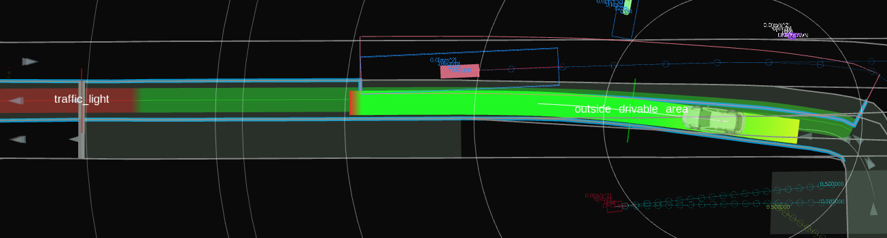
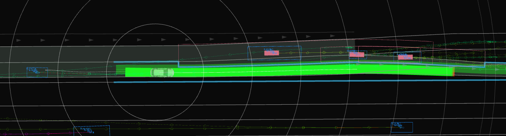

# Dynamic avoidance design

This module is under development.

## Purpose / Role

This module provides avoidance functions for vehicles, pedestrians, and obstacles in the vicinity of the ego's path in combination with the obstacle_avoidance module.
Each module performs the following roles.
Dynamic Avoidance module: This module cuts off the drivable area according to the position and velocity of the target to be avoided.
Obstacle Avoidance module: This module modifies the path to be followed so that it fits within the drivable area received.

Avoidance functions are also provided by the Avoidance module, which allows avoidance through the outside of own lanes but not against moving objects.
On the other hand, this module can avoid moving objects.
For this reason, the word "dynamic" is used in its name.
The table below lists the avoidance modules that can be used for each situation.

|                          |                         avoid within the own lane                          | avoid through the outside of own lanes |
| :----------------------- | :------------------------------------------------------------------------: | :------------------------------------: |
| avoid not-moving objects | Avoidance Module   Dynamic Avoidance Module + Obstacle Avoidance Module |            Avoidance Module            |
| avoid moving objects     |            Dynamic Avoidance Module + Obstacle Avoidance Module            |     No Module (Under Development)      |

## Policy of algorithms

Here, we describe the policy of inner algorithms.
The inner algorithms can be separated into two parts: The first decide whether to avoid the obstacles and the second cuts off the drivable area against the corresponding obstacle.
If you are interested in more details, please see the code itself.

### Select obstacles to avoid

To decide whether to avoid an object, both the predicted path and the state (pose and twist) of each object are used.
The type of objects the user wants this module to avoid is also required.
Using this information, the module decides to _avoid_ objects that _obstruct the ego's passage_ and _can be avoided_.

The definition of _obstruct own passage_ is implemented as the object that collides within seconds.
This process wastes computational cost by doing it for all objects; thus, filtering by the relative position and speed of the object with respect to the ego's path is also done as an auxiliary process.
The other, _can be avoided_ denotes whether it can be avoided without risk to passengers or other vehicles.
For this purpose, it is judged whether the obstacle can be avoided by satisfying the constraints of lateral acceleration and lateral jerk.
For example, the module decides not to avoid an object that is too close or fast in the lateral direction because it cannot be avoided.

### Cuts off the drivable area against the selected obstacles

For the selected obstacles to be avoided, the module cuts off the drivable area.
As inputs to decide the shapes of cut-off polygons, poses of the obstacles are mainly used, assuming they move in parallel to the ego's path, instead of its predicted path.
This design arises from that the predicted path of objects is not accurate enough to use the path modifications (at least currently).
Furthermore, the output drivable area shape is designed as a rectangular cutout along the ego's path to make the computation scalar rather than planar.

#### Determination of lateral dimension

Lateral dimensions of the polygon is calculated as follows.
The polygon's width to extract from the drivable area is the obstacle width and `drivable_area_generation.lat_offset_from_obstacle`.
We can limit the lateral shift length by `drivable_area_generation.max_lat_offset_to_avoid`.

#### Determination of longitudinal dimension

Then, extracting the same directional and opposite directional obstacles from the drivable area will work as follows considering TTC (time to collision).

Regarding the same directional obstacles, obstacles whose TTC is negative will be ignored (e.g. The obstacle is in front of the ego, and the obstacle's velocity is larger than the ego's velocity.).

Same directional obstacles (Parameter names may differ from implementation)

Opposite directional obstacles (Parameter names may differ from implementation)

## Example

<figure>
    
    <figcaption>Avoidance for the bus departure</figcaption>
</figure>

<figure>  
    
    <figcaption>Avoidance on curve </figcaption>
</figure>

<figure>
    
    <figcaption>Avoidance against the opposite direction vehicle</figcaption>
</figure>

<figure>
    
    <figcaption>Avoidance for multiple vehicle</figcaption>
</figure>

## Future works

Currently, the path shifting length is limited to 0.5 meters or less by `drivable_area_generation.max_lat_offset_to_avoid`.
This is caused by the lack of functionality to work with other modules and the structure of the planning component.
Due to this issue, this module can only handle situations where a small avoidance width is sufficient.
This issue is the most significant for this module.
In addition, the ability of this module to extend the drivable area as needed is also required.

## Parameters

Under development

| Name                                                                  | Unit  | Type   | Description                                                | Default value |
| :-------------------------------------------------------------------- | :---- | :----- | :--------------------------------------------------------- | :------------ |
| target_object.car                                                     | [-]   | bool   | The flag whether to avoid cars or not                      | true          |
| target_object.truck                                                   | [-]   | bool   | The flag whether to avoid trucks or not                    | true          |
| ...                                                                   | [-]   | bool   | ...                                                        | ...           |
| target_object.min_obstacle_vel                                        | [m/s] | double | Minimum obstacle velocity to avoid                         | 1.0           |
| drivable_area_generation.lat_offset_from_obstacle                     | [m]   | double | Lateral offset to avoid from obstacles                     | 0.8           |
| drivable_area_generation.max_lat_offset_to_avoid                      | [m]   | double | Maximum lateral offset to avoid                            | 0.5           |
| drivable_area_generation.overtaking_object.max_time_to_collision      | [s]   | double | Maximum value when calculating time to collision           | 3.0           |
| drivable_area_generation.overtaking_object.start_duration_to_avoid    | [s]   | double | Duration to consider avoidance before passing by obstacles | 4.0           |
| drivable_area_generation.overtaking_object.end_duration_to_avoid      | [s]   | double | Duration to consider avoidance after passing by obstacles  | 5.0           |
| drivable_area_generation.overtaking_object.duration_to_hold_avoidance | [s]   | double | Duration to hold avoidance after passing by obstacles      | 3.0           |
| drivable_area_generation.oncoming_object.max_time_to_collision        | [s]   | double | Maximum value when calculating time to collision           | 3.0           |
| drivable_area_generation.oncoming_object.start_duration_to_avoid      | [s]   | double | Duration to consider avoidance before passing by obstacles | 9.0           |
| drivable_area_generation.oncoming_object.end_duration_to_avoid        | [s]   | double | Duration to consider avoidance after passing by obstacles  | 0.0           |
