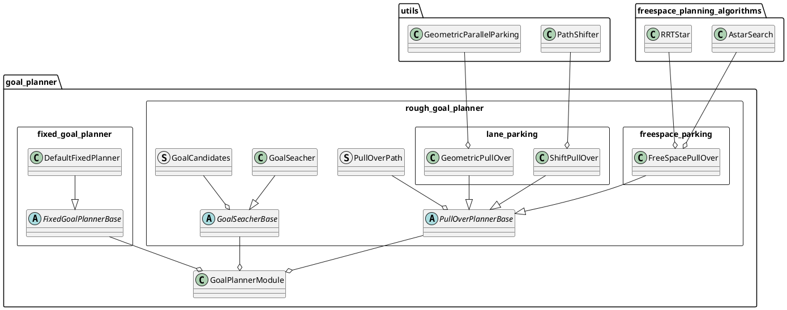

# Goal Planner design

## Purpose / Role

Plan path around the goal.

- Park at the designated goal.
- Modify the goal to avoid obstacles or to pull over at the side of tha lane.

## Design

If goal modification is not allowed, park at the designated fixed goal. (`fixed_goal_planner` in the figure below)
When allowed, park in accordance with the specified policy(e.g pull over on left/right side of the lane). (`rough_goal_planner` in the figure below). Currently rough goal planner only support pull_over feature, but it would be desirable to be able to accommodate various parking policies in the future.

## start condition

Either one is activated when all conditions are met.

### fixed_goal_planner

- Route is set with `allow_goal_modification=false` by default.
- ego-vehicle is in the same lane as the goal.

If the target path contains a goal, modify the points of the path so that the path and the goal are connected smoothly. This process will change the shape of the path by the distance of `refine_goal_search_radius_range` from the goal. Note that this logic depends on the interpolation algorithm that will be executed in a later module (at the moment it uses spline interpolation), so it needs to be updated in the future.

### rough_goal_planner

#### pull over on road lane

- The distance between the goal and ego-vehicle is shorter than `pull_over_minimum_request_length`.
- Route is set with `allow_goal_modification=true` .
  - We can set this option with [SetRoute](https://github.com/autowarefoundation/autoware_adapi_msgs/blob/main/autoware_adapi_v1_msgs/routing/srv/SetRoute.srv#L2) api service.
  - We support `2D Rough Goal Pose` with the key bind `r` in RViz, but in the future there will be a panel of tools to manipulate various Route API from RViz.
- ego-vehicle is in the same lane as the goal.

#### pull over on shoulder lane

- The distance between the goal and ego-vehicle is shorter than `pull_over_minimum_request_length`.
- Goal is set in the `road_shoulder`.

## finish condition

- The distance to the goal from your vehicle is lower than threshold (default: < `1m`).
- The ego-vehicle is stopped.
  - The speed is lower than threshold (default: < `0.01m/s`).

## General parameters for goal_planner

| Name                      | Unit  | Type   | Description                                        | Default value |
| :------------------------ | :---- | :----- | :------------------------------------------------- | :------------ |
| th_arrived_distance       | [m]   | double | distance threshold for arrival of path termination | 1.0           |
| th_stopped_velocity       | [m/s] | double | velocity threshold for arrival of path termination | 0.01          |
| th_stopped_time           | [s]   | double | time threshold for arrival of path termination     | 2.0           |
| center_line_path_interval | [m]   | double | reference center line path point interval          | 1.0           |

## **collision check**

### **occupancy grid based collision check**

Generate footprints from ego-vehicle path points and determine obstacle collision from the value of occupancy_grid of the corresponding cell.

#### Parameters for occupancy grid based collision check

| Name                                            | Unit | Type   | Description                                                                                                     | Default value |
| :---------------------------------------------- | :--- | :----- | :-------------------------------------------------------------------------------------------------------------- | :------------ |
| use_occupancy_grid_for_goal_search              | [-]  | bool   | flag whether to use occupancy grid for goal search collision check                                              | true          |
| use_occupancy_grid_for_goal_longitudinal_margin | [-]  | bool   | flag whether to use occupancy grid for keeping longitudinal margin                                              | false         |
| use_occupancy_grid_for_path_collision_check     | [-]  | bool   | flag whether to use occupancy grid for collision check                                                          | false         |
| occupancy_grid_collision_check_margin           | [m]  | double | margin to calculate ego-vehicle cells from footprint.                                                           | 0.0           |
| theta_size                                      | [-]  | int    | size of theta angle to be considered. angular resolution for collision check will be 2$\pi$ / theta_size [rad]. | 360           |
| obstacle_threshold                              | [-]  | int    | threshold of cell values to be considered as obstacles                                                          | 60            |

### **object recognition based collision check**

#### Parameters for object recognition based collision check

| Name                                                         | Unit | Type   | Description                                                                                              | Default value |
| :----------------------------------------------------------- | :--- | :----- | :------------------------------------------------------------------------------------------------------- | :------------ |
| use_object_recognition                                       | [-]  | bool   | flag whether to use object recognition for collision check                                               | true          |
| object_recognition_collision_check_margin                    | [m]  | double | margin to calculate ego-vehicle cells from footprint.                                                    | 0.6           |
| object_recognition_collision_check_max_extra_stopping_margin | [m]  | double | maximum value when adding longitudinal distance margin for collision check considering stopping distance | 1.0           |

## **Goal Search**

If it is not possible to park safely at a given goal, `/planning/scenario_planning/modified_goal` is
searched for in certain range of the shoulder lane.

[goal search video](https://user-images.githubusercontent.com/39142679/188359594-c6724e3e-1cb7-4051-9a18-8d2c67d4dee9.mp4)

### Parameters for goal search

| Name                            | Unit | Type   | Description                                                                                                                                                                                                                                 | Default value               |
| :------------------------------ | :--- | :----- | :------------------------------------------------------------------------------------------------------------------------------------------------------------------------------------------------------------------------------------------ | :-------------------------- |
| goal_priority                   | [-]  | string | In case `minimum_weighted_distance`, sort with smaller longitudinal distances taking precedence over smaller lateral distances. In case `minimum_longitudinal_distance`, sort with weighted lateral distance against longitudinal distance. | `minimum_weighted_distance` |
| prioritize_goals_before_objects | [-]  | bool   | If there are objects that may need to be avoided, prioritize the goal in front of them                                                                                                                                                      | true                        |
| forward_goal_search_length      | [m]  | double | length of forward range to be explored from the original goal                                                                                                                                                                               | 20.0                        |
| backward_goal_search_length     | [m]  | double | length of backward range to be explored from the original goal                                                                                                                                                                              | 20.0                        |
| goal_search_interval            | [m]  | double | distance interval for goal search                                                                                                                                                                                                           | 2.0                         |
| longitudinal_margin             | [m]  | double | margin between ego-vehicle at the goal position and obstacles                                                                                                                                                                               | 3.0                         |
| max_lateral_offset              | [m]  | double | maximum offset of goal search in the lateral direction                                                                                                                                                                                      | 0.5                         |
| lateral_offset_interval         | [m]  | double | distance interval of goal search in the lateral direction                                                                                                                                                                                   | 0.25                        |
| ignore_distance_from_lane_start | [m]  | double | distance from start of pull over lanes for ignoring goal candidates                                                                                                                                                                         | 0.0                         |
| ignore_distance_from_lane_start | [m]  | double | distance from start of pull over lanes for ignoring goal candidates                                                                                                                                                                         | 0.0                         |
| margin_from_boundary            | [m]  | double | distance margin from edge of the shoulder lane                                                                                                                                                                                              | 0.5                         |

## **Pull Over**

There are three path generation methods.
The path is generated with a certain margin (default: `0.5 m`) from the boundary of shoulder lane.

| Name                             | Unit   | Type   | Description                                                                                                                                                                    | Default value                            |
| :------------------------------- | :----- | :----- | :----------------------------------------------------------------------------------------------------------------------------------------------------------------------------- | :--------------------------------------- |
| pull_over_minimum_request_length | [m]    | double | when the ego-vehicle approaches the goal by this distance or a safe distance to stop, pull over is activated.                                                                  | 100.0                                    |
| pull_over_velocity               | [m/s]  | double | decelerate to this speed by the goal search area                                                                                                                               | 3.0                                      |
| pull_over_minimum_velocity       | [m/s]  | double | speed of pull_over after stopping once. this prevents excessive acceleration.                                                                                                  | 1.38                                     |
| decide_path_distance             | [m]    | double | decide path if it approaches this distance relative to the parking position. after that, no path planning and goal search are performed                                        | 10.0                                     |
| maximum_deceleration             | [m/s2] | double | maximum deceleration. it prevents sudden deceleration when a parking path cannot be found suddenly                                                                             | 1.0                                      |
| path_priority                    | [-]    | string | In case `efficient_path` use a goal that can generate an efficient path which is set in `efficient_path_order`. In case `close_goal` use the closest goal to the original one. | efficient_path                           |
| efficient_path_order             | [-]    | string | efficient order of pull over planner along lanes　excluding freespace pull over                                                                                                | ["SHIFT", "ARC_FORWARD", "ARC_BACKWARD"] |

### **shift parking**

Pull over distance is calculated by the speed, lateral deviation, and the lateral jerk.
The lateral jerk is searched for among the predetermined minimum and maximum values, and the one satisfies ready conditions described above is output.

1. Apply uniform offset to centerline of shoulder lane for ensuring margin
2. In the section between merge start and end, path is shifted by a method that is used to generate avoidance path (four segmental constant jerk polynomials)
3. Combine this path with center line of road lane

[shift_parking video](https://user-images.githubusercontent.com/39142679/178034101-4dc61a33-bc49-41a0-a9a8-755cce53cbc6.mp4)

#### Parameters for shift parking

| Name                          | Unit   | Type   | Description                                                         | Default value |
| :---------------------------- | :----- | :----- | :------------------------------------------------------------------ | :------------ |
| enable_shift_parking          | [-]    | bool   | flag whether to enable shift parking                                | true          |
| shift_sampling_num            | [-]    | int    | Number of samplings in the minimum to maximum range of lateral_jerk | 4             |
| maximum_lateral_jerk          | [m/s3] | double | maximum lateral jerk                                                | 2.0           |
| minimum_lateral_jerk          | [m/s3] | double | minimum lateral jerk                                                | 0.5           |
| deceleration_interval         | [m]    | double | distance of deceleration section                                    | 15.0          |
| after_shift_straight_distance | [m]    | double | straight line distance after pull over end point                    | 1.0           |

### **geometric parallel parking**

Generate two arc paths with discontinuous curvature. It stops twice in the middle of the path to control the steer on the spot. There are two path generation methods: forward and backward.
See also [[1]](https://www.sciencedirect.com/science/article/pii/S1474667015347431) for details of the algorithm. There is also [a simple python implementation](https://github.com/kosuke55/geometric-parallel-parking).

#### Parameters geometric parallel parking

| Name                    | Unit  | Type   | Description                                                                                                                         | Default value |
| :---------------------- | :---- | :----- | :---------------------------------------------------------------------------------------------------------------------------------- | :------------ |
| arc_path_interval       | [m]   | double | interval between arc path points                                                                                                    | 1.0           |
| pull_over_max_steer_rad | [rad] | double | maximum steer angle for path generation. it may not be possible to control steer up to max_steer_angle in vehicle_info when stopped | 0.35          |

#### arc forward parking

Generate two forward arc paths.

[arc_forward_parking video](https://user-images.githubusercontent.com/39142679/178034128-4754c401-8aff-4745-b69a-4a69ca29ce4b.mp4)

#### Parameters arc forward parking

| Name                                    | Unit  | Type   | Description                                                                     | Default value |
| :-------------------------------------- | :---- | :----- | :------------------------------------------------------------------------------ | :------------ |
| enable_arc_forward_parking              | [-]   | bool   | flag whether to enable arc forward parking                                      | true          |
| after_forward_parking_straight_distance | [m]   | double | straight line distance after pull over end point                                | 2.0           |
| forward_parking_velocity                | [m/s] | double | velocity when forward parking                                                   | 1.38          |
| forward_parking_lane_departure_margin   | [m/s] | double | lane departure margin for front left corner of ego-vehicle when forward parking | 0.0           |

#### arc backward parking

Generate two backward arc paths.

.

[arc_backward_parking video](https://user-images.githubusercontent.com/39142679/178034280-4b6754fe-3981-4aee-b5e0-970f34563c6d.mp4)

#### Parameters arc backward parking

| Name                                     | Unit  | Type   | Description                                                               | Default value |
| :--------------------------------------- | :---- | :----- | :------------------------------------------------------------------------ | :------------ |
| enable_arc_backward_parking              | [-]   | bool   | flag whether to enable arc backward parking                               | true          |
| after_backward_parking_straight_distance | [m]   | double | straight line distance after pull over end point                          | 2.0           |
| backward_parking_velocity                | [m/s] | double | velocity when backward parking                                            | -1.38         |
| backward_parking_lane_departure_margin   | [m/s] | double | lane departure margin for front right corner of ego-vehicle when backward | 0.0           |

### freespace parking

If the vehicle gets stuck with `lane_parking`, run `freespace_parking`.
To run this feature, you need to set `parking_lot` to the map, `activate_by_scenario` of [costmap_generator](../costmap_generator/README.md) to `false` and `enable_freespace_parking` to `true`

Simultaneous execution with `avoidance_module` in the flowchart is under development.

#### Unimplemented parts / limitations for freespace parking

- When a short path is generated, the ego does can not drive with it.
- Complex cases take longer to generate or fail.
- The drivable area is not guaranteed to fit in the parking_lot.

#### Parameters freespace parking

| Name                     | Unit | Type | Description                                                                                                          | Default value |
| :----------------------- | :--- | :--- | :------------------------------------------------------------------------------------------------------------------- | :------------ |
| enable_freespace_parking | [-]  | bool | This flag enables freespace parking, which runs when the vehicle is stuck due to e.g. obstacles in the parking area. | true          |

See [freespace_planner](../freespace_planner/README.md) for other parameters.
