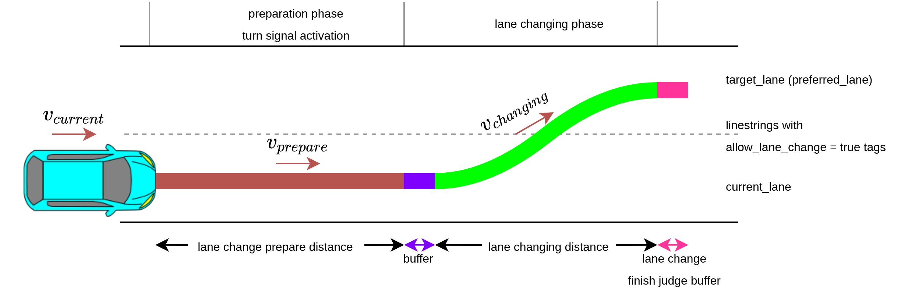
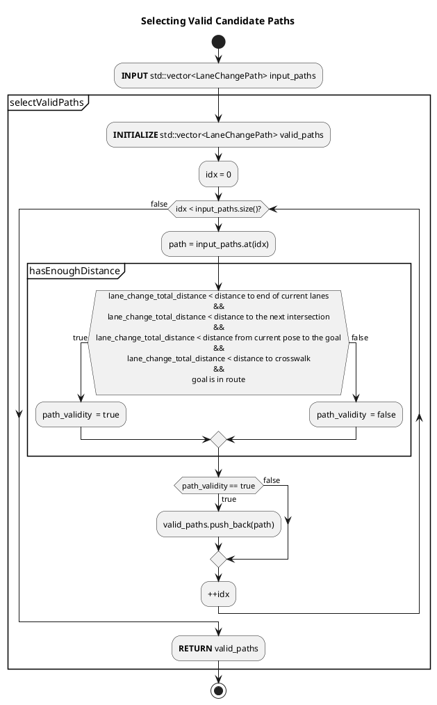
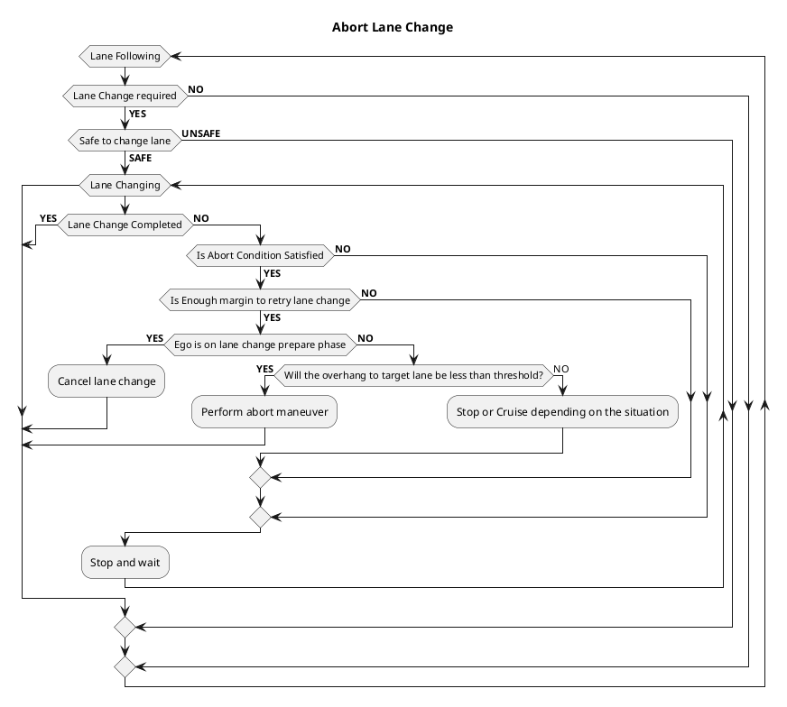
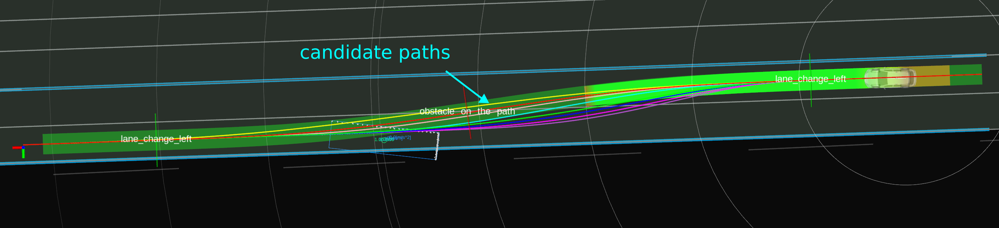

# Lane Change design

The Lane Change module is activated when lane change is needed and can be safely executed.

## Lane Change Requirement

- During lane change request condition
  - The ego-vehicle isn’t on a `preferred_lane`.
  - There is neither intersection nor crosswalk on the path of the lane change
- lane change ready condition
  - Path of the lane change does not collide with other dynamic objects (see the figure below)
  - Lane change candidate path is approved by an operator.

## Generating Lane Change Candidate Path

The lane change candidate path is divided into two phases: preparation and lane-changing. The following figure illustrates each phase of the lane change candidate path.



### Preparation phase

The preparation trajectory is the candidate path's first and the straight portion generated along the ego vehicle's current lane. The length of the preparation trajectory is computed as follows.

```C++
lane_change_prepare_distance = current_speed * lane_change_prepare_duration + 0.5 * deceleration * lane_change_prepare_duration^2
```

During the preparation phase, the turn signal will be activated when the remaining distance is equal to or less than `lane_change_search_distance`.

### Lane-changing phase

The lane-changing phase consist of the shifted path that moves ego from current lane to the target lane. Total distance of lane-changing phase is as follows. Note that during the lane changing phase, the ego vehicle travels at a constant speed.

```C++
lane_change_prepare_velocity = std::max(current_speed + deceleration * lane_change_prepare_duration, minimum_lane_changing_velocity)
lane_changing_distance = lane_change_prepare_velocity * lane_changing_duration
```

The `backward_length_buffer_for_end_of_lane` is added to allow some window for any possible delay, such as control or mechanical delay during brake lag.

#### Multiple candidate path samples (longitudinal acceleration)

Lane change velocity is affected by the ego vehicle's current velocity. High velocity requires longer preparation and lane changing distance. However we also need to plan lane changing trajectories in case ego vehicle slows down.
Computing candidate paths that assumes ego vehicle's slows down is performed by substituting predetermined deceleration value into `prepare_length`, `prepare_velocity` and `lane_changing_length` equation.

The predetermined longitudinal acceleration values are a set of value that starts from `longitudinal_acceleration = maximum_longitudinal_acceleration`, and decrease by `longitudinal_acceleration_resolution` until it reaches `longitudinal_acceleration = -maximum_longitudinal_deceleration`. Both `maximum_longitudinal_acceleration` and `maximum_longitudinal_deceleration` are calculated as: defined in the `common.param` file as `normal.min_acc`.

```C++
maximum_longitudinal_acceleration = min(common_param.max_acc, lane_change_param.max_acc)
maximum_longitudinal_deceleration = max(common_param.min_acc, lane_change_param.min_acc)
```

where `common_param` is vehicle common parameter, which defines vehicle common maximum longitudinal acceleration and deceleration. Whereas, `lane_change_param` has maximum longitudinal acceleration and deceleration for the lane change module. For example, if a user set and `common_param.max_acc=1.0` and `lane_change_param.max_acc=0.0`, `maximum_longitudinal_acceleration` becomes `0.0`, and the lane change does not accelerate in the lane change phase.

The `longitudinal_acceleration_resolution` is determine by the following

```C++
longitudinal_acceleration_resolution = (maximum_longitudinal_acceleration - minimum_longitudinal_acceleration) / longitudinal_acceleration_sampling_num
```

Note that when the `current_velocity` is lower than `minimum_lane_changing_velocity`, the vehicle needs to accelerate its velocity to `minimum_lane_changing_velocity`. Therefore, longitudinal acceleration becomes positive value (not decelerate).

The following figure illustrates when `longitudinal_acceleration_sampling_num = 4`. Assuming that `maximum_deceleration = 1.0` then `a0 == 0.0 == no deceleration`, `a1 == 0.25`, `a2 == 0.5`, `a3 == 0.75` and `a4 == 1.0 == maximum_deceleration`. `a0` is the expected lane change trajectories should ego vehicle do not decelerate, and `a1`'s path is the expected lane change trajectories should ego vehicle decelerate at `0.25 m/s^2`.


Which path will be chosen will depend on validity and collision check.

#### Multiple candidate path samples (lateral acceleration)

In addition to sampling longitudinal acceleration, we also sample lane change paths by adjusting the value of lateral acceleration. Since lateral acceleration influences the duration of a lane change, a lower lateral acceleration value results in a longer lane change path, while a higher lateral acceleration value leads to a shorter lane change path. This allows the lane change module to generate a shorter lane change path by increasing the lateral acceleration when there is limited space for the lane change.

The maximum and minimum lateral accelerations are defined in the lane change parameter file as a map. The range of lateral acceleration is determined for each velocity by linearly interpolating the values in the map. Let's assume we have the following map

| Ego Velocity | Minimum lateral acceleration | Maximum lateral acceleration |
| :----------- | ---------------------------- | ---------------------------- |
| 0.0          | 0.2                          | 0.3                          |
| 2.0          | 0.2                          | 0.4                          |
| 4.0          | 0.3                          | 0.4                          |
| 6.0          | 0.3                          | 0.5                          |

In this case, when the current velocity of the ego vehicle is 3.0, the minimum and maximum lateral accelerations are 0.25 and 0.4 respectively. These values are obtained by linearly interpolating the second and third rows of the map, which provide the minimum and maximum lateral acceleration values.

Within this range, we sample the lateral acceleration for the ego vehicle. Similar to the method used for sampling longitudinal acceleration, the resolution of lateral acceleration (lateral_acceleration_resolution) is determined by the following:

```C++
lateral_acceleration_resolution = (maximum_lateral_acceleration - minimum_lateral_acceleration) / lateral_acceleration_sampling_num
```

#### Candidate Path's validity check

A candidate path is valid if the total lane change distance is less than

1. distance to the end of current lane
2. distance to the next intersection
3. distance from current pose to the goal.
4. distance to the crosswalk.

The goal must also be in the list of the preferred lane.

The following flow chart illustrates the validity check.



#### Candidate Path's Safety check

See [safety check utils explanation](../behavior_path_planner_common/docs/behavior_path_planner_safety_check.md)

#### Objects selection and classification

First, we divide the target objects into obstacles in the target lane, obstacles in the current lane, and obstacles in other lanes. Target lane indicates the lane that the ego vehicle is going to reach after the lane change and current lane mean the current lane where the ego vehicle is following before the lane change. Other lanes are lanes that do not belong to the target and current lanes. The following picture describes objects on each lane. Note that users can remove objects either on current and other lanes from safety check by changing the flag, which are `check_objects_on_current_lanes` and `check_objects_on_other_lanes`.


Furthermore, to change lanes behind a vehicle waiting at a traffic light, we skip the safety check for the stopping vehicles near the traffic light.　The explanation for parked car detection is written in [documentation for avoidance module](../behavior_path_avoidance_module/README.md).

##### Collision check in prepare phase

The ego vehicle may need to secure ample inter-vehicle distance ahead of the target vehicle before attempting a lane change. The flag `enable_collision_check_at_prepare_phase` can be enabled to gain this behavior. The following image illustrates the differences between the `false` and `true` cases.


The parameter `prepare_phase_ignore_target_speed_thresh` can be configured to ignore the prepare phase collision check for targets whose speeds are less than a specific threshold, such as stationary or very slow-moving objects.

#### If the lane is blocked and multiple lane changes

When driving on the public road with other vehicles, there exist scenarios where lane changes cannot be executed. Suppose the candidate path is evaluated as unsafe, for example, due to incoming vehicles in the adjacent lane. In that case, the ego vehicle can't change lanes, and it is impossible to reach the goal. Therefore, the ego vehicle must stop earlier at a certain distance and wait for the adjacent lane to be evaluated as safe. The minimum stopping distance can be computed from shift length and minimum lane changing velocity.

```C++
lane_changing_time = f(shift_length, lat_acceleration, lat_jerk)
minimum_lane_change_distance = minimum_prepare_length + minimum_lane_changing_velocity * lane_changing_time + lane_change_finish_judge_buffer
```

The following figure illustrates when the lane is blocked in multiple lane changes cases.


#### Stopping position when an object exists ahead

When an obstacle is in front of the ego vehicle, stop with keeping a distance for lane change.
The position to be stopped depends on the situation, such as when the lane change is blocked by the target lane obstacle, or when the lane change is not needed immediately.The following shows the division in that case.

##### When the ego vehicle is near the end of the lane change

Regardless of the presence or absence of objects in the lane change target lane, stop by keeping the distance necessary for lane change to the object ahead.


##### When the ego vehicle is not near the end of the lane change

If there are NO objects in the lane change section of the target lane, stop by keeping the distance necessary for lane change to the object ahead.


If there are objects in the lane change section of the target lane, stop WITHOUT keeping the distance necessary for lane change to the object ahead.


##### When the target lane is far away

When the target lane for lane change is far away and not next to the current lane, do not keep the distance necessary for lane change to the object ahead.


### Lane Change When Stuck

The ego vehicle is considered stuck if it is stopped and meets any of the following conditions:

- There is an obstacle in front of the current lane
- The ego vehicle is at the end of the current lane

In this case, the safety check for lane change is relaxed compared to normal times.
Please refer to the 'stuck' section under the 'Collision checks during lane change' for more details.
The function to stop by keeping a margin against forward obstacle in the previous section is being performed to achieve this feature.

### Lane change regulations

If you want to regulate lane change on crosswalks or intersections, the lane change module finds a lane change path excluding it includes crosswalks or intersections.
To regulate lane change on crosswalks or intersections, change `regulation.crosswalk` or `regulation.intersection` to `true`.
If the ego vehicle gets stuck, to avoid stuck, it enables lane change in crosswalk/intersection.
If the ego vehicle stops more than `stuck_detection.stop_time` seconds, it is regarded as a stuck.
If the ego vehicle velocity is smaller than `stuck_detection.velocity`, it is regarded as stopping.

### Aborting lane change

The abort process may result in three different outcome; Cancel, Abort and Stop/Cruise.

The following depicts the flow of the abort lane change check.



#### Cancel

Suppose the lane change trajectory is evaluated as unsafe. In that case, if the ego vehicle has not departed from the current lane yet, the trajectory will be reset, and the ego vehicle will resume the lane following the maneuver.

The function can be enabled by setting `enable_on_prepare_phase` to `true`.

The following image illustrates the cancel process.


#### Abort

Assume the ego vehicle has already departed from the current lane. In that case, it is dangerous to cancel the path, and it will cause the ego vehicle to change the heading direction abruptly. In this case, planning a trajectory that allows the ego vehicle to return to the current path while minimizing the heading changes is necessary. In this case, the lane change module will generate an abort path. The following images show an example of the abort path. Do note that the function DOESN'T GUARANTEE a safe abort process, as it didn't check the presence of the surrounding objects and/or their reactions. The function can be enable manually by setting both `enable_on_prepare_phase` and `enable_on_lane_changing_phase` to `true`. The parameter `max_lateral_jerk` need to be set to a high value in order for it to work.


#### Stop/Cruise

The last behavior will also occur if the ego vehicle has departed from the current lane. If the abort function is disabled or the abort is no longer possible, the ego vehicle will attempt to stop or transition to the obstacle cruise mode. Do note that the module DOESN'T GUARANTEE safe maneuver due to the unexpected behavior that might've occurred during these critical scenarios. The following images illustrate the situation.


## Parameters

### Essential lane change parameters

The following parameters are configurable in `lane_change.param.yaml`.

| Name                                         | Unit   | Type    | Description                                                                                                            | Default value      |
| :------------------------------------------- | ------ | ------- | ---------------------------------------------------------------------------------------------------------------------- | ------------------ |
| `backward_lane_length`                       | [m]    | double  | The backward length to check incoming objects in lane change target lane.                                              | 200.0              |
| `prepare_duration`                           | [m]    | double  | The preparation time for the ego vehicle to be ready to perform lane change.                                           | 4.0                |
| `backward_length_buffer_for_end_of_lane`     | [m]    | double  | The end of lane buffer to ensure ego vehicle has enough distance to start lane change                                  | 3.0                |
| `backward_length_buffer_for_blocking_object` | [m]    | double  | The end of lane buffer to ensure ego vehicle has enough distance to start lane change when there is an object in front | 3.0                |
| `lane_change_finish_judge_buffer`            | [m]    | double  | The additional buffer used to confirm lane change process completion                                                   | 3.0                |
| `finish_judge_lateral_threshold`             | [m]    | double  | Lateral distance threshold to confirm lane change process completion                                                   | 0.2                |
| `lane_changing_lateral_jerk`                 | [m/s3] | double  | Lateral jerk value for lane change path generation                                                                     | 0.5                |
| `minimum_lane_changing_velocity`             | [m/s]  | double  | Minimum speed during lane changing process.                                                                            | 2.78               |
| `prediction_time_resolution`                 | [s]    | double  | Time resolution for object's path interpolation and collision check.                                                   | 0.5                |
| `longitudinal_acceleration_sampling_num`     | [-]    | int     | Number of possible lane-changing trajectories that are being influenced by longitudinal acceleration                   | 5                  |
| `lateral_acceleration_sampling_num`          | [-]    | int     | Number of possible lane-changing trajectories that are being influenced by lateral acceleration                        | 3                  |
| `object_check_min_road_shoulder_width`       | [m]    | double  | Width considered as a road shoulder if the lane does not have a road shoulder                                          | 0.5                |
| `object_shiftable_ratio_threshold`           | [-]    | double  | Vehicles around the center line within this distance ratio will be excluded from parking objects                       | 0.6                |
| `min_length_for_turn_signal_activation`      | [m]    | double  | Turn signal will be activated if the ego vehicle approaches to this length from minimum lane change length             | 10.0               |
| `length_ratio_for_turn_signal_deactivation`  | [-]    | double  | Turn signal will be deactivated if the ego vehicle approaches to this length ratio for lane change finish point        | 0.8                |
| `max_longitudinal_acc`                       | [-]    | double  | maximum longitudinal acceleration for lane change                                                                      | 1.0                |
| `min_longitudinal_acc`                       | [-]    | double  | maximum longitudinal deceleration for lane change                                                                      | -1.0               |
| `lateral_acceleration.velocity`              | [m/s]  | double  | Reference velocity for lateral acceleration calculation (look up table)                                                | [0.0, 4.0, 10.0]   |
| `lateral_acceleration.min_values`            | [m/ss] | double  | Min lateral acceleration values corresponding to velocity (look up table)                                              | [0.15, 0.15, 0.15] |
| `lateral_acceleration.max_values`            | [m/ss] | double  | Max lateral acceleration values corresponding to velocity (look up table)                                              | [0.5, 0.5, 0.5]    |
| `target_object.car`                          | [-]    | boolean | Include car objects for safety check                                                                                   | true               |
| `target_object.truck`                        | [-]    | boolean | Include truck objects for safety check                                                                                 | true               |
| `target_object.bus`                          | [-]    | boolean | Include bus objects for safety check                                                                                   | true               |
| `target_object.trailer`                      | [-]    | boolean | Include trailer objects for safety check                                                                               | true               |
| `target_object.unknown`                      | [-]    | boolean | Include unknown objects for safety check                                                                               | true               |
| `target_object.bicycle`                      | [-]    | boolean | Include bicycle objects for safety check                                                                               | true               |
| `target_object.motorcycle`                   | [-]    | boolean | Include motorcycle objects for safety check                                                                            | true               |
| `target_object.pedestrian`                   | [-]    | boolean | Include pedestrian objects for safety check                                                                            | true               |

### Lane change regulations

| Name                      | Unit | Type    | Description                           | Default value |
| :------------------------ | ---- | ------- | ------------------------------------- | ------------- |
| `regulation.crosswalk`    | [-]  | boolean | Regulate lane change on crosswalks    | false         |
| `regulation.intersection` | [-]  | boolean | Regulate lane change on intersections | false         |

### Ego vehicle stuck detection

| Name                        | Unit  | Type   | Description                                         | Default value |
| :-------------------------- | ----- | ------ | --------------------------------------------------- | ------------- |
| `stuck_detection.velocity`  | [m/s] | double | Velocity threshold for ego vehicle stuck detection  | 0.1           |
| `stuck_detection.stop_time` | [s]   | double | Stop time threshold for ego vehicle stuck detection | 3.0           |

### Collision checks during lane change

The following parameters are configurable in `behavior_path_planner.param.yaml` and `lane_change.param.yaml`.

#### execution

| Name                                                              | Unit    | Type    | Description                                                                                                                                                    | Default value |
| :---------------------------------------------------------------- | ------- | ------- | -------------------------------------------------------------------------------------------------------------------------------------------------------------- | ------------- |
| `safety_check.execution.lateral_distance_max_threshold`           | [m]     | double  | The lateral distance threshold that is used to determine whether lateral distance between two object is enough and whether lane change is safe.                | 2.0           |
| `safety_check.execution.longitudinal_distance_min_threshold`      | [m]     | double  | The longitudinal distance threshold that is used to determine whether longitudinal distance between two object is enough and whether lane change is safe.      | 3.0           |
| `safety_check.execution.expected_front_deceleration`              | [m/s^2] | double  | The front object's maximum deceleration when the front vehicle perform sudden braking. (\*1)                                                                   | -1.0          |
| `safety_check.execution.expected_rear_deceleration`               | [m/s^2] | double  | The rear object's maximum deceleration when the rear vehicle perform sudden braking. (\*1)                                                                     | -1.0          |
| `safety_check.execution.rear_vehicle_reaction_time`               | [s]     | double  | The reaction time of the rear vehicle driver which starts from the driver noticing the sudden braking of the front vehicle until the driver step on the brake. | 2.0           |
| `safety_check.execution.rear_vehicle_safety_time_margin`          | [s]     | double  | The time buffer for the rear vehicle to come into complete stop when its driver perform sudden braking.                                                        | 2.0           |
| `safety_check.execution.enable_collision_check_at_prepare_phase`  | [-]     | boolean | Perform collision check starting from prepare phase. If `false`, collision check only evaluated for lane changing phase.                                       | true          |
| `safety_check.execution.prepare_phase_ignore_target_speed_thresh` | [m/s]   | double  | Ignore collision check in prepare phase of object speed that is lesser that the configured value. `enable_collision_check_at_prepare_phase` must be `true`     | 0.1           |
| `safety_check.execution.check_objects_on_current_lanes`           | [-]     | boolean | If true, the lane change module include objects on current lanes.                                                                                              | true          |
| `safety_check.execution.check_objects_on_other_lanes`             | [-]     | boolean | If true, the lane change module include objects on other lanes.                                                                                                | true          |
| `safety_check.execution.use_all_predicted_path`                   | [-]     | boolean | If false, use only the predicted path that has the maximum confidence.                                                                                         | true          |

##### cancel

| Name                                                           | Unit    | Type    | Description                                                                                                                                                    | Default value |
| :------------------------------------------------------------- | ------- | ------- | -------------------------------------------------------------------------------------------------------------------------------------------------------------- | ------------- |
| `safety_check.cancel.lateral_distance_max_threshold`           | [m]     | double  | The lateral distance threshold that is used to determine whether lateral distance between two object is enough and whether lane change is safe.                | 1.5           |
| `safety_check.cancel.longitudinal_distance_min_threshold`      | [m]     | double  | The longitudinal distance threshold that is used to determine whether longitudinal distance between two object is enough and whether lane change is safe.      | 3.0           |
| `safety_check.cancel.expected_front_deceleration`              | [m/s^2] | double  | The front object's maximum deceleration when the front vehicle perform sudden braking. (\*1)                                                                   | -1.5          |
| `safety_check.cancel.expected_rear_deceleration`               | [m/s^2] | double  | The rear object's maximum deceleration when the rear vehicle perform sudden braking. (\*1)                                                                     | -2.5          |
| `safety_check.cancel.rear_vehicle_reaction_time`               | [s]     | double  | The reaction time of the rear vehicle driver which starts from the driver noticing the sudden braking of the front vehicle until the driver step on the brake. | 2.0           |
| `safety_check.cancel.rear_vehicle_safety_time_margin`          | [s]     | double  | The time buffer for the rear vehicle to come into complete stop when its driver perform sudden braking.                                                        | 2.5           |
| `safety_check.cancel.enable_collision_check_at_prepare_phase`  | [-]     | boolean | Perform collision check starting from prepare phase. If `false`, collision check only evaluated for lane changing phase.                                       | false         |
| `safety_check.cancel.prepare_phase_ignore_target_speed_thresh` | [m/s]   | double  | Ignore collision check in prepare phase of object speed that is lesser that the configured value. `enable_collision_check_at_prepare_phase` must be `true`     | 0.2           |
| `safety_check.cancel.check_objects_on_current_lanes`           | [-]     | boolean | If true, the lane change module include objects on current lanes.                                                                                              | false         |
| `safety_check.cancel.check_objects_on_other_lanes`             | [-]     | boolean | If true, the lane change module include objects on other lanes.                                                                                                | false         |
| `safety_check.cancel.use_all_predicted_path`                   | [-]     | boolean | If false, use only the predicted path that has the maximum confidence.                                                                                         | false         |

##### stuck

| Name                                                          | Unit    | Type    | Description                                                                                                                                                    | Default value |
| :------------------------------------------------------------ | ------- | ------- | -------------------------------------------------------------------------------------------------------------------------------------------------------------- | ------------- |
| `safety_check.stuck.lateral_distance_max_threshold`           | [m]     | double  | The lateral distance threshold that is used to determine whether lateral distance between two object is enough and whether lane change is safe.                | 2.0           |
| `safety_check.stuck.longitudinal_distance_min_threshold`      | [m]     | double  | The longitudinal distance threshold that is used to determine whether longitudinal distance between two object is enough and whether lane change is safe.      | 3.0           |
| `safety_check.stuck.expected_front_deceleration`              | [m/s^2] | double  | The front object's maximum deceleration when the front vehicle perform sudden braking. (\*1)                                                                   | -1.0          |
| `safety_check.stuck.expected_rear_deceleration`               | [m/s^2] | double  | The rear object's maximum deceleration when the rear vehicle perform sudden braking. (\*1)                                                                     | -1.0          |
| `safety_check.stuck.rear_vehicle_reaction_time`               | [s]     | double  | The reaction time of the rear vehicle driver which starts from the driver noticing the sudden braking of the front vehicle until the driver step on the brake. | 2.0           |
| `safety_check.stuck.rear_vehicle_safety_time_margin`          | [s]     | double  | The time buffer for the rear vehicle to come into complete stop when its driver perform sudden braking.                                                        | 2.0           |
| `safety_check.stuck.enable_collision_check_at_prepare_phase`  | [-]     | boolean | Perform collision check starting from prepare phase. If `false`, collision check only evaluated for lane changing phase.                                       | true          |
| `safety_check.stuck.prepare_phase_ignore_target_speed_thresh` | [m/s]   | double  | Ignore collision check in prepare phase of object speed that is lesser that the configured value. `enable_collision_check_at_prepare_phase` must be `true`     | 0.1           |
| `safety_check.stuck.check_objects_on_current_lanes`           | [-]     | boolean | If true, the lane change module include objects on current lanes.                                                                                              | true          |
| `safety_check.stuck.check_objects_on_other_lanes`             | [-]     | boolean | If true, the lane change module include objects on other lanes.                                                                                                | true          |
| `safety_check.stuck.use_all_predicted_path`                   | [-]     | boolean | If false, use only the predicted path that has the maximum confidence.                                                                                         | true          |

(\*1) the value must be negative.

### Abort lane change

The following parameters are configurable in `lane_change.param.yaml`.

| Name                                   | Unit    | Type    | Description                                                                                                      | Default value |
| :------------------------------------- | ------- | ------- | ---------------------------------------------------------------------------------------------------------------- | ------------- |
| `cancel.enable_on_prepare_phase`       | [-]     | boolean | Enable cancel lane change                                                                                        | true          |
| `cancel.enable_on_lane_changing_phase` | [-]     | boolean | Enable abort lane change.                                                                                        | false         |
| `cancel.delta_time`                    | [s]     | double  | The time taken to start steering to return to the center line.                                                   | 3.0           |
| `cancel.duration`                      | [s]     | double  | The time taken to complete returning to the center line.                                                         | 3.0           |
| `cancel.max_lateral_jerk`              | [m/sss] | double  | The maximum lateral jerk for abort path                                                                          | 1000.0        |
| `cancel.overhang_tolerance`            | [m]     | double  | Lane change cancel is prohibited if the vehicle head exceeds the lane boundary more than this tolerance distance | 0.0           |

### Debug

The following parameters are configurable in `lane_change.param.yaml`.

| Name                   | Unit | Type    | Description                  | Default value |
| :--------------------- | ---- | ------- | ---------------------------- | ------------- |
| `publish_debug_marker` | [-]  | boolean | Flag to publish debug marker | false         |

## Debug Marker & Visualization

To enable the debug marker, execute (no restart is needed)

```shell
ros2 param set /planning/scenario_planning/lane_driving/behavior_planning/behavior_path_planner lane_change.publish_debug_marker true

```

or simply set the `publish_debug_marker` to `true` in the `lane_change.param.yaml` for permanent effect (restart is needed).

Then add the marker

```shell
/planning/scenario_planning/lane_driving/behavior_planning/behavior_path_planner/debug/lane_change_left
```

in `rviz2`.




Available information

1. Ego to object relation, plus safety check information
2. Ego vehicle interpolated pose up to the latest safety check position.
3. Object is safe or not, shown by the color of the polygon (Green = Safe, Red = unsafe)
4. Valid candidate paths.
5. Position when lane changing start and end.
