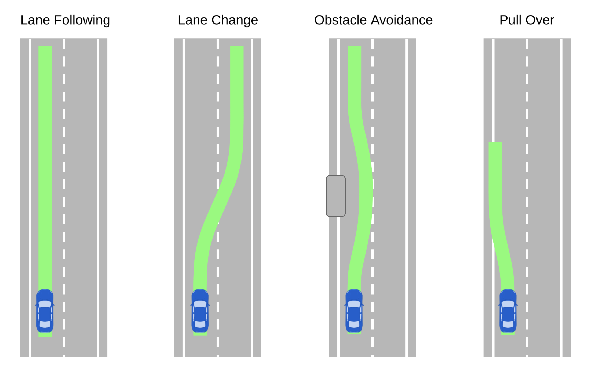
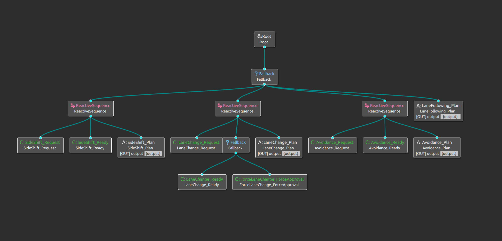
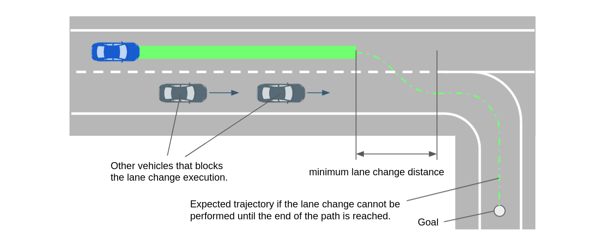
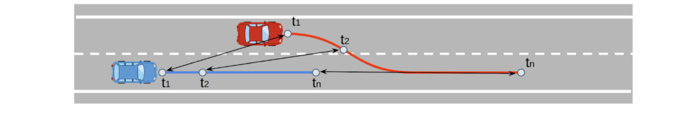
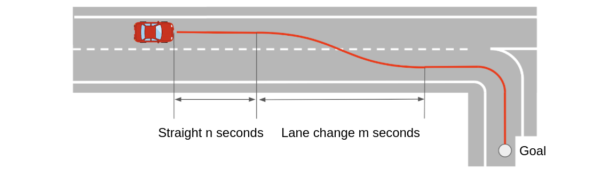
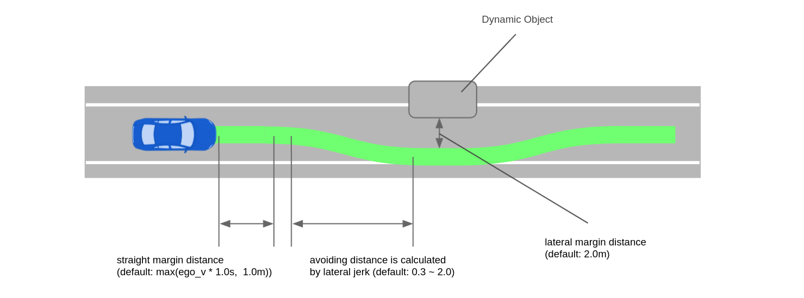
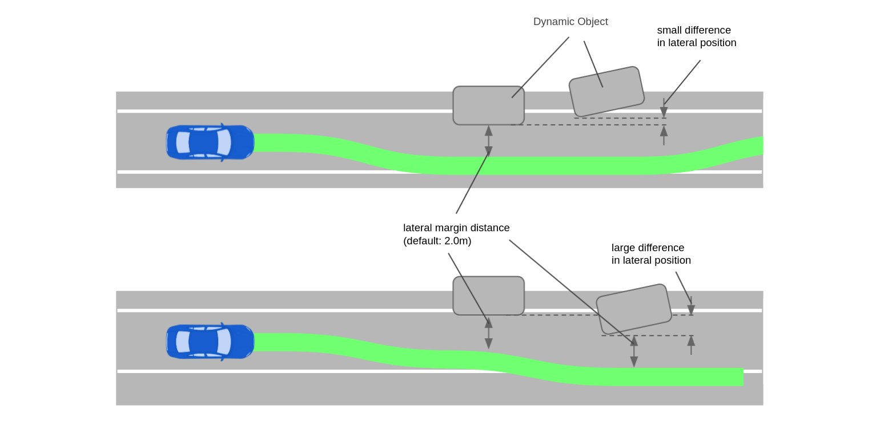
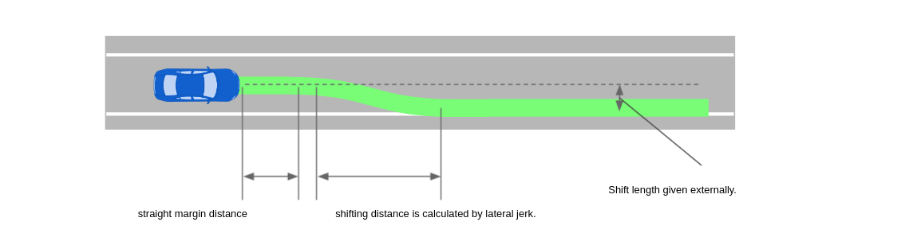

# Behavior Path Planner

## Purpose / Use cases

The `behavior_path_planner` module is responsible to generate

1. **path** based on the traffic situation,
2. **drivable area** that the vehicle can move (defined in the path msg),
3. **turn signal** command to be sent to the vehicle interface.

Depending on the situation, a suitable module is selected and executed on the behavior tree system.

The following modules are currently supported:

- **Lane Following**: Generate lane centerline from map.
- **Lane Change**: Performs a lane change. This module is performed when it is necessary and a collision check with other vehicles is cleared.
- **Obstacle Avoidance**: Perform an obstacle avoidance. This module is for avoidance of a vehicle parked on the edge of the lane or overtaking a low-speed obstacle.
- **Pull Over**: Performs a pull over. This module is performed when ego-vehicle is in the road lane and goal is in the shoulder lane. ego-vehicle will stop at the goal.
- **Pull Out**: Performs a pull out. This module is performed when ego-vehicle is stationary and footprint of ego-vehicle is included in shoulder lane. This module ends when ego-vehicle merges into the road.
- **Side Shift**: (For remote control) Shift the path to left or right according to an external instruction.

[WIP]

- **Free Space**: xxx.

## Design

<!-- ## Assumptions / Known limits -->

## Inputs / Outputs / API

### output

- path [`autoware_auto_planning_msgs/PathWithLaneId`] : The path generated by modules.
- path_candidate [`autoware_auto_planning_msgs/Path`] : The path the module is about to take. To be executed as soon as external approval is obtained.
- turn_indicators_cmd [`autoware_auto_vehicle_msgs/TurnIndicatorsCommand`] : Turn indicators command.
- hazard_lights_cmd [`autoware_auto_vehicle_msgs/HazardLightsCommand`] : Hazard lights command.
- force_available [`tier4_planning_msgs/PathChangeModuleArray`] : (For remote control) modules that are force-executable.
- ready_module [`tier4_planning_msgs/PathChangeModule`] : (For remote control) modules that are ready to be executed.
- running_modules [`tier4_planning_msgs/PathChangeModuleArray`] : (For remote control) Current running module.

### input

- /planning/mission_planning/route [`autoware_planning_msgs/LaneletRoute`] : Current route from start to goal.
- /map/vector_map [autoware_auto_mapping_msgs/HADMapBin] : Map information.
- /perception/object_recognition/objects [`autoware_auto_perception_msgs/PredictedObjects`] : dynamic objects from perception module.
- /perception/occupancy_grid_map/map [nav_msgs/msg/OccupancyGrid] : occupancy grid map from perception module. This is used for only Pull Over module
- /tf [`tf2_msgs/TFMessage`] : For ego-pose.
- /localization/kinematic_state [`nav_msgs/Odometry] : For ego-velocity.
- path_change_approval [`std_msgs::Bool`] : (For remote control)
- path_change_force [`tier4_planning_msgs::PathChangeModule`] : (For remote control)

## Inner-workings / Algorithms

### Parameters for drivable area expansion

Optionally, the drivable area can be expanded by a static distance.
Expansion parameters are defined for each module of the `behavior_path_planner` and should be prefixed accordingly (see `config/drivable_area_expansion.yaml` for an example).

| Name                             | Unit | Type            | Description                                | Default value |
| :------------------------------- | :--- | :-------------- | :----------------------------------------- | :------------ |
| drivable_area_right_bound_offset | [m]  | double          | expansion distance of the right bound      | 0.0           |
| drivable_area_right_bound_offset | [m]  | double          | expansion distance of the left bound       | 0.0           |
| drivable_area_types_to_skip      |      | list of strings | types of linestrings that are not expanded | [road_border] |

### Behavior Tree

In the behavior path planner, the behavior tree mechanism is used to manage which modules are activated in which situations. In general, this "behavior manager" like function is expected to become bigger as more and more modules are added in the future. To improve maintainability, we adopted the behavior tree. The behavior tree has the following advantages: easy visualization, easy configuration management (behaviors can be changed by replacing configuration files), and high scalability compared to the state machine.

The current behavior tree structure is shown below. Each modules (LaneChange, Avoidance, etc) have _Request_, _Ready_, and _Plan_ nodes as a common function.

- **Request**: Check if there is a request from the module (e.g. LaneChange has a request when there are multi-lanes and the vehicle is not on the preferred lane),
- **Ready**: Check if it is safe to execute the plan (e.g. LaneChange is ready when the lane_change path does not have any conflicts with other dynamic objects on S-T space).
- **Plan**: Calculates path and set it to the output of the BehaviorTree. Until the internal status returns SUCCESS, it will be in running state and will not transit to another module.
- **ForceApproval**: A lane change-specific node that overrides the result of _Ready_ when a forced lane change command is given externally.

### Lane Following

Generate path from center line of the route.

#### **special case**

In the case of a route that requires a lane change, the path is generated with a specific distance margin (default: `12.0 m`) from the end of the lane to ensure the minimum distance for lane change. (This function works not only for lane following but also for all modules.)

### Lane Change

The Lane Change module is activated when lane change is needed and can be safely executed.

#### **start lane change condition** (need to meet all of the conditions below)

- lane change request condition
  - The ego-vehicle isn’t on a `preferred_lane`.
  - There is neither intersection nor crosswalk on the path of the lane change
- lane change ready condition
  - Path of the lane change doesn’t collide with other objects (see the figure below)
  - Lane change is allowed by an operator

#### **finish lane change condition** (need to meet any of the conditions below)

- Certain distance (default: `3.0 m`) have passed after the vehicle move to the target lane.
- Before the base_link exceeds white dotted line, a collision with the object was predicted (only if `enable_abort_lane_change` is true.)
  - However, when current velocity is lower than `10km/h` and the ego-vehicle is near the lane end, the lane change isn’t aborted and the ego-vehicle plans to stop. Then, after no collision is predicted, the ego-vehicle resume the lane change.

#### **Collision prediction with obstacles**

1. Predict each position of the ego-vehicle and other vehicle on the target lane of the lane change at t1, t2,...tn
2. If a distance between the ego-vehicle and other one is lower than the threshold (`ego_velocity * stop_time (2s)`) at each time, that is judged as a collision

#### **Path Generation**

Path to complete the lane change in `n + m` seconds under an assumption that a velocity of the ego-vehicle is constant.
Once the lane change is executed, the path won’t be updated until the "finish-lane-change-condition" is satisfied.

<!-- 
  
 -->

### Avoidance

The Avoidance module is activated when dynamic objects to be avoided exist and can be safely avoided.

#### Target objects

Dynamic objects that satisfy the following conditions are considered to be avoidance targets.

- Semantics type is `CAR`, `TRUCK`, or `BUS`
- low speed (default: < `1.0 m/s`)
- Not being around center line (default: deviation from center > `0.5 m`)
- Any footprint of the object in on the detection area (driving lane + `1 m` margin for lateral direction).
- Object is not behind ego(default: > -`2.0 m`) or too far(default: < `150.0 m`) and object is not behind the path goal.

<!-- The target objects are `CAR`, `TRUCK`, or `BUS` type with low speed (default: < `1.0 m/s`). If the object is around the center of lane, it is not considered as a target (default: deviation from center > `0.5 m`). -->

#### How to generate avoidance path

To prevent sudden changes in the vicinity of the ego-position, an avoidance path is generated after a certain distance of straight lane driving. The process of generating the avoidance path is as follows:

1. detect the target object and calculate the lateral shift distance (default: `2.0 m` from closest footprint point)
2. calculate the avoidance distance within the constraint of lateral jerk. (default: `0.3 ~ 2.0 m/s3`)
   1. If the maximum jerk constraint is exceeded to keep the straight margin, the avoidance path generation is aborted.
3. generates the smooth path with given avoiding distance and lateral shift length.
4. generate "return to center" path if there is no next target within a certain distance (default: `50 m`) after the current target.

#### **single objects case**

<!-- 
  
 -->

#### **multiple objects case**

If there are multiple avoidance targets and the lateral distances of these are close (default: < `0.5m`), those objects are considered as a single avoidance target and avoidance is performed simultaneously with a single steering operation. If the lateral distances of the avoidance targets differ greatly than threshold, multiple steering operations are used to avoid them.

<!-- 
  
 -->

#### Smooth path generation

The path generation is computed in Frenet coordinates. The shift length profile for avoidance is generated by four segmental constant jerk polynomials, and added to the original path. Since the lateral jerk can be approximately seen as a steering maneuver, this calculation yields a result similar to a Clothoid curve.

For more detail, see [behavior-path-planner-path-generation](./behavior_path_planner_path_generation_design.md).

<!-- 
  
 -->

#### Unimplemented parts / limitations for avoidance

- collision check is not implemented
- shift distance should be variable depending on the situation (left/right is free or occupied). Now it is a fixed value.
- collaboration with "avoidance-by-lane-change".
- specific rules for traffic condition (need to back to the center line before entering an intersection).

### Pull Over

The Pull Over module is activated when goal is in the shoulder lane. Ego-vehicle will stop at the goal.

#### **start pull over condition** (need to meet all of the conditions below)

- Pull over request condition

  - The goal is in shoulder lane and the ego-vehicle is in road lane.
  - The distance between the goal and ego-vehicle is somewhat close.
    - It is shorter than `minimum_request_length`(default: < `200m`).

- Pull over ready condition

  - It is always ready if the conditions of the request are met.

- Pull over start condition
  - Generate safe parking goal and path.
    - The generated path does not collide with obstacles.
  - Pull over is allowed by an operator
    - If pull over path is not allowed by an operator, leave distance required for pull over and stop.

#### **finish pull over condition** (need to meet any of the conditions below)

- The distance to the goal from your vehicle is lower than threshold (default: < `1m`)
- The ego-vehicle is stopped.
  - The speed is lower than threshold (default: < `0.01m/s`).

#### **Path Generation**

There are three path generation methods.
The path is generated with a certain margin (default: `0.5 m`) from left boundary of shoulder lane.

##### **shift parking**

Pull over distance is calculated by the speed, lateral deviation, and the lateral jerk.
The lateral jerk is searched for among the predetermined minimum and maximum values, and the one satisfies ready conditions described above is output.

1. Apply uniform offset to centerline of shoulder lane for ensuring margin
2. In the section between merge start and end, path is shifted by a method that is used to generate avoidance path (four segmental constant jerk polynomials)
3. Combine this path with center line of road lane

##### **geometric parallel parking**

Generate two arc paths with discontinuous curvature. It stops twice in the middle of the path to control the steer on the spot. There are two path generation methods: forward and backward.
See also [[1]](https://www.sciencedirect.com/science/article/pii/S1474667015347431) for details of the algorithm. There is also [a simple python implementation](https://github.com/kosuke55/geometric-parallel-parking).

###### arc forward parking

Generate two forward arc paths.

###### arc backward parking

Generate two backward arc paths.

.

#### Unimplemented parts / limitations for pull over

- parking on the right shoulder is not allowed
- if the distance from the edge of the shoulder is too narrow, parking is not possible.
  - if `margin_from_boundary` is set to `0.0`, etc., a path without deviation cannot be found.
- geometric_parallel_parking assumes road lanes and shoulder lanes are straight and parallel.
  - sift parking is possible on curved lanes.

### Pull Out

The Pull Out module is activated when ego-vehicle is stationary and footprint of ego-vehicle is included in shoulder lane. This module ends when ego-vehicle merges into the road.

#### **start pull out condition** (need to meet all of the conditions below)

- Pull out request condition

  - The speed of the vehicle is 0.
  - Somewhere in footprint of ego-vehicle is included in shoulder lane
  - The distance from ego-vehicle to the destination is long enough for pull out

- Pull out ready condition

  - It is always ready if the conditions of the request are met.

- Pull out start condition
  - Generate safe path which does not collide with obstacles
    - If safe path cannot be generated from the current position, safe path from a receding position is searched.
  - Pull out is allowed by an operator

#### **finish pull out condition** (need to meet any of the conditions below)

- Exceeding the pull out end point by more than the threshold (default: `1.0m`)

#### **Path Generation**

There are two path generation methods.

##### **shift pull out**

Pull out distance is calculated by the speed, lateral deviation, and the lateral jerk. The lateral jerk is searched for among the predetermined minimum and maximum values, and the one that generates a safe path is selected.

- Generate the shoulder lane centerline and shift it to the current position.
- In the section between merge start and end, path is shifted by a method that is used to generate avoidance path (four segmental constant jerk polynomials)
- Combine this path with center line of road lane

##### **geometric pull out**

Generate two arc paths with discontinuous curvature. Ego-vehicle stops once in the middle of the path to control the steer on the spot.
See also [[1]](https://www.sciencedirect.com/science/article/pii/S1474667015347431) for details of the algorithm.

#### Unimplemented parts / limitations for pull put

- pull out from the right shoulder lane to the left lane is not allowed.
- The safety of the road lane is not judged
  - Collision prediction is not performed for vehicles approaching from behind the road lane.
- freespace pull out is not yet implemented.

### Side Shift

The role of the Side Shift module is to shift the reference path laterally in response to external instructions (such as remote operation).

#### Parameters for path generation

In the figure, `straight margin distance` is to avoid sudden shifting, that is calculated by `max(min_distance_to_start_shifting, ego_speed * time_to_start_shifting)` . The `shifting distance` is calculated by jerk, with minimum speed and minimum distance parameter, described below. The minimum speed is used to prevent sharp shift when ego vehicle is stopped.

| Name                           | Unit   | Type   | Description                                                                 | Default value |
| :----------------------------- | :----- | :----- | :-------------------------------------------------------------------------- | :------------ |
| min_distance_to_start_shifting | [m]    | double | minimum straight distance before shift start.                               | 5.0           |
| time_to_start_shifting         | [s]    | double | time of minimum straight distance before shift start.                       | 1.0           |
| shifting_lateral_jerk          | [m/s3] | double | lateral jerk to calculate shifting distance.                                | 0.2           |
| min_shifting_distance          | [m]    | double | the shifting distance is longer than this length.                           | 5.0           |
| min_shifting_speed             | [m/s]  | double | lateral jerk is calculated with the greater of current_speed or this speed. | 5.56          |

### Smooth goal connection

If the target path contains a goal, modify the points of the path so that the path and the goal are connected smoothly. This process will change the shape of the path by the distance of `refine_goal_search_radius_range` from the goal. Note that this logic depends on the interpolation algorithm that will be executed in a later module (at the moment it uses spline interpolation), so it needs to be updated in the future.

## References / External links

This module depends on the external [BehaviorTreeCpp](https://github.com/BehaviorTree/BehaviorTree.CPP) library.

<!-- cspell:ignore Vorobieva, Minoiu, Enache, Mammar, IFAC -->

[[1]](https://www.sciencedirect.com/science/article/pii/S1474667015347431) H. Vorobieva, S. Glaser, N. Minoiu-Enache, and S. Mammar, “Geometric path planning for automatic parallel parking in tiny spots”, IFAC Proceedings Volumes, vol. 45, no. 24, pp. 36–42, 2012.

## Future extensions / Unimplemented parts

-

## Related issues

-
