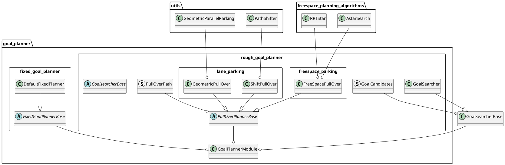
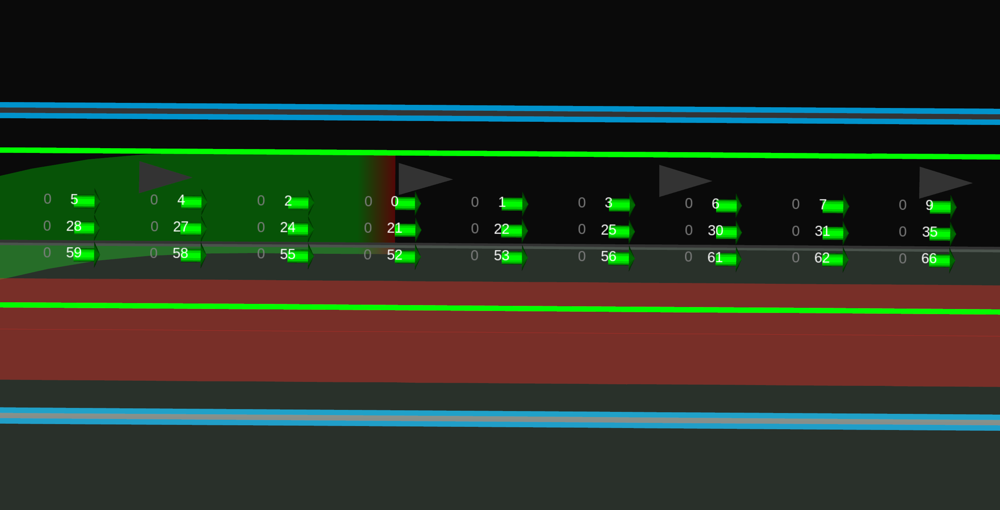

# Goal Planner design

## Purpose / Role

Plan path around the goal.

- Arrive at the designated goal.
- Modify the goal to avoid obstacles or to pull over at the side of the lane.

## Design

If goal modification is not allowed, park at the designated fixed goal. (`fixed_goal_planner` in the figure below)
When allowed, park in accordance with the specified policy(e.g pull over on left/right side of the lane). (`rough_goal_planner` in the figure below). Currently rough goal planner only support pull_over feature, but it would be desirable to be able to accommodate various parking policies in the future.



## start condition

### fixed_goal_planner

This is a very simple function that plans a smooth path to a specified goal. This function does not require approval and always runs with the other modules.
_NOTE: this planner does not perform the several features described below, such as "goal search", "collision check", "safety check", etc._

Executed when both conditions are met.

- Route is set with `allow_goal_modification=false`. This is the default.
- The goal is set in the normal lane. In other words, it is NOT `road_shoulder`.
- Ego-vehicle exists in the same lane sequence as the goal.

If the target path contains a goal, modify the points of the path so that the path and the goal are connected smoothly. This process will change the shape of the path by the distance of `refine_goal_search_radius_range` from the goal. Note that this logic depends on the interpolation algorithm that will be executed in a later module (at the moment it uses spline interpolation), so it needs to be updated in the future.


### rough_goal_planner

#### pull over on road lane

- The distance between the goal and ego-vehicle is shorter than `pull_over_minimum_request_length`.
- Route is set with `allow_goal_modification=true` .
  - We can set this option with [SetRoute](https://github.com/autowarefoundation/autoware_adapi_msgs/blob/main/autoware_adapi_v1_msgs/routing/srv/SetRoute.srv#L2) api service.
  - We support `2D Rough Goal Pose` with the key bind `r` in RViz, but in the future there will be a panel of tools to manipulate various Route API from RViz.
- The terminal point of the current path is in the same lane sequence as the goal. If goal is on the road shoulder, then it is in the adjacent road lane sequence.


#### pull over on shoulder lane

- The distance between the goal and ego-vehicle is shorter than `pull_over_minimum_request_length`.
- Goal is set in the `road_shoulder`.


## finish condition

- The distance to the goal from your vehicle is lower than threshold (default: < `1m`).
- The ego-vehicle is stopped.
  - The speed is lower than threshold (default: < `0.01m/s`).

## General parameters for goal_planner

| Name                      | Unit  | Type   | Description                                        | Default value |
| :------------------------ | :---- | :----- | :------------------------------------------------- | :------------ |
| th_arrived_distance       | [m]   | double | distance threshold for arrival of path termination | 1.0           |
| th_stopped_velocity       | [m/s] | double | velocity threshold for arrival of path termination | 0.01          |
| th_stopped_time           | [s]   | double | time threshold for arrival of path termination     | 2.0           |
| center_line_path_interval | [m]   | double | reference center line path point interval          | 1.0           |

## **Goal Search**

To realize pull over even when an obstacle exists near the original goal, a collision free area is searched within a certain range around the original goal. The goal found will be published as `/planning/scenario_planning/modified_goal`.

[goal search video](https://user-images.githubusercontent.com/39142679/188359594-c6724e3e-1cb7-4051-9a18-8d2c67d4dee9.mp4)

1. The original goal is set, and the refined goal pose is obtained by moving in the direction normal to the lane center line and keeping `margin_from_boundary` from the edge of the lane.
   

2. Using `refined_goal` as the base goal, search for candidate goals in the range of `-forward_goal_search_length` to `backward_goal_search_length` in the longitudinal direction and `longitudinal_margin` to `longitudinal_margin+max_lateral_offset` in th lateral direction based on refined_goal.
   

3. Each candidate goal is prioritized and a path is generated for each planner for each goal. The priority of a candidate goal is determined by its distance from the base goal. The ego vehicle tries to park for the highest possible goal. The distance is determined by the selected policy. In case `minimum_longitudinal_distance`, sort with smaller longitudinal distances taking precedence over smaller lateral distances. In case `minimum_weighted_distance`, sort with the sum of weighted lateral distance and longitudinal distance. This means the distance is calculated by `longitudinal_distance + lateral_cost*lateral_distance`
   
   The following figure is an example of minimum_weighted_distance.​ The white number indicates the goal candidate priority, and the smaller the number, the higher the priority. the 0 goal indicates the base goal.
   
   

4. If the footprint in each goal candidate is within `object_recognition_collision_check_margin` of that of the object, it is determined to be unsafe. These goals are not selected. If `use_occupancy_grid_for_goal_search` is enabled, collision detection on the grid is also performed with `occupancy_grid_collision_check_margin`.

Red goals candidates in the image indicate unsafe ones.


It is possible to keep `longitudinal_margin` in the longitudinal direction apart from the collision margin for obstacles from the goal candidate. This is intended to provide natural spacing for parking and efficient departure.


Also, if `prioritize_goals_before_objects` is enabled, To arrive at each goal, the number of objects that need to be avoided in the target range is counted, and those with the lowest number are given priority.

The images represent a count of objects to be avoided at each range, with priority given to those with the lowest number, regardless of the aforementioned distances.


The gray numbers represent objects to avoid, and you can see that the goal in front has a higher priority in this case.


### Parameters for goal search

| Name                            | Unit | Type   | Description                                                                                                                                                                                                                                                                                                                                                                                                                                                                      | Default value               |
| :------------------------------ | :--- | :----- | :------------------------------------------------------------------------------------------------------------------------------------------------------------------------------------------------------------------------------------------------------------------------------------------------------------------------------------------------------------------------------------------------------------------------------------------------------------------------------- | :-------------------------- |
| goal_priority                   | [-]  | string | In case `minimum_longitudinal_distance`, sort with smaller longitudinal distances taking precedence over smaller lateral distances. In case `minimum_weighted_distance`, sort with the sum of weighted lateral distance and longitudinal distance                                                                                                                                                                                                                                | `minimum_weighted_distance` |
| lateral_weight                  | [-]  | double | Weight for lateral distance used when `minimum_weighted_distance`                                                                                                                                                                                                                                                                                                                                                                                                                | 40.0                        |
| prioritize_goals_before_objects | [-]  | bool   | If there are objects that may need to be avoided, prioritize the goal in front of them                                                                                                                                                                                                                                                                                                                                                                                           | true                        |
| forward_goal_search_length      | [m]  | double | length of forward range to be explored from the original goal                                                                                                                                                                                                                                                                                                                                                                                                                    | 20.0                        |
| backward_goal_search_length     | [m]  | double | length of backward range to be explored from the original goal                                                                                                                                                                                                                                                                                                                                                                                                                   | 20.0                        |
| goal_search_interval            | [m]  | double | distance interval for goal search                                                                                                                                                                                                                                                                                                                                                                                                                                                | 2.0                         |
| longitudinal_margin             | [m]  | double | margin between ego-vehicle at the goal position and obstacles                                                                                                                                                                                                                                                                                                                                                                                                                    | 3.0                         |
| max_lateral_offset              | [m]  | double | maximum offset of goal search in the lateral direction                                                                                                                                                                                                                                                                                                                                                                                                                           | 0.5                         |
| lateral_offset_interval         | [m]  | double | distance interval of goal search in the lateral direction                                                                                                                                                                                                                                                                                                                                                                                                                        | 0.25                        |
| ignore_distance_from_lane_start | [m]  | double | This parameter ensures that the distance between the start of the shoulder lane and the goal is not less than the specified value. It's used to prevent setting goals too close to the beginning of the shoulder lane, which might lead to unsafe or impractical pull-over maneuvers. Increasing this value will force the system to ignore potential goal positions near the start of the shoulder lane, potentially leading to safer and more comfortable pull-over locations. | 0.0                         |
| margin_from_boundary            | [m]  | double | distance margin from edge of the shoulder lane                                                                                                                                                                                                                                                                                                                                                                                                                                   | 0.5                         |

## **Pull Over**

There are three path generation methods.
The path is generated with a certain margin (default: `0.75 m`) from the boundary of shoulder lane.

The process is time consuming because multiple planners are used to generate path for each candidate goal. Therefore, in this module, the path generation is performed in a thread different from the main thread.
Path generation is performed at the timing when the shape of the output path of the previous module changes. If a new module launches, it is expected to go to the previous stage before the goal planner, in which case the goal planner re-generates the path. The goal planner is expected to run at the end of multiple modules, which is achieved by `keep_last` in the planner manager.

Threads in the goal planner are shown below.


The main thread will be the one called from the planner manager flow.

- The goal candidate generation and path candidate generation are done in a separate thread(lane path generation thread).
- The path candidates generated there are referred to by the main thread, and the one judged to be valid for the current planner data (e.g. ego and object information) is selected from among them. valid means no sudden deceleration, no collision with obstacles, etc. The selected path will be the output of this module.
- If there is no path selected, or if the selected path is collision and ego is stuck, a separate thread(freespace path generation thread) will generate a path using freespace planning algorithm. If a valid free space path is found, it will be the output of the module. If the object moves and the pull over path generated along the lane is collision-free, the path is used as output again. See also the section on freespace parking for more information on the flow of generating freespace paths.

| Name                                  | Unit   | Type   | Description                                                                                                                                                                    | Default value                            |
| :------------------------------------ | :----- | :----- | :----------------------------------------------------------------------------------------------------------------------------------------------------------------------------- | :--------------------------------------- |
| pull_over_minimum_request_length      | [m]    | double | when the ego-vehicle approaches the goal by this distance or a safe distance to stop, pull over is activated.                                                                  | 100.0                                    |
| pull_over_velocity                    | [m/s]  | double | decelerate to this speed by the goal search area                                                                                                                               | 3.0                                      |
| pull_over_minimum_velocity            | [m/s]  | double | speed of pull_over after stopping once. this prevents excessive acceleration.                                                                                                  | 1.38                                     |
| decide_path_distance                  | [m]    | double | decide path if it approaches this distance relative to the parking position. after that, no path planning and goal search are performed                                        | 10.0                                     |
| maximum_deceleration                  | [m/s2] | double | maximum deceleration. it prevents sudden deceleration when a parking path cannot be found suddenly                                                                             | 1.0                                      |
| path_priority                         | [-]    | string | In case `efficient_path` use a goal that can generate an efficient path which is set in `efficient_path_order`. In case `close_goal` use the closest goal to the original one. | efficient_path                           |
| efficient_path_order                  | [-]    | string | efficient order of pull over planner along lanes excluding freespace pull over                                                                                                 | ["SHIFT", "ARC_FORWARD", "ARC_BACKWARD"] |
| lane_departure_check_expansion_margin | [m]    | double | margin to expand the ego vehicle footprint when doing lane departure checks                                                                                                    | 0.0                                      |

### **shift parking**

Pull over distance is calculated by the speed, lateral deviation, and the lateral jerk.
The lateral jerk is searched for among the predetermined minimum and maximum values, and the one satisfies ready conditions described above is output.

1. Apply uniform offset to centerline of shoulder lane for ensuring margin
2. In the section between merge start and end, path is shifted by a method that is used to generate avoidance path (four segmental constant jerk polynomials)
3. Combine this path with center line of road lane


[shift_parking video](https://user-images.githubusercontent.com/39142679/178034101-4dc61a33-bc49-41a0-a9a8-755cce53cbc6.mp4)

#### Parameters for shift parking

| Name                          | Unit   | Type   | Description                                                         | Default value |
| :---------------------------- | :----- | :----- | :------------------------------------------------------------------ | :------------ |
| enable_shift_parking          | [-]    | bool   | flag whether to enable shift parking                                | true          |
| shift_sampling_num            | [-]    | int    | Number of samplings in the minimum to maximum range of lateral_jerk | 4             |
| maximum_lateral_jerk          | [m/s3] | double | maximum lateral jerk                                                | 2.0           |
| minimum_lateral_jerk          | [m/s3] | double | minimum lateral jerk                                                | 0.5           |
| deceleration_interval         | [m]    | double | distance of deceleration section                                    | 15.0          |
| after_shift_straight_distance | [m]    | double | straight line distance after pull over end point                    | 1.0           |

### **geometric parallel parking**

Generate two arc paths with discontinuous curvature. It stops twice in the middle of the path to control the steer on the spot. There are two path generation methods: forward and backward.
See also [[1]](https://www.sciencedirect.com/science/article/pii/S1474667015347431) for details of the algorithm. There is also [a simple python implementation](https://github.com/kosuke55/geometric-parallel-parking).

#### Parameters geometric parallel parking

| Name                    | Unit  | Type   | Description                                                                                                                         | Default value |
| :---------------------- | :---- | :----- | :---------------------------------------------------------------------------------------------------------------------------------- | :------------ |
| arc_path_interval       | [m]   | double | interval between arc path points                                                                                                    | 1.0           |
| pull_over_max_steer_rad | [rad] | double | maximum steer angle for path generation. it may not be possible to control steer up to max_steer_angle in vehicle_info when stopped | 0.35          |

#### arc forward parking

Generate two forward arc paths.


[arc_forward_parking video](https://user-images.githubusercontent.com/39142679/178034128-4754c401-8aff-4745-b69a-4a69ca29ce4b.mp4)

#### Parameters arc forward parking

| Name                                    | Unit  | Type   | Description                                                                     | Default value |
| :-------------------------------------- | :---- | :----- | :------------------------------------------------------------------------------ | :------------ |
| enable_arc_forward_parking              | [-]   | bool   | flag whether to enable arc forward parking                                      | true          |
| after_forward_parking_straight_distance | [m]   | double | straight line distance after pull over end point                                | 2.0           |
| forward_parking_velocity                | [m/s] | double | velocity when forward parking                                                   | 1.38          |
| forward_parking_lane_departure_margin   | [m/s] | double | lane departure margin for front left corner of ego-vehicle when forward parking | 0.0           |

#### arc backward parking

Generate two backward arc paths.

.

[arc_backward_parking video](https://user-images.githubusercontent.com/39142679/178034280-4b6754fe-3981-4aee-b5e0-970f34563c6d.mp4)

#### Parameters arc backward parking

| Name                                     | Unit  | Type   | Description                                                               | Default value |
| :--------------------------------------- | :---- | :----- | :------------------------------------------------------------------------ | :------------ |
| enable_arc_backward_parking              | [-]   | bool   | flag whether to enable arc backward parking                               | true          |
| after_backward_parking_straight_distance | [m]   | double | straight line distance after pull over end point                          | 2.0           |
| backward_parking_velocity                | [m/s] | double | velocity when backward parking                                            | -1.38         |
| backward_parking_lane_departure_margin   | [m/s] | double | lane departure margin for front right corner of ego-vehicle when backward | 0.0           |

### freespace parking

If the vehicle gets stuck with `lane_parking`, run `freespace_parking`.
To run this feature, you need to set `parking_lot` to the map, `activate_by_scenario` of [costmap_generator](../costmap_generator/README.md) to `false` and `enable_freespace_parking` to `true`


Simultaneous execution with `avoidance_module` in the flowchart is under development.


#### Parameters freespace parking

| Name                     | Unit | Type | Description                                                                                                          | Default value |
| :----------------------- | :--- | :--- | :------------------------------------------------------------------------------------------------------------------- | :------------ |
| enable_freespace_parking | [-]  | bool | This flag enables freespace parking, which runs when the vehicle is stuck due to e.g. obstacles in the parking area. | true          |

See [freespace_planner](../autoware_freespace_planner/README.md) for other parameters.

## **collision check for path generation**

To select a safe one from the path candidates, a collision check with obstacles is performed.

### **occupancy grid based collision check**

Generate footprints from ego-vehicle path points and determine obstacle collision from the value of occupancy_grid of the corresponding cell.

#### Parameters for occupancy grid based collision check

| Name                                            | Unit | Type   | Description                                                                                                     | Default value |
| :---------------------------------------------- | :--- | :----- | :-------------------------------------------------------------------------------------------------------------- | :------------ |
| use_occupancy_grid_for_goal_search              | [-]  | bool   | flag whether to use occupancy grid for goal search collision check                                              | true          |
| use_occupancy_grid_for_goal_longitudinal_margin | [-]  | bool   | flag whether to use occupancy grid for keeping longitudinal margin                                              | false         |
| use_occupancy_grid_for_path_collision_check     | [-]  | bool   | flag whether to use occupancy grid for collision check                                                          | false         |
| occupancy_grid_collision_check_margin           | [m]  | double | margin to calculate ego-vehicle cells from footprint.                                                           | 0.0           |
| theta_size                                      | [-]  | int    | size of theta angle to be considered. angular resolution for collision check will be 2$\pi$ / theta_size [rad]. | 360           |
| obstacle_threshold                              | [-]  | int    | threshold of cell values to be considered as obstacles                                                          | 60            |

### **object recognition based collision check**

A collision decision is made for each of the path candidates, and a collision-free path is selected.
There are three main margins at this point.

- `object_recognition_collision_check_margin` is margin in all directions of ego.
- In the forward direction, a margin is added by the braking distance calculated from the current speed and maximum deceleration. The maximum distance is The maximum value of the distance is suppressed by the `object_recognition_collision_check_max_extra_stopping_margin`
- In curves, the lateral margin is larger than in straight lines.This is because curves are more prone to control errors or to fear when close to objects (The maximum value is limited by `object_recognition_collision_check_max_extra_stopping_margin`, although it has no basis.)


Then there is the concept of soft and hard margins. Although not currently parameterized, if a collision-free path can be generated by a margin several times larger than `object_recognition_collision_check_margin`, then the priority is higher.

#### Parameters for object recognition based collision check

| Name                                                         | Unit | Type           | Description                                                                                                                                                            | Default value                                 |
| :----------------------------------------------------------- | :--- | :------------- | :--------------------------------------------------------------------------------------------------------------------------------------------------------------------- | :-------------------------------------------- |
| use_object_recognition                                       | [-]  | bool           | flag whether to use object recognition for collision check                                                                                                             | true                                          |
| object_recognition_collision_check_soft_margins              | [m]  | vector[double] | soft margins for collision check when path generation. It is not strictly the distance between footprints, but the maximum distance when ego and objects are oriented. | [5.0, 4.5, 4.0, 3.5, 3.0, 2.5, 2.0, 1.5, 1.0] |
| object_recognition_collision_check_hard_margins              | [m]  | vector[double] | hard margins for collision check when path generation                                                                                                                  | [0.6]                                         |
| object_recognition_collision_check_max_extra_stopping_margin | [m]  | double         | maximum value when adding longitudinal distance margin for collision check considering stopping distance                                                               | 1.0                                           |
| detection_bound_offset                                       | [m]  | double         | expand pull over lane with this offset to make detection area for collision check of path generation                                                                   | 15.0                                          |

## **safety check**

Perform safety checks on moving objects. If the object is determined to be dangerous, no path decision is made and no approval is given,

- path decision is not made and approval is not granted.
- After approval, the ego vehicle stops under deceleration and jerk constraints.

This module has two methods of safety check, `RSS` and `integral_predicted_polygon`.

`RSS` method is a method commonly used by other behavior path planner modules, see [RSS based safety check utils explanation](../autoware_behavior_path_planner_common/docs/behavior_path_planner_safety_check.md).

`integral_predicted_polygon` is a more safety-oriented method. This method is implemented because speeds during pull over are lower than during driving, and fewer objects travel along the edge of the lane. (It is sometimes too reactive and may be less available.)
This method integrates the footprints of egos and objects at a given time and checks for collisions between them.


In addition, the safety check has a time hysteresis, and if the path is judged "safe" for a certain period of time(`keep_unsafe_time`), it is finally treated as "safe".

```txt
                         ==== is_safe
                         ---- current_is_safe
       is_safe
        ^
        |
        |                   time
      1 +--+    +---+       +---=========   +--+
        |  |    |   |       |           |   |  |
        |  |    |   |       |           |   |  |
        |  |    |   |       |           |   |  |
        |  |    |   |       |           |   |  |
      0 =========================-------==========--> t
```

### Parameters for safety check

| Name                                 | Unit  | Type   | Description                                                                                              | Default value                |
| :----------------------------------- | :---- | :----- | :------------------------------------------------------------------------------------------------------- | :--------------------------- |
| enable_safety_check                  | [-]   | bool   | flag whether to use safety check                                                                         | true                         |
| method                               | [-]   | string | method for safety check. `RSS` or `integral_predicted_polygon`                                           | `integral_predicted_polygon` |
| keep_unsafe_time                     | [s]   | double | safety check Hysteresis time. if the path is judged "safe" for the time it is finally treated as "safe". | 3.0                          |
| check_all_predicted_path             | -     | bool   | Flag to check all predicted paths                                                                        | true                         |
| publish_debug_marker                 | -     | bool   | Flag to publish debug markers                                                                            | false                        |
| `collision_check_yaw_diff_threshold` | [rad] | double | Maximum yaw difference between ego and object when executing rss-based collision checking                | 3.1416                       |

#### Parameters for RSS safety check

| Name                                | Unit | Type   | Description                             | Default value |
| :---------------------------------- | :--- | :----- | :-------------------------------------- | :------------ |
| rear_vehicle_reaction_time          | [s]  | double | Reaction time for rear vehicles         | 2.0           |
| rear_vehicle_safety_time_margin     | [s]  | double | Safety time margin for rear vehicles    | 1.0           |
| lateral_distance_max_threshold      | [m]  | double | Maximum lateral distance threshold      | 2.0           |
| longitudinal_distance_min_threshold | [m]  | double | Minimum longitudinal distance threshold | 3.0           |
| longitudinal_velocity_delta_time    | [s]  | double | Delta time for longitudinal velocity    | 0.8           |

#### Parameters for integral_predicted_polygon safety check

| Name            | Unit | Type   | Description                            | Default value |
| :-------------- | :--- | :----- | :------------------------------------- | :------------ |
| forward_margin  | [m]  | double | forward margin for ego footprint       | 1.0           |
| backward_margin | [m]  | double | backward margin for ego footprint      | 1.0           |
| lat_margin      | [m]  | double | lateral margin for ego footprint       | 1.0           |
| time_horizon    | [s]  | double | Time width to integrate each footprint | 10.0          |

## **path deciding**

When `decide_path_distance` closer to the start of the pull over, if it is collision-free at that time and safe for the predicted path of the objects, it transitions to DECIDING. If it is safe for a certain period of time, it moves to DECIDED.


## Unimplemented parts / limitations

- Only shift pull over can be executed concurrently with other modules
- Parking in tight spots and securing margins are traded off. A mode is needed to reduce the margin by using a slower speed depending on the situation, but there is no mechanism for dynamic switching of speeds.
- Parking space available depends on visibility of objects, and sometimes parking decisions cannot be made properly.
- Margin to unrecognized objects(Not even unknown objects) depends on the occupancy grid. May get too close to unrecognized ground objects because the objects that are allowed to approach (e.g., grass, leaves) are indistinguishable.

Unimplemented parts / limitations for freespace parking

- When a short path is generated, the ego does can not drive with it.
- Complex cases take longer to generate or fail.
- The drivable area is not guaranteed to fit in the parking_lot.
