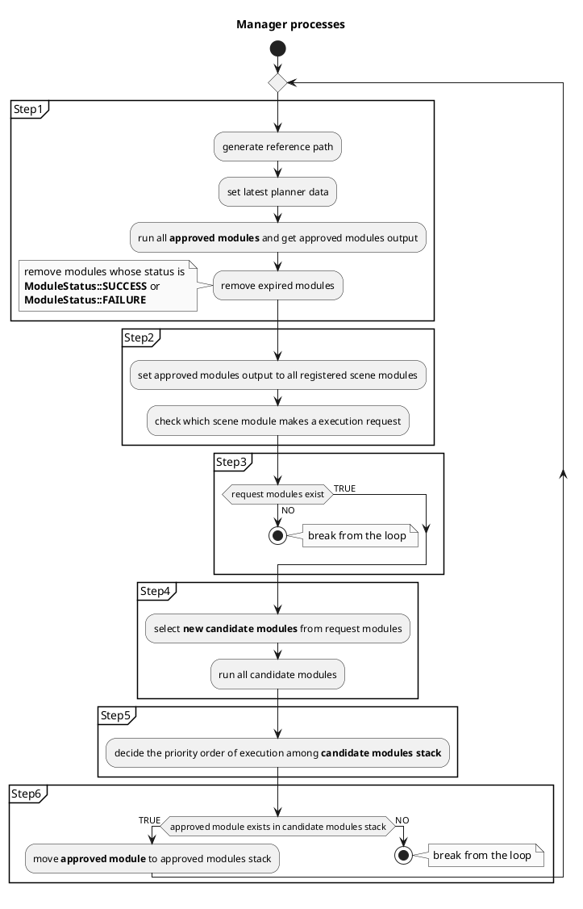
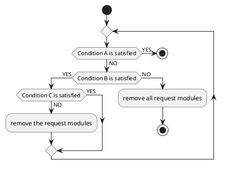
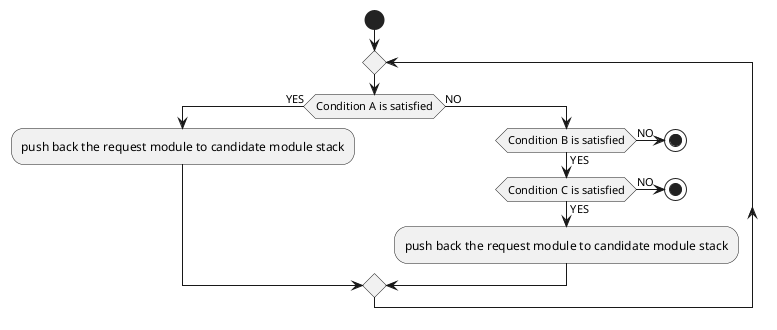

# Manager design

## Purpose / Role

The manager launches and executes scene modules in `behavior_path_planner` depending on the use case, and has been developed to achieve following features:

- Multiple modules can run simultaneously in series in order to achieve more complex use cases. For example, as shown in the following video, this manager make it possible to avoid a parked vehicle during lane change maneuver.
- Flexible development by not relying on framework from external libraries.


[Movie](https://user-images.githubusercontent.com/44889564/231639251-6631dc4e-1861-47e7-9c51-6df1b666ce9b.mp4)

Support status:

| Name                                     | Simple exclusive execution | Advanced simultaneous execution |
| :--------------------------------------- | :------------------------: | :-----------------------------: |
| Avoidance                                |     :heavy_check_mark:     |       :heavy_check_mark:        |
| Avoidance By Lane Change                 |     :heavy_check_mark:     |    :heavy_multiplication_x:     |
| Lane Change                              |     :heavy_check_mark:     |       :heavy_check_mark:        |
| External Lane Change                     |     :heavy_check_mark:     |    :heavy_multiplication_x:     |
| Goal Planner (without goal modification) |     :heavy_check_mark:     |       :heavy_check_mark:        |
| Goal Planner (with goal modification)    |     :heavy_check_mark:     |    :heavy_multiplication_x:     |
| Pull Out                                 |     :heavy_check_mark:     |       :heavy_check_mark:        |
| Side Shift                               |     :heavy_check_mark:     |    :heavy_multiplication_x:     |

Click [here](../README.md) for supported scene modules.

!!! warning

    It is still under development and some functions may be unstable.

## Overview

The manager is the core part of the `behavior_path_planner` implementation. It outputs path based on the latest data.

The manager has sub-managers for each scene module, and its main task is

- set latest planner data to scene modules via sub-managers.
- check scene module's request status via sub-managers.
- launch scene modules that make execution request.
- execute launched modules.
- delete scene expired modules.

Additionally, the manager generates root reference path, and if any other modules don't request execution, the path is used as the planning result of `behavior_path_planner`.


### Slot

The manager owns several containers of sub-managers, namely _slots_, that holds/runs several sub-managers and send the output to the next slot. Given the initial reference path, each slot processes the input path and the output path is processed by the next slot. The final slot output is utilized as the output of the manager. The slot passes following information

```cpp
struct SlotOutput
{
  BehaviorModuleOutput valid_output;

  // if candidate module is running, valid_output contains the planning by candidate module. In
  // that case, downstream slots will just run aproved modules and do not try to launch new
  // modules
  bool is_upstream_candidate_exclusive{false};

  // if this slot failed, downstream slots need to refresh approved/candidate modules and just
  // forward valid_output of this slot output
  bool is_upstream_failed_approved{false};

  // if the approved module in this slot returned to isWaitingApproval, downstream slots need to
  // refresh candidate once
  bool is_upstream_waiting_approved{false};
};

```

### Sub-managers

The sub-manager's main task is

- store the launched modules in internal vectors `registered_modules_`.
- create scene module instance.
- pass scene module's instance to the manager.
- delete expired scene module instance from `registered_modules_`.
- publish debug markers.

<figure markdown>
  {width=1000}
  <figcaption>sub-managers</figcaption>
</figure>

Sub-manager is registered on the manager with the following function.

```c++
/**
 * @brief register managers.
 * @param manager pointer.
 */
void registerSceneModuleManager(const SceneModuleManagerPtr & manager_ptr)
{
  RCLCPP_INFO(logger_, "register %s module", manager_ptr->getModuleName().c_str());
  manager_ptrs_.push_back(manager_ptr);
  processing_time_.emplace(manager_ptr->getModuleName(), 0.0);
}
```

Code is [here](https://github.com/autowarefoundation/autoware.universe/blob/b1734916e3efd9786507a271e0fe829dd37476c8/planning/behavior_path_planner/include/behavior_path_planner/planner_manager.hpp#L66-L75)

Sub-manager has the following parameters that are needed by the manager to manage the launched modules, and these parameters can be set for each module.

```c++
struct ModuleConfigParameters
{
  bool enable_module{false};
  bool enable_rtc{false};
  bool enable_simultaneous_execution_as_approved_module{false};
  bool enable_simultaneous_execution_as_candidate_module{false};
  uint8_t priority{0};
};
```

Code is [here](https://github.com/autowarefoundation/autoware.universe/blob/b1734916e3efd9786507a271e0fe829dd37476c8/planning/behavior_path_planner/include/behavior_path_planner/parameters.hpp#L23-L30)

| Name                                                | Type    | Description                                                                                                                                     |
| :-------------------------------------------------- | :------ | :---------------------------------------------------------------------------------------------------------------------------------------------- |
| `enable_module`                                     | bool    | if true, the sub-manager is registered on the manager.                                                                                          |
| `enable_rtc`                                        | bool    | if true, the scene modules should be approved by (request to cooperate)rtc function. if false, the module can be run without approval from rtc. |
| `enable_simultaneous_execution_as_candidate_module` | bool    | if true, the manager allows its scene modules to run with other scene modules as **candidate module**.                                          |
| `enable_simultaneous_execution_as_approved_module`  | bool    | if true, the manager allows its scene modules to run with other scene modules as **approved module**.                                           |
| `priority`                                          | uint8_t | the manager decides execution priority based on this parameter. The smaller the number is, the higher the priority is.                          |

### Scene modules

Scene modules receives necessary data and RTC command, and outputs candidate path(s), reference path and RTC cooperate status. When multiple modules run in series, the output of the previous module is received as input and the information is used to generate a new modified path, as shown in the following figure. And, when one module is running alone, it receives a reference path generated from the centerline of the lane in which Ego is currently driving as previous module output.

<figure markdown>
  {width=1000}
  <figcaption>scene module</figcaption>
</figure>

| I/O | Type                                          | Description                                                                                                                                                                           |
| :-- | :-------------------------------------------- | :------------------------------------------------------------------------------------------------------------------------------------------------------------------------------------ |
| IN  | `behavior_path_planner::BehaviorModuleOutput` | previous module output. contains data necessary for path planning.                                                                                                                    |
| IN  | `behavior_path_planner::PlannerData`          | contains data necessary for path planning.                                                                                                                                            |
| IN  | `tier4_planning_msgs::srv::CooperateCommands` | contains approval data for scene module's path modification. ([details](https://github.com/autowarefoundation/autoware.universe/blob/main/planning/autoware_rtc_interface/README.md)) |
| OUT | `behavior_path_planner::BehaviorModuleOutput` | contains modified path, turn signal information, etc...                                                                                                                               |
| OUT | `tier4_planning_msgs::msg::CooperateStatus`   | contains RTC cooperate status. ([details](https://github.com/autowarefoundation/autoware.universe/blob/main/planning/autoware_rtc_interface/README.md))                               |
| OUT | `autoware_planning_msgs::msg::Path`           | candidate path output by a module that has not received approval for path change. when it approved, the ego's following path is switched to this path. (just for visualization)       |
| OUT | `autoware_planning_msgs::msg::Path`           | reference path generated from the centerline of the lane the ego is going to follow. (just for visualization)                                                                         |
| OUT | `visualization_msgs::msg::MarkerArray`        | virtual wall, debug info, etc...                                                                                                                                                      |

Scene modules running on the manager are stored on the **candidate modules stack** or **approved modules stack** depending on the condition whether the path modification has been approved or not.

| Stack             | Approval condition | Description                                                                                                                                                                                                                                                                                                                                                                                                                                                                                                                                                                                                                                                                                                                                  |
| :---------------- | :----------------- | :------------------------------------------------------------------------------------------------------------------------------------------------------------------------------------------------------------------------------------------------------------------------------------------------------------------------------------------------------------------------------------------------------------------------------------------------------------------------------------------------------------------------------------------------------------------------------------------------------------------------------------------------------------------------------------------------------------------------------------------- |
| candidate modules | Not approved       | The candidate modules whose modified path has not been approved by [RTC](https://github.com/autowarefoundation/autoware.universe/blob/main/planning/autoware_rtc_interface/README.md) is stored in vector `candidate_module_ptrs_` in the manager. The candidate modules stack is updated in the following order. 1. The manager selects only those modules that can be executed based on the configuration of the sub-manager whose scene module requests execution. 2. Determines the execution priority. 3. Executes them as candidate module. All of these modules receive the decided (approved) path from approved modules stack and **RUN in PARALLEL**. <br> |
| approved modules  | Already approved   | When the path modification is approved via RTC commands, the manager moves the candidate module to approved modules stack. These modules are stored in `approved_module_ptrs_`. In this stack, all scene modules **RUN in SERIES**. <br>                                                                                                                                                                                                                                                                                                                                                                                                                               |

## Process flow

There are 6 steps in one process:

### Step1

At first, the manager set latest planner data, and run all approved modules and get output path. At this time, the manager checks module status and removes expired modules from approved modules stack.


### Step2

Input approved modules output and necessary data to all registered modules, and the modules judge the necessity of path modification based on it. The manager checks which module makes execution request.


### Step3

Check request module existence.

### Step4

The manager decides which module to execute as candidate modules from the modules that requested to execute path modification.


### Step5

Decides the priority order of execution among candidate modules. And, run all candidate modules. Each modules outputs reference path and RTC cooperate status.


### Step6

Move approved module to approved modules stack from candidate modules stack.


---

and, within a single planning cycle, these steps are repeated until the following conditions are satisfied.

- **Any modules don't make a request of path modification. (Check in Step3)**
- **Any candidate modules' request are not approved. (Check in Step5)**



```c++
  while (rclcpp::ok()) {
    /**
     * STEP1: get approved modules' output
     */
    const auto approved_modules_output = runApprovedModules(data);

    /**
     * STEP2: check modules that need to be launched
     */
    const auto request_modules = getRequestModules(approved_modules_output);

    /**
     * STEP3: if there is no module that need to be launched, return approved modules' output
     */
    if (request_modules.empty()) {
      processing_time_.at("total_time") = stop_watch_.toc("total_time", true);
      return approved_modules_output;
    }

    /**
     * STEP4: if there is module that should be launched, execute the module
     */
    const auto [highest_priority_module, candidate_modules_output] =
      runRequestModules(request_modules, data, approved_modules_output);
    if (!highest_priority_module) {
      processing_time_.at("total_time") = stop_watch_.toc("total_time", true);
      return approved_modules_output;
    }

    /**
     * STEP5: if the candidate module's modification is NOT approved yet, return the result.
     * NOTE: the result is output of the candidate module, but the output path don't contains path
     * shape modification that needs approval. On the other hand, it could include velocity profile
     * modification.
     */
    if (highest_priority_module->isWaitingApproval()) {
      processing_time_.at("total_time") = stop_watch_.toc("total_time", true);
      return candidate_modules_output;
    }

    /**
     * STEP6: if the candidate module is approved, push the module into approved_module_ptrs_
     */
    addApprovedModule(highest_priority_module);
    clearCandidateModules();
  }
```

Code is [here](https://github.com/autowarefoundation/autoware.universe/blob/b1734916e3efd9786507a271e0fe829dd37476c8/planning/behavior_path_planner/src/planner_manager.cpp#L66-L111)

## Priority of execution request

Compare priorities parameter among sub-managers to determine the order of execution based on config. Therefore, the priority between sub-modules does **NOT** change at runtime.

```c++
  /**
   * @brief swap the modules order based on it's priority.
   * @param modules.
   * @details for now, the priority is decided in config file and doesn't change runtime.
   */
  void sortByPriority(std::vector<SceneModulePtr> & modules) const
  {
    // TODO(someone) enhance this priority decision method.
    std::sort(modules.begin(), modules.end(), [this](auto a, auto b) {
      return getManager(a)->getPriority() < getManager(b)->getPriority();
    });
  }
```

Code is [here](https://github.com/autowarefoundation/autoware.universe/blob/b1734916e3efd9786507a271e0fe829dd37476c8/planning/behavior_path_planner/include/behavior_path_planner/planner_manager.hpp#L239-L250)

In the future, however, we are considering having the priorities change dynamically depending on the situation in order to achieve more complex use cases.

## How to decide which request modules to run?

On this manager, it is possible that multiple scene modules may request path modification at same time. In that case, the modules to be executed as candidate module is determined in the following order.

### Step1

Push back the modules that make a request to `request_modules`.


### Step2

Check approved modules stack, and remove non-executable modules from`request_modules` based on the following condition.

- **Condition A.** approved module stack is empty.
- **Condition B.** all modules in approved modules stack support simultaneous execution as approved module (`enable_simultaneous_execution_as_approved_module` is `true`).
- **Condition C.** the request module supports simultaneous execution as approved module.



Executable or not:

| Condition A | Condition B | Condition C | Executable as candidate modules? |
| :---------: | :---------: | :---------: | :------------------------------: |
|     YES     |      -      |     YES     |             **YES**              |
|     YES     |      -      |     NO      |             **YES**              |
|     NO      |     YES     |     YES     |             **YES**              |
|     NO      |     YES     |     NO      |                NO                |
|     NO      |     NO      |     YES     |                NO                |
|     NO      |     NO      |     NO      |                NO                |

If a module that doesn't support simultaneous execution exists in approved modules stack (**NOT** satisfy Condition B), no more modules can be added to the stack, and therefore none of the modules can be executed as candidate.

For example, if approved module's setting of `enable_simultaneous_execution_as_approved_module` is **ENABLE**, then only modules whose the setting is **ENABLE** proceed to the next step.


Other examples:

| Process                                                         | Description                                                                                                                                                             |
| :-------------------------------------------------------------- | :---------------------------------------------------------------------------------------------------------------------------------------------------------------------- |
|  | If approved modules stack is empty, then all request modules proceed to the next step, regardless of the setting of `enable_simultaneous_execution_as_approved_module`. |
|  | If approved module's setting of `enable_simultaneous_execution_as_approved_module` is **DISABLE**, then all request modules are discarded.                              |

### Step3

Sort `request_modules` by priority.


### Step4

Check and pick up executable modules as candidate in order of priority based on the following conditions.

- **Condition A.** candidate module stack is empty.
- **Condition B.** all modules in candidate modules stack support simultaneous execution as candidate module (`enable_simultaneous_execution_as_candidate_module` is `true`).
- **Condition C.** the request module supports simultaneous execution as candidate module.



Executable or not:

| Condition A | Condition B | Condition C | Executable as candidate modules? |
| :---------: | :---------: | :---------: | :------------------------------: |
|     YES     |      -      |     YES     |             **YES**              |
|     YES     |      -      |     NO      |             **YES**              |
|     NO      |     YES     |     YES     |             **YES**              |
|     NO      |     YES     |     NO      |                NO                |
|     NO      |     NO      |     YES     |                NO                |
|     NO      |     NO      |     NO      |                NO                |

For example, if the highest priority module's setting of `enable_simultaneous_execution_as_candidate_module` is **DISABLE**, then all modules after the second priority are discarded.


Other examples:

| Process                                                         | Description                                                                                                                                                          |
| :-------------------------------------------------------------- | :------------------------------------------------------------------------------------------------------------------------------------------------------------------- |
|  | If a module with a higher priority exists, lower priority modules whose setting of `enable_simultaneous_execution_as_candidate_module` is **DISABLE** are discarded. |
|  | If all modules' setting of `enable_simultaneous_execution_as_candidate_module` is **ENABLE**, then all modules proceed to the next step.                             |

### Step5

Run all candidate modules.


## How to decide which module's output to use?

Sometimes, multiple candidate modules are running simultaneously.


In this case, the manager selects a candidate modules which output path is used as `behavior_path_planner` output by approval condition in the following rules.

- **Rule A.** Regardless of the priority in the sub-manager (`priority`), approved modules always have a higher priority than unapproved modules.
- **Rule B.** If the approval status is the same, sort according to the sub-manager's priority.

| Module A's approval condition | Module A's priority | Module B's approval condition | Module B's priority |     Final priority      |
| :---------------------------: | :-----------------: | :---------------------------: | :-----------------: | :---------------------: |
|           Approved            |          1          |           Approved            |         99          |   Module A > Module B   |
|           Approved            |          1          |         Not approved          |         99          |   Module A > Module B   |
|         Not approved          |          1          |           Approved            |         99          | **Module B > Module A** |
|         Not approved          |          1          |         Not approved          |         99          |   Module A > Module B   |

!!! note

    The smaller the number is, the higher the priority is.

<figure markdown>
  {width=1000}
  <figcaption>module priority</figcaption>
</figure>


Additionally, the manager moves the highest priority module to approved modules stack if it is already approved.

## Scene module unregister process

The manager removes expired module in approved modules stack based on the module's status.

### Waiting approval modules

If one module requests multiple path changes, the module may be back to waiting approval condition again. In this case, the manager moves the module to candidate modules stack. If there are some modules that was pushed back to approved modules stack later than the waiting approved module, it is also removed from approved modules stack.

This is because module C is planning output path with the output of module B as input, and if module B is removed from approved modules stack and the input of module C changes, the output path of module C may also change greatly, and the output path will be unstable.

As a result, the module A's output is used as approved modules stack.


If this case happened in the slot, `is_upstream_waiting_approved` is set to true.

### Failure modules

The failure modules return the status `ModuleStatus::FAILURE`. The manager removes the module from approved modules stack as well as waiting approval modules, but the failure module is not moved to candidate modules stack.

As a result, the module A's output is used as approved modules stack.


If this case happened in the slot, `is_upstream_failed_approved` is set to true.

### Succeeded modules

The succeeded modules return the status `ModuleStatus::SUCCESS`. The manager removes those modules based on **Last In First Out** policy. In other words, if a module added later to approved modules stack is still running (is in `ModuleStatus::RUNNING`), the manager doesn't remove the succeeded module. The reason for this is the same as in removal for waiting approval modules, and is to prevent sudden changes of the running module's output.


As an exception, if **Lane Change** module returns status `ModuleStatus::SUCCESS`, the manager doesn't remove any modules until all modules is in status `ModuleStatus::SUCCESS`. This is because when the manager removes the **Lane Change** (normal LC, external LC, avoidance by LC) module as succeeded module, the manager updates the information of the lane Ego is currently driving in, so root reference path (= module A's input path) changes significantly at that moment.


When the manager removes succeeded modules, the last added module's output is used as approved modules stack.

## Slot output propagation

As the initial solution, following _SlotOutput_ is passed to the first slot.

```cpp
  SlotOutput result_output = SlotOutput{
    getReferencePath(data),
    false,
    false,
    false,
  };
```

If a slot turned out to be `is_upstream_failed_approved`, then all the subsequent slots are refreshed and have all of their approved_modules and candidate_modules cleared. The valid_output is just transferred to the end without any modification.

If a slot turned out to be `is_upstream_waiting_approved`, then all the subsequent slots clear their candidate_modules once and apply their approved_modules to obtain the slot output.

If a slot turned out to be `is_upstream_candidate_exclusive`, it means that a not `simultaneously_executable_as_candidate` module is running in that slot. Then all the subsequent modules just apply their approved_modules without trying to launch new candidate_modules.

## Reference path generation

The reference path is generated from the centerline of the **lanelet sequence** obtained from the **current route lanelet**, and it is not only used as an input to the first added module of approved modules stack, but also used as the output of `behavior_path_planner` if none of the modules are running.

<figure markdown>
  {width=500}
  <figcaption>root reference path generation</figcaption>
</figure>

The **current route lanelet** keeps track of the route lanelet currently followed by the planner.
It is initialized as the closest lanelet within the route.
It is then updated as ego travels along the route such that (1) it follows the previous **current route lanelet** and (2) it is the closest lanelet within the route.

The **current route lanelet** can be reset to the closest lanelet within the route, ignoring whether it follows the previous **current route lanelet** .


The manager needs to know the ego behavior and then generate a root reference path from the lanes that Ego should follow.

For example, during autonomous driving, even if Ego moves into the next lane in order to avoid a parked vehicle, the target lanes that Ego should follow will **NOT** change because Ego will return to the original lane after the avoidance maneuver. Therefore, the manager does **NOT** reset the **current route lanelet**, even if the avoidance maneuver is finished.


On the other hand, if the lane change is successful, the manager resets the **current route lanelet** because the lane that Ego should follow changes.


In addition, while manually driving (i.e., either the `OperationModeState` is different from `AUTONOMOUS` or the Autoware control is not engaged), the manager resets the **current route lanelet** at each iteration because the ego vehicle may move to an adjacent lane regardless of the decision of the autonomous driving system.
The only exception is when a module is already approved, allowing testing the module's behavior while manually driving.

## Drivable area generation

!!! warning

    Under Construction

## Turn signal management

!!! warning

    Under Construction
