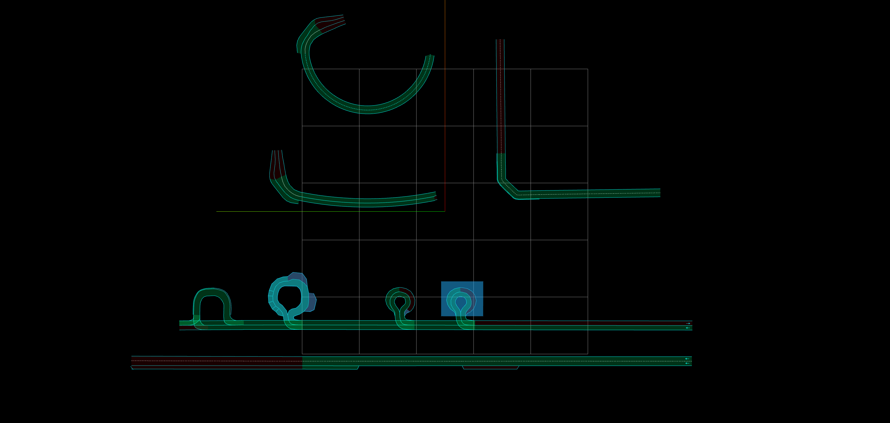

# Develop purpose maps

## road_shoulders

The road_shoulders lanelet map consist of a variety of pick-up/drop-off site maps with road_shoulder tags including:

- pick-up/drop-off sites on the side of street lanes
- pick-up/drop-off sites on the side of curved lanes
- pick-up/drop-off sites inside a private area

