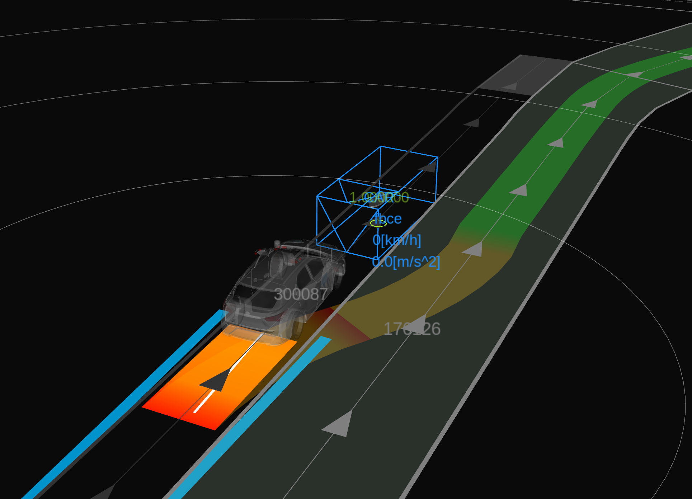
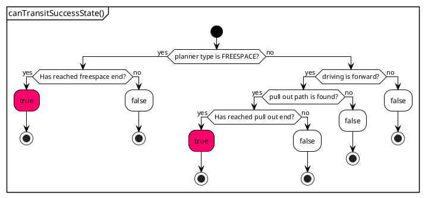
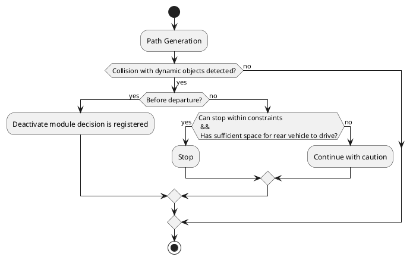
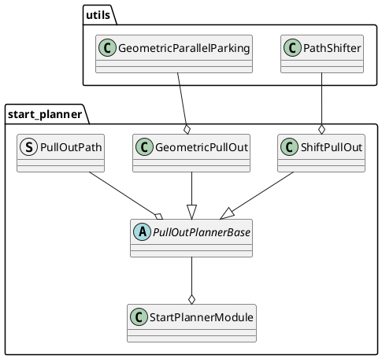

# Start Planner design

## Purpose / Role

This module generates and plans a path for safely merging from the shoulder lane or side of road lane into the center of the road lane.

Specifically, it includes the following features:

- Plan the path to automatically start from the shoulder lane or side of road lane to center of road lane.
- When parked vehicles are present on the shoulder lane, the module generates a path that allows for starting with a gap of a specified margin.
- If a collision with other traffic participants is detected while traveling on the generated path, it will stop as much as possible.

<figure markdown>
  {width=1100}
</figure>

## Use Cases

Give an typical example of how path generation is executed. Showing example of path generation starts from shoulder lane, but also from side of road lane can be generated.

<figure markdown>
  {width=1100}
</figure>

### **Use Case 1: Shift pull out**

In the shoulder lane, when there are no parked vehicles ahead and the shoulder lane is sufficiently long, a forward shift pull out path (a clothoid curve with consistent jerk) is generated.

<figure markdown>
  {width=1100}
</figure>

### **Use Case 2: Geometric pull out**

In the shoulder lane, when there are objects in front and the lane is not sufficiently long behind, a geometric pull out path is generated.

<figure markdown>
  {width=1100}
</figure>

### **Use Case 3: Backward and shift pull out**

In the shoulder lane, when there are parked vehicles ahead and the lane is sufficiently long behind, a path that involves reversing before generating a forward shift pull out path is created.

<figure markdown>
  {width=1100}
</figure>

### **Use Case 4: Backward and geometric pull out**

In the shoulder lane, when there is an object ahead and not enough space to reverse sufficiently, a path that involves reversing before making an geometric pull out is generated.

<figure markdown>
  {width=1100}
</figure>

### **Use Case 5: Freespace pull out**

If the map is annotated with the information that a free space path can be generated in situations where both shift and geometric pull out paths are impossible to create, a path based on the free space algorithm will be generated.

<figure markdown>
  {width=1100}
</figure>

**As a note, the patterns for generating these paths are based on default parameters, but as will be explained in the following sections, it is possible to control aspects such as making paths that involve reversing more likely to be generated, or making geometric paths more likely to be generated, by changing the path generation policy or adjusting the margin around static objects.**

## Limitations

Here are some notable limitations:

- If parked vehicles exist in front of, behind, or on both sides of the shoulder, and it's not possible to maintain a specified distance from them, a stopping path will be generated, leading to a potential deadlock.
- In the default settings of the behavior_path_planner, an avoidance module operates in a later stage and attempts to avoid objects. However, it is not guaranteed that the start_planner module will output a path that can successfully navigate around obstacles. This means that if an unavoidable path is generated, it could result in a deadlock.
- The performance of safety check relies on the accuracy of the predicted paths generated by the map_based_prediction node. It's important to note that, currently, predicted paths that consider acceleration are not generated, and paths for low-speed objects may not be accurately produced, which requires caution.
- Given the current specifications of the rule-based algorithms, there is a trade-off between the safety of a path and its naturalness to humans. While it's possible to adjust parameters to manage this trade-off, improvements are necessary to better reconcile these aspects.

## Start/End Conditions

### **Start Conditions**

The `StartPlannerModule` is designed to initiate its execution based on specific criteria evaluated by the `isExecutionRequested` function. The module will **not** start under the following conditions:

1. **Start pose on the middle of the road**: The module will not initiate if the start pose of the vehicle is determined to be in the middle of the road. This ensures the planner starts from a roadside position.

2. **Vehicle is far from start position**: If the vehicle is far from the start position, the module will not execute. This prevents redundant execution when the new goal is given.

3. **Vehicle reached goal**: The module will not start if the vehicle has already reached its goal position, avoiding unnecessary execution when the destination is attained.

4. **Vehicle in motion**: If the vehicle is still moving, the module will defer starting. This ensures that planning occurs from a stable, stationary state for safety.

5. **Goal behind in same route segment**: The module will not initiate if the goal position is behind the ego vehicle within the same route segment. This condition is checked to avoid complications with planning routes that require the vehicle to move backward on its current path, which is currently not supported.

### **End Conditions**

The `StartPlannerModule` terminates when specific conditions are met, depending on the type of planner being used. The `canTransitSuccessState` function determines whether the module should transition to the success state based on the following criteria:

#### When the Freespace Planner is active

- If the end point of the freespace path is reached, the module transitions to the success state.

#### When any other type of planner is active

The transition to the success state is determined by the following conditions:

- If a reverse path is being generated or the search for a pull out path fails:
  - The module does not transition to the success state.
- If the end point of the pull out path's shift section is reached:
  - The module transitions to the success state.

The flowchart below illustrates the decision-making process in the `canTransitSuccessState` function:

## Concept of safety assurance

The approach to collision safety is divided into two main components: generating paths that consider static information, and detecting collisions with dynamic obstacles to ensure the safety of the generated paths.

### 1. Generating path with static information

- **Path deviation checks**: This ensures that the path remains within the designated lanelets. By default, this feature is active, but it can be deactivated if necessary.

- **Static obstacle clearance from the path**: This involves verifying that a sufficient margin around static obstacles is maintained. The process includes creating a vehicle-sized footprint from the current position to the pull-out endpoint, which can be adjusted via parameters. The distance to static obstacle polygons is then calculated. If this distance is below a specified threshold, the path is deemed unsafe. Threshold levels (e.g., [2.0, 1.0, 0.5, 0.1]) can be configured, and the system searches for paths that meet the highest possible threshold based on a set search priority explained in following section, ensuring the selection of the safe path based on the policy. If no path meets the minimum threshold, it's determined that no safe path is available.

- **Clearance from stationary objects**: Maintaining an adequate distance from stationary objects positioned in front of and behind the vehicle is imperative for safety. Despite the path and stationary objects having a confirmed margin, the path is deemed unsafe if the distance from the shift start position to a front stationary object falls below `collision_check_margin_from_front_object` meters, or if the distance to a rear stationary object is shorter than `back_objects_collision_check_margin` meters.

  - Why is a margin from the front object necessary?
    Consider a scenario in a "geometric pull out path" where the clearance from the path to a static obstacle is minimal, and there is a stopped vehicle ahead. In this case, although the path may meet safety standards and thus be generated, a concurrently operating avoidance module might deem it impossible to avoid the obstacle, potentially leading to vehicle deadlock. To ensure there is enough distance for avoidance maneuvers, the distance to the front obstacle is assessed. Increasing this parameter can prevent immobilization within the avoidance module but may also lead to the frequent generation of backward paths or geometric pull out path, resulting in paths that may seem unnatural to humans.

  - Why is a margin from the rear object necessary?
    For objects ahead, another behavior module can intervene, allowing the path to overwrite itself through an avoidance plan, even if the clearance from the path to a static obstacle is minimal, thus maintaining a safe distance from static obstacles. However, for objects behind the vehicle, it is impossible for other behavior modules other than the start_planner to alter the path to secure a margin, potentially leading to a deadlock by an action module like "obstacle_cruise_planner" and subsequent immobilization. Therefore, a margin is set for stationary objects at the rear.

Here's the expression of the steps start pose searching steps, considering the `collision_check_margins` is set at [2.0, 1.0, 0.5, 0.1] as example. The process is as follows:

1. **Generating start pose candidates**

   - Set the current position of the vehicle as the base point.
   - Determine the area of consideration behind the vehicle up to the `max_back_distance`.
   - Generate candidate points for the start pose in the backward direction at intervals defined by `backward_search_resolution`.
   - Include the current position as one of the start pose candidates.

   {width=1100}

2. **Starting search at maximum margin**

   - Begin the search with the largest threshold (e.g., 2.0 meters).
   - Evaluate each start pose candidate to see if it maintains a margin of more than 2.0 meters.
   - Simultaneously, verify that the path generated from that start pose meets other necessary criteria (e.g., path deviation check).
   - Following the search priority described later, evaluate each in turn and adopt the start pose if it meets the conditions.

3. **Repeating search according to threshold levels**

   - If no start pose meeting the conditions is found, lower the threshold to the next level (e.g., 1.0 meter) and repeat the search.

4. **Continuing the search**

   - Continue the search until a start pose that meets the conditions is found, or the threshold level reaches the minimum value (e.g., 0.1 meter).
   - The aim of this process is to find a start pose that not only secures as large a margin as possible but also satisfies the conditions required for the path.

5. **Generating a stop path**
   - If no start pose satisfies the conditions at any threshold level, generate a stop path to ensure safety.

#### **search priority**

If a safe path with sufficient clearance for static obstacles cannot be generated forward, a backward search from the vehicle's current position is conducted to locate a suitable start point for a pull out path generation.

During this backward search, different policies can be applied based on `search_priority` parameters:

Selecting `efficient_path` focuses on creating a shift pull out path, regardless of how far back the vehicle needs to move.
Opting for `short_back_distance` aims to find a location with the least possible backward movement.

`PriorityOrder` is defined as a vector of pairs, where each element consists of a `size_t` index representing a start pose candidate index, and the planner type. The PriorityOrder vector is processed sequentially from the beginning, meaning that the pairs listed at the top of the vector are given priority in the selection process for pull out path generation.

##### `efficient_path`

When `search_priority` is set to `efficient_path` and the preference is for prioritizing `shift_pull_out`, the `PriorityOrder` array is populated in such a way that `shift_pull_out` is grouped together for all start pose candidates before moving on to the next planner type. This prioritization is reflected in the order of the array, with `shift_pull_out` being listed before geometric_pull_out.

| Index | Planner Type       |
| ----- | ------------------ |
| 0     | shift_pull_out     |
| 1     | shift_pull_out     |
| ...   | ...                |
| N     | shift_pull_out     |
| 0     | geometric_pull_out |
| 1     | geometric_pull_out |
| ...   | ...                |
| N     | geometric_pull_out |

This approach prioritizes trying all candidates with `shift_pull_out` before proceeding to `geometric_pull_out`, which may be efficient in situations where `shift_pull_out` is likely to be appropriate.

##### `short_back_distance`

For `search_priority` set to `short_back_distance`, the array alternates between planner types for each start pose candidate, which can minimize the distance the vehicle needs to move backward if the earlier candidates are successful.

| Index | Planner Type       |
| ----- | ------------------ |
| 0     | shift_pull_out     |
| 0     | geometric_pull_out |
| 1     | shift_pull_out     |
| 1     | geometric_pull_out |
| ...   | ...                |
| N     | shift_pull_out     |
| N     | geometric_pull_out |

This ordering is beneficial when the priority is to minimize the backward distance traveled, giving an equal chance for each planner to succeed at the closest possible starting position.

### 2. Collision detection with dynamic obstacles

- **Applying RSS in Dynamic Collision Detection**: Collision detection is based on the RSS (Responsibility-Sensitive Safety) model to evaluate if a safe distance is maintained. See [safety check feature explanation](../autoware_behavior_path_planner_common/docs/behavior_path_planner_safety_check.md)

- **Collision check performed range**: Safety checks for collisions with dynamic objects are conducted within the defined boundaries between the start and end points of each maneuver, ensuring the ego vehicle does not impede or hinder the progress of dynamic objects that come from behind it.

- **Collision response policy**: Should a collision with dynamic objects be detected along the generated path, deactivate module decision is registered if collision detection occurs before departure. If the vehicle has already commenced movement, an attempt to stop will be made, provided it's feasible within the braking constraints and that the rear vehicle can pass through the gap between the ego vehicle and the lane border.

#### **example of safety check performed range for shift pull out**

Give an example of safety verification range for shift pull out. The safety check is performed from the start of the shift to the end of the shift. And if the vehicle footprint does not leave enough space for a rear vehicle to drive through, the safety check against dynamic objects is disabled.

<figure markdown>
  {width=1100}
</figure>

**As a note, no safety check is performed during backward movements. Safety verification commences at the point where the backward motion ceases.**

## RTC interface

The system operates distinctly under manual and auto mode, especially concerning the before the departure and interaction with dynamic obstacles. Below are the specific behaviors for each mode:

### When approval is required?

#### Forward driving

- **Start approval required**: Even if a path is generated, approval is required to initiate movement. If a dynamic object poses a risk, such as an approaching vehicle from behind, candidate paths may be displayed, but approval is necessary for departure.

#### Backward driving + forward driving

- **Multiple approvals required**: When the planned path includes a backward driving, multiple approvals are needed before starting the reverse and again before restarting forward movement. Before initiating forward movement, the system conducts safety checks against dynamic obstacles. If a detection is detected, approval for departure is necessary.

This differentiation ensures that the vehicle operates safely by requiring human intervention in manual mode(`enable_rtc` is true) at critical junctures and incorporating automatic safety checks in both modes to prevent unsafe operations in the presence of dynamic obstacles.

## Design

## General parameters for start_planner

| Name                                                       | Unit  | Type   | Description                                                                                                                                                                           | Default value        |
| :--------------------------------------------------------- | :---- | :----- | :------------------------------------------------------------------------------------------------------------------------------------------------------------------------------------ | :------------------- |
| th_arrived_distance                                        | [m]   | double | distance threshold for arrival of path termination                                                                                                                                    | 1.0                  |
| th_stopped_velocity                                        | [m/s] | double | velocity threshold for arrival of path termination                                                                                                                                    | 0.01                 |
| th_stopped_time                                            | [s]   | double | time threshold for arrival of path termination                                                                                                                                        | 1.0                  |
| th_distance_to_middle_of_the_road                          | [m]   | double | distance threshold to determine if the vehicle is on the middle of the road                                                                                                           | 0.1                  |
| collision_check_margins                                    | [m]   | double | Obstacle collision check margins list                                                                                                                                                 | [2.0, 1.0, 0.5, 0.1] |
| shift_collision_check_distance_from_end                    | [m]   | double | collision check distance from end shift end pose                                                                                                                                      | -10.0                |
| geometric_collision_check_distance_from_end                | [m]   | double | collision check distance from end geometric end pose                                                                                                                                  | 0.0                  |
| collision_check_margin_from_front_object                   | [m]   | double | collision check margin from front object                                                                                                                                              | 5.0                  |
| skip_rear_vehicle_check                                    | -     | bool   | flag to skip rear vehicle check (rear vehicle check is performed to skip safety check and proceed with departure when the ego vehicle is obstructing the progress of a rear vehicle)  | false                |
| extra_width_margin_for_rear_obstacle                       | [m]   | double | extra width that is added to the perceived rear obstacle's width when deciding if the rear obstacle can overtake the ego vehicle while it is merging to a lane from the shoulder lane | 0.5                  |
| object_types_to_check_for_path_generation.check_car        | -     | bool   | flag to check car for path generation                                                                                                                                                 | true                 |
| object_types_to_check_for_path_generation.check_truck      | -     | bool   | flag to check truck for path generation                                                                                                                                               | true                 |
| object_types_to_check_for_path_generation.check_bus        | -     | bool   | flag to check bus for path generation                                                                                                                                                 | true                 |
| object_types_to_check_for_path_generation.check_bicycle    | -     | bool   | flag to check bicycle for path generation                                                                                                                                             | true                 |
| object_types_to_check_for_path_generation.check_motorcycle | -     | bool   | flag to check motorcycle for path generation                                                                                                                                          | true                 |
| object_types_to_check_for_path_generation.check_pedestrian | -     | bool   | flag to check pedestrian for path generation                                                                                                                                          | true                 |
| object_types_to_check_for_path_generation.check_unknown    | -     | bool   | flag to check unknown for path generation                                                                                                                                             | true                 |
| center_line_path_interval                                  | [m]   | double | reference center line path point interval                                                                                                                                             | 1.0                  |

### **Ego vehicle's velocity planning**

WIP

### **Safety check in free space area**

WIP

## Parameters for safety check

### Stop Condition Parameters

Parameters under `stop_condition` define the criteria for stopping conditions.

| Name                          | Unit    | Type   | Description                             | Default value |
| :---------------------------- | :------ | :----- | :-------------------------------------- | :------------ |
| maximum_deceleration_for_stop | [m/s^2] | double | Maximum deceleration allowed for a stop | 1.0           |
| maximum_jerk_for_stop         | [m/s^3] | double | Maximum jerk allowed for a stop         | 1.0           |

### Ego Predicted Path Parameters

Parameters under `path_safety_check.ego_predicted_path` specify the ego vehicle's predicted path characteristics.

| Name                          | Unit    | Type   | Description                                          | Default value |
| :---------------------------- | :------ | :----- | :--------------------------------------------------- | :------------ |
| min_velocity                  | [m/s]   | double | Minimum velocity of the ego vehicle's predicted path | 0.0           |
| acceleration                  | [m/s^2] | double | Acceleration for the ego vehicle's predicted path    | 1.0           |
| max_velocity                  | [m/s]   | double | Maximum velocity of the ego vehicle's predicted path | 1.0           |
| time_horizon_for_front_object | [s]     | double | Time horizon for predicting front objects            | 10.0          |
| time_horizon_for_rear_object  | [s]     | double | Time horizon for predicting rear objects             | 10.0          |
| time_resolution               | [s]     | double | Time resolution for the ego vehicle's predicted path | 0.5           |
| delay_until_departure         | [s]     | double | Delay until the ego vehicle departs                  | 1.0           |

### Target Object Filtering Parameters

Parameters under `target_filtering` are related to filtering target objects for safety check.

| Name                                            | Unit  | Type   | Description                                                        | Default value |
| :---------------------------------------------- | :---- | :----- | :----------------------------------------------------------------- | :------------ |
| safety_check_time_horizon                       | [s]   | double | Time horizon for predicted paths of the ego and dynamic objects    | 5.0           |
| safety_check_time_resolution                    | [s]   | double | Time resolution for predicted paths of the ego and dynamic objects | 1.0           |
| object_check_forward_distance                   | [m]   | double | Forward distance for object detection                              | 10.0          |
| object_check_backward_distance                  | [m]   | double | Backward distance for object detection                             | 100.0         |
| ignore_object_velocity_threshold                | [m/s] | double | Velocity threshold below which objects are ignored                 | 1.0           |
| object_types_to_check.check_car                 | -     | bool   | Flag to check cars                                                 | true          |
| object_types_to_check.check_truck               | -     | bool   | Flag to check trucks                                               | true          |
| object_types_to_check.check_bus                 | -     | bool   | Flag to check buses                                                | true          |
| object_types_to_check.check_trailer             | -     | bool   | Flag to check trailers                                             | true          |
| object_types_to_check.check_bicycle             | -     | bool   | Flag to check bicycles                                             | true          |
| object_types_to_check.check_motorcycle          | -     | bool   | Flag to check motorcycles                                          | true          |
| object_types_to_check.check_pedestrian          | -     | bool   | Flag to check pedestrians                                          | true          |
| object_types_to_check.check_unknown             | -     | bool   | Flag to check unknown object types                                 | false         |
| object_lane_configuration.check_current_lane    | -     | bool   | Flag to check the current lane                                     | true          |
| object_lane_configuration.check_right_side_lane | -     | bool   | Flag to check the right side lane                                  | true          |
| object_lane_configuration.check_left_side_lane  | -     | bool   | Flag to check the left side lane                                   | true          |
| object_lane_configuration.check_shoulder_lane   | -     | bool   | Flag to check the shoulder lane                                    | true          |
| object_lane_configuration.check_other_lane      | -     | bool   | Flag to check other lanes                                          | false         |
| include_opposite_lane                           | -     | bool   | Flag to include the opposite lane in check                         | false         |
| invert_opposite_lane                            | -     | bool   | Flag to invert the opposite lane check                             | false         |
| check_all_predicted_path                        | -     | bool   | Flag to check all predicted paths                                  | true          |
| use_all_predicted_path                          | -     | bool   | Flag to use all predicted paths                                    | true          |
| use_predicted_path_outside_lanelet              | -     | bool   | Flag to use predicted paths outside of lanelets                    | false         |

### Safety Check Parameters

Parameters under `safety_check_params` define the configuration for safety check.

| Name                                           | Unit | Type   | Description                                                                               | Default value |
| :--------------------------------------------- | :--- | :----- | :---------------------------------------------------------------------------------------- | :------------ |
| enable_safety_check                            | -    | bool   | Flag to enable safety check                                                               | true          |
| check_all_predicted_path                       | -    | bool   | Flag to check all predicted paths                                                         | true          |
| publish_debug_marker                           | -    | bool   | Flag to publish debug markers                                                             | false         |
| rss_params.rear_vehicle_reaction_time          | [s]  | double | Reaction time for rear vehicles                                                           | 2.0           |
| rss_params.rear_vehicle_safety_time_margin     | [s]  | double | Safety time margin for rear vehicles                                                      | 1.0           |
| rss_params.lateral_distance_max_threshold      | [m]  | double | Maximum lateral distance threshold                                                        | 2.0           |
| rss_params.longitudinal_distance_min_threshold | [m]  | double | Minimum longitudinal distance threshold                                                   | 3.0           |
| rss_params.longitudinal_velocity_delta_time    | [s]  | double | Delta time for longitudinal velocity                                                      | 0.8           |
| hysteresis_factor_expand_rate                  | -    | double | Rate to expand/shrink the hysteresis factor                                               | 1.0           |
| collision_check_yaw_diff_threshold             | -    | double | Maximum yaw difference between ego and object when executing rss-based collision checking | 1.578         |

## **Path Generation**

There are two path generation methods.

### **shift pull out**

This is the most basic method of starting path planning and is used on road lanes and shoulder lanes when there is no particular obstruction.

Pull out distance is calculated by the speed, lateral deviation, and the lateral jerk. The lateral jerk is searched for among the predetermined minimum and maximum values, and the one that generates a safe path is selected.

- Generate the road lane centerline and shift it to the current position.
- In the section between merge start and end, path is shifted by a method that is used to generate avoidance path (four segmental constant jerk polynomials)
- Combine this path with center line of road lane

[shift pull out video](https://user-images.githubusercontent.com/39142679/187872468-6d5057ee-e039-499b-afc7-fe0dc8052a6b.mp4)

#### parameters for shift pull out

| Name                                           | Unit   | Type   | Description                                                                                                                                                                                                                                                                                                                                                                                                                                                                                              | Default value |
| :--------------------------------------------- | :----- | :----- | :------------------------------------------------------------------------------------------------------------------------------------------------------------------------------------------------------------------------------------------------------------------------------------------------------------------------------------------------------------------------------------------------------------------------------------------------------------------------------------------------------- | :------------ |
| enable_shift_pull_out                          | [-]    | bool   | flag whether to enable shift pull out                                                                                                                                                                                                                                                                                                                                                                                                                                                                    | true          |
| check_shift_path_lane_departure                | [-]    | bool   | flag whether to check if shift path footprints are out of lane                                                                                                                                                                                                                                                                                                                                                                                                                                           | true          |
| allow_check_shift_path_lane_departure_override | [-]    | bool   | flag to override/cancel lane departure check if the ego vehicle's starting pose is already out of lane                                                                                                                                                                                                                                                                                                                                                                                                   | false         |
| shift_pull_out_velocity                        | [m/s]  | double | velocity of shift pull out                                                                                                                                                                                                                                                                                                                                                                                                                                                                               | 2.0           |
| pull_out_sampling_num                          | [-]    | int    | Number of samplings in the minimum to maximum range of lateral_jerk                                                                                                                                                                                                                                                                                                                                                                                                                                      | 4             |
| maximum_lateral_jerk                           | [m/s3] | double | maximum lateral jerk                                                                                                                                                                                                                                                                                                                                                                                                                                                                                     | 2.0           |
| minimum_lateral_jerk                           | [m/s3] | double | minimum lateral jerk                                                                                                                                                                                                                                                                                                                                                                                                                                                                                     | 0.1           |
| minimum_shift_pull_out_distance                | [m]    | double | minimum shift pull out distance. if calculated pull out distance is shorter than this, use this for path generation.                                                                                                                                                                                                                                                                                                                                                                                     | 0.0           |
| maximum_curvature                              | [1/m]  | double | maximum curvature. Calculate the required pull out distance from this maximum curvature, assuming the reference path is considered a straight line and shifted by two approximate arcs. This does not compensate for curvature in a shifted path or curve.                                                                                                                                                                                                                                               | 0.07          |
| end_pose_curvature_threshold                   | [1/m]  | double | The curvature threshold which is used for calculating the shift pull out distance. The shift end pose is shifted forward so that curvature on shift end pose is less than this value. This is to prevent the generated path from having a large curvature when the end pose is on a curve. If a shift end pose with a curvature below the threshold is not found, the shift pull out distance is used as the distance to the point with the lowest curvature among the points beyond a certain distance. | 0.01          |

### **geometric pull out**

Generate two arc paths with discontinuous curvature. Ego-vehicle stops once in the middle of the path to control the steer on the spot.
See also [[1]](https://www.sciencedirect.com/science/article/pii/S1474667015347431) for details of the algorithm.

[geometric pull out video](https://user-images.githubusercontent.com/39142679/181024707-3e7ca5ee-62de-4334-b9e9-ded313de1ea1.mp4)

#### parameters for geometric pull out

| Name                                  | Unit  | Type   | Description                                                                                                                                               | Default value |
| :------------------------------------ | :---- | :----- | :-------------------------------------------------------------------------------------------------------------------------------------------------------- | :------------ |
| enable_geometric_pull_out             | [-]   | bool   | flag whether to enable geometric pull out                                                                                                                 | true          |
| divide_pull_out_path                  | [-]   | bool   | flag whether to divide arc paths. The path is assumed to be divided because the curvature is not continuous. But it requires a stop during the departure. | false         |
| geometric_pull_out_velocity           | [m/s] | double | velocity of geometric pull out                                                                                                                            | 1.0           |
| lane_departure_margin                 | [m]   | double | margin of deviation to lane right                                                                                                                         | 0.2           |
| lane_departure_check_expansion_margin | [m]   | double | margin to expand the ego vehicle footprint when doing lane departure checks                                                                               | 0.0           |
| pull_out_max_steer_angle              | [rad] | double | maximum steer angle for path generation                                                                                                                   | 0.26          |

## **backward pull out start point search**

If a safe path cannot be generated from the current position, search backwards for a pull out start point at regular intervals(default: `2.0`).

[pull out after backward driving video](https://user-images.githubusercontent.com/39142679/181025149-8fb9fb51-9b8f-45c4-af75-27572f4fba78.mp4)

### **parameters for backward pull out start point search**

| Name                          | Unit | Type   | Description                                                                                                                                                          | Default value  |
| :---------------------------- | :--- | :----- | :------------------------------------------------------------------------------------------------------------------------------------------------------------------- | :------------- |
| enable_back                   | [-]  | bool   | flag whether to search backward for start_point                                                                                                                      | true           |
| search_priority               | [-]  | string | In the case of `efficient_path`, use efficient paths even if the back distance is longer. In case of `short_back_distance`, use a path with as short a back distance | efficient_path |
| max_back_distance             | [m]  | double | maximum back distance                                                                                                                                                | 30.0           |
| backward_search_resolution    | [m]  | double | distance interval for searching backward pull out start point                                                                                                        | 2.0            |
| backward_path_update_duration | [s]  | double | time interval for searching backward pull out start point. this prevents chattering between back driving and pull_out                                                | 3.0            |
| ignore_distance_from_lane_end | [m]  | double | If distance from shift start pose to end of shoulder lane is less than this value, this start pose candidate is ignored                                              | 15.0           |

### **freespace pull out**

If the vehicle gets stuck with pull out along lanes, execute freespace pull out.
To run this feature, you need to set `parking_lot` to the map, `activate_by_scenario` of [costmap_generator](../autoware_costmap_generator/README.md) to `false` and `enable_freespace_planner` to `true`

#### Unimplemented parts / limitations for freespace pull out

- When a short path is generated, the ego does can not drive with it.
- Complex cases take longer to generate or fail.
- The drivable area is not guaranteed to fit in the parking_lot.

#### Parameters freespace parking

| Name                           | Unit | Type   | Description                                                                                                                              | Default value |
| :----------------------------- | :--- | :----- | :--------------------------------------------------------------------------------------------------------------------------------------- | :------------ |
| enable_freespace_planner       | [-]  | bool   | this flag activates a free space pullout that is executed when a vehicle is stuck due to obstacles in the lanes where the ego is located | true          |
| end_pose_search_start_distance | [m]  | double | distance from ego to the start point of the search for the end point in the freespace_pull_out driving lane                              | 20.0          |
| end_pose_search_end_distance   | [m]  | double | distance from ego to the end point of the search for the end point in the freespace_pull_out driving lane                                | 30.0          |
| end_pose_search_interval       | [m]  | bool   | interval to search for the end point in the freespace_pull_out driving lane                                                              | 2.0           |

See [freespace_planner](../autoware_freespace_planner/README.md) for other parameters.
