# Avoidance module for static objects


## Purpose / Role

This is a rule-based avoidance module, which is running based on perception output data, HDMap, current path and route. This module is designed for creating avoidance path for static (=stopped) objects in simple situation. On the other hand, this module doesn't support dynamic (=moving) objects for now.

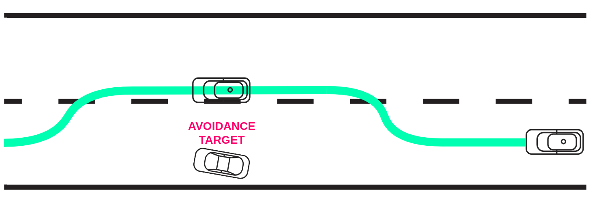

This module has [RTC interface](../../autoware_rtc_interface/README.md), and user can select operation mode from MANUAL/AUTO depending on the vehicle sensor performance. If user selects MANUAL mode, this module outputs avoidance path as candidate and waits operator approval. In the case where the sensor/perception performance is not enough and false positive maybe occurs, we recommend to use this module with MANUAL mode in order to prevent unnecessary avoidance maneuver.

On the other hand, if user selects AUTO mode, this module modifies current following path without operator approval. If the sensor/perception performance is good enough, user can use this module with AUTO mode.

### Limitations

This module allows developers to design vehicle behavior in avoidance planning using specific rules. Due to the property of rule-based planning, the algorithm can not compensate for not colliding with obstacles in complex cases. This is a trade-off between "be intuitive and easy to design" and "be hard to tune but can handle many cases". This module adopts the former policy and therefore this output should be checked more strictly in the later stage. In the .iv reference implementation, there is another avoidance module in motion planning module that uses optimization to handle the avoidance in complex cases. (Note that, the motion planner needs to be adjusted so that the behavior result will not be changed much in the simple case and this is a typical challenge for the behavior-motion hierarchical architecture.)

### Why is avoidance in behavior module?

This module executes avoidance over lanes, and the decision requires the lane structure information to take care of traffic rules (e.g. it needs to send an indicator signal when the vehicle crosses a lane). The difference between motion and behavior module in the planning stack is whether the planner takes traffic rules into account, which is why this avoidance module exists in the behavior module.

## Inner-workings / Algorithms

This module mainly has two parts, target filtering part and path generation part. At first, all objects are filtered by several conditions. In this step, this module checks avoidance feasibility and necessity as well. After that, this module generates avoidance path outline, whom we call **shift line**, based on filtered objects. The shift lines are set into [path shifter](../autoware_behavior_path_planner_common/docs/behavior_path_planner_path_generation_design.md), which is a library for path generation, to create smooth shift path. Additionally, this module has feature to check non-target objects so that the ego can avoid target object safely. This feature receives generated avoidance path and surround objects and judges current situation. Lastly, this module update current ego behavior.


```plantuml
@startuml
skinparam monochrome true

title Overall flowchart
start

partition updateData() {
partition fillFundamentalData() {
:update fundamental data;
note right
 - reference pose
 - reference path:
      generated by spline interpolation of centerline path
      with dense interval
 - current lanelets
 - drivable bounds
 - avoidance start point
      calculate the point where the ego should start avoidance maneuver
      depending on traffic siganl.
 - avoidance return point
      calculate the point where the ego should return original lane
      depending on traffic siganl and goal position.
end note

:fillAvoidanceTargetObjects();
note right
  This module checks following conditions:
  - target object type
  - being stopped
  - being around the ego-driving lane
  - being on the edge of the lane
  - ...
end note

:updateRegisteredObject();

:compensateDetectionLost();
}

partition fillShiftLine() {
:generate shift line;

:create candidate path;

:check candidate path;
note right
  This module checks following conditions:
  - is there enough distance between surround moving vehicle and ego path to avoid target safely?
  - is the path jerky?
  - is the path within drivable area?
end note
}

partition fillEgoStatus() {
:getCurrentModuleState();
note right
  This module has following status:
  - RUNNING: target object is still remaining. Or, the ego hasn't returned original lane.
  - CANCEL: target object has gone. And, the ego hasn't initiated avoidance maneuver.
  - SUCCEEDED: the ego finishes avoiding all objects and returns original lane.
end note

if (canYieldManeuver()) then (yes)
if (Is the avoidance path safe?) then (yes)
else (no)
:transit yield maneuver;
note right
  Check current situation.
  This module can transit yield maneuver only when the ego hasn't initiated avoidance maneuver.
end note
endif

else (no)

endif
}
}
stop

start
partition isExecutionRequested() {
if (Is there object that should/can be avoid immediately?) then (yes)
:return true;
stop
else (no)
endif

if (Does it generate new shift lines successfully?) then (yes)
else (no)
:return false;
stop
endif

if (Is there object that is potentially avoidable?) then (yes)
:return true;
note right
  Sometimes, we meet the situation where there is enough space to avoid
  but ego speed is to high to avoid target object under lateral jerk constraints.
  This module keeps running in this case in order to decelerate ego speed.
end note
stop
else (no)
:return false;
endif
}
stop

start
partition plan() {
partition updatePathShifter() {
if (Is approved?) then (yes)
:add new shift lines to path shifter;
else (\n yes)
endif
}

if (Is current status SUCCEEDED?) then (yes)
:removeRegisteredShiftLines();
:output previous module output;
stop
else (no)
endif

if (Is current status CANCEL?) then (yes)
:removeRegisteredShiftLines();
:output previous module output;
stop
else (no)
endif

if (Is in YIELD maneuver?) then (yes)
:removeRegisteredShiftLines();
else (no)
endif

:generate avoidance path;

:calculate turn signal;

partition updateEgoBehavior() {
:insertPrepareVelocity();
note right
  This module inserts slow down section so that the ego can avoid target object under lateral jerk constraints.
end note
:insertAvoidanceVelocity();
note right
  This module controls ego acceleration until the ego passes the side of the target object.
end note

if (Is in YIELD maneuver?) then (yes)
:insertWaitPoint();
note right
  This module inserts stop point.
  The ego keeps stopping until this module judges the ego can avoid target object safely.
end note
else (no)
endif

if (Is waiting operator approval?) then (yes)
:insertWaitPoint();
note right
  This module inserts stop point.
  The ego keeps stopping until operator approves avoidance maneuver.
end note
else (no)
endif

:insertReturnDeadLine();
}

:generate drivable area;
}
stop

@enduml
```

## Target object filtering

### Overview

The module uses following conditions to filter avoidance target objects.

| Check condition                                                                              | Target class             | Details                                                                                                                                                                        | If conditions are not met       |
| -------------------------------------------------------------------------------------------- | ------------------------ | ------------------------------------------------------------------------------------------------------------------------------------------------------------------------------ | ------------------------------- |
| Is an avoidance target class object?                                                         | All                      | Use can select avoidance target class from config file.                                                                                                                        | Never avoid it.                 |
| Is a stopped object?                                                                         | All                      | Objects keep higher speed than `th_moving_speed` for longer period of time than `th_moving_time` is judged as moving.                                                          | Never avoid it.                 |
| Is within detection area?                                                                    | All                      | The module creates detection area to filter target objects roughly based on lateral margin in config file. (see [here](#width-of-detection-area))                              | Never avoid it.                 |
| Isn't there enough lateral distance between the object and path?                             | All                      | -                                                                                                                                                                              | Never avoid it.                 |
| Is near the centerline of ego lane?                                                          | All                      | -                                                                                                                                                                              | It depends on other conditions. |
| Is there a crosswalk near the object?                                                        | Pedestrian, Bicycle      | The module don't avoid the Pedestrian and Bicycle nearer the crosswalk because the ego should stop in front of it if they're crossing road. (see [here](#for-crosswalk-users)) | Never avoid it.                 |
| Is the distance between the object and traffic light along the path longer than threshold?   | Car, Truck, Bus, Trailer | The module used this condition if there is ambiguity as to whether the vehicle is a parked vehicle or not.                                                                     | It depends on other conditions. |
| Is the distance between the object and crosswalk light along the path longer than threshold? | Car, Truck, Bus, Trailer | Same as above.                                                                                                                                                                 | It depends on other conditions. |
| Is the stopping time longer than threshold?                                                  | Car, Truck, Bus, Trailer | Same as above.                                                                                                                                                                 | It depends on other conditions. |
| Is within intersection?                                                                      | Car, Truck, Bus, Trailer | The module assumes that there isn't any parked vehicle within intersection.                                                                                                    | It depends on other conditions. |
| Is on ego lane?                                                                              | Car, Truck, Bus, Trailer | -                                                                                                                                                                              | It depends on other conditions. |
| Is a parked vehicle?                                                                         | Car, Truck, Bus, Trailer | The module judges whether the vehicle is a parked vehicle based on its lateral offset. (see [here](#judge-if-its-a-parked-vehicle))                                            | It depends on other conditions. |
| Is merging to ego lane from other lane?                                                      | Car, Truck, Bus, Trailer | The module judges the vehicle behavior based on its yaw angle and offset direction. (see [here](#judge-vehicle-behavior))                                                      | It depends on other conditions. |
| Is merging to other lane from ego lane?                                                      | Car, Truck, Bus, Trailer | Same as above.                                                                                                                                                                 | It depends on other conditions. |

### Common conditions

#### Detection area

The module generates detection area for target filtering based on following params:

```yaml
      # avoidance is performed for the object type with true
      target_object:
      ...
          lateral_margin:
            soft_margin: 0.3                            # [m]
            hard_margin: 0.2                            # [m]
            hard_margin_for_parked_vehicle: 0.7         # [m]
      ...
      # For target object filtering
      target_filtering:
      ...
        # detection area generation parameters
        detection_area:
          static: false                                 # [-]
          min_forward_distance: 50.0                    # [m]
          max_forward_distance: 150.0                   # [m]
          backward_distance: 10.0                       # [m]
```

##### Width of detection area

1. get the largest lateral margin of all classes (Car, Truck, ...). The margin is sum of `soft_margin` and `hard_margin_for_parked_vehicle`.
2. the detection area width is sum of ego vehicle width and the largest lateral margin.

##### Longitudinal distance of detection area

If the parameter `detection_area.static` is set to `true`, the module creates detection area whose longitudinal distance is `max_forward_distance`.

If the parameter `detection_area.static` is set to `false`, the module creates detection area so that the ego can avoid objects with minimum lateral jerk value. Thus, the longitudinal distance is depends on lateral maximum shift length, lateral jerk constraints and current ego speed. Additionally, it has to consider distance used for prepare phase.

```c++
...
    const auto max_shift_length = std::max(
      std::abs(parameters_->max_right_shift_length), std::abs(parameters_->max_left_shift_length));
    const auto dynamic_distance =
      PathShifter::calcLongitudinalDistFromJerk(max_shift_length, getLateralMinJerkLimit(), speed);

    return std::clamp(
      1.5 * dynamic_distance + getNominalPrepareDistance(),
      parameters_->object_check_min_forward_distance,
      parameters_->object_check_max_forward_distance);
```

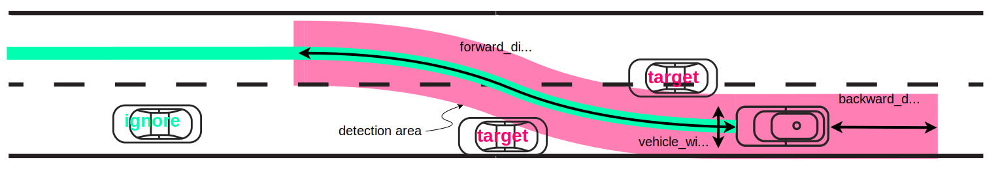

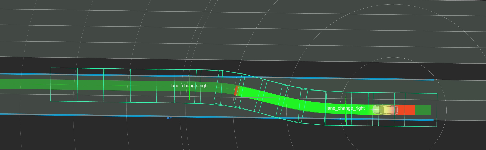

### Conditions for non-vehicle type objects

#### For crosswalk users

If Pedestrian and Bicycle are closer to crosswalk than threshold 2.0m (hard coded for now), the module judges they're crossing the road and never avoids them.


### Conditions for vehicle type objects

#### Judge vehicle behavior

The module classifies vehicles into following three behavior based on its yaw angle and offset direction.

```yaml
# params for filtering objects that are in intersection
intersection:
  yaw_deviation: 0.349 # [rad] (default 20.0deg)
```

| Behavior  | Details                                                                                                          | Figure                                       |
| --------- | ---------------------------------------------------------------------------------------------------------------- | -------------------------------------------- |
| NONE      | If the object's relative yaw angle to lane is less than threshold `yaw_deviation`, it is classified into `NONE`. | 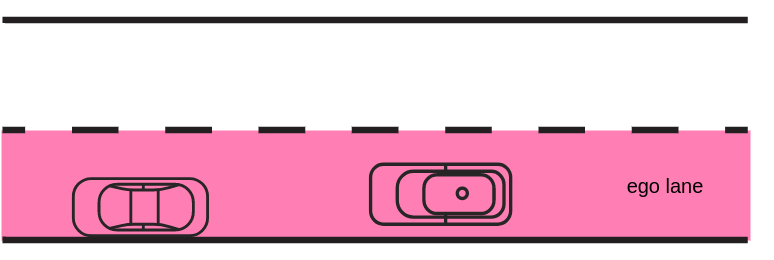      |
| MERGING   | See following flowchart.                                                                                         | 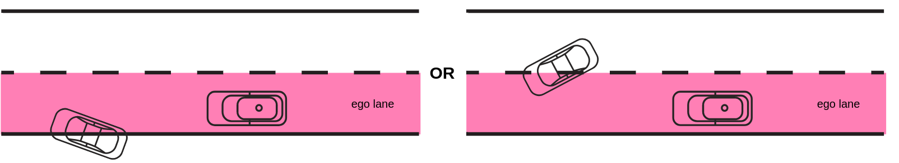   |
| DEVIATING | See following flowchart.                                                                                         |  |

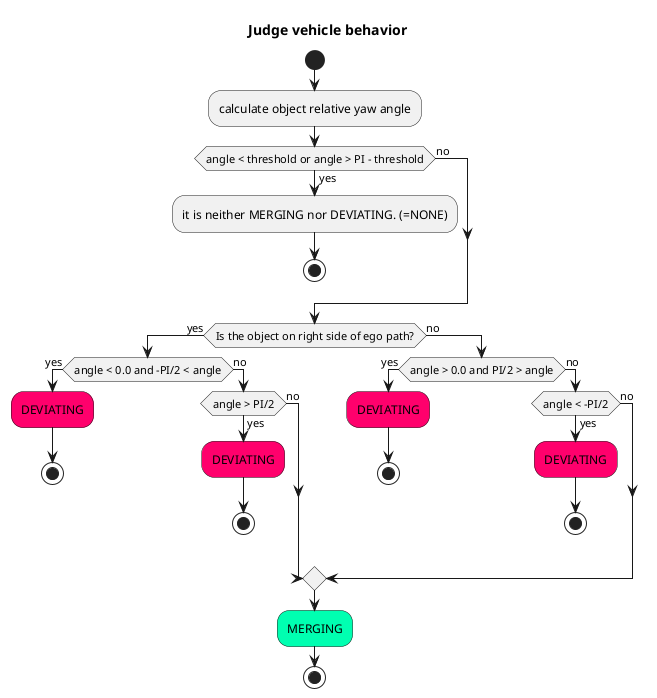
```plantuml
@startuml
skinparam defaultTextAlignment center
skinparam noteTextAlignment left

title Judge vehicle behavior
start

:calculate object relative yaw angle;
if(angle < threshold or angle > PI - threshold) then (yes)
:it is neither MERGING nor DEVIATING. (=NONE);
stop
else (no)
endif
if(Is the object on right side of ego path?) then (yes)
if(angle < 0.0 and -PI/2 < angle) then (yes)
#FF006C :DEVIATING;
stop
else (no)
if(angle > PI/2) then (yes)
#FF006C :DEVIATING;
stop
else (no)
endif
endif
else (no)
if(angle > 0.0 and PI/2 > angle) then (yes)
#FF006C :DEVIATING;
stop
else (no)
if(angle < -PI/2) then (yes)
#FF006C :DEVIATING;
stop
else (no)
endif
endif
endif
#00FFB1 :MERGING;
stop
@enduml

```

#### Judge if it's a parked vehicle

Not only the length from the centerline, but also the length from the road shoulder is calculated and used for the filtering process. In this logic, it calculates ratio of **actual shift length** to **shiftable shift length** as follow. If the result is larger than threshold `th_shiftable_ratio`, the module judges the vehicle as a parked vehicle.

$$
L_{d} = \frac{W_{lane} - W_{obj}}{2}, \\
ratio =  \frac{L_{a}}{L_{d}}
$$

- $L_{d}$ : shiftable length.
- $L_{a}$ : actual shift length.
- $W_{lane}$ : lane width.
- $W_{obj}$ : object width.

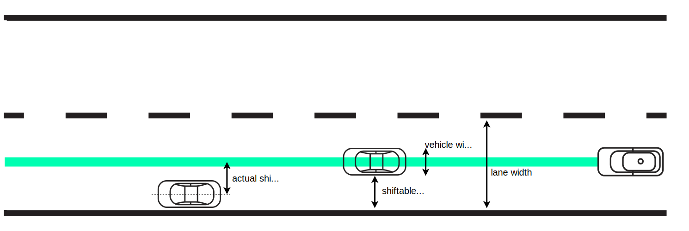

### Target object filtering

| Situation                                                                                                                        | Details                                                     | Ego behavior                                                                                               |
| -------------------------------------------------------------------------------------------------------------------------------- | ----------------------------------------------------------- | ---------------------------------------------------------------------------------------------------------- |
| Vehicle is within intersection area defined in HDMap. The module ignores vehicle which is following lane or merging to ego lane. | 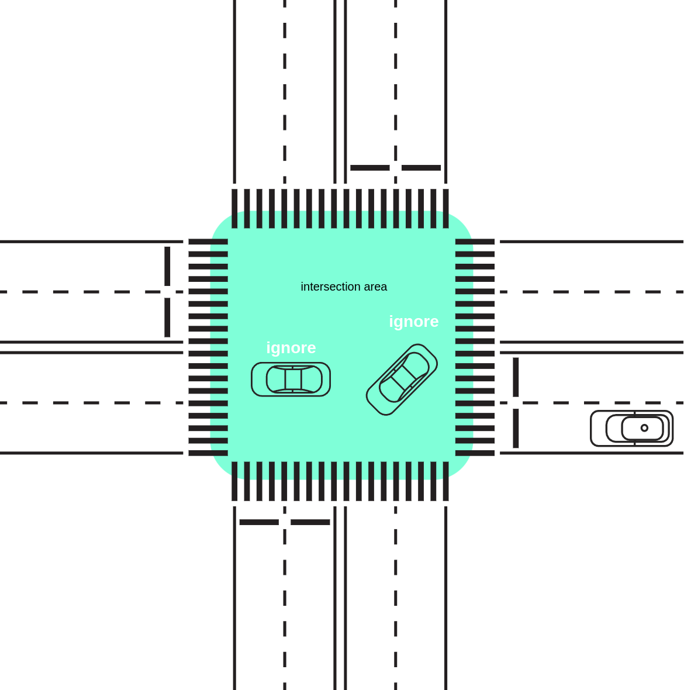 | Never avoid it.                                                                                            |
| Vehicle is on ego lane. There are adjacent lanes for both side.                                                                  |      | Never avoid it.                                                                                            |
| Vehicle is merging to other lane from ego lane. Most part of its footprint is on ego lane.                                       |     | Never avoid it.                                                                                            |
| Vehicle is merging to ego lane from other lane. Most part of its footprint is on ego lane.                                       | 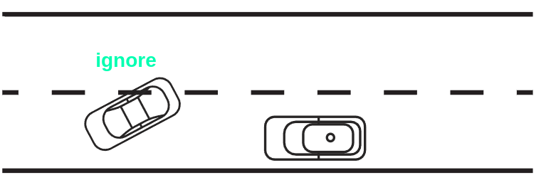      | Never avoid it.                                                                                            |
| Vehicle is not a obvious parked vehicle and stopping in front of the crosswalk or traffic light.                                 | 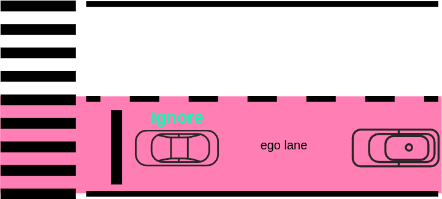  | Never avoid it.                                                                                            |
| Vehicle stops on ego lane with pulling over to the side of the road.                                                             |         | Avoid it immediately.                                                                                      |
| Vehicle stops on adjacent lane.                                                                                                  |     | Avoid it immediately.                                                                                      |
| Vehicle stops on ego lane without pulling over to the side of the road.                                                          | 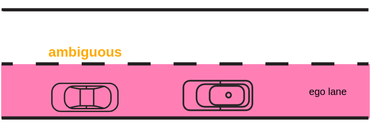       | Set the parameter `avoidance_for_ambiguous_vehicle.enable` to `true`, the module avoids ambiguous vehicle. |
| Vehicle is merging to ego lane from other lane.                                                                                  | 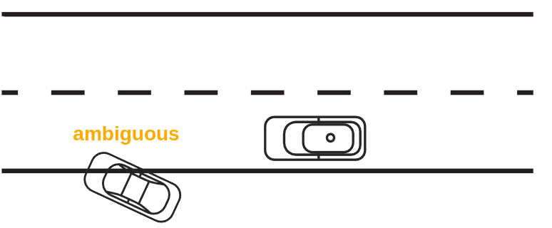        | Set the parameter `avoidance_for_ambiguous_vehicle.enable` to `true`, the module avoids ambiguous vehicle. |
| Vehicle is merging to other lane from ego lane.                                                                                  |       | Set the parameter `avoidance_for_ambiguous_vehicle.enable` to `true`, the module avoids ambiguous vehicle. |

### Flowchart

There are three main filtering functions `isSatisfiedWithCommonCondition()`, `isSatisfiedWithVehicleCondition()` and `isSatisfiedWithNonVehicleCondition()`. The filtering process is executed according to following flowchart. Additionally, the module checks avoidance necessity in `isNoNeedAvoidanceBehavior()` based on the object pose, ego path and lateral margin in config file.

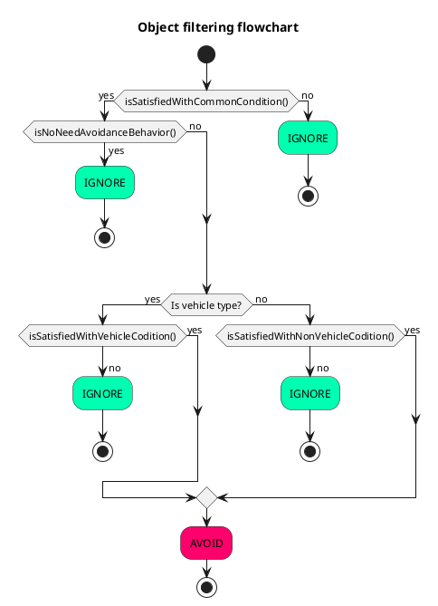
```plantuml
@startuml
skinparam defaultTextAlignment center
skinparam noteTextAlignment left

title Object filtering flowchart
start

if(isSatisfiedWithCommonCondition()) then (yes)
if(isNoNeedAvoidanceBehavior()) then (yes)
#00FFB1 :IGNORE;
stop
else (\n no)
endif
else (\n no)
#00FFB1 :IGNORE;
stop
endif
if(Is vehicle type?) then (yes)
if(isSatisfiedWithVehicleCodition()) then (yes)
else (\n no)
#00FFB1 :IGNORE;
stop
endif
else (\n no)
if(isSatisfiedWithNonVehicleCodition()) then (yes)
else (\n no)
#00FFB1 :IGNORE;
stop
endif
endif
#FF006C :AVOID;
stop
@enduml
```

#### Common conditions

At first, the function `isSatisfiedWithCommonCondition()` includes conditions used for all object class.

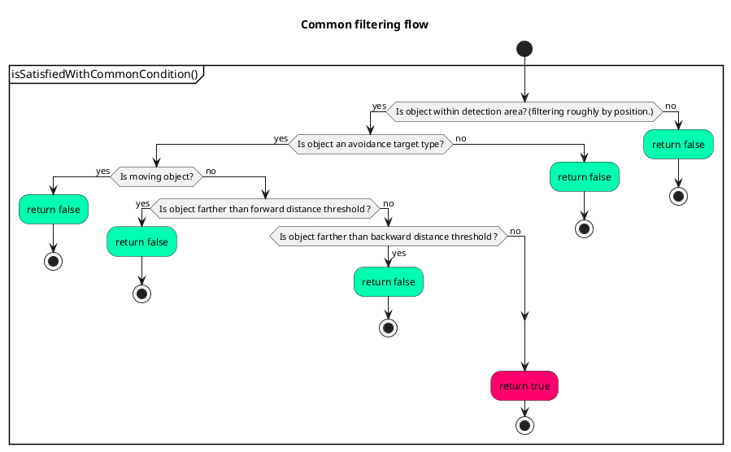
```plantuml
@startuml
skinparam defaultTextAlignment center
skinparam noteTextAlignment left

title Common filtering flow
start

partition isSatisfiedWithCommonCondition() {
if(Is object within detection area? (filtering roughly by position.)) then (yes)
if(Is object an avoidance target type?) then (yes)
if(Is moving object?) then (yes)
#00FFB1 :return false;
stop
else (\n no)
if(Is object farther than forward distance threshold ?) then (yes)
#00FFB1 :return false;
stop
else (\n no)
If(Is object farther than backward distance threshold ?) then (yes)
#00FFB1 :return false;
stop
else (\n no)
endif
endif
endif
else (\n no)
#00FFB1 :return false;
stop
endif
else (\n no)
#00FFB1 :return false;
stop
endif
#FF006C :return true;
stop
}

@enduml

```

#### Conditions for vehicle

Target class:

- Car
- Truck
- Bus
- Trailer

As a next step, object is filtered by condition specialized for its class.

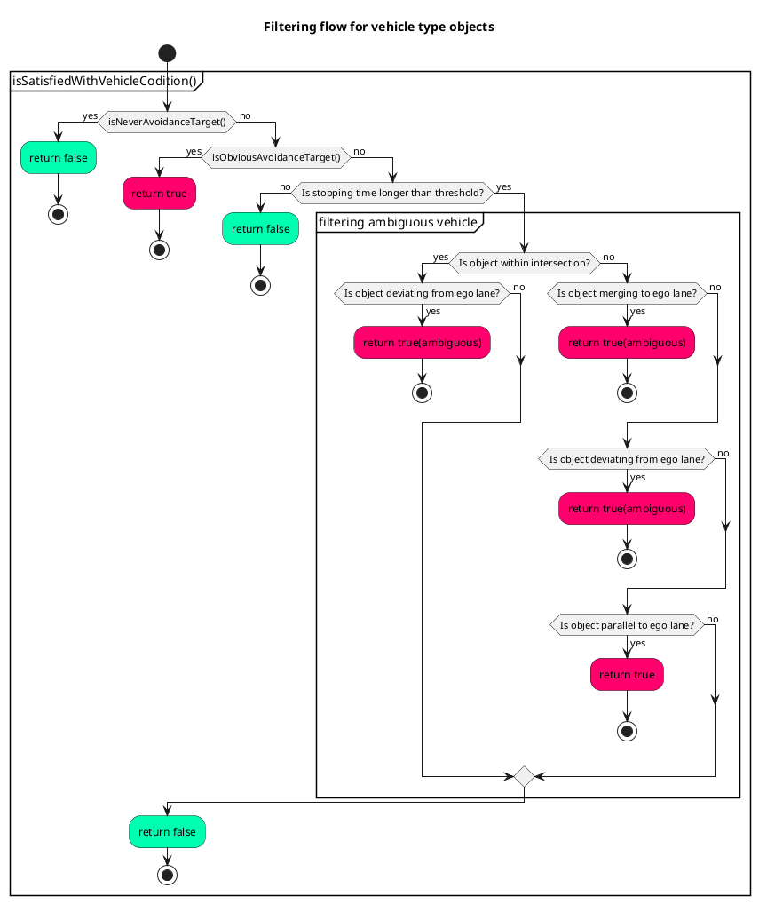
```plantuml
@startuml
skinparam defaultTextAlignment center
skinparam noteTextAlignment left

title Filtering flow for vehicle type objects
start

partition isSatisfiedWithVehicleCodition() {
if(isNeverAvoidanceTarget()) then (yes)
#00FFB1 :return false;
stop
else (\n no)

if(isObviousAvoidanceTarget()) then (yes)
#FF006C :return true;
stop
else (\n no)

if(Is stopping time longer than threshold?) then (no)
#00FFB1 :return false;
stop
else (\n yes)

partition filtering ambiguous vehicle {
if(Is object within intersection?) then (yes)
if(Is object deviating from ego lane?) then (yes)
#FF006C :return true(ambiguous);
stop
else (\n no)
endif
else (\n no)

if(Is object merging to ego lane?) then (yes)
#FF006C :return true(ambiguous);
stop
else (\n no)
endif

if(Is object deviating from ego lane?) then (yes)
#FF006C :return true(ambiguous);
stop
else (\n no)
endif

if(Is object parallel to ego lane?) then (yes)
#FF006C :return true;
stop
else (\n no)
endif

endif
}
endif
endif
endif
#00FFB1 :return false;
stop
}

@enduml

```

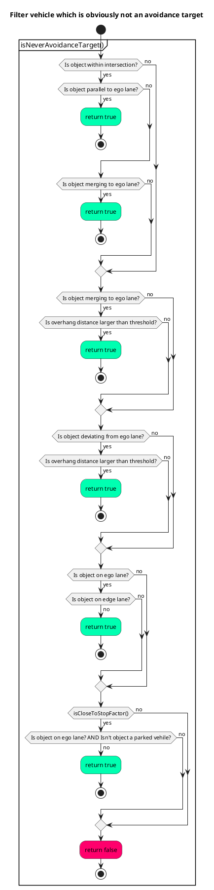
```plantuml
@startuml
skinparam defaultTextAlignment center
skinparam noteTextAlignment left

title Filter vehicle which is obviously not an avoidance target
start

partition isNeverAvoidanceTarget() {
if(Is object within intersection?) then (yes)

if(Is object parallel to ego lane?) then (yes)
#00FFB1 :return true;
stop
else (\n no)
endif

if(Is object merging to ego lane?) then (yes)
#00FFB1 :return true;
stop
else (\n no)
endif

else (\n no)
endif

if(Is object merging to ego lane?) then (yes)
if(Is overhang distance larger than threshold?) then (yes)
#00FFB1 :return true;
stop
else (\n no)
endif
else (\n no)
endif

if(Is object deviating from ego lane?) then (yes)
if(Is overhang distance larger than threshold?) then (yes)
#00FFB1 :return true;
stop
else (\n no)
endif
else (\n no)
endif

if(Is object on ego lane?) then (yes)
if(Is object on edge lane?) then (no)
#00FFB1 :return true;
stop
else (\n no)
endif
else (\n no)
endif

if(isCloseToStopFactor()) then (yes)
if(Is object on ego lane? AND Isn't object a parked vehile?) then (no)
#00FFB1 :return true;
stop
else (\n no)
endif
else (\n no)
endif

#FF006C :return false;
stop
}

@enduml
```

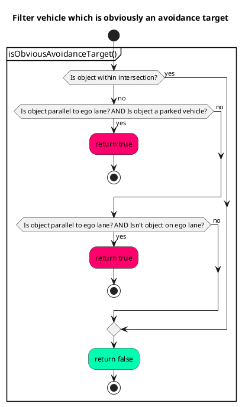
```plantuml
@startuml
skinparam defaultTextAlignment center
skinparam noteTextAlignment left

title Filter vehicle which is obviously an avoidance target
start

partition isObviousAvoidanceTarget() {
if(Is object within intersection?) then (yes)
else (\n no)
if(Is object parallel to ego lane? AND Is object a parked vehicle?) then (yes)
#FF006C :return true;
stop
else (\n no)
endif

if(Is object parallel to ego lane? AND Isn't object on ego lane?) then (yes)
#FF006C :return true;
stop
else (\n no)
endif
endif

#00FFB1 :return false;
stop
}

@enduml
```

#### Conditions for non-vehicle objects

- Pedestrian
- Bicycle

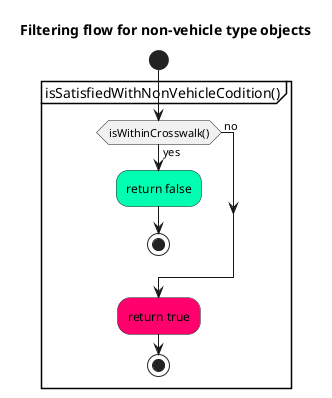
```plantuml
@startuml
skinparam defaultTextAlignment center
skinparam noteTextAlignment left

title Filtering flow for non-vehicle type objects
start

partition isSatisfiedWithNonVehicleCodition() {
if(isWithinCrosswalk()) then (yes)
#00FFB1 :return false;
stop
else (\n no)
endif
#FF006C :return true;
stop
}

@enduml
```

## When target object has gone

User can select the ego behavior when the target object has gone.

```yaml
cancel:
  enable: true # [-]
```

If above parameter is `true`, this module reverts avoidance path when following conditions are met.

- all target objects have gone.
- the ego vehicle hasn't initiated avoidance maneuver yet.


If the parameter is `false`, this module keeps running even after target object has gone.

## Path generation

### How to prevent shift line chattering that is caused by perception noise

Since object recognition result contains noise related to position, orientation and polygon shape, if the module uses the raw object recognition results in path generation, the output path will be directly affected by the noise. Therefore, in order to reduce the influence of the noise, this module generates polygon for each target objects, and the output path is generated based on that.

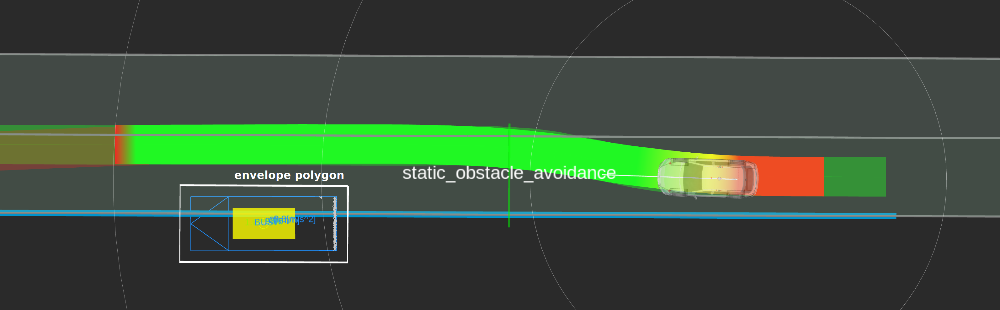

The envelope polygon is a rectangle box, whose size depends on object's polygon and buffer parameter `envelope_buffer_margin`. Additionally, it is always parallel to reference path. When the module finds target object for the first time, it initializes the polygon.

```yaml
        car:
          ...
          envelope_buffer_margin: 0.5                   # [m] FOR DEVELOPER
```

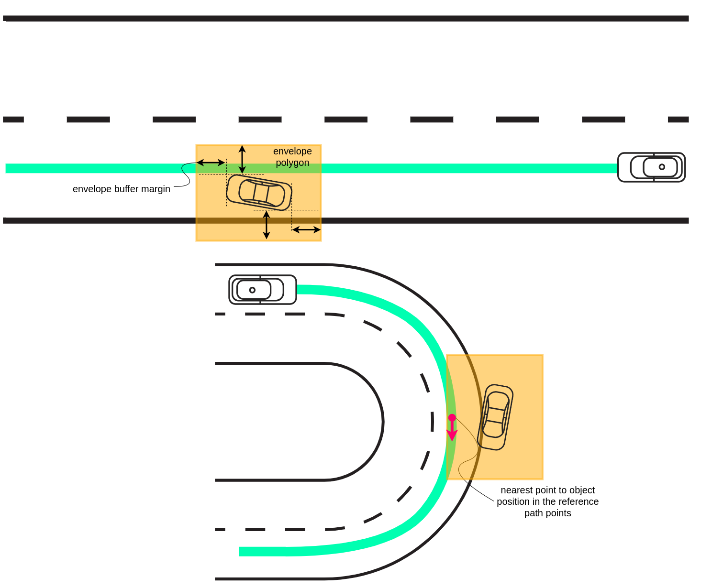

The module creates one-shot envelope polygon by using latest object pose and raw polygon in every planning cycle. On the other hand, the module envelope polygon information which is created in last planning cycle as well in order to update envelope polygon according to following logic. If the one-shot envelope polygon is not within previous envelope polygon, the module creates new envelope polygon. Otherwise, it keeps previous envelope polygon. By doing this process, the envelope polygon size and pose will converge even if perception output includes noise in object pose or shape.

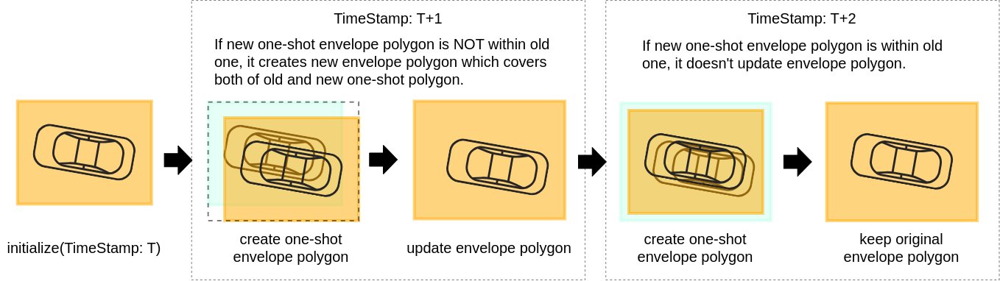

### Relationship between envelope polygon and avoidance path

The avoidance path has two shift section, whose start or end point position depends on envelope polygon. The end point of avoidance shift section and start point of return shift section are fixed based on envelope polygon and the other side edges are dynamically changed based on ego speed, shift length, lateral jerk constraints, etc...

The lateral positions of the two points are decided so that there can be enough space (=lateral margin) between ego body and the most overhang point of envelope polygon edge points. User can adjust lateral margin with following parameters.

```yaml
        car:
          ...
          lateral_margin:
            soft_margin: 0.3                            # [m]
            hard_margin: 0.2                            # [m]
            hard_margin_for_parked_vehicle: 0.7         # [m]
```

The longitudinal positions depends on envelope polygon, ego vehicle specification and following parameters. The longitudinal distance between avoidance shift section end point and envelope polygon (=front longitudinal buffer) is sum of `front_overhang` defined in `vehicle_info.param.yaml` and `longitudinal_margin` if the parameter `consider_front_overhang` is `true`. If `consider_front_overhang` is `false`, only `longitudinal_margin` is considered. Similarly, the distance between return shift section start point and envelope polygon (=rear longitudinal buffer) is sum of `rear_overhang` and `longitudinal_margin`.

```yaml

      target_object:
        car:
          ...
          longitudinal_margin: 0.0                      # [m]

      ...
      avoidance:
        ...
        longitudinal:
          ...
          consider_front_overhang: true                 # [-]
          consider_rear_overhang: true                  # [-]
```

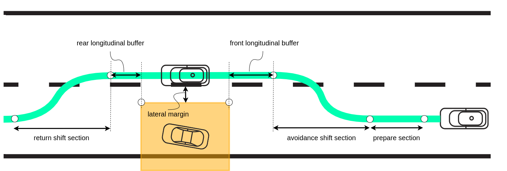

### Lateral margin

As mentioned above, user can adjust lateral margin by changing following two types parameter. The `soft_margin` is a soft constraint parameter for lateral margin. The `hard_margin` and `hard_margin_for_parked_vehicle` are hard constraint parameter.

```yaml
        car:
          ...
          lateral_margin:
            soft_margin: 0.3                            # [m]
            hard_margin: 0.2                            # [m]
            hard_margin_for_parked_vehicle: 0.7         # [m]
```

Basically, this module tries to generate avoidance path in order to keep lateral distance, which is sum of `soft_margin` and `hard_margin`/`hard_margin_for_parked_vehicle`, from avoidance target object.

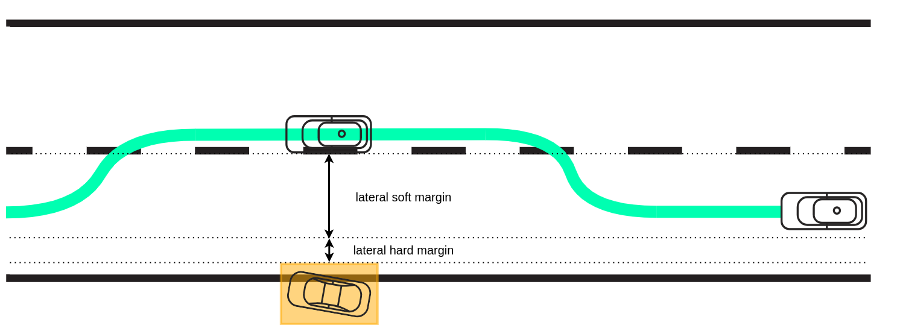

But if there isn't enough space to keep `soft_margin` distance, this module shortens soft constraint lateral margin. The parameter `soft_margin` is a maximum value of soft constraint, and actual soft margin can be a value between 0.0 and `soft_margin`. On the other hand, this module definitely keeps `hard_margin` or `hard_margin_for_parked_vehicle` depending on the situation. Thus, the minimum value of total lateral margin is `hard_margin`/`hard_margin_for_parked_vehicle`, and the maximum value is the sum of `hard_margin`/`hard_margin_for_parked_vehicle` and `soft_margin`.

Following figure shows the situation where this module shortens lateral soft constraint in order not to drive opposite direction lane when user set a parameter `use_lane_type` to `same_direction_lane`.

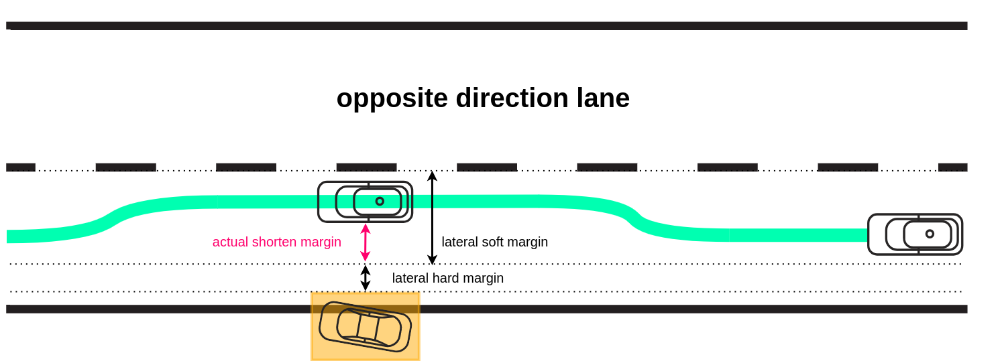

This module avoids not only parked vehicle but also non-parked vehicle which stops temporarily for some reason (e.g. waiting for traffic light to change red to green.). Additionally, this module has two types hard margin parameters, `hard_margin` and `hard_margin_for_parked_vehicle` and judges if it's a parked vehicle or not for each vehicles because it takes the risk of vehicle doors opening suddenly and people getting out from parked vehicle into consideration.

Basically, user had better make `hard_margin_for_parked_vehicle` larger than `hard_margin` to prevent collision with doors or people who suddenly get out from vehicle.

On the other hand, this module has only one parameter `soft_margin` for soft lateral margin constraint.

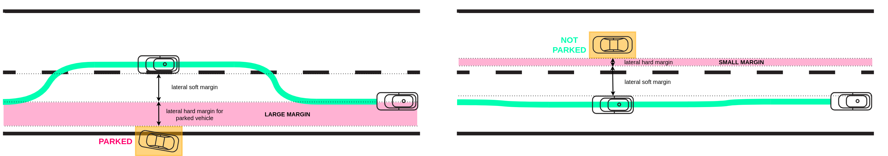

As the hard margin parameters the distance which the user definitely want to keep, they are used in the logic to check whether the ego can pass side of the target object without avoidance maneuver as well.

If the lateral distance is less than `hard_margin`/`hard_margin_for_parked_vehicle` when assuming that the ego follows current lane without avoidance maneuver, this module thinks the ego can not pass the side of the object safely and the ego must avoid it. In this case, this module inserts stop point until the avoidance maneuver is allowed to execute so that the ego can avoid the object after approval. (e.g. The ego keeps stopping in front of such a object until operator approves avoidance maneuver if user uses this module in MANUAL mode.)

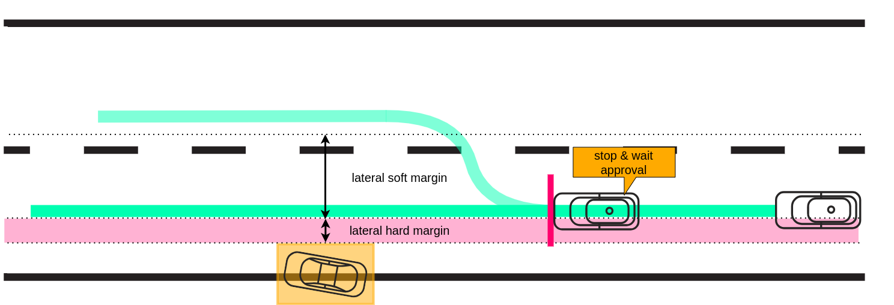

On the other hand, if the lateral distance is larger than `hard_margin`/`hard_margin_for_parked_vehicle`, this module doesn't insert stop point even when it's waiting approval because it thinks it's possible to pass the side of the object safely.


### When there is not enough space

This module inserts stop point only when the ego can potentially avoid the object. So, if it is not able to keep distance more than `hard_margin`/`hard_margin_for_parked_vehicle`, this module does nothing. Following figure shows the situation where this module is not able to keep enough lateral distance when user set a parameter `use_lane_type` to `same_direction_lane`.

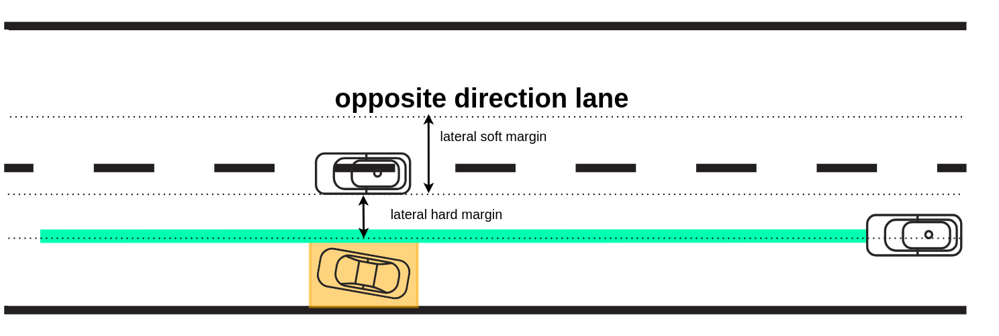

!!! info

    In this situation, obstacle stop feature in [obstacle_cruise_planner](../../autoware_obstacle_cruise_planner/README.md) is responsible for ego vehicle safety.

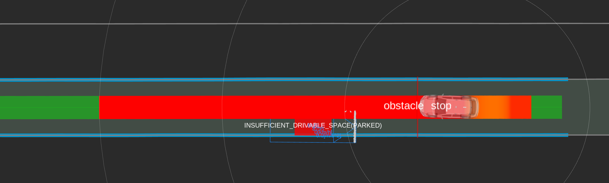

### Shift length calculation

The lateral shift length is sum of `overhang_distance`, lateral margin, whose value is set in config file, and the half of ego vehicle width defined in `vehicle_info.param.yaml`. On the other hand, the module limits the shift length depending on the space which the module can use for avoidance maneuver and the parameters `soft_drivable_bound_margin` `hard_drivable_bound_margin`. Basically, the shift length is limited so that the ego doesn't get closer than `soft_drivable_bound_margin` to drivable boundary. But it allows to relax the threshold `soft_drivable_bound_margin` to `hard_drivable_bound_margin` when the road is narrow.


Usable lane for avoidance module can be selected by config file.

```yaml
      ...
      # drivable lane setting. this module is able to use not only current lane but also right/left lane
      # if the current lane(=lanelt::Lanelet) and the rignt/left lane share the boundary(=lanelet::Linestring) in HDMap.
      # "current_lane"           : use only current lane. this module doesn't use adjacent lane to avoid object.
      # "same_direction_lane"    : this module uses same direction lane to avoid object if need.
      # "opposite_direction_lane": this module uses both same direction and opposite direction lane.
      use_lane_type: "opposite_direction_lane"
```

When user set parameter `use_lane_type` to `opposite_direction_lane`, it is possible to use opposite lane.


When user set parameter `use_lane_type` to `same_direction_lane`, the module doesn't create path that overlaps opposite lane.

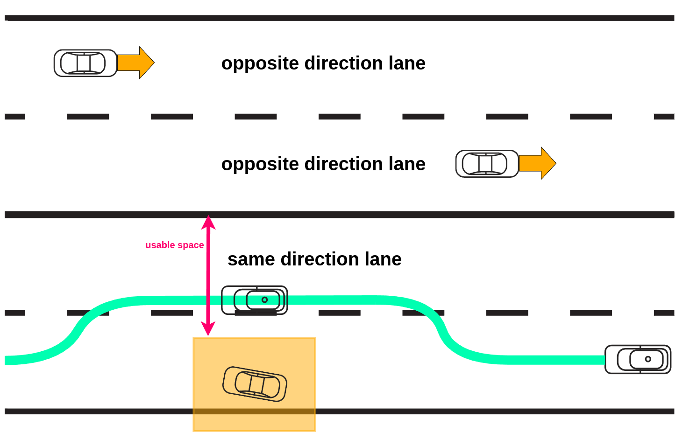

### Shift line generation

As mentioned above, the end point of avoidance shift path and the start point of return shift path, which are FIXED points, are calculated from envelope polygon. As a next step, the module adjusts the other side points depending on shift length, current ego speed and lateral jerk constrain params defined in config file.

Since the two points are always on centerline of ego lane, the module only calculates longitudinal distance between shift start and end point based on following function. This function is defined in path shifter library, so please see [this](../autoware_behavior_path_planner_common/docs/behavior_path_planner_path_generation_design.md) page as well.

```c++
double PathShifter::calcLongitudinalDistFromJerk(
  const double lateral, const double jerk, const double velocity)
{
  const double j = std::abs(jerk);
  const double l = std::abs(lateral);
  const double v = std::abs(velocity);
  if (j < 1.0e-8) {
    return 1.0e10;
  }
  return 4.0 * std::pow(0.5 * l / j, 1.0 / 3.0) * v;
}
```

We call the line which connects shift start and end point `shift_line`, whom the avoidance path is generated from with spline completion.

The start point of avoidance has another longitudinal constraint. In order to keep turning on the blinker for few seconds before starting avoidance maneuver, the avoidance start point must be further than the value (we call the distance `prepare_length`.) depending on ego speed from ego position.

```yaml
longitudinal:
  min_prepare_time: 1.0 # [s]
  max_prepare_time: 2.0 # [s]
  min_prepare_distance: 1.0 # [m]
```

The `prepare_length` is calculated as the product of ego speed and `max_prepare_time`. (When the ego speed is zero, `min_prepare_distance` is used.)


## Planning at RED traffic light

This module takes traffic light information into account so that the ego can behave properly. Sometimes, the ego straddles lane boundary but we want to prevent the ego from stopping in front of red traffic signal in such a situation. This is because the ego will block adjacent lane and it's inconvenient for other vehicles.

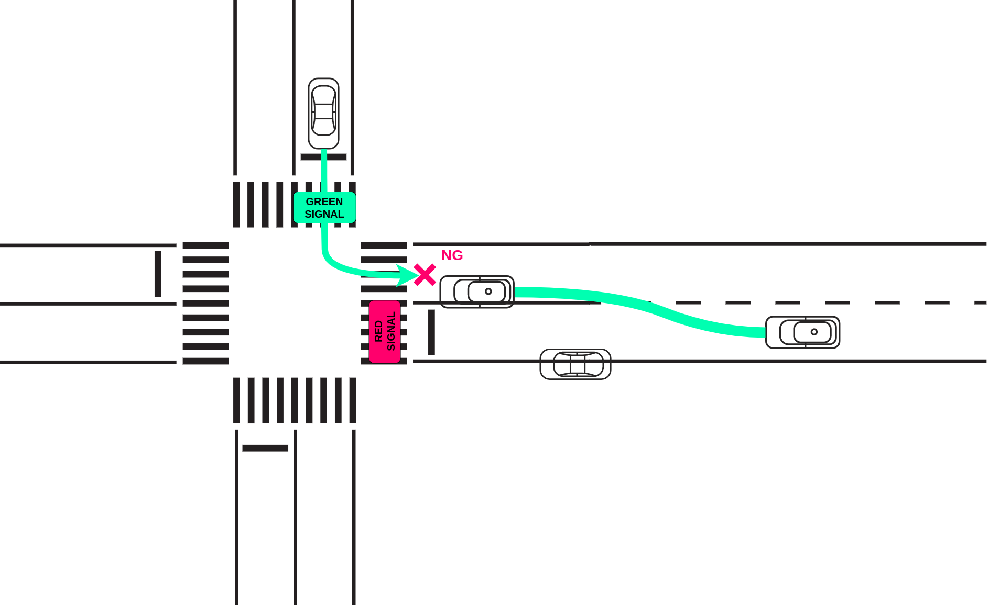

So, this module controls shift length and shift start/end point in order to prevent above situation.

### Control shift length

At first, if the ego hasn't initiated avoidance maneuver yet, this module limits maximum shift length and uses **ONLY** current lane during red traffic signal. This prevents the ego from blocking other vehicles even if this module executes avoidance maneuver and the ego is caught by red traffic signal.

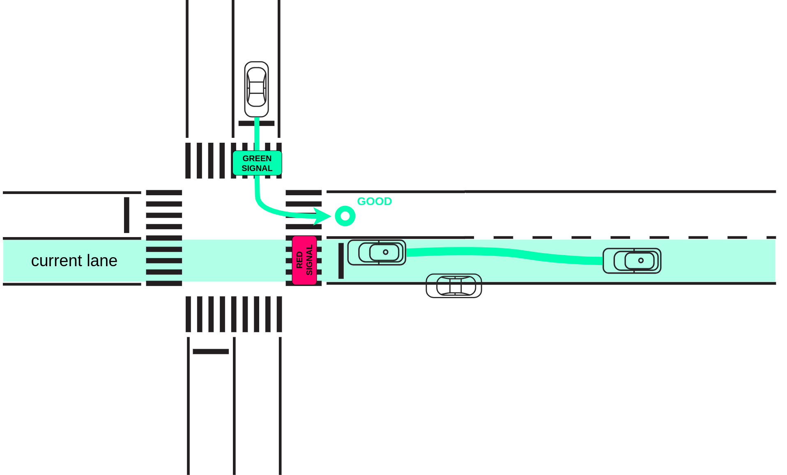

### Control avoidance shift start point

Additionally, if the target object is farther than stop line for traffic light, this module set avoidance shift start point on the stop line in order to prevent the ego from stopping by red traffic signal in middle of avoidance maneuver.

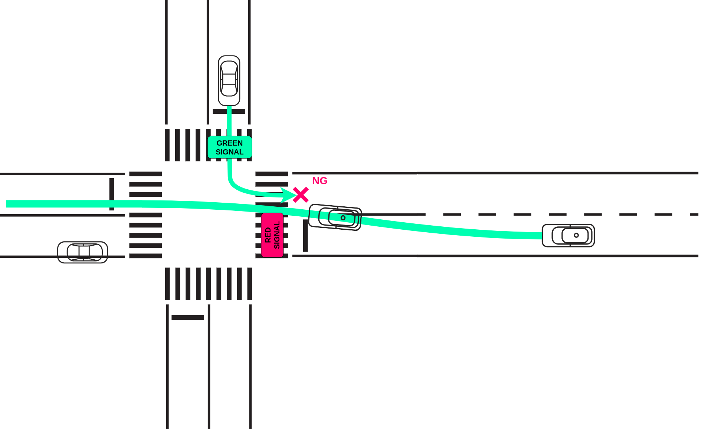
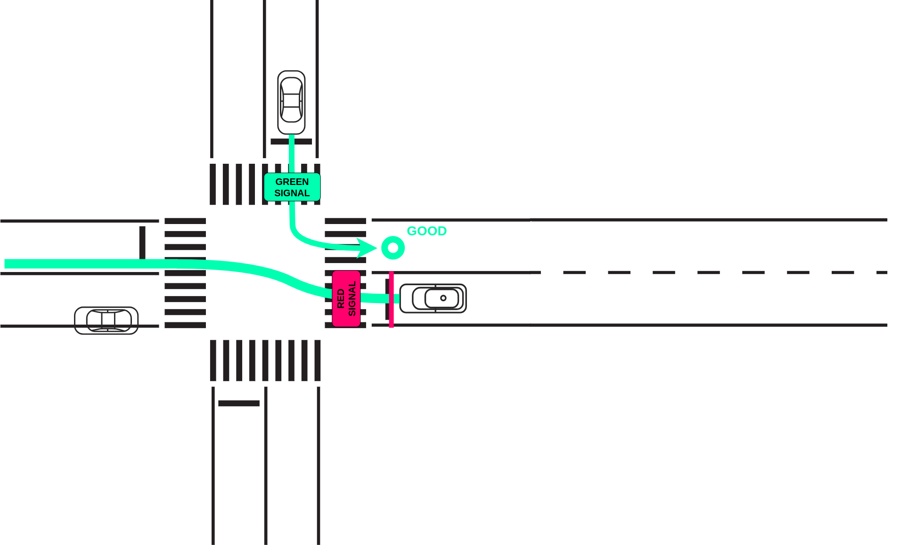

### Control return shift end point

If the ego has already initiated avoidance maneuver, this module tries to set return shift end point on the stop line.

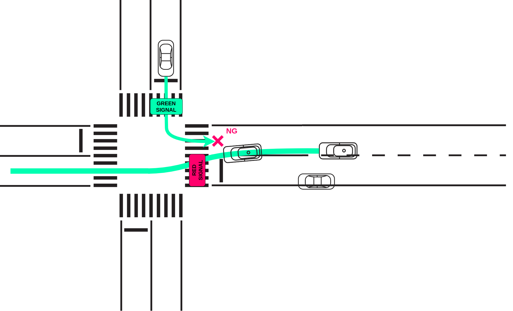


## Safety check

This feature can be enable by setting following parameter to `true`.

```yaml
      safety_check:
        ...
        enable: true                                    # [-]
```

This module pay attention not only avoidance target objects but also non-target objects that are near the avoidance path, and if avoidance path is unsafe due to surround objects, it reverts avoidance maneuver and yields lane to them.

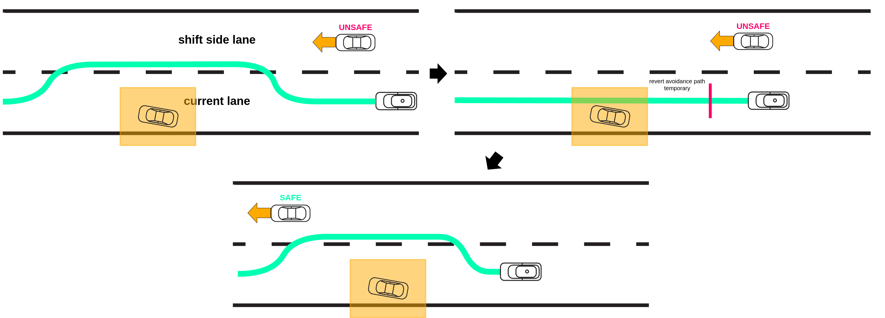

### Yield maneuver

Additionally, this module basically inserts stop point in front of avoidance target during yielding maneuver in order to keep enough distance to avoid the target after it is safe situation. If the shift side lane is congested, the ego stops the point and waits.

This feature can be enable by setting following parameter to `true`.

```yaml
yield:
  enable: true # [-]
```

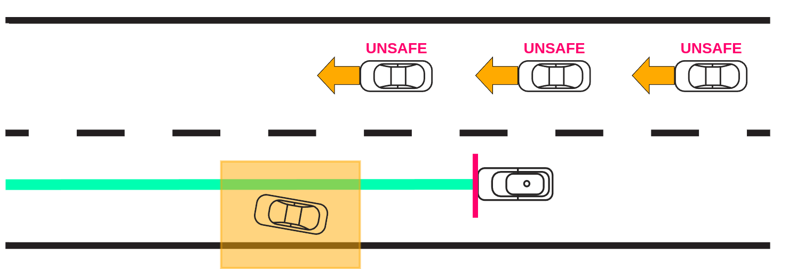

But if the lateral margin is larger than `hard_margin` (or `hard_margin_for_parked_vehicle`), this module doesn't insert stop point because the ego can pass side of the object safely without avoidance maneuver.

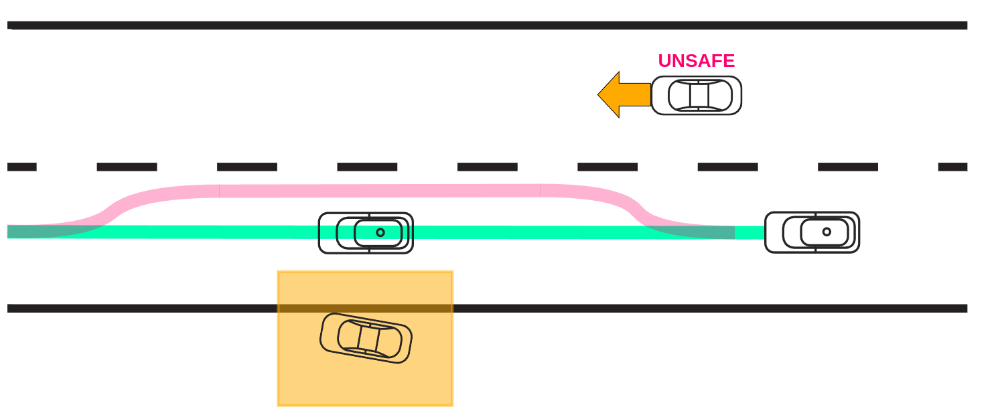

### Safety check target lane

User can select safety check area by following params. Basically, we recommend following configuration to check only sift side lane. But if user want to confirm safety strictly, please set `check_current_lane` and/or `check_other_side_lane` to `true`.

```yaml
      safety_check:
      ...
        check_current_lane: false                       # [-]
        check_shift_side_lane: true                     # [-]
        check_other_side_lane: false                    # [-]
```

In avoidance module, the function `path_safety_checker::isCentroidWithinLanelet` is used for filtering objects by lane.

```c++
bool isCentroidWithinLanelet(const PredictedObject & object, const lanelet::ConstLanelet & lanelet)
{
  const auto & object_pos = object.kinematics.initial_pose_with_covariance.pose.position;
  lanelet::BasicPoint2d object_centroid(object_pos.x, object_pos.y);
  return boost::geometry::within(object_centroid, lanelet.polygon2d().basicPolygon());
}
```

!!! info

    If it set `check_current_lane` and/or `check_other_side_lane` to `true`, maybe the possibility of false positive occurring and unnecessary yield maneuver execution increases.

### Safety check algorithm

This module uses common safety check logic implemented in `path_safety_checker` library. See [this](../autoware_behavior_path_planner_common/docs/behavior_path_planner_safety_check.md) page.

### Limitation

#### Limitation-1

The current behavior when the module judges it's unsafe is so conservative because it is difficult to achieve aggressive (e.g. increase speed in order to increase the distance to behind vehicle.) for current planning architecture.

#### Limitation-2

The yield maneuver is executed **ONLY** when the vehicle has **NOT** initiated avoidance maneuver yet. (This module checks objects on opposite lane but it's necessary to find very far objects to judge unsafe before avoidance maneuver.) If it detects vehicle which is closing to ego during avoidance maneuver, this module doesn't neither revert the path nor insert stop point. For now, there is no feature to deal with this situation in this module. Thus, new module is needed to adjust path to avoid moving objects, or operator should do override.

!!! info

    This module has a threshold parameter `th_avoid_execution` for the shift length, and judge that the vehicle is initiating avoidance if the vehicle current shift exceeds the value.

## Other features

### Compensation for detection lost

In order to prevent chattering of recognition results, once an obstacle is targeted, it is hold for a while even if it disappears. This is effective when recognition is unstable. However, since it will result in over-detection (increase a number of false-positive), it is necessary to adjust parameters according to the recognition accuracy (if `object_last_seen_threshold = 0.0`, the recognition result is 100% trusted).

### Drivable area expansion

This module supports drivable area expansion for following polygons defined in HDMap.

- intersection area
- hatched road marking
- freespace area

Please set the flags to `true` when user wants to make it possible to use those areas in avoidance maneuver.

```yaml
# drivable lane setting. this module is able to use not only current lane but also right/left lane
# if the current lane(=lanelt::Lanelet) and the rignt/left lane share the boundary(=lanelet::Linestring) in HDMap.
# "current_lane"           : use only current lane. this module doesn't use adjacent lane to avoid object.
# "same_direction_lane"    : this module uses same direction lane to avoid object if need.
# "opposite_direction_lane": this module uses both same direction and opposite direction lane.
use_lane_type: "opposite_direction_lane"
# drivable area setting
use_intersection_areas: true
use_hatched_road_markings: true
use_freespace_areas: true
```

|                                        |                                                            |                                                                                                                                                                                                                     |
| -------------------------------------- | ---------------------------------------------------------- | ------------------------------------------------------------------------------------------------------------------------------------------------------------------------------------------------------------------- |
| use_lane_type: same_direction_lane     | 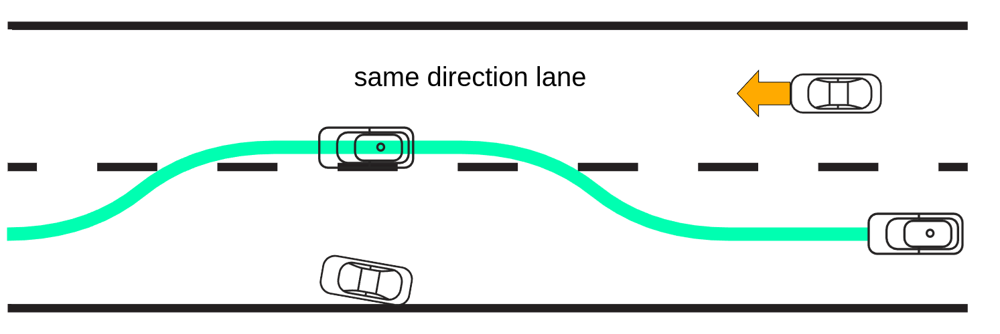     |                                                                                                                                                                                                                     |
| use_lane_type: opposite_direction_lane | 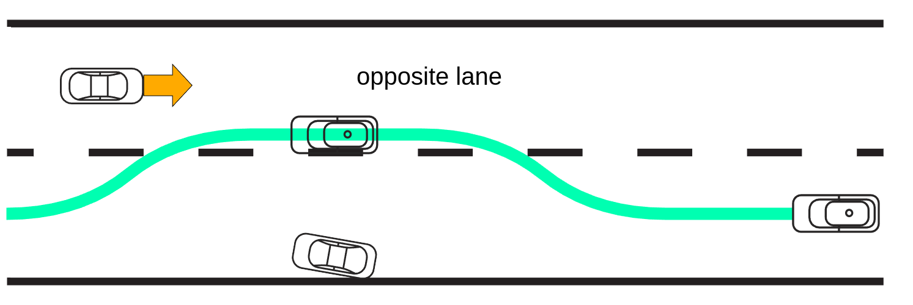 |                                                                                                                                                                                                                     |
| intersection area                      | 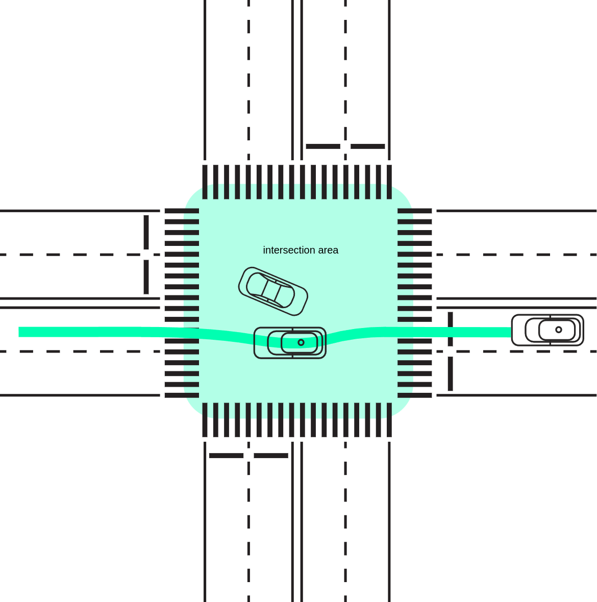       | The intersection area is defined on Lanelet map. See [here](https://github.com/autowarefoundation/autoware_common/blob/main/tmp/lanelet2_extension/docs/lanelet2_format_extension.md)                               |
| hatched road markings                  |               | The hatched road marking is defined on Lanelet map. See [here](https://github.com/autowarefoundation/autoware_common/blob/main/tmp/lanelet2_extension/docs/lanelet2_format_extension.md#hatched-road-markings-area) |
| freespace area                         | 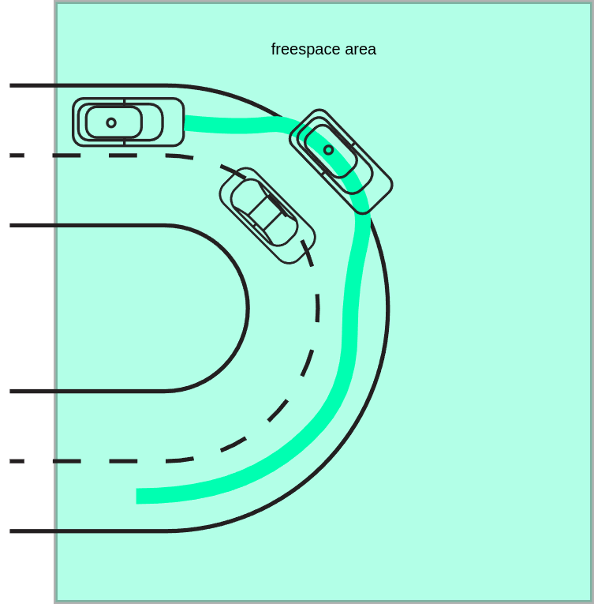          | The freespace area is defined on Lanelet map. (unstable)                                                                                                                                                            |

## Future extensions / Unimplemented parts

- **Consideration of the speed of the avoidance target**

  - In the current implementation, only stopped vehicle is targeted as an avoidance target. It is needed to support the overtaking function for low-speed vehicles, such as a bicycle. (It is actually possible to overtake the low-speed objects by changing the parameter, but the logic is not supported and thus the safety cannot be guaranteed.)
  - The overtaking (e.g., to overtake a vehicle running in front at 20 km/h at 40 km/h) may need to be handled outside the avoidance module. It should be discussed which module should handle it.

- **Cancel avoidance when target disappears**

  - In the current implementation, even if the avoidance target disappears, the avoidance path will remain. If there is no longer a need to avoid, it must be canceled.

- **Improved performance of avoidance target selection**

  - Essentially, avoidance targets are judged based on whether they are static objects or not. For example, a vehicle waiting at a traffic light should not be avoided because we know that it will start moving in the future. However this decision cannot be made in the current Autoware due to the lack of the perception functions. Therefore, the current avoidance module limits the avoidance target to vehicles parked on the shoulder of the road, and executes avoidance only for vehicles that are stopped away from the center of the lane. However, this logic cannot avoid a vehicle that has broken down and is stopped in the center of the lane, which should be recognized as a static object by the perception module. There is room for improvement in the performance of this decision.

- **Resampling path**
  - Now the rough resolution resampling is processed to the output path in order to reduce the computational cost for the later modules. This resolution is set to a uniformly large value (e.g. `5m`), but small resolution should be applied for complex paths.

## Debug

### Show `RCLCPP_DEBUG` on console

All of debug messages are logged in following namespaces.

- `planning.scenario_planning.lane_driving.behavior_planning.behavior_path_planner.static_obstacle_avoidance` or,
- `planning.scenario_planning.lane_driving.behavior_planning.behavior_path_planner.static_obstacle_avoidance.utils`

User can see debug information by following command.

```bash
ros2 service call /planning/scenario_planning/lane_driving/behavior_planning/behavior_path_planner/config_logger logging_demo/srv/ConfigLogger "{logger_name: 'planning.scenario_planning.lane_driving.behavior_planning.behavior_path_planner.static_obstacle_avoidance', level: DEBUG}"
```

### Visualize debug markers

Use can enable to publish debug markers by following parameters.

```yaml
debug:
  enable_other_objects_marker: false
  enable_other_objects_info: false
  enable_detection_area_marker: false
  enable_drivable_bound_marker: false
  enable_safety_check_marker: false
  enable_shift_line_marker: false
  enable_lane_marker: false
  enable_misc_marker: false
```

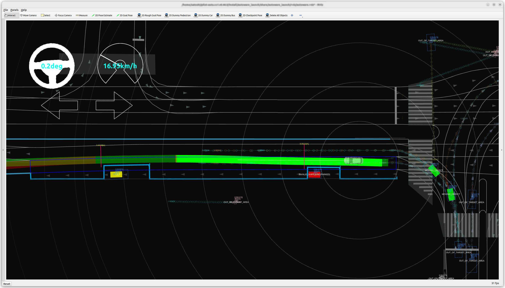

### Echoing debug message to find out why the objects were ignored

If for some reason, no shift point is generated for your object, you can check for the failure reason via `ros2 topic echo`.


To print the debug message, just run the following

```bash
ros2 topic echo /planning/scenario_planning/lane_driving/behavior_planning/behavior_path_planner/debug/avoidance_debug_message_array
```

## Appendix: Shift line generation pipeline

### Flow-chart of the process

<!-- spell-checker:disable -->

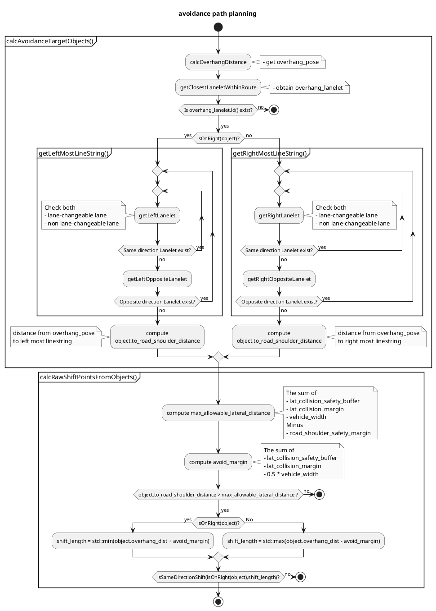
```plantuml
@startuml
skinparam monochrome true
skinparam defaultTextAlignment center
skinparam noteTextAlignment left

title avoidance path planning
start
partition calcAvoidanceTargetObjects() {
:calcOverhangDistance;
note right
 - get overhang_pose
end note

:getClosestLaneletWithinRoute;
note right
 - obtain overhang_lanelet
end note

if(Is overhang_lanelet.id() exist?) then (no)
stop
else (\n yes)

if(isOnRight(object)?) then (yes)
partition getLeftMostLineString() {
repeat
repeat
:getLeftLanelet;
note left
 Check both
 - lane-changeable lane
 - non lane-changeable lane
end note
repeat while (Same direction Lanelet exist?) is (yes) not (no)
:getLeftOppositeLanelet;
repeat while (Opposite direction Lanelet exist?) is (yes) not (no)
}
:compute\nobject.to_road_shoulder_distance;
note left
distance from overhang_pose
to left most linestring
end note
else(\n no)
partition getRightMostLineString() {
repeat
repeat
:getRightLanelet;
note right
 Check both
 - lane-changeable lane
 - non lane-changeable lane
end note
repeat while (Same direction Lanelet exist?) is (yes) not (no)
:getRightOppositeLanelet;
repeat while (Opposite direction Lanelet exist?) is (yes) not (no)
}
:compute\nobject.to_road_shoulder_distance;
note right
distance from overhang_pose
to right most linestring
end note
endif
endif
}

partition calcRawShiftPointsFromObjects() {
:compute max_allowable_lateral_distance;
note right
The sum of
- lat_collision_safety_buffer
- lat_collision_margin
- vehicle_width
Minus
- road_shoulder_safety_margin
end note
:compute avoid_margin;
note right
The sum of
- lat_collision_safety_buffer
- lat_collision_margin
- 0.5 * vehicle_width
end note
if(object.to_road_shoulder_distance > max_allowable_lateral_distance ?) then (no)
stop
else (\n yes)
if(isOnRight(object)?) then (yes)
:shift_length = std::min(object.overhang_dist + avoid_margin);
else (\n No)
:shift_length = std::max(object.overhang_dist - avoid_margin);
endif
if(isSameDirectionShift(isOnRight(object),shift_length)?) then (no)
stop
endif
endif
}
stop
@enduml
```

<!-- spell-checker:enable -->

### How to decide the path shape

Generate shift points for obstacles with given lateral jerk. These points are integrated to generate an avoidance path. The detailed process flow for each case corresponding to the obstacle placement are described below. The actual implementation is not separated for each case, but the function corresponding to `multiple obstacle case (both directions)` is always running.

#### One obstacle case

The lateral shift distance to the obstacle is calculated, and then the shift point is generated from the ego vehicle speed and the given lateral jerk as shown in the figure below. A smooth avoidance path is then calculated based on the shift point.

Additionally, the following processes are executed in special cases.

#### Lateral jerk relaxation conditions

- If the ego vehicle is close to the avoidance target, the lateral jerk will be relaxed up to the maximum jerk
- When returning to the center line after avoidance, if there is not enough distance left to the goal (end of path), the jerk condition will be relaxed as above.

#### Minimum velocity relaxation conditions

There is a problem that we can not know the actual speed during avoidance in advance. This is especially critical when the ego vehicle speed is 0.
To solve that, this module provides a parameter for the minimum avoidance speed, which is used for the lateral jerk calculation when the vehicle speed is low.

- If the ego vehicle speed is lower than "nominal" minimum speed, use the minimum speed in the calculation of the jerk.
- If the ego vehicle speed is lower than "sharp" minimum speed and a nominal lateral jerk is not enough for avoidance (the case where the ego vehicle is stopped close to the obstacle), use the "sharp" minimum speed in the calculation of the jerk (it should be lower than "nominal" speed).


#### Multiple obstacle case (one direction)

Generate shift points for multiple obstacles. All of them are merged to generate new shift points along the reference path. The new points are filtered (e.g. remove small-impact shift points), and the avoidance path is computed for the filtered shift points.

**Merge process of raw shift points**: check the shift length on each path points. If the shift points are overlapped, the maximum shift value is selected for the same direction.

For the details of the shift point filtering, see [filtering for shift points](#filtering-for-shift-points).


#### Multiple obstacle case (both direction)

Generate shift points for multiple obstacles. All of them are merged to generate new shift points. If there are areas where the desired shifts conflict in different directions, the sum of the maximum shift amounts of these areas is used as the final shift amount. The rest of the process is the same as in the case of one direction.


#### Filtering for shift points

The shift points are modified by a filtering process in order to get the expected shape of the avoidance path. It contains the following filters.

- Quantization: Quantize the avoidance width in order to ignore small shifts.
- Small shifts removal: Shifts with small changes with respect to the previous shift point are unified in the previous shift width.
- Similar gradient removal: Connect two shift points with a straight line, and remove the shift points in between if their shift amount is in the vicinity of the straight line.
- Remove momentary returns: For shift points that reduce the avoidance width (for going back to the center line), if there is enough long distance in the longitudinal direction, remove them.

## Appendix: All parameters

The avoidance specific parameter configuration file can be located at `src/autoware/launcher/planning_launch/config/scenario_planning/lane_driving/behavior_planning/behavior_path_planner/autoware_behavior_path_static_obstacle_avoidance_module/static_obstacle_avoidance.param.yaml`.

{{ json_to_markdown("planning/behavior_path_planner/autoware_behavior_path_static_obstacle_avoidance_module/schema/static_obstacle_avoidance.schema.json") }}
