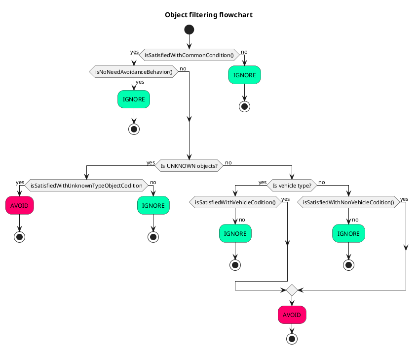
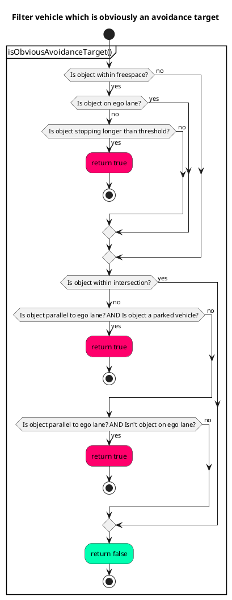
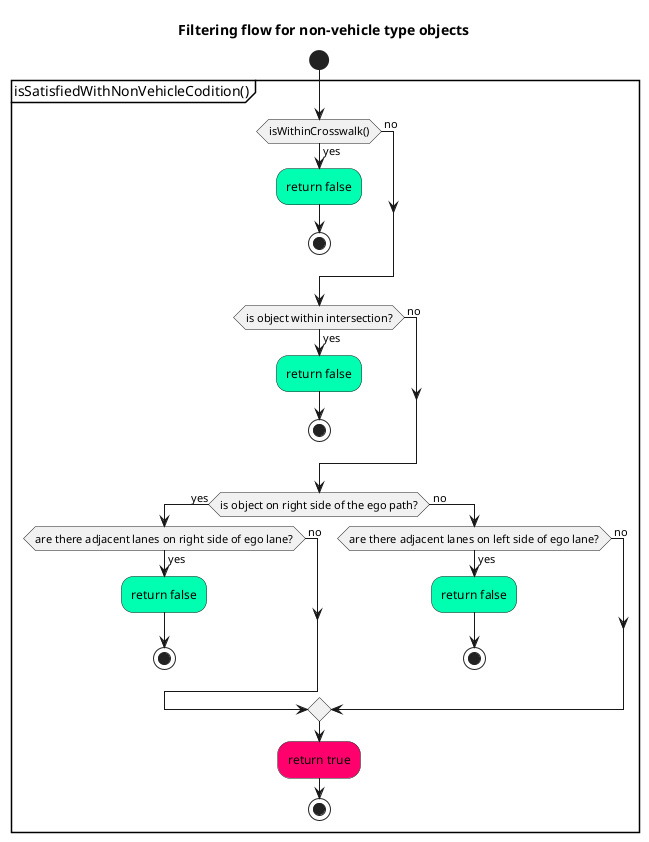

# Avoidance module for static objects


## Purpose/Role

This is a rule-based avoidance module, which runs based on perception output data, HDMap, current path and route. This module is designed to create avoidance paths for static (=stopped) objects in simple situations. Currently, this module doesn't support dynamic (=moving) objects.


This module has an [RTC interface](../../autoware_rtc_interface/README.md), and the user can select operation mode from MANUAL/AUTO depending on the performance of the vehicle's sensors. If the user selects MANUAL mode, this module outputs a candidate avoidance path and awaits operator approval. In the case where the sensor/perception performance is insufficient and false positives occur, we recommend MANUAL mode to prevent unnecessary avoidance maneuvers.

If the user selects AUTO mode, this module modifies the current following path without operator approval. If the sensor/perception performance is sufficient, use AUTO mode.

### Limitations

This module allows developers to design vehicle behavior in avoidance planning using specific rules. Due to the property of rule-based planning, the algorithm cannot compensate for not colliding with obstacles in complex cases. This is a trade-off between "be intuitive and easy to design" and "be hard to tune but can handle many cases". This module adopts the former policy and therefore this output should be checked more strictly in the later stage. In the .iv reference implementation, there is another avoidance module in the motion planning module that uses optimization to handle the avoidance in complex cases. (Note that, the motion planner needs to be adjusted so that the behavior result will not be changed much in the simple case and this is a typical challenge for the behavior-motion hierarchical architecture.)

### Why is avoidance in behavior module?

This module executes avoidance over lanes, and the decision requires the lane structure information to take care of traffic rules (e.g. it needs to send an indicator signal when the vehicle crosses a lane). The difference between the motion and behavior modules in the planning stack is whether the planner takes traffic rules into account, which is why this avoidance module exists in the behavior module.

<br>

If you would like to know the overview rather than the detail, please skip the next section and refer to [FAQ](#frequently-asked-questions).

## Inner workings/Algorithms

This module mainly has two parts, target filtering and path generation. At first, all objects are filtered by several conditions. In this step, the module checks avoidance feasibility and necessity. After that, this module generates avoidance path outline, which we call **shift line**, based on filtered objects. The shift lines are set into [path shifter](../autoware_behavior_path_planner_common/docs/behavior_path_planner_path_generation_design.md), which is a library for path generation, to create a smooth shift path. Additionally, this module has a feature to check non-target objects so that the ego can avoid target objects safely. This feature receives a generated avoidance path and surrounding objects, and judges the current situation. Lastly, this module updates current ego behavior.


## Target object filtering

### Overview

The module uses the following conditions to filter avoidance target objects.

| Check condition                                                                                | Target class             | Details                                                                                                                                                                              | If conditions are not met       |
| ---------------------------------------------------------------------------------------------- | ------------------------ | ------------------------------------------------------------------------------------------------------------------------------------------------------------------------------------ | ------------------------------- |
| Is an avoidance target class object?                                                           | All                      | Use can select avoidance target class from config file.                                                                                                                              | Never avoid it.                 |
| Is a stopped object?                                                                           | All                      | Objects keep higher speed than `th_moving_speed` for longer period of time than `th_moving_time` is judged as moving.                                                                | Never avoid it.                 |
| Is within detection area?                                                                      | All                      | The module creates detection area to filter target objects roughly based on lateral margin in config file. (see [here](#width-of-detection-area))                                    | Never avoid it.                 |
| Isn't there enough lateral distance between the object and path?                               | All                      | -                                                                                                                                                                                    | Never avoid it.                 |
| Is near the centerline of ego lane?                                                            | All                      | -                                                                                                                                                                                    | It depends on other conditions. |
| Is there a crosswalk near the object?                                                          | Pedestrian, Bicycle      | The module doesn't avoid the Pedestrian and Bicycle nearer the crosswalk because the ego should stop in front of it if they're crossing the road. (see [here](#for-crosswalk-users)) | Never avoid it.                 |
| Is the distance between the object and traffic light along the path longer than the threshold? | Car, Truck, Bus, Trailer | The module uses this condition when there is ambiguity about whether the vehicle is parked.                                                                                          | It depends on other conditions. |
| Is the distance between the object and crosswalk light along the path longer than threshold?   | Car, Truck, Bus, Trailer | Same as above.                                                                                                                                                                       | It depends on other conditions. |
| Is the stopping time longer than threshold?                                                    | Car, Truck, Bus, Trailer | Same as above.                                                                                                                                                                       | It depends on other conditions. |
| Is within intersection?                                                                        | Car, Truck, Bus, Trailer | The module assumes that there isn't any parked vehicle within intersection.                                                                                                          | It depends on other conditions. |
| Is on ego lane?                                                                                | Car, Truck, Bus, Trailer | -                                                                                                                                                                                    | It depends on other conditions. |
| Is a parked vehicle?                                                                           | Car, Truck, Bus, Trailer | The module judges whether the vehicle is a parked vehicle based on its lateral offset. (see [here](#judge-if-its-a-parked-vehicle))                                                  | It depends on other conditions. |
| Is merging into ego lane from other lane?                                                      | Car, Truck, Bus, Trailer | The module judges the vehicle behavior based on its yaw angle and offset direction. (see [here](#judge-vehicle-behavior))                                                            | It depends on other conditions. |
| Is merging into other lane from ego lane?                                                      | Car, Truck, Bus, Trailer | Same as above.                                                                                                                                                                       | It depends on other conditions. |

### Common conditions

#### Detection area

The module generates detection area for target filtering based on the following parameters:

```yaml
      # avoidance is performed for the object type with true
      target_object:
      ...
          lateral_margin:
            soft_margin: 0.3                            # [m]
            hard_margin: 0.2                            # [m]
            hard_margin_for_parked_vehicle: 0.7         # [m]
      ...
      # For target object filtering
      target_filtering:
      ...
        # detection area generation parameters
        detection_area:
          static: false                                 # [-]
          min_forward_distance: 50.0                    # [m]
          max_forward_distance: 150.0                   # [m]
          backward_distance: 10.0                       # [m]
```

##### Width of detection area

1. Get the largest lateral margin of all classes (Car, Truck, ...). The margin is the sum of `soft_margin` and `hard_margin_for_parked_vehicle`.
2. The detection area width is the sum of ego vehicle width and the largest lateral margin.

##### Longitudinal distance of detection area

If the parameter `detection_area.static` is set to `true`, the module creates detection area whose longitudinal distance is `max_forward_distance`.

If the parameter `detection_area.static` is set to `false`, the module creates a detection area so that the ego can avoid objects with minimum lateral jerk value. Thus, the longitudinal distance depends on maximum lateral shift length, lateral jerk constraints and current ego speed. Additionally, it has to consider the distance used for the preparation phase.

```c++
...
    const auto max_shift_length = std::max(
      std::abs(parameters_->max_right_shift_length), std::abs(parameters_->max_left_shift_length));
    const auto dynamic_distance =
      PathShifter::calcLongitudinalDistFromJerk(max_shift_length, getLateralMinJerkLimit(), speed);

    return std::clamp(
      1.5 * dynamic_distance + getNominalPrepareDistance(),
      parameters_->object_check_min_forward_distance,
      parameters_->object_check_max_forward_distance);
```


### Conditions for non-vehicle type objects

#### For crosswalk users

If Pedestrian and Bicycle are closer to crosswalk than threshold 2.0m (hard coded for now), the module judges they're crossing the road and never avoids them.


### Conditions for vehicle type objects

#### Judge vehicle behavior

The module classifies vehicles into the following three behaviors based on yaw angle and offset direction.

```yaml
# params for filtering objects that are in intersection
intersection:
  yaw_deviation: 0.349 # [rad] (default 20.0deg)
```

| Behavior  | Details                                                                                                          | Figure                                       |
| --------- | ---------------------------------------------------------------------------------------------------------------- | -------------------------------------------- |
| NONE      | If the object's relative yaw angle to lane is less than threshold `yaw_deviation`, it is classified into `NONE`. |       |
| MERGING   | See following flowchart.                                                                                         |    |
| DEVIATING | See following flowchart.                                                                                         |  |


#### Judge if it's a parked vehicle

Not only the length from the centerline, but also the length from the road shoulder is calculated and used for the filtering process. In this logic, it calculates ratio of **actual shift length** to **shiftable shift length** as follows. If the result is larger than threshold `th_shiftable_ratio`, the module judges the vehicle is a parked vehicle.

$$
L_{d} = \frac{W_{lane} - W_{obj}}{2}, \\
ratio =  \frac{L_{a}}{L_{d}}
$$

- $L_{d}$ : shiftable length.
- $L_{a}$ : actual shift length.
- $W_{lane}$ : lane width.
- $W_{obj}$ : object width.


### Target object filtering

| Situation                                                                                                                    | Details                                                     | Ego behavior                                                                                               |
| ---------------------------------------------------------------------------------------------------------------------------- | ----------------------------------------------------------- | ---------------------------------------------------------------------------------------------------------- |
| Vehicle is within intersection area defined in HDMap. The module ignores vehicles following a lane or merging into ego lane. |  | Never avoid it.                                                                                            |
| Vehicle is on ego lane. There are adjacent lanes for both sides.                                                             |      | Never avoid it.                                                                                            |
| Vehicle is merging into other lane from ego lane. Most of its footprint is on ego lane.                                      |     | Never avoid it.                                                                                            |
| Vehicle is merging into ego lane from other lane. Most of its footprint is on ego lane.                                      |       | Never avoid it.                                                                                            |
| Vehicle does not appear to be parked and is stopped in front of a crosswalk or traffic light.                                |   | Never avoid it.                                                                                            |
| Vehicle stops on ego lane while pulling over to the side of the road.                                                        |         | Avoid it immediately.                                                                                      |
| Vehicle stops on adjacent lane.                                                                                              |     | Avoid it immediately.                                                                                      |
| Vehicle stops on ego lane without pulling over to the side of the road.                                                      |        | Set the parameter `avoidance_for_ambiguous_vehicle.enable` to `true`, the module avoids ambiguous vehicle. |
| Vehicle is merging into ego lane from other lane.                                                                            |         | Set the parameter `avoidance_for_ambiguous_vehicle.enable` to `true`, the module avoids ambiguous vehicle. |
| Vehicle is merging into other lane from ego lane.                                                                            |       | Set the parameter `avoidance_for_ambiguous_vehicle.enable` to `true`, the module avoids ambiguous vehicle. |

### Flowchart

There are three main filtering functions `isSatisfiedWithCommonCondition()`, `isSatisfiedWithVehicleCondition()` and `isSatisfiedWithNonVehicleCondition()`. The filtering process is executed according to the following flowchart. Additionally, the module checks avoidance necessity in `isNoNeedAvoidanceBehavior()` based on the object pose, ego path and lateral margin in the config file.



#### Common conditions

At first, the function `isSatisfiedWithCommonCondition()` includes conditions used for all object classes.


#### Conditions for vehicle

Target class:

- Car
- Truck
- Bus
- Trailer

As a next step, the object is filtered by a condition specialized for its class.




#### Conditions for non-vehicle objects

- Pedestrian
- Bicycle



## When target object has gone

User can select the ego behavior when the target object has gone.

```yaml
cancel:
  enable: true # [-]
```

If the above parameter is `true`, this module reverts avoidance path when the following conditions are met.

- All target objects have gone.
- The ego vehicle hasn't initiated avoidance maneuver yet.


If the parameter is `false`, this module keeps running even after the target object has gone.

## Path generation

### How to prevent shift line chattering that is caused by perception noise

Since the object recognition result contains noise related to position, orientation and polygon shape, if the module uses the raw object recognition results in path generation, the output path will be directly affected by the noise. Therefore, in order to reduce the influence of the noise, this module generates a polygon for each target object, and the output path is generated based on that.


The envelope polygon is a rectangle box, whose size depends on the object's polygon and buffer parameter `envelope_buffer_margin`. Additionally, it is always parallel to the reference path. When the module finds a target object for the first time, it initializes the polygon.

```yaml
        car:
          ...
          envelope_buffer_margin: 0.5                   # [m] FOR DEVELOPER
```


The module creates a one-shot envelope polygon by using the latest object pose and raw polygon in every planning cycle. On the other hand, the module uses the envelope polygon information created in the last planning cycle in order to update the envelope polygon with consideration of the pose covariance.

If the pose covariance is smaller than the threshold, the envelope polygon would be updated according to the following logic. If the one-shot envelope polygon is not within the previous envelope polygon, the module creates a new envelope polygon. Otherwise, it keeps the previous envelope polygon.


When the pose covariance is larger than the threshold, it is compared with the maximum pose covariance of each object. If the value is smaller, the one-shot envelope polygon is used directly as the envelope polygon. Otherwise, it keeps the previous envelope polygon.

By doing this process, the envelope polygon size and pose will converge even if perception output includes noise in object pose or shape.

### Relationship between envelope polygon and avoidance path

The avoidance path has two shift sections, whose start or end point position depends on the envelope polygon. The end point of the avoidance shift section and start point of the return shift section are fixed based on the envelope polygon and the other side edges are dynamically changed based on ego speed, shift length, lateral jerk constraints, etc.

The lateral positions of the two points are decided so that there can be enough space (=lateral margin) between ego body and the most overhang point of the envelope polygon edge points. User can adjust lateral margin with the following parameters.

```yaml
        car:
          ...
          lateral_margin:
            soft_margin: 0.3                            # [m]
            hard_margin: 0.2                            # [m]
            hard_margin_for_parked_vehicle: 0.7         # [m]
```

The longitudinal positions depends on the envelope polygon, ego vehicle specification and the following parameters. The longitudinal distance between avoidance shift section end point and envelope polygon (=front longitudinal buffer) is the sum of `front_overhang` defined in `vehicle_info.param.yaml` and `longitudinal_margin` if the parameter `consider_front_overhang` is `true`. If `consider_front_overhang` is `false`, only `longitudinal_margin` is considered. Similarly, the distance between the return shift section start point and envelope polygon (=rear longitudinal buffer) is the sum of `rear_overhang` and `longitudinal_margin`.

```yaml

      target_object:
        car:
          ...
          longitudinal_margin: 0.0                      # [m]

      ...
      avoidance:
        ...
        longitudinal:
          ...
          consider_front_overhang: true                 # [-]
          consider_rear_overhang: true                  # [-]
```


### Lateral margin

As mentioned above, user can adjust lateral margin by changing the following two types of parameters. The `soft_margin` is a soft constraint parameter for lateral margin. The `hard_margin` and `hard_margin_for_parked_vehicle` are hard constraint parameters.

```yaml
        car:
          ...
          lateral_margin:
            soft_margin: 0.3                            # [m]
            hard_margin: 0.2                            # [m]
            hard_margin_for_parked_vehicle: 0.7         # [m]
```

Basically, this module tries to generate an avoidance path in order to keep lateral distance, which is the sum of `soft_margin` and `hard_margin`/`hard_margin_for_parked_vehicle`, from the avoidance target object.


But if there isn't enough space to keep `soft_margin` distance, this module shortens soft constraint lateral margin. The parameter `soft_margin` is a maximum value of soft constraint, and actual soft margin can be a value between 0.0 and `soft_margin`. On the other hand, this module definitely keeps `hard_margin` or `hard_margin_for_parked_vehicle` depending on the situation. Thus, the minimum value of total lateral margin is `hard_margin`/`hard_margin_for_parked_vehicle`, and the maximum value is the sum of `hard_margin`/`hard_margin_for_parked_vehicle` and `soft_margin`.

The following figure shows the situation where this module shortens lateral soft constraint in order not to drive in the opposite lane when user sets parameter `use_lane_type` to `same_direction_lane`.


This module avoids not only parked vehicles but also non-parked vehicles that stop temporarily for some reason (e.g. waiting for traffic light to change from red to green). Additionally, this module has two types of hard margin parameters, `hard_margin` and `hard_margin_for_parked_vehicle` and judges if it is a parked vehicle or not for each vehicle because it takes the risk of vehicle doors opening suddenly and people getting out from parked vehicles into consideration.

Users should set `hard_margin_for_parked_vehicle` larger than `hard_margin` to prevent collisions with doors or people who suddenly exit a vehicle.

This module has only one parameter `soft_margin` for soft lateral margin constraint.


As the hard margin parameters define the distance the user definitely wants to maintain, they are used in the logic to check whether the ego can pass the side of the target object without executing an avoidance maneuver as well.

If the lateral distance is less than `hard_margin`/`hard_margin_for_parked_vehicle` when assuming that the ego follows the current lane without an avoidance maneuver, this module thinks the ego can not pass the side of the object safely and the ego must avoid it. In this case, this module inserts a stop point until the avoidance maneuver is allowed to execute so that the ego can avoid the object after approval. (For example, the ego keeps stopping in front of such an object until the operator approves the avoidance maneuver if the module is in MANUAL mode.)


On the other hand, if the lateral distance is larger than `hard_margin`/`hard_margin_for_parked_vehicle`, this module doesn't insert a stop point even when it is waiting for approval because it thinks it is possible to pass the side of the object safely.


### When there is not enough space

This module inserts a stop point only when the ego can potentially avoid the object. So, if it is not able to keep a distance more than `hard_margin`/`hard_margin_for_parked_vehicle`, this module does nothing. The following figure shows the situation where this module is not able to keep enough lateral distance when the user sets parameter `use_lane_type` to `same_direction_lane`.


!!! info

    In this situation, the obstacle stop feature in [obstacle_cruise_planner](../../autoware_obstacle_cruise_planner/README.md) is responsible for ego vehicle safety.


### Shift length calculation

The lateral shift length is the sum of `overhang_distance`, lateral margin, whose value is set in the config file, and half of ego vehicle width defined in `vehicle_info.param.yaml`. On the other hand, the module limits the shift length depending on the space the module can use for an avoidance maneuver and the parameters `soft_drivable_bound_margin` `hard_drivable_bound_margin`. Basically, the shift length is limited so that the ego doesn't get closer than `soft_drivable_bound_margin` to the drivable boundary. But the module allows the threshold to be relaxed from `soft_drivable_bound_margin` to `hard_drivable_bound_margin` when the road is narrow.


Usable lanes for the avoidance module can be selected using the config file.

```yaml
      ...
      # drivable lane setting. This module is able to use not only current lane but also right/left lane
      # if the current lane(=lanelet::Lanelet) and the right/left lane share the boundary(=lanelet::Linestring) in HDMap.
      # "current_lane"           : use only current lane. This module doesn't use adjacent lane to avoid object.
      # "same_direction_lane"    : this module uses same direction lane to avoid object if needed.
      # "opposite_direction_lane": this module uses both same direction and opposite direction lanes.
      use_lane_type: "opposite_direction_lane"
```

When user set parameter `use_lane_type` to `opposite_direction_lane`, it is possible to use opposite lane.


When user set parameter `use_lane_type` to `same_direction_lane`, the module doesn't create path that overlaps opposite lane.


### Shift line generation

As mentioned above, the end point of the avoidance shift path and the start point of the return shift path, which are FIXED points, are calculated from envelope polygon. As a next step, the module adjusts the other side points depending on shift length, current ego speed and lateral jerk constrain params defined in the config file.

Since the two points are always on the centerline of the ego lane, the module only calculates longitudinal distance between the shift start and end point based on the following function. This function is defined in the path shifter library. See [this](../autoware_behavior_path_planner_common/docs/behavior_path_planner_path_generation_design.md) page as well.

```c++
double PathShifter::calcLongitudinalDistFromJerk(
  const double lateral, const double jerk, const double velocity)
{
  const double j = std::abs(jerk);
  const double l = std::abs(lateral);
  const double v = std::abs(velocity);
  if (j < 1.0e-8) {
    return 1.0e10;
  }
  return 4.0 * std::pow(0.5 * l / j, 1.0 / 3.0) * v;
}
```

We call the line that connects shift start and end point `shift_line`, which the avoidance path is generated from with spline completion.

The start point of avoidance has another longitudinal constraint. In order to keep turning on the blinker for a few seconds before starting the avoidance maneuver, the avoidance start point must be further than the value (we call the distance `prepare_length`.) depending on ego speed from ego position.

```yaml
longitudinal:
  min_prepare_time: 1.0 # [s]
  max_prepare_time: 2.0 # [s]
  min_prepare_distance: 1.0 # [m]
```

The `prepare_length` is calculated as the product of ego speed and `max_prepare_time`. (When the ego speed is zero, `min_prepare_distance` is used.)


## Planning at RED traffic light

This module takes traffic light information into account so that the ego can behave properly. Sometimes, the ego straddles the lane boundary but we want to prevent the ego from stopping in front of a red traffic signal in such a situation. This is because the ego will block adjacent lanes and it is inconvenient for other vehicles.


So, this module controls shift length and shift start/end point in order to prevent the above situation.

### Control shift length

At first, if the ego hasn't initiated an avoidance maneuver yet, this module limits maximum shift length and uses **ONLY** current lane during a red traffic signal. This prevents the ego from blocking other vehicles even if this module executes the avoidance maneuver and the ego is caught by a red traffic signal.


### Control avoidance shift start point

Additionally, if the target object is farther than the stop line of the traffic light, this module sets the avoidance shift start point on the stop line in order to prevent the ego from stopping at a red traffic signal in the middle of an avoidance maneuver.


### Control return shift end point

If the ego has already initiated an avoidance maneuver, this module tries to set the return shift end point on the stop line.


## Safety check

This feature can be enabled by setting the following parameter to `true`.

```yaml
      safety_check:
        ...
        enable: true                                    # [-]
```

This module pays attention not only to avoidance target objects but also non-target objects that are near the avoidance path, and if the avoidance path is unsafe due to surrounding objects, it reverts the avoidance maneuver and yields the lane to them.


### Yield maneuver

Additionally, this module basically inserts a stop point in front of an avoidance target during yielding maneuvers in order to keep enough distance to avoid the target when it is safe to do so. If the shift side lane is congested, the ego stops at a point and waits.

This feature can be enabled by setting the following parameter to `true`.

```yaml
yield:
  enable: true # [-]
```


But if the lateral margin is larger than `hard_margin` (or `hard_margin_for_parked_vehicle`), this module doesn't insert a stop point because the ego can pass the side of the object safely without an avoidance maneuver.


### Safety check target lane

User can select the safety check area with the following parameters. Basically, we recommend the following configuration to check only the shift side lane. If users want to confirm safety strictly, please set `check_current_lane` and/or `check_other_side_lane` to `true`.

```yaml
      safety_check:
      ...
        check_current_lane: false                       # [-]
        check_shift_side_lane: true                     # [-]
        check_other_side_lane: false                    # [-]
```

In the avoidance module, the function `path_safety_checker::isCentroidWithinLanelet` is used for filtering objects by lane.

```c++
bool isCentroidWithinLanelet(const PredictedObject & object, const lanelet::ConstLanelet & lanelet)
{
  const auto & object_pos = object.kinematics.initial_pose_with_covariance.pose.position;
  lanelet::BasicPoint2d object_centroid(object_pos.x, object_pos.y);
  return boost::geometry::within(object_centroid, lanelet.polygon2d().basicPolygon());
}
```

!!! info

    If `check_current_lane` and/or `check_other_side_lane` are set to `true`, the possibility of false positives and unnecessary yield maneuvers increase.

### Safety check algorithm

This module uses common safety check logic implemented in `path_safety_checker` library. See [this](../autoware_behavior_path_planner_common/docs/behavior_path_planner_safety_check.md) page.

### Limitation

#### Limitation-1

The current behavior when the module judges it is unsafe is so conservative because it is difficult to achieve aggressive maneuvers (e.g. increase speed in order to increase the distance from rear vehicle) for current planning architecture.

#### Limitation-2

The yield maneuver is executed **ONLY** when the vehicle has **NOT** initiated avoidance maneuver yet. (This module checks objects in the opposite lane but it is necessary to find very far objects to judge whether it is unsafe before avoidance maneuver.) If it detects a vehicle which is approaching the ego during an avoidance maneuver, this module doesn't revert the path or insert a stop point. For now, there is no feature to deal with this situation in this module. Thus, a new module is needed to adjust the path to avoid moving objects, or an operator must override.

!!! info

    This module has a threshold parameter `th_avoid_execution` for the shift length, and judges that the vehicle is initiating avoidance if the vehicle current shift exceeds the value.

## Other features

### Compensation for detection lost

In order to prevent chattering of recognition results, once an obstacle is targeted, it is held for a while even if it disappears. This is effective when recognition is unstable. However, since it will result in over-detection (increases number of false-positives), it is necessary to adjust parameters according to the recognition accuracy (if `object_last_seen_threshold = 0.0`, the recognition result is 100% trusted).

### Drivable area expansion

This module supports drivable area expansion for following polygons defined in HDMap.

- Intersection area
- Hatched road marking
- Freespace area

Please set the flags to `true` when user wants to make it possible to use those areas in avoidance maneuvers.

```yaml
# drivable lane setting. This module is able to use not only current lane but also right/left lane
# if the current lane(=lanelet::Lanelet) and the right/left lane share the boundary(=lanelet::Linestring) in HDMap.
# "current_lane"           : use only current lane. This module doesn't use adjacent lane to avoid object.
# "same_direction_lane"    : this module uses the same direction lane to avoid object if needed.
# "opposite_direction_lane": this module uses both same direction and opposite direction lanes.
use_lane_type: "opposite_direction_lane"
# drivable area setting
use_intersection_areas: true
use_hatched_road_markings: true
use_freespace_areas: true
```

|                                        |                                                            |                                                                                                                                                                                                                                      |
| -------------------------------------- | ---------------------------------------------------------- | ------------------------------------------------------------------------------------------------------------------------------------------------------------------------------------------------------------------------------------ |
| use_lane_type: same_direction_lane     |      |                                                                                                                                                                                                                                      |
| use_lane_type: opposite_direction_lane |  |                                                                                                                                                                                                                                      |
| intersection area                      |        | The intersection area is defined on Lanelet map. See [here](https://github.com/autowarefoundation/autoware_lanelet2_extension/blob/main/autoware_lanelet2_extension/docs/lanelet2_format_extension.md)                               |
| hatched road markings                  |               | The hatched road marking is defined on Lanelet map. See [here](https://github.com/autowarefoundation/autoware_lanelet2_extension/blob/main/autoware_lanelet2_extension/docs/lanelet2_format_extension.md#hatched-road-markings-area) |
| freespace area                         |           | The freespace area is defined on Lanelet map. (unstable)                                                                                                                                                                             |

## Future extensions/Unimplemented parts

- **Consideration of the speed of the avoidance target**

  - In the current implementation, only stopped vehicle is targeted as an avoidance target. It is needed to support the overtaking function for low-speed vehicles, such as a bicycle. (It is actually possible to overtake the low-speed objects by changing the parameter, but the logic is not supported and thus the safety cannot be guaranteed.)
  - Overtaking (e.g., to overtake a vehicle running in front at 20 km/h at 40 km/h) may need to be handled outside the avoidance module. It should be discussed which module should handle it.

- **Cancel avoidance when target disappears**

  - In the current implementation, even if the avoidance target disappears, the avoidance path will remain. If there is no longer a need to avoid, it must be canceled.

- **Improved performance of avoidance target selection**

  - Essentially, avoidance targets are judged based on whether they are static objects or not. For example, a vehicle waiting at a traffic light should not be avoided because we know that it will start moving in the future. However this decision cannot be made in the current Autoware due to the lack of perception functions. Therefore, the current avoidance module limits the avoidance target to vehicles parked on the shoulder of the road, and executes avoidance only for vehicles that are stopped away from the center of the lane. However, this logic cannot avoid a vehicle that has broken down and is stopped in the center of the lane, which should be recognized as a static object by the perception module. There is room for improvement in the performance of this decision.

- **Resampling path**
  - Now the rough resolution resampling is processed to the output path in order to reduce the computational cost for the later modules. This resolution is set to a uniformly large value (e.g. `5m`), but a small resolution should be applied for complex paths.

## Debug

### Show `RCLCPP_DEBUG` on console

All debug messages are logged in the following namespaces.

- `planning.scenario_planning.lane_driving.behavior_planning.behavior_path_planner.static_obstacle_avoidance` or,
- `planning.scenario_planning.lane_driving.behavior_planning.behavior_path_planner.static_obstacle_avoidance.utils`

User can see debug information with the following command.

```bash
ros2 service call /planning/scenario_planning/lane_driving/behavior_planning/behavior_path_planner/config_logger logging_demo/srv/ConfigLogger "{logger_name: 'planning.scenario_planning.lane_driving.behavior_planning.behavior_path_planner.static_obstacle_avoidance', level: DEBUG}"
```

### Visualize debug markers

User can enable publishing of debug markers with the following parameters.

```yaml
debug:
  enable_other_objects_marker: false
  enable_other_objects_info: false
  enable_detection_area_marker: false
  enable_drivable_bound_marker: false
  enable_safety_check_marker: false
  enable_shift_line_marker: false
  enable_lane_marker: false
  enable_misc_marker: false
```


### Echoing debug message to find out why the objects were ignored

If for some reason, no shift point is generated for your object, you can check for the failure reason via `ros2 topic echo`.


To print the debug message, just run the following

```bash
ros2 topic echo /planning/scenario_planning/lane_driving/behavior_planning/behavior_path_planner/debug/avoidance_debug_message_array
```

## Frequently asked questions

### Target objects

#### Does it avoid static objects and dynamic objects?

This module avoids static (stopped) objects and does not support dynamic (moving) objects avoidance. Dynamic objects are handled within the [dynamic obstacle avoidance module](../autoware_behavior_path_dynamic_obstacle_avoidance_module/README.md).

#### What type (class) of object would it avoid?

It avoids cars, trucks, buses, trailers, bicycles, motorcycles, pedestrians, and unknown objects by default. Details are in the [Target object filtering section](#target-object-filtering).
The above objects are divided into vehicle type objects and non-vehicle type objects; the target object filtering would differ for vehicle types and non-vehicle types.

- Vehicle type objects: Car, Truck, Bus, Trailer, Motorcycle
- Non-vehicle type objects: Pedestrian, Bicycle

#### How does it judge if it is a target object or not?

The conditions for vehicle type objects and non-vehicle type objects are different. However, the main idea is that static objects on road shoulders within the planned path would be avoided.
Below are some examples when an avoidance path is generated for vehicle type objects.

- Vehicle stopping on ego lane while pulling over to the side of the road
- Vehicle stopping on adjacent lane

For more details refer to [vehicle type object](#conditions-for-vehicle-type-objects) and [non-vehicle object](#conditions-for-non-vehicle-type-objects).

#### What is an ambiguous target?

An ambiguous target refers to objects that may not be clearly identifiable as avoidance target due to limitations of current Autoware (ex. parked vehicle in the center of a lane).
This module will avoid clearly defined static objects automatically, whereas ambiguous targets would need some operator intervention.

#### How can I visualize the target object?

Target objects can be visualized using RViz, where the module's outputs, such as detected obstacles and planned avoidance paths, are displayed. For further information refer to the [debug marker section](#visualize-debug-markers).

#### How can I check the lateral distance to an obstacle?

Currently, there isn't any topic that outputs the relative position with the ego vehicle and target object.
Visual confirmation on RViz would be the only solution for now.

#### Does it avoid multiple objects at once?

Yes, the module is capable of avoiding multiple static objects simultaneously.
It generates multiple shift lines and calculates an avoidance path that navigates around each object.
Details are explained in the [How to decide path shape section](#multiple-obstacle-case-one-direction).

### Area used when avoiding

#### Which lanes are used to avoid objects?

This module is able to use not only the current lane but also adjacent lanes and opposite lanes. Usable lanes can be selected by the configuration file as noted in the [shift length calculation section](#shift-length-calculation).
It is assumed that there are no parked vehicles on the central lane in a situation where there are lanes on the left and right.

#### Would it avoid objects inside intersections?

Basically, the module assumes that there are no parked vehicles within intersections. Vehicles that follow the lane or merge into ego lane are non-target objects.
Vehicles waiting to make a right/left turn within an intersection can be avoided by expanding the drivable area in the configuration file, as noted in the [drivable area expansion section](#drivable-area-expansion).

#### Does it generate avoidance paths for any road type?

Drivable area can be expanded in the configuration file, as noted in the [drivable area expansion section](#drivable-area-expansion).

### Path generation

#### How is the avoidance path generated?

The avoidance path is generated by modifying the current reference path to navigate around detected static objects.
This is done using a rule-based shift line approach that ensures the vehicle remains within safe boundaries and follows the road while avoiding obstacles.
Details are explained in the [appendix](#appendix-shift-line-generation-pipeline).

#### Which way (right or left) is the avoidance path generated?

The behavior of avoiding depends on the target vehicle's center of gravity.
If the target object is on the left side of the ego lane the avoidance would be generated on the right side.
Currently, avoiding left-shifted obstacles from the left side is not supported (same for right-shifted objects).

#### Why is an envelope polygon used for the target object?

It is employed to reduce the influence of the perception/tracking noise for each target object.
The envelope polygon is a rectangle, whose size depends on the object's polygon and buffer parameter and it is always parallel to the reference path.
The envelope polygon is created by using the latest one-shot envelope polygon and the previous envelope polygon.
Details are explained in [How to prevent shift line chattering that is caused by perception noise section](#how-to-prevent-shift-line-chattering-that-is-caused-by-perception-noise).

#### What happens if the module cannot find a safe avoidance path?

If the module cannot find a safe avoidance path, the vehicle may stop or continue along its current path without performing an avoidance maneuver.
If there is a target object and there is enough space to avoid, the ego vehicle would stop at a position where an avoidance path could be generated; this is called the [yield manuever](#yield-maneuver).
On the other hand, where there is not enough space, this module has nothing to do and the [obstacle cruise planner](../../autoware_obstacle_cruise_planner/README.md) would be in charge of the object.

#### There seems to be an avoidance path, but the vehicle stops. What is happening?

This situation occurs when the module is operating in AUTO mode and the target object is ambiguous or when operating in MANUAL mode.
The generated avoidance path is presented as a candidate and requires operator approval before execution.
If the operator does not approve the path the ego vehicle would stop where it is possible to generate an avoidance path.

### Operation

#### What are the benefits of using MANUAL mode over AUTO mode?

MANUAL mode allows the operator to have direct control over the approval of avoidance paths, which is particularly useful in situations where sensor data may be unreliable or ambiguous.
This mode helps prevent unnecessary or incorrect avoidance maneuvers by requiring human validation before execution.
It is recommended for environments where false positives are likely or when the sensor/perception system's performance is limited.

#### Can this module be customized for specific vehicle types or environments?

The module can be customized by adjusting the rules and parameters that define how it identifies and avoids obstacles.
The avoidance manuever would not be changed by specific vehicle types.

## Appendix: Shift line generation pipeline

### Flow chart of the process

<!-- spell-checker:disable -->


<!-- spell-checker:enable -->

### How to decide the path shape

Generate shift points for obstacles with a given lateral jerk. These points are integrated to generate an avoidance path. The detailed process flow for each case corresponding to the obstacle placement are described below. The actual implementation is not separated for each case, but the function corresponding to `multiple obstacle case (both directions)` is always running.

#### One obstacle case

The lateral shift distance to the obstacle is calculated, and then the shift point is generated from the ego vehicle speed and the given lateral jerk as shown in the figure below. A smooth avoidance path is then calculated based on the shift point.

Additionally, the following processes are executed in special cases.

#### Lateral jerk relaxation conditions

- If the ego vehicle is close to the avoidance target, the lateral jerk will be relaxed up to the maximum jerk.
- When returning to the center line after avoidance, if there is not enough distance left to the goal (end of path), the jerk condition will be relaxed as above.

#### Minimum velocity relaxation conditions

There is a problem that we cannot know the actual speed during avoidance in advance. This is especially critical when the ego vehicle speed is 0.
To solve that, this module provides a parameter for the minimum avoidance speed, which is used for the lateral jerk calculation when the vehicle speed is low.

- If the ego vehicle speed is lower than "nominal" minimum speed, use the minimum speed in the calculation of the jerk.
- If the ego vehicle speed is lower than "sharp" minimum speed and a nominal lateral jerk is not enough for avoidance (the case where the ego vehicle is stopped close to the obstacle), use the "sharp" minimum speed in the calculation of the jerk (it should be lower than "nominal" speed).


#### Multiple obstacle case (one direction)

Generate shift points for multiple obstacles. All of them are merged to generate new shift points along the reference path. The new points are filtered (e.g. remove small-impact shift points), and the avoidance path is computed for the filtered shift points.

**Merge process of raw shift points**: check the shift length on each path point. If the shift points are overlapped, the maximum shift value is selected for the same direction.

For the details of the shift point filtering, see [filtering for shift points](#filtering-for-shift-points).


#### Multiple obstacle case (both direction)

Generate shift points for multiple obstacles. All of them are merged to generate new shift points. If there are areas where the desired shifts conflict in different directions, the sum of the maximum shift amounts of these areas is used as the final shift amount. The rest of the process is the same as in the case of one direction.


#### Filtering for shift points

The shift points are modified by a filtering process in order to get the expected shape of the avoidance path. It contains the following filters.

- Quantization: Quantize the avoidance width in order to ignore small shifts.
- Small shifts removal: Shifts with small changes with respect to the previous shift point are unified in the previous shift width.
- Similar gradient removal: Connect two shift points with a straight line, and remove the shift points in between if their shift amount is in the vicinity of the straight line.
- Remove momentary returns: For shift points that reduce the avoidance width (for going back to the center line), if there is enough long distance in the longitudinal direction, remove them.

## Appendix: All parameters

Location of the avoidance specific parameter configuration file: `src/autoware/launcher/planning_launch/config/scenario_planning/lane_driving/behavior_planning/behavior_path_planner/autoware_behavior_path_static_obstacle_avoidance_module/static_obstacle_avoidance.param.yaml`.

{{ json_to_markdown("planning/behavior_path_planner/autoware_behavior_path_static_obstacle_avoidance_module/schema/static_obstacle_avoidance.schema.json") }}
