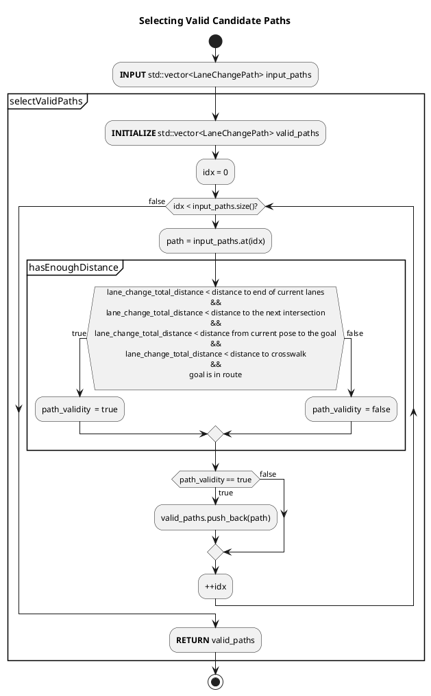
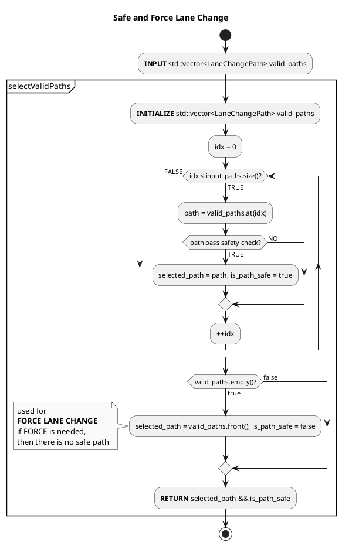
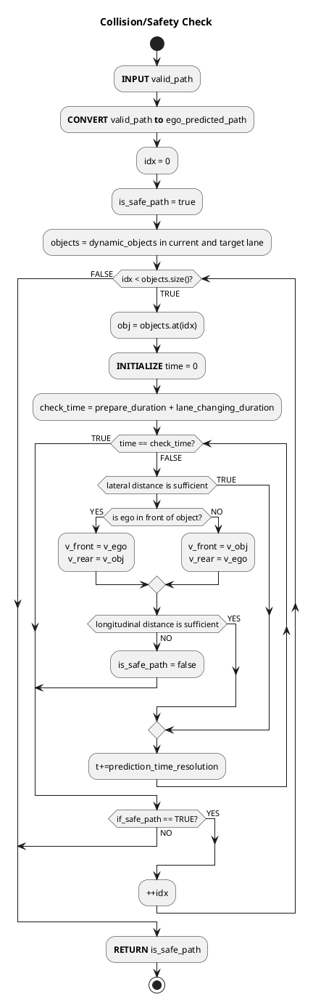
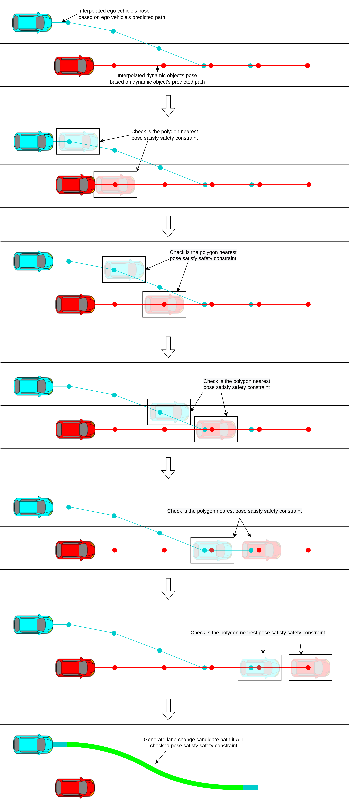
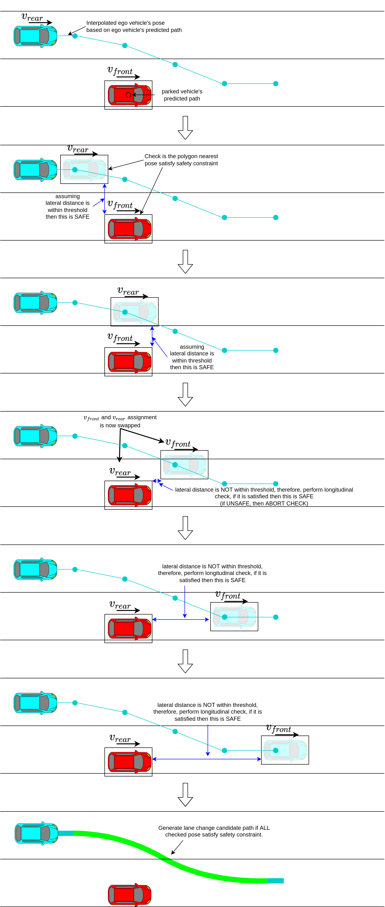
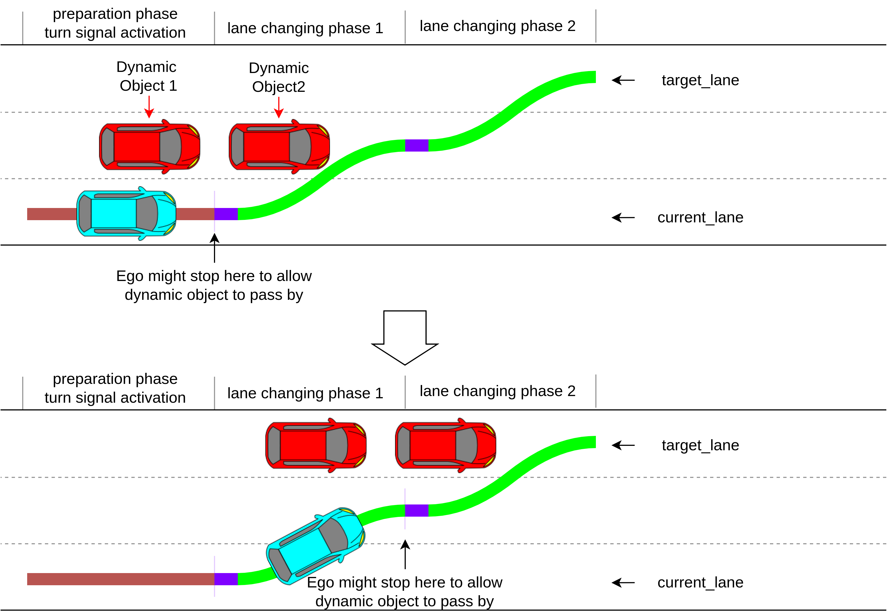
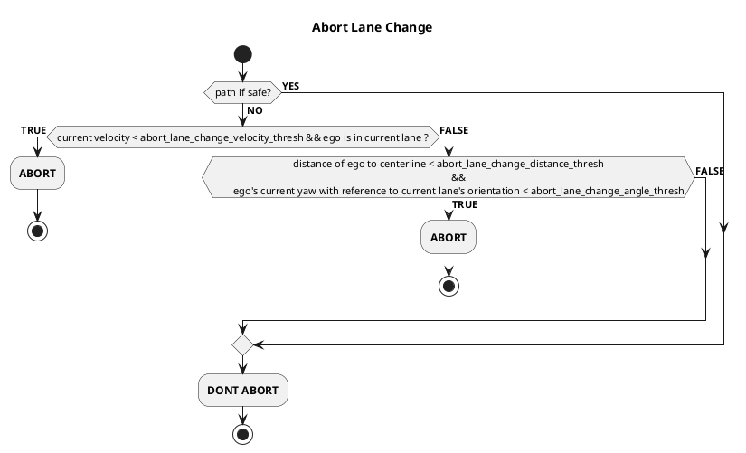
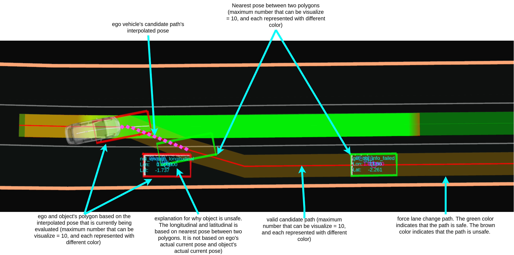

# Lane Change

The Lane Change module is activated when lane change is needed and can be safely executed.

## Lane Change Requirement

- During lane change request condition
  - The ego-vehicle isn’t on a `preferred_lane`.
  - There is neither intersection nor crosswalk on the path of the lane change
- lane change ready condition
  - Path of the lane change does not collide with other dynamic objects (see the figure below)
  - Lane change candidate path is approved by an operator.

## Generating Lane Change Candidate Path

The lane change candidate path is divided into two phases: preparation and lane-changing. The following figure illustrates each phase of the lane change candidate path.


### Preparation phase

The preparation trajectory is the candidate path's first and the straight portion generated along the ego vehicle's current lane. The length of the preparation trajectory is computed as follows.

```C++
lane_change_prepare_distance = max(current_speed * lane_change_prepare_duration + 0.5 * deceleration * lane_change_prepare_duration^2, minimum_lane_change_prepare_distance)
```

During the preparation phase, the turn signal will be activated when the remaining distance is equal to or less than `lane_change_search_distance`.

### Lane-changing phase

The lane-changing phase consist of the shifted path that moves ego from current lane to the target lane. Total distance of lane-changing phase is as follows.

```C++
lane_change_prepare_velocity = current_speed + deceleration * lane_change_prepare_duration
lane_changing_distance = max(lane_change_prepare_velocity * lane_changing_duration + 0.5 * deceleration * lane_changing_duration^2, minimum_lane_change_length + backward_length_buffer_for_end_of_lane)
```

The `backward_length_buffer_for_end_of_lane` is added to allow some window for any possible delay, such as control or mechanical delay during brake lag.

#### Multiple candidate path samples

Lane change velocity is affected by the ego vehicle's current velocity. High velocity requires longer preparation and lane changing distance. However we also need to plan lane changing trajectories in case ego vehicle slows down.
Computing candidate paths that assumes ego vehicle's slows down is performed by substituting predetermined deceleration value into `lane_change_prepare_distance`, `lane_change_prepare_velocity` and `lane_changing_distance` equation.

The predetermined deceleration are a set of value that starts from `deceleration = 0.0`, and decrease by `acceleration_resolution` until it reaches`deceleration = -maximum_deceleration`. The `acceleration_resolution` is determine by the following

```C++
acceleration_resolution = maximum_deceleration / lane_change_sampling_num
```

The following figure illustrates when `lane_change_sampling_num = 4`. Assuming that `maximum_deceleration = 1.0` then `a0 == 0.0 == no deceleration`, `a1 == 0.25`, `a2 == 0.5`, `a3 == 0.75` and `a4 == 1.0 == maximum_deceleration`. `a0` is the expected lane change trajectories should ego vehicle do not decelerate, and `a1`'s path is the expected lane change trajectories should ego vehicle decelerate at `0.25 m/s^2`.


Which path will be chosen will depend on validity and collision check.

#### Candidate Path's validity check

A candidate path is valid if the total lane change distance is less than

1. distance to the end of current lane
2. distance to the next intersection
3. distance from current pose to the goal.
4. distance to the crosswalk.

The goal must also be in the list of the preferred lane.

The following flow chart illustrates the validity check.



#### Candidate Path's Safety check

Valid candidate path is evaluated for safety before is was selected as the output candidate path. The flow of the process is as follows.



If all valid candidate path is unsafe, then the operator will have the option to perform force lane change by using the front-most candidate path as the output. The force lane change will ignore all safety checks.

A candidate path's is safe if it satisfies the following lateral distance criteria,

```C++
lateral distance > lateral_distance_threshold
```

However, suppose the lateral distance is insufficient. In that case, longitudinal distance will be evaluated. The candidate path is safe only when the longitudinal gap between the ego vehicle and the dynamic object is wide enough.

The following charts illustrate the flow of the safety checks



##### Calculating and evaluating longitudinal distance

A sufficient longitudinal gap between vehicles will prevent any rear-end collision from happening. This includes an emergency stop or sudden braking scenarios.

The following information is required to evaluate the longitudinal distance between vehicles

1. estimated speed of the dynamic objects
2. predicted path of dynamic objects
3. ego vehicle's current speed
4. ego vehicle's predicted path (converted/estimated from candidate path)

The following figure illustrates how the safety check is performed on ego vs. dynamic objects.



Let `v_front` and `a_front` be the front vehicle's velocity and deceleration, respectively, and `v_rear` and `a_rear` be the rear vehicle's velocity and deceleration, respectively.
Front vehicle and rear vehicle assignment will depend on which predicted path's pose is currently being evaluated.

The following figure illustrates front and rear vehicle velocity assignment.



Assuming the front vehicle brakes, then `d_front` is the distance the front vehicle will travel until it comes to a complete stop. The distance is computed from the equation of motion, which yield.

```C++
d_front = -std::pow(v_front,2) / (2*a_front)
```

Using the same formula to evaluate the rear vehicle's stopping distance `d_rear` is insufficient. This is because as the rear vehicle's driver saw the front vehicle's sudden brake, it will take some time for the driver to process the information and react by pressing the brake. We call this delay the reaction time.

The reaction time is considered from the duration starting from the driver seeing the front vehicle brake light until the brake is pressed. As the brake is pressed, the time margin (which might be caused by mechanical or control delay) also needs to be considered. With these two parameters included, the formula for `d_rear` will be as follows.

```C++
d_rear = v_rear * rear_vehicle_reaction_time + v_rear * rear_vehicle_safety_time_margin + (-std::pow(v_front,2) / 2 * a_rear)
```

Since there is no absolute value for the deceleration`a_front` and `a_rear`, both of the values are parameterized (`expected_front_deceleration` and `expected_rear_deceleration`, respectively) with the estimation of how much deceleration will occur if the brake is pressed.

The longitudinal distance is evaluated as follows

```C++
d_rear < d_front + d_inter
```

where `d_inter` is the relative longitudinal distance obtained at each evaluated predicted pose.

Finally minimum longitudinal distance for `d_rear` is added to compensate for object to near to each other when `d_rear = 0.0`. This yields

```C++
std::max(longitudinal_distance_min_threshold, d_rear) < d_front + d_inter
```

##### Collision check in prepare phase

The ego vehicle may need to secure ample inter-vehicle distance ahead of the target vehicle before attempting a lane change. The flag `enable_collision_check_at_prepare_phase` can be enabled to gain this behavior. The following image illustrates the differences between the `false` and `true` cases.


The parameter `prepare_phase_ignore_target_speed_thresh` can be configured to ignore the prepare phase collision check for targets whose speeds are less than a specific threshold, such as stationary or very slow-moving objects.

#### If the lane is blocked and multiple lane changes

When driving on the public road with other vehicles, there exist scenarios where lane changes cannot be executed. Suppose the candidate path is evaluated as unsafe, for example, due to incoming vehicles in the adjacent lane. In that case, the ego vehicle can't change lanes, and it is impossible to reach the goal. Therefore, the ego vehicle must stop earlier at a certain distance and wait for the adjacent lane to be evaluated as safe. The minimum stopping distance computation is as follows.

```C++
minimum_lane_change_distance = num_of_lane_changes * (minimum_lane_change_length + backward_length_buffer_for_end_of_lane)
```

The following figure illustrates when the lane is blocked in multiple lane changes cases.



#### Intersection

Lane change in the intersection is prohibited following traffic regulation. Therefore, if the goal is place close passed the intersection, the lane change needs to be completed before ego vehicle enters the intersection region. Similar to the lane blocked case, in case of the path is unsafe, ego vehicle will stop and waits for the dynamic object to pass by.

The following figure illustrate the intersection case.


### Abort lane change

The lane changing process can still be aborted if the proper conditions are satisfied. The following states are validated before the abort request is approved.

1. Ego's current speed is under the threshold, and ego is still in the current lane
2. ego relative distance from the centerline and ego relative yaw from lanelet's orientation is under the threshold.

The following depicts the flow of the abort lane change check.



## Parameters

### Essential lane change parameters

The following parameters are configurable in `behavior_path_planner.param.yaml`.

| Name                                     | Unit | Type   | Description                                                                           | Default value |
| :--------------------------------------- | ---- | ------ | ------------------------------------------------------------------------------------- | ------------- |
| `backward_length_buffer_for_end_of_lane` | [m]  | double | The end of lane buffer to ensure ego vehicle has enough distance to start lane change | 5.0           |
| `minimum_lane_change_length`             | [m]  | double | The minimum distance needed for changing lanes.                                       | 12.0          |

The following parameters are configurable in `lane_change.param.yaml`.

| Name                                       | Unit    | Type    | Description                                                                                                                                                | Default value |
| :----------------------------------------- | ------- | ------- | ---------------------------------------------------------------------------------------------------------------------------------------------------------- | ------------- |
| `lane_change_prepare_duration`             | [m]     | double  | The preparation time for the ego vehicle to be ready to perform lane change.                                                                               | 4.0           |
| `lane_changing_duration`                   | [m]     | double  | The total time that is taken to complete the lane-changing task.                                                                                           | 8.0           |
| `lane_change_finish_judge_buffer`          | [m]     | double  | The additional buffer used to confirm lane change process completion                                                                                       | 3.0           |
| `minimum_lane_change_velocity`             | [m/s]   | double  | Minimum speed during lane changing process.                                                                                                                | 5.6           |
| `prediction_time_resolution`               | [s]     | double  | Time resolution for object's path interpolation and collision check.                                                                                       | 0.5           |
| `maximum_deceleration`                     | [m/s^2] | double  | Ego vehicle maximum deceleration when performing lane change.                                                                                              | 1.0           |
| `lane_change_sampling_num`                 | [-]     | int     | Number of possible lane-changing trajectories that are being influenced by deceleration                                                                    | 10            |
| `use_all_predicted_path`                   | [-]     | boolean | If false, use only the predicted path that has the maximum confidence.                                                                                     | false         |
| `lane_change_search_distance`              | [m]     | double  | The turn signal activation distance during the lane change preparation phase.                                                                              | 30.0          |
| `enable_collision_check_at_prepare_phase`  | [-]     | boolean | Perform collision check starting from prepare phase. If `false`, collision check only evaluated for lane changing phase.                                   | false         |
| `prepare_phase_ignore_target_speed_thresh` | [m/s]   | double  | Ignore collision check in prepare phase of object speed that is lesser that the configured value. `enable_collision_check_at_prepare_phase` must be `true` | 0.1           |

### Collision checks during lane change

The following parameters are configurable in `behavior_path_planner.param.yaml`.

| Name                                  | Unit    | Type   | Description                                                                                                                                                    | Default value |
| :------------------------------------ | ------- | ------ | -------------------------------------------------------------------------------------------------------------------------------------------------------------- | ------------- |
| `lateral_distance_max_threshold`      | [m]     | double | The lateral distance threshold that is used to determine whether lateral distance between two object is enough and whether lane change is safe.                | 5.0           |
| `longitudinal_distance_min_threshold` | [m]     | double | The longitudinal distance threshold that is used to determine whether longitudinal distance between two object is enough and whether lane change is safe.      | 3.0           |
| `expected_front_deceleration`         | [m/s^2] | double | The front object's maximum deceleration when the front vehicle perform sudden braking. (\*2)                                                                   | -1.0          |
| `expected_rear_deceleration`          | [m/s^2] | double | The rear object's maximum deceleration when the rear vehicle perform sudden braking. (\*2)                                                                     | -1.0          |
| `rear_vehicle_reaction_time`          | [s]     | double | The reaction time of the rear vehicle driver which starts from the driver noticing the sudden braking of the front vehicle until the driver step on the brake. | 2.0           |
| `rear_vehicle_safety_time_margin`     | [s]     | double | The time buffer for the rear vehicle to come into complete stop when its driver perform sudden braking.                                                        | 2.0           |

(\*2) the value must be negative.

### Abort lane change

The following parameters are configurable in `lane_change.param.yaml`.

| Name                                   | Unit  | Type    | Description                                                                          | Default value |
| :------------------------------------- | ----- | ------- | ------------------------------------------------------------------------------------ | ------------- |
| `enable_abort_lane_change`             | [-]   | boolean | Enable abort lane change. (\*1)                                                      | false         |
| `abort_lane_change_velocity_thresh`    | [m/s] | double  | The velocity threshold to abort lane change while ego is still in current lane.      | 0.5           |
| `abort_lane_change_angle_threshold`    | [deg] | double  | The angle threshold based on angle between ego's current yaw and lane's orientation. | 10.0          |
| `abort_lane_change_distance_threshold` | [m]   | double  | The distance threshold based on relative distance from ego pose to the centerline.   | 0.3           |

### Debug

The following parameters are configurable in `lane_change.param.yaml`.

| Name                   | Unit | Type    | Description                  | Default value |
| :--------------------- | ---- | ------- | ---------------------------- | ------------- |
| `publish_debug_marker` | [-]  | boolean | Flag to publish debug marker | false         |

## Debug Marker & Visualization

To enable the debug marker, execute `ros2 param set /planning/scenario_planning/lane_driving/behavior_planning/behavior_path_planner lane_change.publish_debug_marker true` (no restart is needed) or simply set the `publish_debug_marker` to `true` in the `lane_change.param.yaml` for permanent effect (restart is needed). Then add the marker `/planning/scenario_planning/lane_driving/behavior_planning/behavior_path_planner/debug/lanechange` in `rviz2`.


