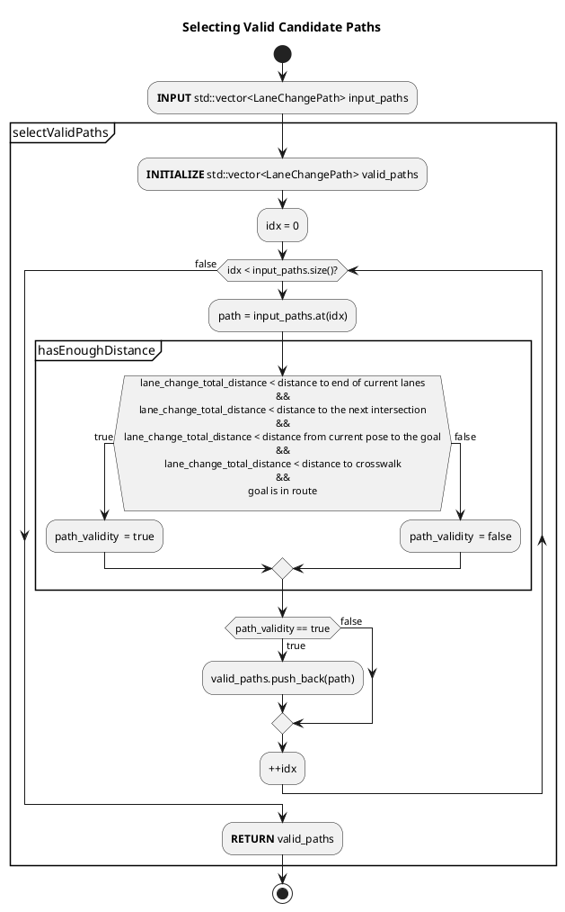
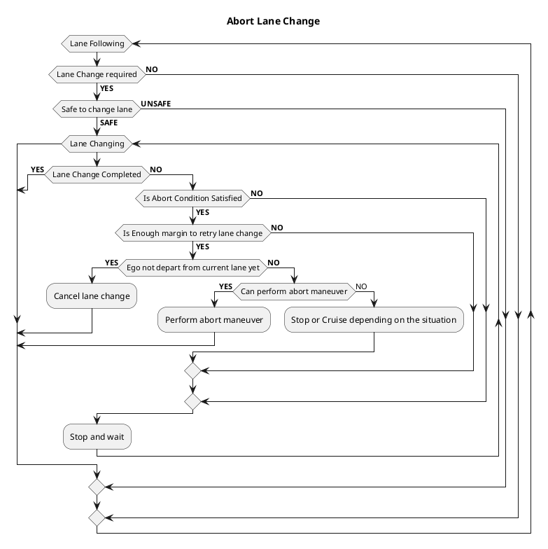
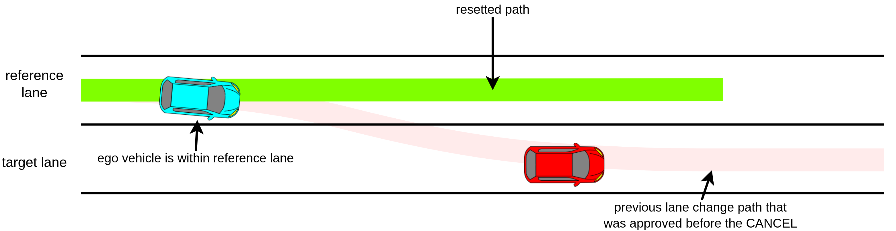
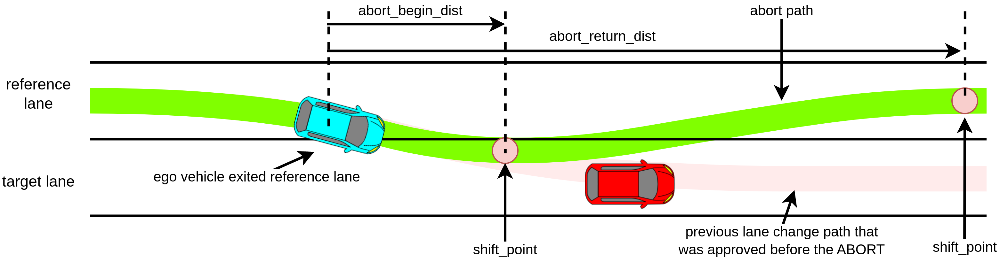
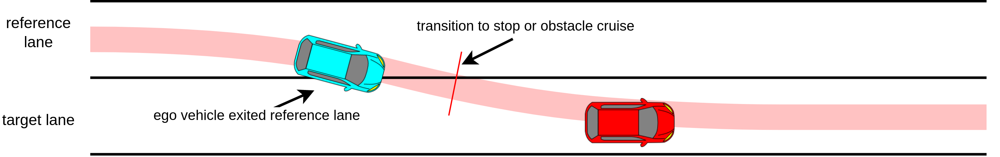

# Lane Change design

The Lane Change module is activated when lane change is needed and can be safely executed.

## Lane Change Requirement

- During lane change request condition
  - The ego-vehicle isn’t on a `preferred_lane`.
  - There is neither intersection nor crosswalk on the path of the lane change
- lane change ready condition
  - Path of the lane change does not collide with other dynamic objects (see the figure below)
  - Lane change candidate path is approved by an operator.

## Generating Lane Change Candidate Path

The lane change candidate path is divided into two phases: preparation and lane-changing. The following figure illustrates each phase of the lane change candidate path.


### Preparation phase

The preparation trajectory is the candidate path's first and the straight portion generated along the ego vehicle's current lane. The length of the preparation trajectory is computed as follows.

```C++
lane_change_prepare_distance = current_speed * lane_change_prepare_duration + 0.5 * deceleration * lane_change_prepare_duration^2
```

During the preparation phase, the turn signal will be activated when the remaining distance is equal to or less than `lane_change_search_distance`.

### Lane-changing phase

The lane-changing phase consist of the shifted path that moves ego from current lane to the target lane. Total distance of lane-changing phase is as follows. Note that during the lane changing phase, the ego vehicle travels at a constant speed.

```C++
lane_change_prepare_velocity = std::max(current_speed + deceleration * lane_change_prepare_duration, minimum_lane_changing_velocity)
lane_changing_distance = lane_change_prepare_velocity * lane_changing_duration
```

The `backward_length_buffer_for_end_of_lane` is added to allow some window for any possible delay, such as control or mechanical delay during brake lag.

#### Multiple candidate path samples

Lane change velocity is affected by the ego vehicle's current velocity. High velocity requires longer preparation and lane changing distance. However we also need to plan lane changing trajectories in case ego vehicle slows down.
Computing candidate paths that assumes ego vehicle's slows down is performed by substituting predetermined deceleration value into `prepare_length`, `prepare_velocity` and `lane_changing_length` equation.

The predetermined deceleration are a set of value that starts from `deceleration = 0.0`, and decrease by `acceleration_resolution` until it reaches`deceleration = -maximum_deceleration`. `maximum_deceleration` is defined in the `common.param` file as `normal.min_acc`. The `acceleration_resolution` is determine by the following

```C++
acceleration_resolution = maximum_deceleration / lane_change_sampling_num
```

Note that when the `current_velocity` is lower than `minimum_lane_changing_velocity`, the vehicle needs to accelerate its velocity to `minimum_lane_changing_velocity`. Therefore, the acceleration becomes positive value (not deceleration).

The following figure illustrates when `lane_change_sampling_num = 4`. Assuming that `maximum_deceleration = 1.0` then `a0 == 0.0 == no deceleration`, `a1 == 0.25`, `a2 == 0.5`, `a3 == 0.75` and `a4 == 1.0 == maximum_deceleration`. `a0` is the expected lane change trajectories should ego vehicle do not decelerate, and `a1`'s path is the expected lane change trajectories should ego vehicle decelerate at `0.25 m/s^2`.


Which path will be chosen will depend on validity and collision check.

#### Candidate Path's validity check

A candidate path is valid if the total lane change distance is less than

1. distance to the end of current lane
2. distance to the next intersection
3. distance from current pose to the goal.
4. distance to the crosswalk.

The goal must also be in the list of the preferred lane.

The following flow chart illustrates the validity check.



#### Candidate Path's Safety check

See [safety check utils explanation](../docs/behavior_path_planner_safety_check.md)

##### Collision check in prepare phase

The ego vehicle may need to secure ample inter-vehicle distance ahead of the target vehicle before attempting a lane change. The flag `enable_collision_check_at_prepare_phase` can be enabled to gain this behavior. The following image illustrates the differences between the `false` and `true` cases.


The parameter `prepare_phase_ignore_target_speed_thresh` can be configured to ignore the prepare phase collision check for targets whose speeds are less than a specific threshold, such as stationary or very slow-moving objects.

#### If the lane is blocked and multiple lane changes

When driving on the public road with other vehicles, there exist scenarios where lane changes cannot be executed. Suppose the candidate path is evaluated as unsafe, for example, due to incoming vehicles in the adjacent lane. In that case, the ego vehicle can't change lanes, and it is impossible to reach the goal. Therefore, the ego vehicle must stop earlier at a certain distance and wait for the adjacent lane to be evaluated as safe. The minimum stopping distance can be computed from shift length and minimum lane changing velocity.

```C++
lane_changing_time = f(shift_length, lat_acceleration, lat_jerk)
minimum_lane_change_distance = minimum_prepare_length + minimum_lane_changing_velocity * lane_changing_time + backward_length_buffer_for_end_of_lane
```

The following figure illustrates when the lane is blocked in multiple lane changes cases.


#### Intersection

Lane change in the intersection is prohibited following traffic regulation. Therefore, if the goal is place close passed the intersection, the lane change needs to be completed before ego vehicle enters the intersection region. Similar to the lane blocked case, in case of the path is unsafe, ego vehicle will stop and waits for the dynamic object to pass by.

The following figure illustrate the intersection case.


### Aborting lane change

The abort process may result in three different outcome; Cancel, Abort and Stop/Cruise.

The following depicts the flow of the abort lane change check.



#### Cancel

Suppose the lane change trajectory is evaluated as unsafe. In that case, if the ego vehicle has not departed from the current lane yet, the trajectory will be reset, and the ego vehicle will resume the lane following the maneuver.

The function can be enabled by setting `enable_cancel_lane_change` to `true`.

The following image illustrates the cancel process.



#### Abort

Assume the ego vehicle has already departed from the current lane. In that case, it is dangerous to cancel the path, and it will cause the ego vehicle to change the heading direction abruptly. In this case, planning a trajectory that allows the ego vehicle to return to the current path while minimizing the heading changes is necessary. In this case, the lane change module will generate an abort path. The following images show an example of the abort path. Do note that the function DOESN'T GUARANTEE a safe abort process, as it didn't check the presence of the surrounding objects and/or their reactions. The function can be enable manually by setting both `enable_cancel_lane_change` and `enable_abort_lane_change` to `true`. The parameter `abort_max_lateral_jerk` need to be set to a high value in order for it to work.



#### Stop/Cruise

The last behavior will also occur if the ego vehicle has departed from the current lane. If the abort function is disabled or the abort is no longer possible, the ego vehicle will attempt to stop or transition to the obstacle cruise mode. Do note that the module DOESN'T GUARANTEE safe maneuver due to the unexpected behavior that might've occurred during these critical scenarios. The following images illustrate the situation.



## Parameters

### Essential lane change parameters

The following parameters are configurable in `lane_change.param.yaml`.

| Name                                     | Unit   | Type   | Description                                                                             | Default value |
| :--------------------------------------- | ------ | ------ | --------------------------------------------------------------------------------------- | ------------- |
| `prepare_duration`                       | [m]    | double | The preparation time for the ego vehicle to be ready to perform lane change.            | 4.0           |
| `lane_changing_safety_check_duration`    | [m]    | double | The total time that is taken to complete the lane-changing task.                        | 8.0           |
| `backward_length_buffer_for_end_of_lane` | [m]    | double | The end of lane buffer to ensure ego vehicle has enough distance to start lane change   | 2.0           |
| `lane_change_finish_judge_buffer`        | [m]    | double | The additional buffer used to confirm lane change process completion                    | 3.0           |
| `lane_changing_lateral_jerk`             | [m/s3] | double | Lateral jerk value for lane change path generation                                      | 0.5           |
| `lane_changing_lateral_acc`              | [m/s2] | double | Lateral acceleration value for lane change path generation                              | 0.5           |
| `minimum_lane_changing_velocity`         | [m/s]  | double | Minimum speed during lane changing process.                                             | 2.78          |
| `prediction_time_resolution`             | [s]    | double | Time resolution for object's path interpolation and collision check.                    | 0.5           |
| `lane_change_sampling_num`               | [-]    | int    | Number of possible lane-changing trajectories that are being influenced by deceleration | 10            |

### Collision checks during lane change

The following parameters are configurable in `behavior_path_planner.param.yaml`.

| Name                                       | Unit    | Type    | Description                                                                                                                                                    | Default value |
| :----------------------------------------- | ------- | ------- | -------------------------------------------------------------------------------------------------------------------------------------------------------------- | ------------- |
| `lateral_distance_max_threshold`           | [m]     | double  | The lateral distance threshold that is used to determine whether lateral distance between two object is enough and whether lane change is safe.                | 2.0           |
| `longitudinal_distance_min_threshold`      | [m]     | double  | The longitudinal distance threshold that is used to determine whether longitudinal distance between two object is enough and whether lane change is safe.      | 3.0           |
| `expected_front_deceleration`              | [m/s^2] | double  | The front object's maximum deceleration when the front vehicle perform sudden braking. (\*1)                                                                   | -1.0          |
| `expected_rear_deceleration`               | [m/s^2] | double  | The rear object's maximum deceleration when the rear vehicle perform sudden braking. (\*1)                                                                     | -1.0          |
| `rear_vehicle_reaction_time`               | [s]     | double  | The reaction time of the rear vehicle driver which starts from the driver noticing the sudden braking of the front vehicle until the driver step on the brake. | 2.0           |
| `rear_vehicle_safety_time_margin`          | [s]     | double  | The time buffer for the rear vehicle to come into complete stop when its driver perform sudden braking.                                                        | 2.0           |
| `enable_collision_check_at_prepare_phase`  | [-]     | boolean | Perform collision check starting from prepare phase. If `false`, collision check only evaluated for lane changing phase.                                       | true          |
| `prepare_phase_ignore_target_speed_thresh` | [m/s]   | double  | Ignore collision check in prepare phase of object speed that is lesser that the configured value. `enable_collision_check_at_prepare_phase` must be `true`     | 0.1           |
| `use_predicted_path_outside_lanelet`       | [-]     | boolean | If true, include collision check for predicted path that is out of lanelet (freespace).                                                                        | false         |
| `use_all_predicted_path`                   | [-]     | boolean | If false, use only the predicted path that has the maximum confidence.                                                                                         | true          |

(\*1) the value must be negative.

### Abort lane change

The following parameters are configurable in `lane_change.param.yaml`.

| Name                        | Unit | Type    | Description                             | Default value |
| :-------------------------- | ---- | ------- | --------------------------------------- | ------------- |
| `enable_cancel_lane_change` | [-]  | boolean | Enable cancel lane change               | true          |
| `enable_abort_lane_change`  | [-]  | boolean | Enable abort lane change.               | false         |
| `abort_delta_time`          | [s]  | double  | The time taken to start aborting.       | 3.0           |
| `abort_max_lateral_jerk`    | [s]  | double  | The maximum lateral jerk for abort path | 1000.0        |

### Debug

The following parameters are configurable in `lane_change.param.yaml`.

| Name                   | Unit | Type    | Description                  | Default value |
| :--------------------- | ---- | ------- | ---------------------------- | ------------- |
| `publish_debug_marker` | [-]  | boolean | Flag to publish debug marker | false         |

## Debug Marker & Visualization

To enable the debug marker, execute `ros2 param set /planning/scenario_planning/lane_driving/behavior_planning/behavior_path_planner lane_change.publish_debug_marker true` (no restart is needed) or simply set the `publish_debug_marker` to `true` in the `lane_change.param.yaml` for permanent effect (restart is needed). Then add the marker `/planning/scenario_planning/lane_driving/behavior_planning/behavior_path_planner/debug/lanechange` in `rviz2`.


