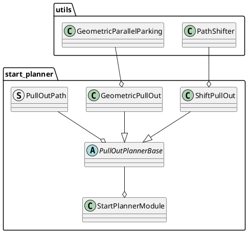

# Start Planner design

## Purpose / Role

Pull out from the shoulder lane without colliding with objects.

## Design

## General parameters for start_planner

| Name                              | Unit  | Type   | Description                                                          | Default value |
| :-------------------------------- | :---- | :----- | :------------------------------------------------------------------- | :------------ |
| th_arrived_distance_m             | [m]   | double | distance threshold for arrival of path termination                   | 1.0           |
| th_stopped_velocity_mps           | [m/s] | double | velocity threshold for arrival of path termination                   | 0.01          |
| th_stopped_time_sec               | [s]   | double | time threshold for arrival of path termination                       | 1.0           |
| th_blinker_on_lateral_offset      | [m]   | double | lateral distance threshold for turning on blinker                    | 1.0           |
| collision_check_margin            | [m]   | double | Obstacle collision check margin                                      | 1.0           |
| collision_check_distance_from_end | [m]   | double | collision check distance from end point. currently only for pull out | 15.0          |

## **Safe check with obstacles in shoulder lane**

1. Calculate ego-vehicle's footprint on pull out path between from current position to pull out end point. (Illustrated by blue frame)
2. Calculate object's polygon which is located in shoulder lane
3. If a distance between the footprint and the polygon is lower than the threshold (default: `1.0 m`), that is judged as a unsafe path

### **Path Generation**

There are two path generation methods.

#### **shift pull out**

Pull out distance is calculated by the speed, lateral deviation, and the lateral jerk. The lateral jerk is searched for among the predetermined minimum and maximum values, and the one that generates a safe path is selected.

- Generate the shoulder lane centerline and shift it to the current position.
- In the section between merge start and end, path is shifted by a method that is used to generate avoidance path (four segmental constant jerk polynomials)
- Combine this path with center line of road lane

[shift pull out video](https://user-images.githubusercontent.com/39142679/187872468-6d5057ee-e039-499b-afc7-fe0dc8052a6b.mp4)

##### parameters for shift pull out

| Name                            | Unit   | Type   | Description                                                                                                          | Default value |
| :------------------------------ | :----- | :----- | :------------------------------------------------------------------------------------------------------------------- | :------------ |
| enable_shift_pull_out           | [-]    | bool   | flag whether to enable shift pull out                                                                                | true          |
| shift_pull_out_velocity         | [m/s]  | double | velocity of shift pull out                                                                                           | 2.0           |
| pull_out_sampling_num           | [-]    | int    | Number of samplings in the minimum to maximum range of lateral_jerk                                                  | 4             |
| maximum_lateral_jerk            | [m/s3] | double | maximum lateral jerk                                                                                                 | 2.0           |
| minimum_lateral_jerk            | [m/s3] | double | minimum lateral jerk                                                                                                 | 0.1           |
| minimum_shift_pull_out_distance | [m]    | double | minimum shift pull out distance. if calculated pull out distance is shorter than this, use this for path generation. | 0.0           |

#### **geometric pull out**

Generate two arc paths with discontinuous curvature. Ego-vehicle stops once in the middle of the path to control the steer on the spot.
See also [[1]](https://www.sciencedirect.com/science/article/pii/S1474667015347431) for details of the algorithm.

[geometric pull out video](https://user-images.githubusercontent.com/39142679/181024707-3e7ca5ee-62de-4334-b9e9-ded313de1ea1.mp4)

##### parameters for geometric pull out

| Name                        | Unit  | Type   | Description                                                                                                                                                | Default value |
| :-------------------------- | :---- | :----- | :--------------------------------------------------------------------------------------------------------------------------------------------------------- | :------------ |
| enable_geometric_pull_out   | [-]   | bool   | flag whether to enable geometric pull out                                                                                                                  | true          |
| divide_pull_out_path        | [-]   | bool   | flag whether to divide arc paths.　The path is assumed to be divided because the curvature is not continuous. But it requires a stop during the departure. | false         |
| geometric_pull_out_velocity | [m/s] | double | velocity of geometric pull out                                                                                                                             | 1.0           |
| arc_path_interval           | [m]   | double | path points interval of arc paths of geometric pull out                                                                                                    | 1.0           |
| lane_departure_margin       | [m]   | double | margin of deviation to lane right                                                                                                                          | 0.2           |
| pull_out_max_steer_angle    | [rad] | double | maximum steer angle for path generation                                                                                                                    | 0.26          |

### **backward pull out start point search**

If a safe path cannot be generated from the current position, search backwards for a pull out start point at regular intervals(default: `2.0`).

[pull out after backward driving video](https://user-images.githubusercontent.com/39142679/181025149-8fb9fb51-9b8f-45c4-af75-27572f4fba78.mp4)

#### **parameters for backward pull out start point search**

| Name                          | Unit | Type   | Description                                                                                                                                                          | Default value  |
| :---------------------------- | :--- | :----- | :------------------------------------------------------------------------------------------------------------------------------------------------------------------- | :------------- |
| enable_back                   | [-]  | bool   | flag whether to search backward for start_point                                                                                                                      | true           |
| search_priority               | [-]  | string | In the case of `efficient_path`, use efficient paths even if the back distance is longer. In case of `short_back_distance`, use a path with as short a back distance | efficient_path |
| max_back_distance             | [m]  | double | maximum back distance                                                                                                                                                | 30.0           |
| backward_search_resolution    | [m]  | double | distance interval for searching backward pull out start point                                                                                                        | 2.0            |
| backward_path_update_duration | [s]  | double | time interval for searching backward pull out start point. this prevents chattering between back driving and pull_out                                                | 3.0            |
| ignore_distance_from_lane_end | [m]  | double | distance from end of pull out lanes for ignoring start candidates                                                                                                    | 15.0           |
