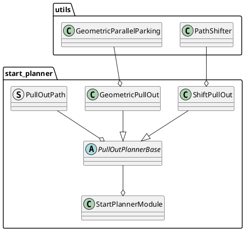

# Start Planner design

## Purpose / Role

This module generates and plans a path for safely merging from the shoulder lane or side of road lane into the center of the road lane.

Specifically, it includes the following features:

- Plan the path to automatically start from the shoulder lane or side of road lane to center of road lane.
- When parked vehicles are present on the shoulder lane, the module generates a path that allows for starting with a gap of a specified margin.
- If a collision with other traffic participants is detected while traveling on the generated path, it will stop as much as possible.

<figure markdown>
  {width=1100}
</figure>

## Use Cases

Give an typical example of how path generation is executed. Showing example of path generation starts from shoulder lane, but also from side of road lane can be generated.

<figure markdown>
  {width=1100}
</figure>

### **Use Case 1: Shift pull out**

In the shoulder lane, when there are no parked vehicles ahead and the shoulder lane is sufficiently long, a forward shift pull out path (a clothoid curve with consistent jerk) is generated.

<figure markdown>
  {width=1100}
</figure>

### **Use Case 2: Geometric pull out**

In the shoulder lane, when there are objects in front and the lane is not sufficiently long behind, a geometric pull out path is generated.

<figure markdown>
  {width=1100}
</figure>

### **Use Case 3: Backward and shift pull out**

In the shoulder lane, when there are parked vehicles ahead and the lane is sufficiently long behind, a path that involves reversing before generating a forward shift pull out path is created.

<figure markdown>
  {width=1100}
</figure>

### **Use Case 4: Backward and geometric pull out**

In the shoulder lane, when there is an object ahead and not enough space to reverse sufficiently, a path that involves reversing before making an geometric pull out is generated.

<figure markdown>
  {width=1100}
</figure>

### **Use Case 5: Freespace pull out**

If the map is annotated with the information that a free space path can be generated in situations where both shift and geometric pull out paths are impossible to create, a path based on the free space algorithm will be generated.

<figure markdown>
  {width=1100}
</figure>

**As a note, the patterns for generating these paths are based on default parameters, but as will be explained in the following sections, it is possible to control aspects such as making paths that involve reversing more likely to be generated, or making geometric paths more likely to be generated, by changing the path generation policy or adjusting the margin around static objects.**

## Limitations

Here are some notable limitations:

- If parked vehicles exist in front of, behind, or on both sides of the shoulder, and it's not possible to maintain a specified distance from them, a stopping path will be generated, leading to a potential deadlock.
- In the default settings of the behavior_path_planner, an avoidance module operates in a later stage and attempts to avoid objects. However, it is not guaranteed that the start_planner module will output a path that can successfully navigate around obstacles. This means that if an unavoidable path is generated, it could result in a deadlock.
- The performance of safety check relies on the accuracy of the predicted paths generated by the map_based_prediction node. It's important to note that, currently, predicted paths that consider acceleration are not generated, and paths for low-speed objects may not be accurately produced, which requires caution.
- Given the current specifications of the rule-based algorithms, there is a trade-off between the safety of a path and its naturalness to humans. While it's possible to adjust parameters to manage this trade-off, improvements are necessary to better reconcile these aspects.

## Design

## General parameters for start_planner

| Name                                                        | Unit  | Type     | Description                                                                 | Default value   |
| :---------------------------------------------------------- | :---- | :------- | :-------------------------------------------------------------------------- | :-------------- |
| th_arrived_distance_m                                       | [m]   | double   | distance threshold for arrival of path termination                          | 1.0             |
| th_distance_to_middle_of_the_road                           | [m]   | double   | distance threshold to determine if the vehicle is on the middle of the road | 0.1             |
| th_stopped_velocity_mps                                     | [m/s] | double   | velocity threshold for arrival of path termination                          | 0.01            |
| th_stopped_time_sec                                         | [s]   | double   | time threshold for arrival of path termination                              | 1.0             |
| th_turn_signal_on_lateral_offset                            | [m]   | double   | lateral distance threshold for turning on blinker                           | 1.0             |
| intersection_search_length                                  | [m]   | double   | check if intersections exist within this length                             | 30.0            |
| length_ratio_for_turn_signal_deactivation_near_intersection | [m]   | double   | deactivate turn signal of this module near intersection                     | 0.5             |
| collision_check_margins                                     | [m]   | [double] | Obstacle collision check margins list                                       | [2.0, 1.5, 1.0] |
| collision_check_distance_from_end                           | [m]   | double   | collision check distance from end shift end pose                            | 1.0             |
| collision_check_margin_from_front_object                    | [m]   | double   | collision check margin from front object                                    | 5.0             |
| center_line_path_interval                                   | [m]   | double   | reference center line path point interval                                   | 1.0             |

## Safety check with static obstacles

1. Calculate ego-vehicle's footprint on pull out path between from current position to pull out end point. (Illustrated by blue frame)
2. Calculate object's polygon
3. If a distance between the footprint and the polygon is lower than the threshold (default: `1.0 m`), that is judged as a unsafe path

## Safety check with dynamic obstacles

### **Basic concept of safety check against dynamic obstacles**

This is based on the concept of RSS. For the logic used, refer to the link below.
See [safety check feature explanation](../behavior_path_planner_common/docs/behavior_path_planner_safety_check.md)

### **Collision check performed range**

A collision check with dynamic objects is primarily performed between the shift start point and end point. The range for safety check varies depending on the type of path generated, so it will be explained for each pattern.

#### **Shift pull out**

For the "shift pull out", safety verification starts at the beginning of the shift and ends at the shift's conclusion.

#### **Geometric pull out**

Since there's a stop at the midpoint during the shift, this becomes the endpoint for safety verification. After stopping, safety verification resumes.

#### **Backward pull out start point search**

During backward movement, no safety check is performed. Safety check begins at the point where the backward movement ends.

### **Ego vehicle's velocity planning**

WIP

### **Safety check in free space area**

WIP

## Parameters for safety check

### Stop Condition Parameters

Parameters under `stop_condition` define the criteria for stopping conditions.

| Name                          | Unit    | Type   | Description                             | Default value |
| :---------------------------- | :------ | :----- | :-------------------------------------- | :------------ |
| maximum_deceleration_for_stop | [m/s^2] | double | Maximum deceleration allowed for a stop | 1.0           |
| maximum_jerk_for_stop         | [m/s^3] | double | Maximum jerk allowed for a stop         | 1.0           |

### Ego Predicted Path Parameters

Parameters under `path_safety_check.ego_predicted_path` specify the ego vehicle's predicted path characteristics.

| Name                          | Unit    | Type   | Description                                          | Default value |
| :---------------------------- | :------ | :----- | :--------------------------------------------------- | :------------ |
| min_velocity                  | [m/s]   | double | Minimum velocity of the ego vehicle's predicted path | 0.0           |
| acceleration                  | [m/s^2] | double | Acceleration for the ego vehicle's predicted path    | 1.0           |
| max_velocity                  | [m/s]   | double | Maximum velocity of the ego vehicle's predicted path | 1.0           |
| time_horizon_for_front_object | [s]     | double | Time horizon for predicting front objects            | 10.0          |
| time_horizon_for_rear_object  | [s]     | double | Time horizon for predicting rear objects             | 10.0          |
| time_resolution               | [s]     | double | Time resolution for the ego vehicle's predicted path | 0.5           |
| delay_until_departure         | [s]     | double | Delay until the ego vehicle departs                  | 1.0           |

### Target Object Filtering Parameters

Parameters under `target_filtering` are related to filtering target objects for safety check.

| Name                                            | Unit  | Type   | Description                                        | Default value |
| :---------------------------------------------- | :---- | :----- | :------------------------------------------------- | :------------ |
| safety_check_time_horizon                       | [s]   | double | Time horizon for safety check                      | 5.0           |
| safety_check_time_resolution                    | [s]   | double | Time resolution for safety check                   | 1.0           |
| object_check_forward_distance                   | [m]   | double | Forward distance for object detection              | 10.0          |
| object_check_backward_distance                  | [m]   | double | Backward distance for object detection             | 100.0         |
| ignore_object_velocity_threshold                | [m/s] | double | Velocity threshold below which objects are ignored | 1.0           |
| object_types_to_check.check_car                 | -     | bool   | Flag to check cars                                 | true          |
| object_types_to_check.check_truck               | -     | bool   | Flag to check trucks                               | true          |
| object_types_to_check.check_bus                 | -     | bool   | Flag to check buses                                | true          |
| object_types_to_check.check_trailer             | -     | bool   | Flag to check trailers                             | true          |
| object_types_to_check.check_bicycle             | -     | bool   | Flag to check bicycles                             | true          |
| object_types_to_check.check_motorcycle          | -     | bool   | Flag to check motorcycles                          | true          |
| object_types_to_check.check_pedestrian          | -     | bool   | Flag to check pedestrians                          | true          |
| object_types_to_check.check_unknown             | -     | bool   | Flag to check unknown object types                 | false         |
| object_lane_configuration.check_current_lane    | -     | bool   | Flag to check the current lane                     | true          |
| object_lane_configuration.check_right_side_lane | -     | bool   | Flag to check the right side lane                  | true          |
| object_lane_configuration.check_left_side_lane  | -     | bool   | Flag to check the left side lane                   | true          |
| object_lane_configuration.check_shoulder_lane   | -     | bool   | Flag to check the shoulder lane                    | true          |
| object_lane_configuration.check_other_lane      | -     | bool   | Flag to check other lanes                          | false         |
| include_opposite_lane                           | -     | bool   | Flag to include the opposite lane in check         | false         |
| invert_opposite_lane                            | -     | bool   | Flag to invert the opposite lane check             | false         |
| check_all_predicted_path                        | -     | bool   | Flag to check all predicted paths                  | true          |
| use_all_predicted_path                          | -     | bool   | Flag to use all predicted paths                    | true          |
| use_predicted_path_outside_lanelet              | -     | bool   | Flag to use predicted paths outside of lanelets    | false         |

### Safety Check Parameters

Parameters under `safety_check_params` define the configuration for safety check.

| Name                                           | Unit | Type   | Description                                 | Default value |
| :--------------------------------------------- | :--- | :----- | :------------------------------------------ | :------------ |
| enable_safety_check                            | -    | bool   | Flag to enable safety check                 | true          |
| check_all_predicted_path                       | -    | bool   | Flag to check all predicted paths           | true          |
| publish_debug_marker                           | -    | bool   | Flag to publish debug markers               | false         |
| rss_params.rear_vehicle_reaction_time          | [s]  | double | Reaction time for rear vehicles             | 2.0           |
| rss_params.rear_vehicle_safety_time_margin     | [s]  | double | Safety time margin for rear vehicles        | 1.0           |
| rss_params.lateral_distance_max_threshold      | [m]  | double | Maximum lateral distance threshold          | 2.0           |
| rss_params.longitudinal_distance_min_threshold | [m]  | double | Minimum longitudinal distance threshold     | 3.0           |
| rss_params.longitudinal_velocity_delta_time    | [s]  | double | Delta time for longitudinal velocity        | 0.8           |
| hysteresis_factor_expand_rate                  | -    | double | Rate to expand/shrink the hysteresis factor | 1.0           |

## **Path Generation**

There are two path generation methods.

### **shift pull out**

This is the most basic method of starting path planning and is used on road lanes and shoulder lanes when there is no particular obstruction.

Pull out distance is calculated by the speed, lateral deviation, and the lateral jerk. The lateral jerk is searched for among the predetermined minimum and maximum values, and the one that generates a safe path is selected.

- Generate the road lane centerline and shift it to the current position.
- In the section between merge start and end, path is shifted by a method that is used to generate avoidance path (four segmental constant jerk polynomials)
- Combine this path with center line of road lane

[shift pull out video](https://user-images.githubusercontent.com/39142679/187872468-6d5057ee-e039-499b-afc7-fe0dc8052a6b.mp4)

#### parameters for shift pull out

| Name                            | Unit   | Type   | Description                                                                                                          | Default value |
| :------------------------------ | :----- | :----- | :------------------------------------------------------------------------------------------------------------------- | :------------ |
| enable_shift_pull_out           | [-]    | bool   | flag whether to enable shift pull out                                                                                | true          |
| check_shift_path_lane_departure | [-]    | bool   | flag whether to check if shift path footprints are out of lane                                                       | false         |
| shift_pull_out_velocity         | [m/s]  | double | velocity of shift pull out                                                                                           | 2.0           |
| pull_out_sampling_num           | [-]    | int    | Number of samplings in the minimum to maximum range of lateral_jerk                                                  | 4             |
| maximum_lateral_jerk            | [m/s3] | double | maximum lateral jerk                                                                                                 | 2.0           |
| minimum_lateral_jerk            | [m/s3] | double | minimum lateral jerk                                                                                                 | 0.1           |
| minimum_shift_pull_out_distance | [m]    | double | minimum shift pull out distance. if calculated pull out distance is shorter than this, use this for path generation. | 0.0           |
| maximum_curvature               | [m]    | double | maximum curvature. The pull out distance is calculated so that the curvature is smaller than this value.             | 0.07          |

### **geometric pull out**

Generate two arc paths with discontinuous curvature. Ego-vehicle stops once in the middle of the path to control the steer on the spot.
See also [[1]](https://www.sciencedirect.com/science/article/pii/S1474667015347431) for details of the algorithm.

[geometric pull out video](https://user-images.githubusercontent.com/39142679/181024707-3e7ca5ee-62de-4334-b9e9-ded313de1ea1.mp4)

#### parameters for geometric pull out

| Name                        | Unit  | Type   | Description                                                                                                                                               | Default value |
| :-------------------------- | :---- | :----- | :-------------------------------------------------------------------------------------------------------------------------------------------------------- | :------------ |
| enable_geometric_pull_out   | [-]   | bool   | flag whether to enable geometric pull out                                                                                                                 | true          |
| divide_pull_out_path        | [-]   | bool   | flag whether to divide arc paths. The path is assumed to be divided because the curvature is not continuous. But it requires a stop during the departure. | false         |
| geometric_pull_out_velocity | [m/s] | double | velocity of geometric pull out                                                                                                                            | 1.0           |
| arc_path_interval           | [m]   | double | path points interval of arc paths of geometric pull out                                                                                                   | 1.0           |
| lane_departure_margin       | [m]   | double | margin of deviation to lane right                                                                                                                         | 0.2           |
| pull_out_max_steer_angle    | [rad] | double | maximum steer angle for path generation                                                                                                                   | 0.26          |

## **backward pull out start point search**

If a safe path cannot be generated from the current position, search backwards for a pull out start point at regular intervals(default: `2.0`).

[pull out after backward driving video](https://user-images.githubusercontent.com/39142679/181025149-8fb9fb51-9b8f-45c4-af75-27572f4fba78.mp4)

### **search priority**

If a safe path with sufficient clearance for static obstacles cannot be generated forward, a backward search from the vehicle's current position is conducted to locate a suitable start point for a pull out path generation.

During this backward search, different policies can be applied based on `search_priority` parameters:

Selecting `efficient_path` focuses on creating a shift pull out path, regardless of how far back the vehicle needs to move.
Opting for `short_back_distance` aims to find a location with the least possible backward movement.

`PriorityOrder` is defined as a vector of pairs, where each element consists of a `size_t` index representing a start pose candidate index, and the planner type. The PriorityOrder vector is processed sequentially from the beginning, meaning that the pairs listed at the top of the vector are given priority in the selection process for pull out path generation.

#### `efficient_path`

When `search_priority` is set to `efficient_path` and the preference is for prioritizing `shift_pull_out`, the `PriorityOrder` array is populated in such a way that `shift_pull_out` is grouped together for all start pose candidates before moving on to the next planner type. This prioritization is reflected in the order of the array, with `shift_pull_out` being listed before geometric_pull_out.

| Index | Planner Type       |
| ----- | ------------------ |
| 0     | shift_pull_out     |
| 1     | shift_pull_out     |
| ...   | ...                |
| N     | shift_pull_out     |
| 0     | geometric_pull_out |
| 1     | geometric_pull_out |
| ...   | ...                |
| N     | geometric_pull_out |

This approach prioritizes trying all candidates with `shift_pull_out` before proceeding to `geometric_pull_out`, which may be efficient in situations where `shift_pull_out` is likely to be appropriate.

#### `short_back_distance`

For `search_priority` set to `short_back_distance`, the array alternates between planner types for each start pose candidate, which can minimize the distance the vehicle needs to move backward if the earlier candidates are successful.

| Index | Planner Type       |
| ----- | ------------------ |
| 0     | shift_pull_out     |
| 0     | geometric_pull_out |
| 1     | shift_pull_out     |
| 1     | geometric_pull_out |
| ...   | ...                |
| N     | shift_pull_out     |
| N     | geometric_pull_out |

This ordering is beneficial when the priority is to minimize the backward distance traveled, giving an equal chance for each planner to succeed at the closest possible starting position.

### **parameters for backward pull out start point search**

| Name                          | Unit | Type   | Description                                                                                                                                                          | Default value  |
| :---------------------------- | :--- | :----- | :------------------------------------------------------------------------------------------------------------------------------------------------------------------- | :------------- |
| enable_back                   | [-]  | bool   | flag whether to search backward for start_point                                                                                                                      | true           |
| search_priority               | [-]  | string | In the case of `efficient_path`, use efficient paths even if the back distance is longer. In case of `short_back_distance`, use a path with as short a back distance | efficient_path |
| max_back_distance             | [m]  | double | maximum back distance                                                                                                                                                | 30.0           |
| backward_search_resolution    | [m]  | double | distance interval for searching backward pull out start point                                                                                                        | 2.0            |
| backward_path_update_duration | [s]  | double | time interval for searching backward pull out start point. this prevents chattering between back driving and pull_out                                                | 3.0            |
| ignore_distance_from_lane_end | [m]  | double | If distance from shift start pose to end of shoulder lane is less than this value, this start pose candidate is ignored                                              | 15.0           |

### **freespace pull out**

If the vehicle gets stuck with pull out along lanes, execute freespace pull out.
To run this feature, you need to set `parking_lot` to the map, `activate_by_scenario` of [costmap_generator](../costmap_generator/README.md) to `false` and `enable_freespace_planner` to `true`

#### Unimplemented parts / limitations for freespace pull out

- When a short path is generated, the ego does can not drive with it.
- Complex cases take longer to generate or fail.
- The drivable area is not guaranteed to fit in the parking_lot.

#### Parameters freespace parking

| Name                           | Unit | Type   | Description                                                                                                                              | Default value |
| :----------------------------- | :--- | :----- | :--------------------------------------------------------------------------------------------------------------------------------------- | :------------ |
| enable_freespace_planner       | [-]  | bool   | this flag activates a free space pullout that is executed when a vehicle is stuck due to obstacles in the lanes where the ego is located | true          |
| end_pose_search_start_distance | [m]  | double | distance from ego to the start point of the search for the end point in the freespace_pull_out driving lane                              | 20.0          |
| end_pose_search_end_distance   | [m]  | double | distance from ego to the end point of the search for the end point in the freespace_pull_out driving lane                                | 30.0          |
| end_pose_search_interval       | [m]  | bool   | interval to search for the end point in the freespace_pull_out driving lane                                                              | 2.0           |

See [freespace_planner](../freespace_planner/README.md) for other parameters.
