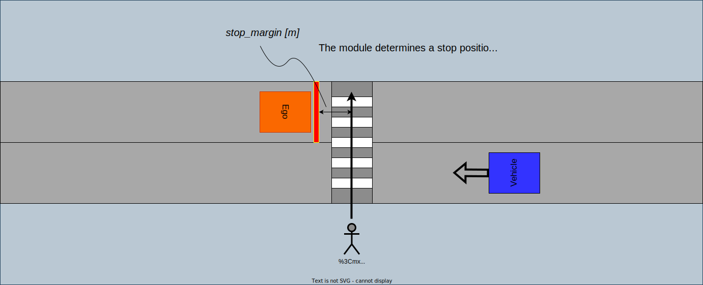
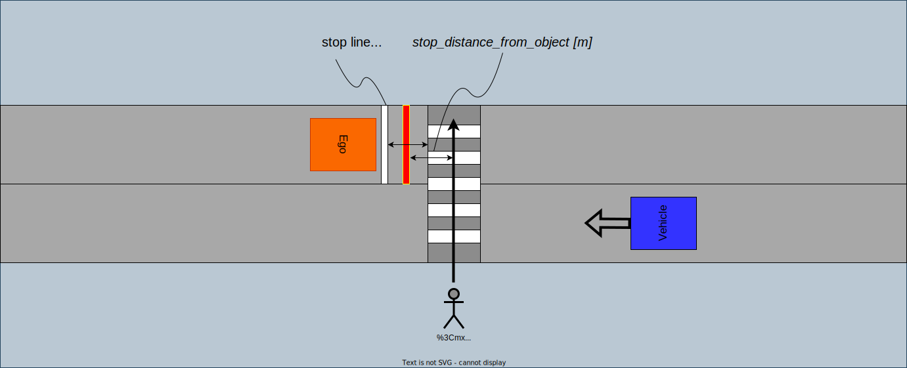
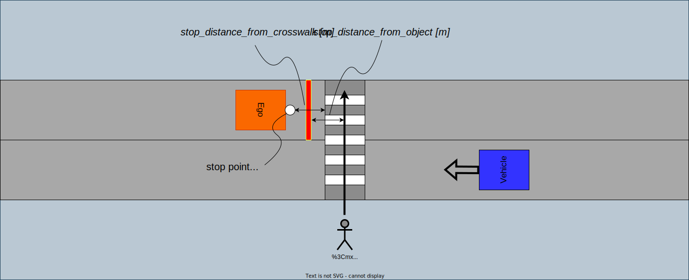
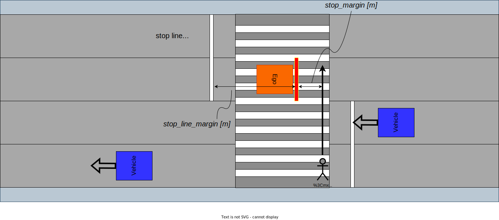
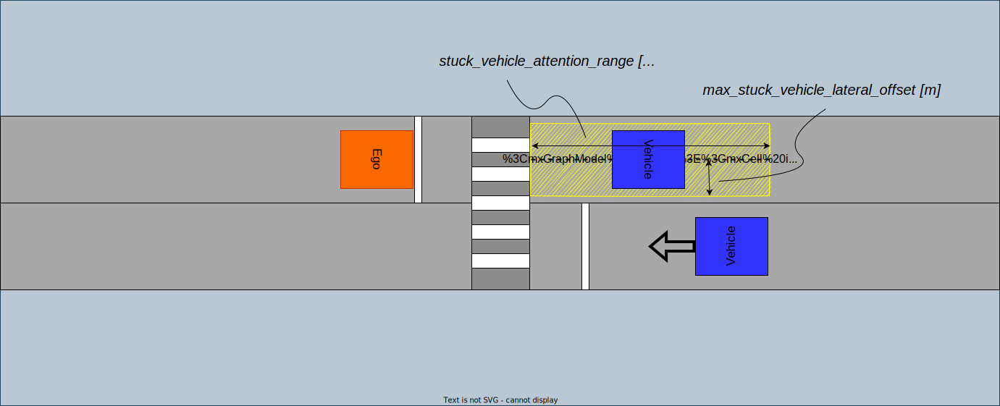
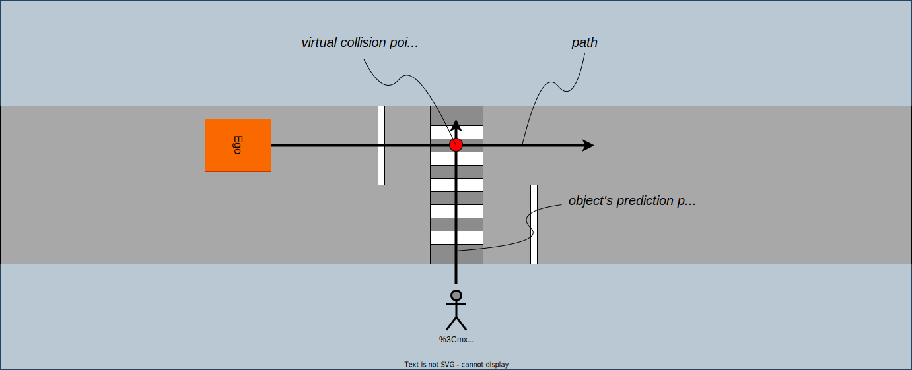
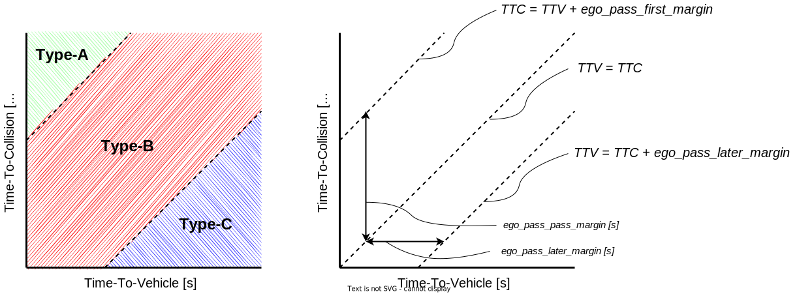
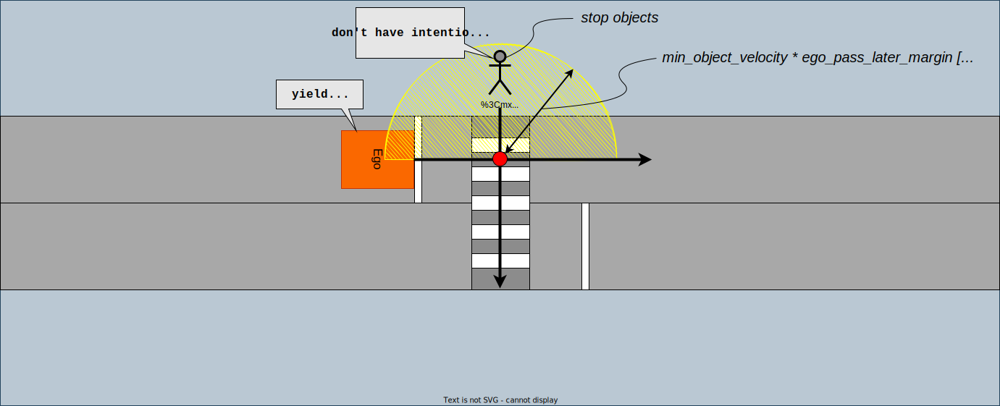

## Crosswalk

### Role

This module judges whether the ego should stop in front of the crosswalk in order to provide safe passage of pedestrians and bicycles based on object's behavior and surround traffic.

<figure markdown>
  {width=1000}
  <figcaption>crosswalk module</figcaption>
</figure>

### Activation Timing

The manager launch crosswalk scene modules when the reference path conflicts crosswalk lanelets.

### Module Parameters

#### Common parameters

| Parameter                     | Type | Description                     |
| ----------------------------- | ---- | ------------------------------- |
| `common.show_processing_time` | bool | whether to show processing time |

#### Parameters for input data

| Parameter                            | Type   | Description                                    |
| ------------------------------------ | ------ | ---------------------------------------------- |
| `common.traffic_light_state_timeout` | double | [s] timeout threshold for traffic light signal |

#### Parameters for stop position

The crosswalk module determines a stop position at least `stop_distance_from_object` away from the object.

<figure markdown>
  {width=1000}
  <figcaption>stop margin</figcaption>
</figure>

The stop line is the reference point for the stopping position of the vehicle, but if there is no stop line in front of the crosswalk, the position `stop_distance_from_crosswalk` meters before the crosswalk is the virtual stop line for the vehicle. Then, if the stop position determined from `stop_distance_from_object` exists in front of the stop line determined from the HDMap or `stop_distance_from_crosswalk`, the actual stop position is determined according to `stop_distance_from_object` in principle, and vice versa.

<figure markdown>
  {width=700}
  <figcaption>explicit stop line</figcaption>
</figure>

<figure markdown>
  {width=700}
  <figcaption>virtual stop point</figcaption>
</figure>

On the other hand, if pedestrian (bicycle) is crossing **wide** crosswalks seen in scramble intersections, and the pedestrian position is more than `far_object_threshold` meters away from the stop line, the actual stop position is determined to be `stop_distance_from_object` and pedestrian position, not at the stop line.

<figure markdown>
  {width=1000}
  <figcaption>stop at wide crosswalk</figcaption>
</figure>

See the workflow in algorithms section.

| Parameter                                    | Type   | Description                                                                                                                                                               |
| -------------------------------------------- | ------ | ------------------------------------------------------------------------------------------------------------------------------------------------------------------------- |
| `stop_position.stop_distance_from_object`    | double | [m] the vehicle decelerates to be able to stop in front of object with margin                                                                                             |
| `stop_position.stop_distance_from_crosswalk` | double | [m] make stop line away from crosswalk when no explicit stop line exists                                                                                                  |
| `stop_position.far_object_threshold`         | double | [m] if objects cross X meters behind the stop line, the stop position is determined according to the object position (stop_distance_from_object meters before the object) |
| `stop_position.stop_position_threshold`      | double | [m] threshold for check whether the vehicle stop in front of crosswalk                                                                                                    |

#### Parameters for ego's slow down velocity

| Parameter             | Type   | Description                                                                                                                 |
| --------------------- | ------ | --------------------------------------------------------------------------------------------------------------------------- |
| `slow_velocity`       | double | [m/s] target vehicle velocity when module receive slow down command from FOA                                                |
| `max_slow_down_jerk`  | double | [m/sss] minimum jerk deceleration for safe brake                                                                            |
| `max_slow_down_accel` | double | [m/ss] minimum accel deceleration for safe brake                                                                            |
| `no_relax_velocity`   | double | [m/s] if the current velocity is less than X m/s, ego always stops at the stop position(not relax deceleration constraints) |

#### Parameters for stuck vehicle

If there are low speed or stop vehicle ahead of the crosswalk, and there is not enough space between the crosswalk and the vehicle (see following figure), closing the distance to that vehicle could cause Ego to be stuck on the crosswalk. So, in this situation, this module plans to stop before the crosswalk and wait until the vehicles move away, even if there are no pedestrians or bicycles.

<figure markdown>
  {width=1000}
  <figcaption>stuck vehicle attention range</figcaption>
</figure>

| Parameter                                        | Type   | Description                                                            |
| ------------------------------------------------ | ------ | ---------------------------------------------------------------------- |
| `stuck_vehicle.stuck_vehicle_velocity`           | double | [m/s] maximum velocity threshold whether the vehicle is stuck          |
| `stuck_vehicle.max_stuck_vehicle_lateral_offset` | double | [m] maximum lateral offset for stuck vehicle position should be looked |
| `stuck_vehicle.stuck_vehicle_attention_range`    | double | [m] the detection area is defined as X meters behind the crosswalk     |

#### Parameters for pass judge logic

Also see algorithm section.

| Parameter                                   | Type   | Description                                                                                                                                        |
| ------------------------------------------- | ------ | -------------------------------------------------------------------------------------------------------------------------------------------------- |
| `pass_judge.ego_pass_first_margin`          | double | [s] time margin for ego pass first situation                                                                                                       |
| `pass_judge.ego_pass_later_margin`          | double | [s] time margin for object pass first situation                                                                                                    |
| `pass_judge.stop_object_velocity_threshold` | double | [m/s] velocity threshold for the module to judge whether the objects is stopped                                                                    |
| `pass_judge.min_object_velocity`            | double | [m/s] minimum object velocity (compare the estimated velocity by perception module with this parameter and adopt the larger one to calculate TTV.) |
| `pass_judge.timeout_no_intention_to_walk`   | double | [s] if the pedestrian does not move for X seconds after stopping before the crosswalk, the module judge that ego is able to pass first.            |
| `pass_judge.timeout_ego_stop_for_yield`     | double | [s] the amount of time which ego should be stopping to query whether it yields or not.                                                             |

#### Parameters for object filtering

As a countermeasure against pedestrians attempting to cross outside the crosswalk area, this module watches not only the crosswalk zebra area but also in front of and behind space of the crosswalk, and if there are pedestrians or bicycles attempting to pass through the watch area, this module judges whether ego should pass or stop.

<figure markdown>
  {width=1000}
  <figcaption>crosswalk attention range</figcaption>
</figure>

This module mainly looks the following objects as target objects. There are also optional flags that enables the pass/stop decision for `motorcycle` and `unknown` objects.

- pedestrian
- bicycle

| Parameter                   | Type   | Description                                                                                           |
| --------------------------- | ------ | ----------------------------------------------------------------------------------------------------- |
| `crosswalk_attention_range` | double | [m] the detection area is defined as -X meters before the crosswalk to +X meters behind the crosswalk |
| `target/unknown`            | bool   | whether to look and stop by UNKNOWN objects                                                           |
| `target/bicycle`            | bool   | whether to look and stop by BICYCLE objects                                                           |
| `target/motorcycle`         | bool   | whether to look and stop MOTORCYCLE objects                                                           |
| `target/pedestrian`         | bool   | whether to look and stop PEDESTRIAN objects                                                           |

### Inner-workings / Algorithms

#### Stop position

The stop position is determined by the existence of the stop line defined by the HDMap, the positional relationship between the stop line and the pedestrians and bicycles, and each parameter.

```plantuml
start
:calculate stop point from **stop_distance_from_object** (POINT-1);
if (There is the stop line in front of the crosswalk?) then (yes)
  :calculate stop point from stop line (POINT-2.1);
else (no)
  :calculate stop point from **stop_distance_from_crosswalk** (POINT-2.2);
endif
if (The distance ego to **POINT-1** is shorter than the distance ego to **POINT-2**) then (yes)
  :ego stops at POINT-1;
else if (The distance ego to **POINT-1** is longer than the distance ego to **POINT-2** + **far_object_threshold**) then (yes)
  :ego stops at POINT-1;
else (no)
  :ego stops at POINT-2;
endif
end
```

#### Pass judge logic

At first, this module determines whether the pedestrians or bicycles are likely to cross the crosswalk based on the color of the pedestrian traffic light signal related to the crosswalk. Only when the pedestrian traffic signal is **RED**, this module judges that the objects will not cross the crosswalk and skip the pass judge logic.

Secondly, this module makes a decision as to whether ego should stop in front of the crosswalk or pass through based on the relative relationship between TTC(Time-To-Collision) and TTV(Time-To-Vehicle). The TTC is the time it takes for ego to reach the virtual collision point, and the TTV is the time it takes for the object to reach the virtual collision point.

<figure markdown>
  {width=1000}
  <figcaption>virtual collision point</figcaption>
</figure>

Depending on the relative relationship between TTC and TTV, the ego's behavior at crosswalks can be classified into three categories.

1. **TTC >> TTV**: The objects have enough time to cross first before ego reaches the crosswalk. (Type-A)
2. **TTC ≒ TTV**: There is a risk of a near miss and collision between ego and objects at the virtual collision point. (Type-B)
3. **TTC << TTV**: Ego has enough time to path through the crosswalk before the objects reach the virtual collision point. (Type-C)

This module judges that ego is able to pass through the crosswalk without collision risk when the relative relationship between TTC and TTV is **Type-A** and **Type-C**. On the other hand, this module judges that ego needs to stop in front of the crosswalk prevent collision with objects in **Type-B** condition. The time margin can be set by parameters `ego_pass_first_margin` and `ego_pass_later_margin`. This logic is designed based on [1].

<figure markdown>
  {width=1000}
  <figcaption>time-to-collision vs time-to-vehicle</figcaption>
</figure>

This module uses the larger value of estimated object velocity and `min_object_velocity` in calculating TTV in order to avoid division by zero.

```plantuml
start
if (Pedestrian's traffic light signal is **RED**?) then (yes)
else (no)
  if (There are objects around the crosswalk?) then (yes)
    :calculate TTC & TTV;
    if (TTC < TTV + **ego_pass_first_margin** && TTV < TTC + **ego_pass_later_margin**) then (yes)
      :STOP;
    else (no)
      :PASS;
    endif
  endif
endif
end
```

#### Dead lock prevention

If there are objects stop within a radius of `min_object_velocity * ego_pass_later_margin` meters from virtual collision point, this module judges that ego should stop based on the pass judge logic described above at all times. In such a situation, even if the pedestrian has no intention of crossing, ego continues the stop decision on the spot. So, this module has another logic for dead lock prevention, and if the object continues to stop for more than `timeout_no_intention_to_walk` seconds after ego stops in front of the crosswalk, this module judges that the object has no intention of crossing and switches from **STOP** state to **PASS** state. The parameter `stop_object_velocity_threshold` is used to judge whether the objects are stopped or not. In addition, if the object starts to move after the module judges that the object has no intention of crossing, this module judges whether ego should stop or not once again.

<figure markdown>
  {width=1000}
  <figcaption>dead lock situation</figcaption>
</figure>

#### Safety Slow Down Behavior

In current autoware implementation if there are no target objects around a crosswalk, ego vehicle
will not slow down for the crosswalk. However, if ego vehicle to slow down to a certain speed in
such cases is wanted then it is possible by adding some tags to the related crosswalk definition as
it is instructed
in [lanelet2_format_extension.md](https://github.com/autowarefoundation/autoware_common/blob/main/tmp/lanelet2_extension/docs/lanelet2_format_extension.md)
document.

### Limitations

When multiple crosswalks are nearby (such as intersection), this module may make a stop decision even at crosswalks where the object has no intention of crossing.

<figure markdown>
  {width=1000}
  <figcaption>design limits</figcaption>
</figure>

### Known Issues

### Debugging

By `ros2 run behavior_velocity_crosswalk_module time_to_collision_plotter.py`, you can visualize the following figure of the ego and pedestrian's time to collision.
The label of each plot is `<crosswalk module id>-<pedestrian uuid>`.

<figure markdown>
  {width=1000}
  <figcaption>Plot of time to collision</figcaption>
</figure>

### References/External links

[1] 佐藤 みなみ, 早坂 祥一, 清水 政行, 村野 隆彦, 横断歩行者に対するドライバのリスク回避行動のモデル化, 自動車技術会論文集, 2013, 44 巻, 3 号, p. 931-936.
