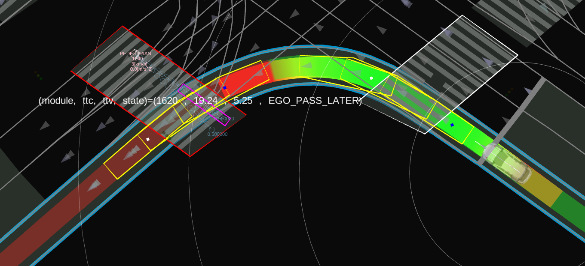

# Crosswalk

## Role

This module judges whether the ego should stop in front of the crosswalk in order to provide safe passage for crosswalk users, such as pedestrians and bicycles, based on the objects' behavior and surround traffic.

<figure markdown>
  {width=1100}
</figure>

## Features

### Yield

#### Target Object

The crosswalk module handles objects of the types defined by the following parameters in the `object_filtering.target_object` namespace.

| Parameter    | Unit | Type | Description                                    |
| ------------ | ---- | ---- | ---------------------------------------------- |
| `unknown`    | [-]  | bool | whether to look and stop by UNKNOWN objects    |
| `pedestrian` | [-]  | bool | whether to look and stop by PEDESTRIAN objects |
| `bicycle`    | [-]  | bool | whether to look and stop by BICYCLE objects    |
| `motorcycle` | [-]  | bool | whether to look and stop by MOTORCYCLE objects |

In order to handle the crosswalk users crossing the neighborhood but outside the crosswalk, the crosswalk module creates an attention area around the crosswalk, shown as the yellow polygon in the figure. If the object's predicted path collides with the attention area, the object will be targeted for yield.

<figure markdown>
  {width=600}
</figure>

The neighborhood is defined by the following parameter in the `object_filtering.target_object` namespace.

| Parameter                   | Unit | Type   | Description                                                                                       |
| --------------------------- | ---- | ------ | ------------------------------------------------------------------------------------------------- |
| `crosswalk_attention_range` | [m]  | double | the detection area is defined as -X meters before the crosswalk to +X meters behind the crosswalk |

#### Stop Position

First of all, `stop_distance_from_object [m]` is always kept at least between the ego and the target object for safety.

When the stop line exists in the lanelet map, the stop position is calculated based on the line.
When the stop line does **NOT** exist in the lanelet map, the stop position is calculated by keeping `stop_distance_from_crosswalk [m]` between the ego and the crosswalk.

<div align="center">
    <table>
        <tr>
            <td></td>
            <td></td>
        </tr>
    </table>
</div>

As an exceptional case, if a pedestrian (or bicycle) is crossing **wide** crosswalks seen in scramble intersections, and the pedestrian position is more than `far_object_threshold` meters away from the stop line, the actual stop position is determined by `stop_distance_from_object` and pedestrian position, not at the stop line.

<figure markdown>
  {width=700}
</figure>

In the `stop_position` namespace, the following parameters are defined.

| Parameter                      |     | Type   | Description                                                                                                                                                                                                               |
| ------------------------------ | --- | ------ | ------------------------------------------------------------------------------------------------------------------------------------------------------------------------------------------------------------------------- |
| `stop_position_threshold`      | [m] | double | If the ego vehicle has stopped near the stop line than this value, this module assumes itself to have achieved yielding.                                                                                                  |
| `stop_distance_from_crosswalk` | [m] | double | make stop line away from crosswalk for the Lanelet2 map with no explicit stop lines                                                                                                                                       |
| `far_object_threshold`         | [m] | double | If objects cross X meters behind the stop line, the stop position is determined according to the object position (stop_distance_from_object meters before the object) for the case where the crosswalk width is very wide |
| `stop_distance_from_object`    | [m] | double | the vehicle decelerates to be able to stop in front of object with margin                                                                                                                                                 |

#### Yield decision

The module makes a decision to yield only when the pedestrian traffic light is **GREEN** or **UNKNOWN**.
The decision is based on the following variables, along with the calculation of the collision point.

- Time-To-Collision (TTC): The time for the **ego** to reach the virtual collision point.
- Time-To-Vehicle (TTV): The time for the **object** to reach the virtual collision point.

We classify ego behavior at crosswalks into three categories according to the relative relationship between TTC and TTV [1].

- A. **TTC >> TTV**: The object has enough time to cross before the ego.
  - No stop planning.
- B. **TTC ≒ TTV**: There is a risk of collision.
  - **Stop point is inserted in the ego's path**.
- C. **TTC << TTV**: Ego has enough time to cross before the object.
  - No stop planning.

<div align="center">
    <table>
        <tr>
            <td></td>
            <td></td>
        </tr>
    </table>
</div>

The boundary of A and B is interpolated from `ego_pass_later_margin_x` and `ego_pass_later_margin_y`.
In the case of the upper figure, `ego_pass_later_margin_x` is `{0, 1, 2}` and `ego_pass_later_margin_y` is `{1, 4, 6}`.
In the same way, the boundary of B and C is calculated from `ego_pass_first_margin_x` and `ego_pass_first_margin_y`.
In the case of the upper figure, `ego_pass_first_margin_x` is `{3, 5}` and `ego_pass_first_margin_y` is `{0, 1}`.

In the `pass_judge` namespace, the following parameters are defined.

| Parameter                          |       | Type   | Description                                                                                                                                     |
| ---------------------------------- | ----- | ------ | ----------------------------------------------------------------------------------------------------------------------------------------------- |
| `ego_pass_first_margin_x`          | [[s]] | double | time to collision margin vector for ego pass first situation (the module judges that ego don't have to stop at TTC + MARGIN < TTV condition)    |
| `ego_pass_first_margin_y`          | [[s]] | double | time to vehicle margin vector for ego pass first situation (the module judges that ego don't have to stop at TTC + MARGIN < TTV condition)      |
| `ego_pass_first_additional_margin` | [s]   | double | additional time margin for ego pass first situation to suppress chattering                                                                      |
| `ego_pass_later_margin_x`          | [[s]] | double | time to vehicle margin vector for object pass first situation (the module judges that ego don't have to stop at TTV + MARGIN < TTC condition)   |
| `ego_pass_later_margin_y`          | [[s]] | double | time to collision margin vector for object pass first situation (the module judges that ego don't have to stop at TTV + MARGIN < TTC condition) |
| `ego_pass_later_additional_margin` | [s]   | double | additional time margin for object pass first situation to suppress chattering                                                                   |

### Smooth Yield Decision

If the object is stopped near the crosswalk but has no intention of walking, a situation can arise in which the ego continues to yield the right-of-way to the object.
To prevent such a deadlock situation, the ego will cancel yielding depending on the situation.

#### Cases without traffic lights

For the object stopped around the crosswalk but has no intention to walk (\*1), after the ego has keep stopping to yield for a specific time (\*2), the ego cancels the yield and starts driving.

\*1:
The time is calculated by the interpolation of distance between the object and crosswalk with `distance_map_for_no_intention_to_walk` and `timeout_map_for_no_intention_to_walk`.

In the `pass_judge` namespace, the following parameters are defined.

| Parameter                               |       | Type   | Description                                                                       |
| --------------------------------------- | ----- | ------ | --------------------------------------------------------------------------------- |
| `distance_map_for_no_intention_to_walk` | [[m]] | double | distance map to calculate the timeout for no intention to walk with interpolation |
| `timeout_map_for_no_intention_to_walk`  | [[s]] | double | timeout map to calculate the timeout for no intention to walk with interpolation  |

\*2:
In the `pass_judge` namespace, the following parameters are defined.

| Parameter                    |     | Type   | Description                                                                                                             |
| ---------------------------- | --- | ------ | ----------------------------------------------------------------------------------------------------------------------- |
| `timeout_ego_stop_for_yield` | [s] | double | If the ego maintains the stop for this amount of time, then the ego proceeds, assuming it has stopped long time enough. |

#### Cases with traffic lights

The ego will cancel the yield without stopping when the object stops around the crosswalk but has no intention to walk (\*1).
This comes from the assumption that the object has no intention to walk since it is stopped even though the pedestrian traffic light is green.

\*1:
The crosswalk user's intention to walk is calculated in the same way as `Cases without traffic lights`.

<div align="center">
    <table>
        <tr>
            <td></td>
            <td></td>
        </tr>
    </table>
</div>

#### New Object Handling

Due to the perception's limited performance where the tree or poll is recognized as a pedestrian or the tracking failure in the crowd or occlusion, even if the surrounding environment does not change, the new pedestrian (= the new ID's pedestrian) may suddenly appear unexpectedly.
If this happens while the ego is going to pass the crosswalk, the ego will stop suddenly.

To deal with this issue, the option `disable_yield_for_new_stopped_object` is prepared.
If true is set, the yield decisions around the crosswalk with a traffic light will ignore the new stopped object.

In the `pass_judge` namespace, the following parameters are defined.

| Parameter                              |     | Type | Description                                                                                      |
| -------------------------------------- | --- | ---- | ------------------------------------------------------------------------------------------------ |
| `disable_yield_for_new_stopped_object` | [-] | bool | If set to true, the new stopped object will be ignored around the crosswalk with a traffic light |

### Safety Slow Down Behavior

In the current autoware implementation, if no target object is detected around a crosswalk, the ego vehicle will not slow down for the crosswalk.
However, it may be desirable to slow down in situations, for example, where there are blind spots.
Such a situation can be handled by setting some tags to the related crosswalk as instructed in the [lanelet2_format_extension.md](https://github.com/autowarefoundation/autoware_common/blob/main/tmp/lanelet2_extension/docs/lanelet2_format_extension.md)
document.

| Parameter             |         | Type   | Description                                                                                                           |
| --------------------- | ------- | ------ | --------------------------------------------------------------------------------------------------------------------- |
| `slow_velocity`       | [m/s]   | double | target vehicle velocity when module receive slow down command from FOA                                                |
| `max_slow_down_jerk`  | [m/sss] | double | minimum jerk deceleration for safe brake                                                                              |
| `max_slow_down_accel` | [m/ss]  | double | minimum accel deceleration for safe brake                                                                             |
| `no_relax_velocity`   | [m/s]   | double | if the current velocity is less than X m/s, ego always stops at the stop position(not relax deceleration constraints) |

### Stuck Vehicle Detection

The feature will make the ego not to stop on the crosswalk.
When there is a low-speed or stopped vehicle ahead of the crosswalk, and there is not enough space between the crosswalk and the vehicle, the crosswalk module plans to stop before the crosswalk even if there are no pedestrians or bicycles.

`min_acc`, `min_jerk`, and `max_jerk` are met. If the ego cannot stop before the crosswalk with these parameters, the stop position will move forward.

<figure markdown>
  {width=600}
</figure>

In the `stuck_vehicle` namespace, the following parameters are defined.

| Parameter                          | Unit    | Type   | Description                                                             |
| ---------------------------------- | ------- | ------ | ----------------------------------------------------------------------- |
| `stuck_vehicle_velocity`           | [m/s]   | double | maximum velocity threshold whether the target vehicle is stopped or not |
| `max_stuck_vehicle_lateral_offset` | [m]     | double | maximum lateral offset of the target vehicle position                   |
| `stuck_vehicle_attention_range`    | [m]     | double | detection area length ahead of the crosswalk                            |
| `min_acc`                          | [m/ss]  | double | minimum acceleration to stop                                            |
| `min_jerk`                         | [m/sss] | double | minimum jerk to stop                                                    |
| `max_jerk`                         | [m/sss] | double | maximum jerk to stop                                                    |

### Others

In the `common` namespace, the following parameters are defined.

| Parameter                     | Unit | Type   | Description                                                                                                                                     |
| ----------------------------- | ---- | ------ | ----------------------------------------------------------------------------------------------------------------------------------------------- |
| `show_processing_time`        | [-]  | bool   | whether to show processing time                                                                                                                 |
| `traffic_light_state_timeout` | [s]  | double | timeout threshold for traffic light signal                                                                                                      |
| `enable_rtc`                  | [-]  | bool   | if true, the scene modules should be approved by (request to cooperate)rtc function. if false, the module can be run without approval from rtc. |

## Known Issues

- The yield decision may be sometimes aggressive or conservative depending on the case.
  - The main reason is that the crosswalk module does not know the ego's position in the future. The detailed ego's position will be determined after the whole planning.
  - Currently the module assumes that the ego will move with a constant velocity.

## Debugging

### Visualization of debug markers

`/planning/scenario_planning/lane_driving/behavior_planning/behavior_velocity_planner/debug/crosswalk` shows the following markers.

<figure markdown>
  {width=1000}
</figure>

- Yellow polygons
  - Ego footprints' polygon to calculate the collision check.
- Pink polygons
  - Object footprints' polygon to calculate the collision check.
- The color of crosswalks
  - Considering the traffic light's color, red means the target crosswalk, and white means the ignored crosswalk.
- Texts
  - It shows the module ID, TTC, TTV, and the module state.

### Visualization of Time-To-Collision

```sh
ros2 run behavior_velocity_crosswalk_module time_to_collision_plotter.py
```

enables you to visualize the following figure of the ego and pedestrian's time to collision.
The label of each plot is `<crosswalk module id>-<pedestrian uuid>`.

<figure markdown>
  {width=1000}
</figure>

## Trouble Shooting

### Behavior

- Q. The ego stopped around the crosswalk even though there were no crosswalk user objects.
  - A. See [Stuck Vehicle Detection](https://autowarefoundation.github.io/autoware.universe/pr-5583/planning/behavior_velocity_crosswalk_module/#stuck-vehicle-detection).
- Q. The crosswalk virtual wall suddenly appeared resulting in the sudden stop.
  - A. There may be a crosswalk user started moving when the ego was close to the crosswalk.
- Q. The crosswalk module decides to stop even when the pedestrian traffic light is red.
  - A. The lanelet map may be incorrect. The pedestrian traffic light and the crosswalk have to be related.
- Q. In the planning simulation, the crosswalk module does the yield decision to stop on all the crosswalks.
  - A. This is because the pedestrian traffic light is unknown by default. In this case, the crosswalk does the yield decision for safety.

### Parameter Tuning

- Q. The ego's yield behavior is too conservative.
  - A. Tune `ego_pass_later_margin` described in [Yield Decision](https://autowarefoundation.github.io/autoware.universe/pr-5583/planning/behavior_velocity_crosswalk_module/#stuck-vehicle-detection)
- Q. The ego's yield behavior is too aggressive.
  - A. Tune `ego_pass_later_margin` described in [Yield Decision](https://autowarefoundation.github.io/autoware.universe/pr-5583/planning/behavior_velocity_crosswalk_module/#stuck-vehicle-detection)

## References/External links

[1] 佐藤 みなみ, 早坂 祥一, 清水 政行, 村野 隆彦, 横断歩行者に対するドライバのリスク回避行動のモデル化, 自動車技術会論文集, 2013, 44 巻, 3 号, p. 931-936.
