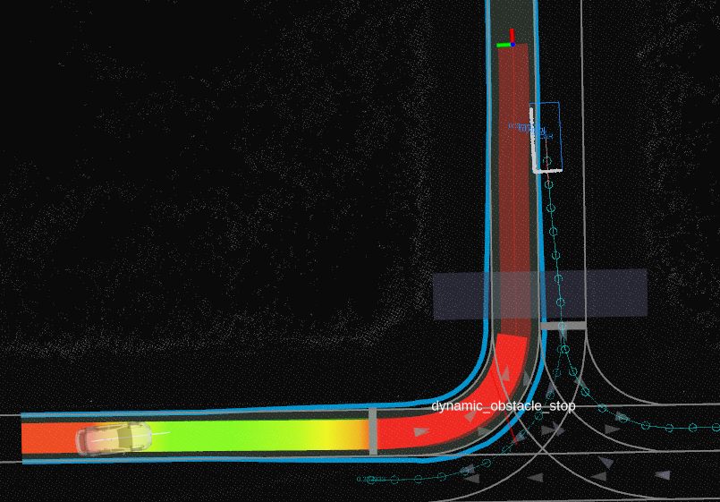

## Dynamic Obstacle Stop

### Role

`dynamic_obstacle_stop` is a module that stops the ego vehicle from entering the _immediate_ path of a dynamic object.

The _immediate_ path of an object is the area that the object would traverse during a given time horizon, assuming constant velocity and heading.

### Activation Timing

This module is activated if the launch parameter `launch_dynamic_obstacle_stop_module` is set to true in the behavior planning launch file.

### Inner-workings / Algorithms

The module insert a stop point where the ego path collides with the immediate path of an object.
The overall module flow can be summarized with the following 4 steps.

1. Filter dynamic objects.
2. Calculate immediate path rectangles of the dynamic objects.
3. Find earliest collision where ego collides with an immediate path rectangle.
4. Insert stop point before the collision.

In addition to these 4 steps, 2 mechanisms are in place to make the stop point of this module more stable: an hysteresis and a decision duration buffer.

The `hysteresis` parameter is used when a stop point was already being inserted in the previous iteration
and it increases the range where dynamic objects are considered close enough to the ego path to be used by the module.

The `decision_duration_buffer` parameter defines the duration when the module will keep inserted the previous stop point, even after no collisions were found.

#### Filter dynamic objects

An object is considered by the module only if it meets all of the following conditions:

- it is a vehicle (pedestrians are ignored);
- it is moving at a velocity higher than defined by the `minimum_object_velocity` parameter;
- it is not too close to the current position of the ego vehicle;
- it is close to the ego path.

For the last condition,
the object is considered close enough if its lateral distance from the ego path is less than the threshold parameter `minimum_object_distance_from_ego_path` plus half the width of ego and of the object (including the `extra_object_width` parameter).
In addition, the value of the `hysteresis` parameter is added to the minimum distance if a stop point was inserted in the previous iteration.

#### Calculate immediate path rectangles

For each considered object, a rectangle is created representing its _immediate_ path.
The rectangle has the width of the object plus the `extra_object_width` parameter
and its length is the current speed of the object multiplied by the `time_horizon`.

#### Find earliest collision

We build the ego path footprints as the set of ego footprint polygons projected on each path point.
We then calculate the intersections between these ego path footprints and the previously calculated immediate path rectangles.
An intersection is ignored if the object is not driving toward ego, i.e., the absolute angle between the object and the path point is larger than $\frac{3 \pi}{4}$.

The collision point with the lowest arc length when projected on the ego path will be used to calculate the final stop point.

#### Insert stop point

Before inserting a stop point, we calculate the range of path arc lengths where it can be inserted.
The minimum is calculated to satisfy the acceleration and jerk constraints of the vehicle.
If a stop point was inserted in the previous iteration of the module, its arc length is used as the maximum.
Finally,
the stop point arc length is calculated to be the arc length of the previously found collision point minus the `stop_distance_buffer` and the ego vehicle longitudinal offset, clamped between the minimum and maximum values.

### Module Parameters

| Parameter                               | Type   | Description                                                                                |
| --------------------------------------- | ------ | ------------------------------------------------------------------------------------------ |
| `extra_object_width`                    | double | [m] extra width around detected objects                                                    |
| `minimum_object_velocity`               | double | [m/s] objects with a velocity bellow this value are ignored                                |
| `stop_distance_buffer`                  | double | [m] extra distance to add between the stop point and the collision point                   |
| `time_horizon`                          | double | [s] time horizon used for collision checks                                                 |
| `hysteresis`                            | double | [m] once a collision has been detected, this hysteresis is used on the collision detection |
| `decision_duration_buffer`              | double | [s] duration between no collision being detected and the stop decision being cancelled     |
| `minimum_object_distance_from_ego_path` | double | [m] minimum distance between the footprints of ego and an object to consider for collision |
