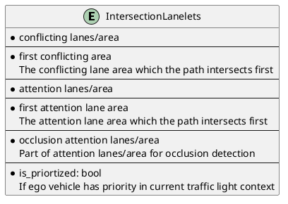
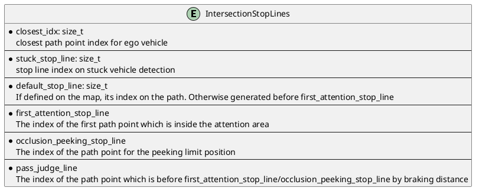
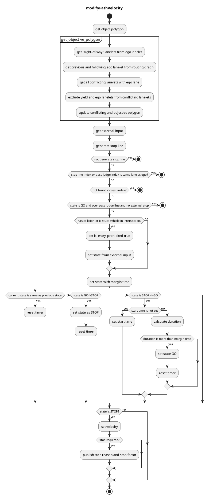

## Intersection

### Role

The _intersection_ module is responsible for safely going through urban intersections by:

1. checking collisions with upcoming vehicles
2. recognizing the occluded area in the intersection
3. reacting to arrow signals of associated traffic lights

The module is designed to be agnostic to left-hand/right-hand traffic rules and works on crossroads, T-shape junctions, etc.


### Activation condition

This module is activated when the path contains the lanes with `turn_direction` tag. More precisely, if the `lane_ids` of the path contains the ids of those lanes, corresponding instances of intersection module are activated on each lanes respectively.

### Requirements/Limitations

- The HDMap needs to have the information of `turn_direction` tag (which should be one of `straight`, `left`, `right`) for all the lanes in intersections and `right_of_way` tag for specific lanes (refer to [RightOfWay](#right-of-way) section for more details). See [lanelet2_extension document](https://github.com/autowarefoundation/autoware_common/blob/main/tmp/lanelet2_extension/docs/lanelet2_format_extension.md) for more detail.
- WIP(perception requirements/limitations)
- WIP(sensor visibility requirements/limitations)

### Attention area

The `attention area` in the intersection are defined as the set of lanes that are conflicting with ego vehicle's path and their preceding lanes up to `common.attention_area_length` meters. `RightOfWay` tag is used to rule out the lanes that each lane has priority given the traffic light relation and `turn_direction` priority(`yield lane`).

`Intersection Area`, which is supposed to be defined on the HDMap, is an area converting the entire intersection.


#### Right Of Way

Following table shows an example of how to assign `right_of_way` tag and set `yield_lanes` to each lane in intersections.

| turn direction / traffic light | w/ traffic light                                                | w/o traffic light                                |
| ------------------------------ | --------------------------------------------------------------- | ------------------------------------------------ |
| straight                       | Highest priority of all                                         | Priority over left/right lanes of the same group |
| left(Left hand traffic)        | Priority over the other group and right lanes of the same group | Priority over right lanes of the same group      |
| right(Left hand traffic)       | Priority only over the other group                              | priority only over the other group               |
| left(Right hand traffic)       | Priority only over the other group                              | Priority only over the other group               |
| right(Right hand traffic)      | Priority over the other group and left lanes of the same group  | priority over left lanes of the same group       |

This setting gives the following `attention_area` configurations.


### Target objects

For [stuck vehicle detection](#stuck-vehicle-detection) and [collision detection](#collision-detection), this module checks **car**, **bus**, **truck**, **trailer**, **motor cycle**, and **bicycle** type objects.

Objects that satisfy all of the following conditions are considered as target objects (possible collision objects):

- The center of mass of the object is **within a certain distance** from the attention lane (threshold = `common.attention_area_margin`) .
  - (Optional condition) The center of gravity is in the **intersection area**.
    - To deal with objects that is in the area not covered by the lanelets in the intersection.
- The posture of object is **the same direction as the attention lane** (threshold = `common.attention_area_angle_threshold`).
- Not being **in the adjacent lanes of the ego vehicle**.

#### Stuck Vehicle Detection

If there is any object on the path in inside the intersection and at the exit of the intersection (up to `stuck_vehicle_detect_dist`) lane and its velocity is less than a threshold (`stuck_vehicle.stuck_vehicle_vel_thr`), the object is regarded as a stuck vehicle. If stuck vehicles exist, this module inserts a stopline a certain distance (=`stop_line_margin`) before the overlapped region with other lanes. The stuck vehicle detection area is generated based on the vehicle path, so the stuck vehicle stopline is not inserted if the upstream module generated avoidance path


#### Collision detection

The following process is performed for the targets objects to determine whether the ego vehicle can pass the intersection safely. If it is judged that the ego vehicle cannot pass through the intersection with enough margin, this module inserts a stopline on the path.

1. calculate the time interval that the ego vehicle is in the intersection. This time is set as $t_s$ ~ $t_e$
2. extract the predicted path of the target object whose confidence is greater than `collision_detection.min_predicted_path_confidence`.
3. detect collision between the extracted predicted path and ego's predicted path in the following process.
   1. obtain the passing area of the ego vehicle $A_{ego}$ in $t_s$ ~ $t_e$.
   2. calculate the passing area of the target object $A_{target}$ at $t_s$ - `collision_detection.collision_start_margin_time` ~ $t_e$ + `collision_detection.collision_end_margin_time` for each predicted path (\*1).
   3. check if $A_{ego}$ and $A_{target}$ polygons are overlapped (has collision).
4. when a collision is detected, the module inserts a stopline.
5. If ego is over the `pass_judge_line`, collision checking is not processed to avoid sudden braking and/or unnecessary stop in the middle of the intersection.

The parameters `collision_detection.collision_start_margin_time` and `collision_detection.collision_end_margin_time` can be interpreted as follows:

- If the ego vehicle was to pass through the intersection earlier than the target object, collision would be detected if the time difference between the two was less than `collision_detection.collision_start_margin_time`.
- If the ego vehicle was to pass through the intersection later than the target object, collision would be detected if the time difference between the two was less than `collision_detection.collision_end_margin_time`.

If collision is detected, the state transits to "STOP" immediately. On the other hand, the state does not transit to "GO" unless safe judgement continues for a certain period `collision_detection.state_transit_margin` to prevent the chattering of decisions.

Currently, the intersection module uses `motion_velocity_smoother` feature to precisely calculate ego vehicle velocity profile along the intersection lane under longitudinal/lateral constraints. If the flag `collision_detection.use_upstream_velocity` is true, the target velocity profile of the original path is used. Otherwise the target velocity is set to `common.intersection_velocity`. In the trajectory smoothing process the target velocity at/before ego trajectory points are set to ego current velocity. The smoothed trajectory is then converted to an array of (time, distance) which indicates the arrival time to each trajectory point on the path from current ego position. You can visualize this array by adding the lane id to `debug.ttc` and running

```bash
ros2 run behavior_velocity_intersection_module ttc.py --lane_id <lane_id>
```


#### Stop Line Automatic Generation

If a stopline is associated with the intersection lane on the map, that line is used as the stopline for collision detection. Otherwise the path is interpolated at a certain intervals (=`common.path_interpolation_ds`), and the point which is `stop_line_margin` meters behind the attention area is defined as the position of the stop line for the vehicle front.

#### Pass Judge Line

To avoid sudden braking, if deceleration and jerk more than a threshold (`behavior_velocity_planner.max_accel` and `behavior_velocity_planner.max_jerk`) is required to stop just in front of the attention area, namely the `first_attention_stop_line`, this module does not insert stopline after it passed the `default stop_line` position.

The position of the pass judge line depends on the occlusion detection configuration and the existence of the associated traffic light of the intersection lane.

- If `occlusion.enable` is false, the pass judge line before the `first_attention_stop_line` by the braking distance $v_{ego}^{2} / 2a_{max}$.
- If `occlusion.enable` is true and:
  - if there are associated traffic lights, the pass judge line is at the `occlusion_peeking_stop_line` in order to continue peeking/collision detection while occlusion is detected.
  - if there are no associated traffic lights and:
    - if occlusion is detected, pass judge line is at the `occlusion_wo_tl_pass_judge_line` to continue peeking.
    - if occlusion is not detected, pass judge line is at the same place at the case where `occlusion.enable` is false.


### Occlusion detection

If the flag `occlusion.enable` is true this module checks if there is sufficient field of view (FOV) on the attention area up to `occlusion.occlusion_attention_area_length`. If FOV is not clear enough the ego vehicle will once stop at the _default stop line_ for `occlusion.before_creep_stop_time`, and then slowly creep toward _occlusion peeking stop line_ at the speed of `occlusion.occlusion_creep_velocity` if `occlusion.enable_creeping` is true. During the creeping if collision is detected this module inserts a stop line instantly, and if the FOV gets sufficiently clear the _intersection occlusion_ wall will disappear. If occlusion is cleared and no collision is detected the ego vehicle will pass the intersection.

The occlusion is detected as the common area of occlusion attention area(which is partially the same as the normal attention area) and the unknown cells of the occupancy grid map. The occupancy grid map is denoised using morphology with the window size of `occlusion.denoise_kernel`. The occlusion attention area lanes are discretized to line strings and they are used to generate a grid whose each cell represents the distance from the ego path along the lane as shown below.


If the nearest occlusion cell value is below the threshold, occlusion is detected. It is expected that the occlusion gets cleared as the vehicle approaches the occlusion peeking stop line.

In there are no traffic lights associated with the lane, the ego vehicle will make a brief stop at the _default stop line_ and the position where the vehicle heading touches the attention area for the first time(which is denoted as _first attention stop line_). After stopping at the _first attention area stop line_ this module inserts `occlusion.absence_traffic_light.creep_velocity` velocity between ego and the position which is `occlusion.absence_traffic_light.maximum_peeking_distance` ahead of _first attention area stop line_ while occlusion is not cleared. If collision is detected, ego will instantly stop. Once the occlusion is cleared or ego passed `occlusion.absence_traffic_light.maximum_peeking_distance` this module does not detect collision and occlusion because ego vehicle is already inside the intersection.


### Data Structure

#### `IntersectionLanelets`



#### `IntersectionStopLines`

Each stop lines are generated from interpolated path points to obtain precise positions.



### Module Parameters

| Parameter                                           | Type   | Description                                                                                    |
| --------------------------------------------------- | ------ | ---------------------------------------------------------------------------------------------- |
| `common.attention_area_margin`                      | double | [m] margin for expanding attention area width                                                  |
| `common.attention_area_length`                      | double | [m] range for object detection                                                                 |
| `common.attention_area_angle_threshold`             | double | [rad] threshold of angle difference between the detected object and lane                       |
| `common.stop_line_margin`                           | double | [m] margin before stop line                                                                    |
| `common.intersection_velocity`                      | double | [m/s] velocity profile for pass judge calculation                                              |
| `common.intersection_max_accel`                     | double | [m/s^2] acceleration profile for pass judge calculation                                        |
| `common.stop_overshoot_margin`                      | double | [m] margin for the overshoot from stopline                                                     |
| `stuck_vehicle.stuck_vehicle_detect_dist`           | double | [m] length toward from the exit of intersection for stuck vehicle detection                    |
| `stuck_vehicle.stuck_vehicle_vel_thr`               | double | [m/s] velocity threshold for stuck vehicle detection                                           |
| `collision_detection.state_transit_margin_time`     | double | [m] time margin to change state                                                                |
| `collision_detection.min_predicted_path_confidence` | double | [-] minimum confidence value of predicted path to use for collision detection                  |
| `collision_detection.collision_start_margin_time`   | double | [s] time margin for the beginning of collision with upcoming vehicle                           |
| `collision_detection.collision_end_margin_time`     | double | [s] time margin for the finish of collision with upcoming vehicle                              |
| `collision_detection.keep_detection_vel_thr`        | double | [m/s] ego velocity threshold for continuing collision detection before pass judge line         |
| `occlusion.occlusion_attention_area_length`         | double | [m] the length of attention are for occlusion detection                                        |
| `occlusion.enable_creeping`                         | bool   | [-] flag to insert `occlusion_creep_velocity` while peeking to intersection occlusion stopline |
| `occlusion.peeking_offset`                          | double | [m] the offset of the front of the vehicle into the attention area for peeking to occlusion    |
| `occlusion.min_vehicle_brake_for_rss`               | double | [m/s] assumed minimum brake of the vehicle running from behind the occlusion                   |
| `occlusion.max_vehicle_velocity_for_rss`            | double | [m/s] assumed maximum velocity of the vehicle running from behind the occlusion                |

#### For developers only

| Parameter                      | Type   | Description                                                            |
| ------------------------------ | ------ | ---------------------------------------------------------------------- |
| `common.path_interpolation_ds` | double | [m] path interpolation interval                                        |
| `occlusion.denoise_kernel`     | double | [m] the window size of morphology process for clearing noisy occlusion |

### How to turn parameters

WIP

### Flowchart

WIP



## Merge From Private

### Role

When an ego vehicle enters a public road from a private road (e.g. a parking lot), it needs to face and stop before entering the public road to make sure it is safe.

This module is activated when there is an intersection at the private area from which the vehicle enters the public road. The stop line is generated both when the goal is in the intersection lane and when the path goes beyond the intersection lane. The basic behavior is the same as the intersection module, but the ego vehicle must stop once at the stop line.


### Activation Timing

This module is activated when the following conditions are met:

- ego-lane has a `private` tag
- ego-lane has a conflict with other no-private lanelets

### Module Parameters

| Parameter                                   | Type   | Description                     |
| ------------------------------------------- | ------ | ------------------------------- |
| `merge_from_private_road/stop_duration_sec` | double | [m] time margin to change state |

### Known Issue

If ego vehicle go over the stop line for a certain distance, then ego vehicle will not transit from STOP.
