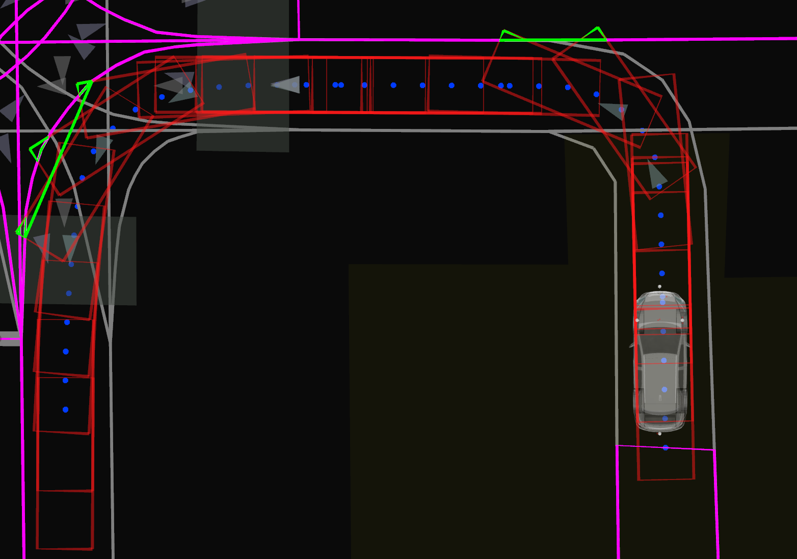
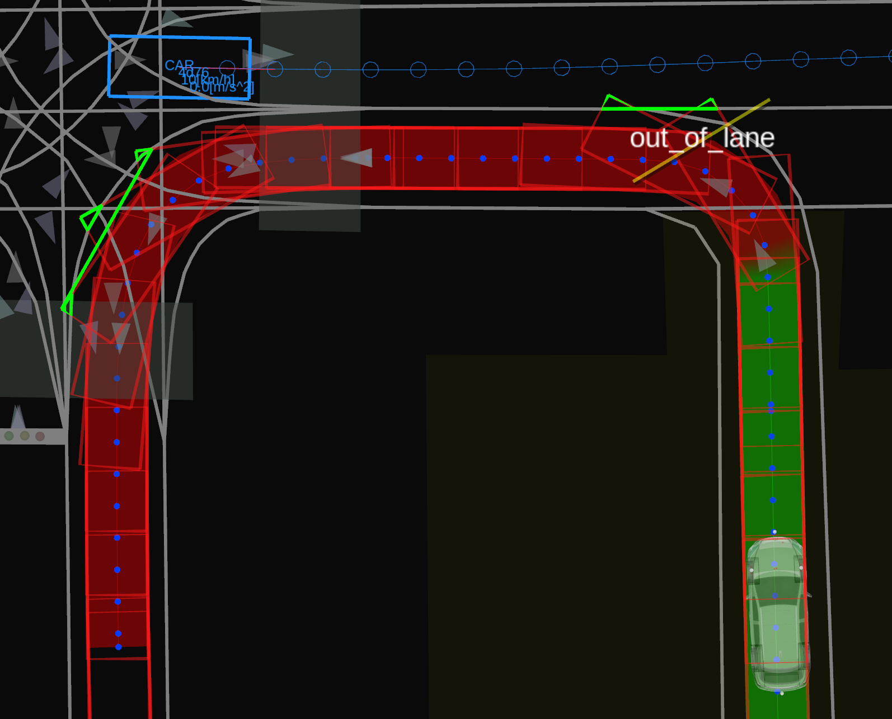

## Out of Lane

### Role

`out_of_lane` is the module that decelerates and stops to prevent the ego vehicle from entering another lane with incoming dynamic objects.

### Activation Timing

This module is activated if `launch_out_of_lane` is set to true.

### Inner-workings / Algorithms

The algorithm is made of the following steps.

1. Calculate the ego path footprints (red).
2. Calculate the other lanes (magenta).
3. Calculate the overlapping ranges between the ego path footprints and the other lanes (green).
4. For each overlapping range, decide if a stop or slow down action must be taken.
5. For each action, insert the corresponding stop or slow down point in the path.

#### 1. Ego Path Footprints

In this first step, the ego footprint is projected at each path point and are eventually inflated based on the `extra_..._offset` parameters.

#### 2. Other lanes

In the second step, the set of lanes to consider for overlaps is generated.
This set is built by selecting all lanelets within some distance from the ego vehicle, and then removing non-relevant lanelets.
The selection distance is chosen as the maximum between the `slowdown.distance_threshold` and the `stop.distance_threshold`.

A lanelet is deemed non-relevant if it meets one of the following conditions.

- It is part of the lanelets followed by the ego path.
- It contains the rear point of the ego footprint.
- It follows one of the ego path lanelets.

#### 3. Overlapping ranges

In the third step, overlaps between the ego path footprints and the other lanes are calculated.
For each pair of other lane $l$ and ego path footprint $f$, we calculate the overlapping polygons using `boost::geometry::intersection`.
For each overlapping polygon found, if the distance inside the other lane $l$ is above the `overlap.minimum_distance` threshold, then the overlap is ignored.
Otherwise, the arc length range (relative to the ego path) and corresponding points of the overlapping polygons are stored.
Ultimately, for each other lane $l$, overlapping ranges of successive overlaps are built with the following information:

- overlapped other lane $l$.
- start and end ego path indexes.
- start and end ego path arc lengths.
- start and end overlap points.

#### 4. Decisions

In the fourth step, a decision to either slow down or stop before each overlapping range is taken based on the dynamic objects.
The conditions for the decision depend on the value of the `mode` parameter.

Whether it is decided to slow down or stop is determined by the distance between the ego vehicle and the start of the overlapping range (in arc length along the ego path).
If this distance is bellow the `actions.slowdown.threshold`, a velocity of `actions.slowdown.velocity` will be used.
If the distance is bellow the `actions.stop.threshold`, a velocity of `0`m/s will be used.

<table width="100%">
  <tr>
  <td>
    
  </td>
  <td>
    
  </td>
  </tr>
</table>

##### Threshold

With the `mode` set to `"threshold"`,
a decision to stop or slow down before a range is made if
an incoming dynamic object is estimated to reach the overlap within `threshold.time_threshold`.

##### TTC (time to collision)

With the `mode` set to `"ttc"`,
estimates for the times when ego and the dynamic objects reach the start and end of the overlapping range are calculated.
This is then used to calculate the time to collision over the period where ego crosses the overlap.
If the time to collision is predicted to go bellow the `ttc.threshold`, the decision to stop or slow down is made.

##### Intervals

With the `mode` set to `"intervals"`,
the estimated times when ego and the dynamic objects reach the start and end points of
the overlapping range are used to create time intervals.
These intervals can be made shorter or longer using the
`intervals.ego_time_buffer` and `intervals.objects_time_buffer` parameters.
If the time interval of ego overlaps with the time interval of an object, the decision to stop or slow down is made.

##### Time estimates

###### Ego

To estimate the times when ego will reach an overlap, it is assumed that ego travels along its path
at its current velocity or at half the velocity of the path points, whichever is higher.

###### Dynamic objects

Two methods are used to estimate the time when a dynamic objects with reach some point.
If `objects.use_predicted_paths` is set to `true`, the predicted paths of the dynamic object are used if their confidence value is higher than the value set by the `objects.predicted_path_min_confidence` parameter.
Otherwise, the lanelet map is used to estimate the distance between the object and the point and the time is calculated assuming the object keeps its current velocity.

#### 5. Path update

Finally, for each decision to stop or slow down before an overlapping range,
a point is inserted in the path.
For a decision taken for an overlapping range with a lane $l$ starting at ego path point index $i$,
a point is inserted in the path between index $i$ and $i-1$ such that the ego footprint projected at the inserted point does not overlap $l$.
Such point with no overlap must exist since, by definition of the overlapping range,
we know that there is no overlap at $i-1$.

If the point would cause a higher deceleration than allowed by the `max_accel` parameter (node parameter),
it is skipped.

Moreover, parameter `action.distance_buffer` adds an extra distance between the ego footprint and the overlap when possible.

### Module Parameters

| Parameter                     | Type   | Description                                                                       |
| ----------------------------- | ------ | --------------------------------------------------------------------------------- |
| `mode`                        | string | [-] mode used to consider a dynamic object. Candidates: threshold, intervals, ttc |
| `skip_if_already_overlapping` | bool   | [-] if true, do not run this module when ego already overlaps another lane        |

| Parameter /threshold | Type   | Description                                                      |
| -------------------- | ------ | ---------------------------------------------------------------- |
| `time_threshold`     | double | [s] consider objects that will reach an overlap within this time |

| Parameter /intervals  | Type   | Description                                             |
| --------------------- | ------ | ------------------------------------------------------- |
| `ego_time_buffer`     | double | [s] extend the ego time interval by this buffer         |
| `objects_time_buffer` | double | [s] extend the time intervals of objects by this buffer |

| Parameter /ttc | Type   | Description                                                                                            |
| -------------- | ------ | ------------------------------------------------------------------------------------------------------ |
| `threshold`    | double | [s] consider objects with an estimated time to collision bellow this value while ego is on the overlap |

| Parameter /objects              | Type   | Description                                                                                                                                                               |
| ------------------------------- | ------ | ------------------------------------------------------------------------------------------------------------------------------------------------------------------------- |
| `minimum_velocity`              | double | [m/s] ignore objects with a velocity lower than this value                                                                                                                |
| `predicted_path_min_confidence` | double | [-] minimum confidence required for a predicted path to be considered                                                                                                     |
| `use_predicted_paths`           | bool   | [-] if true, use the predicted paths to estimate future positions; if false, assume the object moves at constant velocity along _all_ lanelets it currently is located in |

| Parameter /overlap | Type   | Description                                                                                          |
| ------------------ | ------ | ---------------------------------------------------------------------------------------------------- |
| `minimum_distance` | double | [m] minimum distance inside a lanelet for an overlap to be considered                                |
| `extra_length`     | double | [m] extra arc length to add to the front and back of an overlap (used to calculate enter/exit times) |

| Parameter /action             | Type   | Description                                                                                    |
| ----------------------------- | ------ | ---------------------------------------------------------------------------------------------- |
| `skip_if_over_max_decel`      | bool   | [-] if true, do not take an action that would cause more deceleration than the maximum allowed |
| `distance_buffer`             | double | [m] buffer distance to try to keep between the ego footprint and lane                          |
| `slowdown.distance_threshold` | double | [m] insert a slow down when closer than this distance from an overlap                          |
| `slowdown.velocity`           | double | [m] slow down velocity                                                                         |
| `stop.distance_threshold`     | double | [m] insert a stop when closer than this distance from an overlap                               |

| Parameter /ego       | Type   | Description                                          |
| -------------------- | ------ | ---------------------------------------------------- |
| `extra_front_offset` | double | [m] extra front distance to add to the ego footprint |
| `extra_rear_offset`  | double | [m] extra rear distance to add to the ego footprint  |
| `extra_left_offset`  | double | [m] extra left distance to add to the ego footprint  |
| `extra_right_offset` | double | [m] extra right distance to add to the ego footprint |
