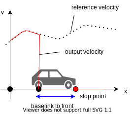

# Behavior Velocity Planner

## Overview

`behavior_velocity_planner` is a planner that adjust velocity based on the traffic rules.
It consists of several modules. Please refer to the links listed below for detail on each module.

- [Blind Spot](blind-spot-design.md)
- [Crosswalk](crosswalk-design.md)
- [Detection Area](detection-area-design.md)
- [Intersection](intersection-design.md)
- [MergeFromPrivate](merge-from-private-design.md)
- [Stop Line](stop-line-design.md)
- [Virtual Traffic Light](virtual-traffic-light-design.md)
- [Traffic Light](traffic-light-design.md)
- [Occlusion Spot](occlusion-spot-design.md)
- [No Stopping Area](no-stopping-area-design.md)
- [Run Out](run-out-design.md)

When each module plans velocity, it considers based on `base_link`(center of rear-wheel axis) pose.
So for example, in order to stop at a stop line with the vehicles' front on the stop line, it calculates `base_link` position from the distance between `base_link` to front and modifies path velocity from the `base_link` position.

## Input topics

| Name                                      | Type                                                   | Description                                                                                                                     |
| ----------------------------------------- | ------------------------------------------------------ | ------------------------------------------------------------------------------------------------------------------------------- |
| `~input/path_with_lane_id`                | autoware_auto_planning_msgs::msg::PathWithLaneId       | path with lane_id                                                                                                               |
| `~input/vector_map`                       | autoware_auto_mapping_msgs::msg::HADMapBin             | vector map                                                                                                                      |
| `~input/vehicle_odometry`                 | nav_msgs::msg::Odometry                                | vehicle velocity                                                                                                                |
| `~input/dynamic_objects`                  | autoware_auto_perception_msgs::msg::PredictedObjects   | dynamic objects                                                                                                                 |
| `~input/no_ground_pointcloud`             | sensor_msgs::msg::PointCloud2                          | obstacle pointcloud                                                                                                             |
| `~/input/compare_map_filtered_pointcloud` | sensor_msgs::msg::PointCloud2                          | obstacle pointcloud filtered by compare map. Note that this is used only when the detection method of run out module is Points. |
| `~input/traffic_signals`                  | autoware_auto_perception_msgs::msg::TrafficSignalArray | traffic light states                                                                                                            |

## Output topics

| Name                   | Type                                      | Description                            |
| ---------------------- | ----------------------------------------- | -------------------------------------- |
| `~output/path`         | autoware_auto_planning_msgs::msg::Path    | path to be followed                    |
| `~output/stop_reasons` | tier4_planning_msgs::msg::StopReasonArray | reasons that cause the vehicle to stop |

## Node parameters

| Parameter               | Type   | Description                                                                         |
| ----------------------- | ------ | ----------------------------------------------------------------------------------- |
| `launch_blind_spot`     | bool   | whether to launch blind_spot module                                                 |
| `launch_crosswalk`      | bool   | whether to launch crosswalk module                                                  |
| `launch_detection_area` | bool   | whether to launch detection_area module                                             |
| `launch_intersection`   | bool   | whether to launch intersection module                                               |
| `launch_traffic_light`  | bool   | whether to launch traffic light module                                              |
| `launch_stop_line`      | bool   | whether to launch stop_line module                                                  |
| `launch_occlusion_spot` | bool   | whether to launch occlusion_spot module                                             |
| `launch_run_out`        | bool   | whether to launch run_out module                                                    |
| `forward_path_length`   | double | forward path length                                                                 |
| `backward_path_length`  | double | backward path length                                                                |
| `max_accel`             | double | (to be a global parameter) max acceleration of the vehicle                          |
| `system_delay`          | double | (to be a global parameter) delay time until output control command                  |
| `delay_response_time`   | double | (to be a global parameter) delay time of the vehicle's response to control commands |
