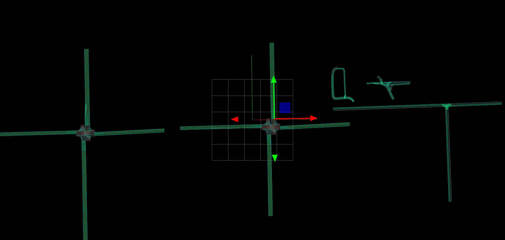

# Behavior Velocity Planner Common

This package provides common functions as a library, which are used in the `behavior_velocity_planner` node and modules.

## Test map

### intersection

The intersections lanelet map consist of a variety of intersections including:

- 4-way crossing with traffic light
- 4-way crossing without traffic light
- T-shape crossing without traffic light
- intersection with a loop
- complicated intersection

