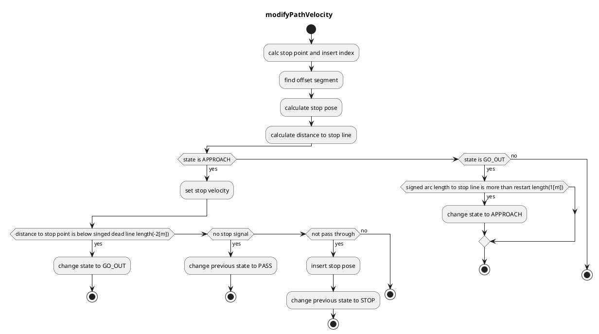

### Traffic Light

#### Role

Judgement whether a vehicle can go into an intersection or not by traffic light status, and planning a velocity of the stop if necessary.
This module is designed for rule-based velocity decision that is easy for developers to design its behavior. It generates proper velocity for traffic light scene.

### Limitations

This module allows developers to design STOP/GO in traffic light module using specific rules. Due to the property of rule-based planning, the algorithm is greatly depends on object detection and perception accuracy considering traffic light. Also, this module only handles STOP/Go at traffic light scene, so rushing or quick decision according to traffic condition is future work.

#### Activation Timing

This module is activated when there is traffic light in ego lane.

#### Algorithm

1. Obtains a traffic light mapped to the route and a stop line correspond to the traffic light from a map information.

   - If a corresponding traffic light signal have never been found, it treats as a signal to pass.

   - If a corresponding traffic light signal is found but timed out, it treats as a signal to stop.

2. Uses the highest reliability one of the traffic light recognition result and if the color of that was not green or corresponding arrow signal, generates a stop point.

   - If an elapsed time to receive stop signal is less than `stop_time_hysteresis`, it treats as a signal to pass. This feature is to prevent chattering.

3. When vehicle current velocity is

   - higher than 2.0m/s ⇒ pass judge(using next slide formula)

   - lower than 2.0m/s ⇒ stop

4. When it to be judged that vehicle can’t stop before stop line, autoware chooses one of the following behaviors

   - "can pass through" stop line during yellow lamp => pass

   - "can’t pass through" stop line during yellow lamp => emergency stop

#### Dilemma Zone

- yellow lamp line

  It’s called “yellow lamp line” which shows the distance traveled by the vehicle during yellow lamp.

- dilemma zone

  It’s called “dilemma zone” which satisfies following conditions:

  - vehicle can’t pass through stop line during yellow lamp.(right side of the yellow lamp line)

  - vehicle can’t stop under deceleration and jerk limit.(left side of the pass judge curve)

    ⇒emergency stop(relax deceleration and jerk limitation in order to observe the traffic regulation)

- optional zone

  It’s called “optional zone” which satisfies following conditions:

  - vehicle can pass through stop line during yellow lamp.(left side of the yellow lamp line)

  - vehicle can stop under deceleration and jerk limit.(right side of the pass judge curve)

    ⇒ stop(autoware selects the safety choice)

#### Module Parameters

| Parameter              | Type   | Description                                                          |
| ---------------------- | ------ | -------------------------------------------------------------------- |
| `stop_margin`          | double | [m] margin before stop point                                         |
| `tl_state_timeout`     | double | [s] time out for detected traffic light result.                      |
| `stop_time_hysteresis` | double | [s] time threshold to decide stop planning for chattering prevention |
| `yellow_lamp_period`   | double | [s] time for yellow lamp                                             |
| `enable_pass_judge`    | bool   | [-] whether to use pass judge                                        |

#### Flowchart

##### Known Limits

- tbd.
