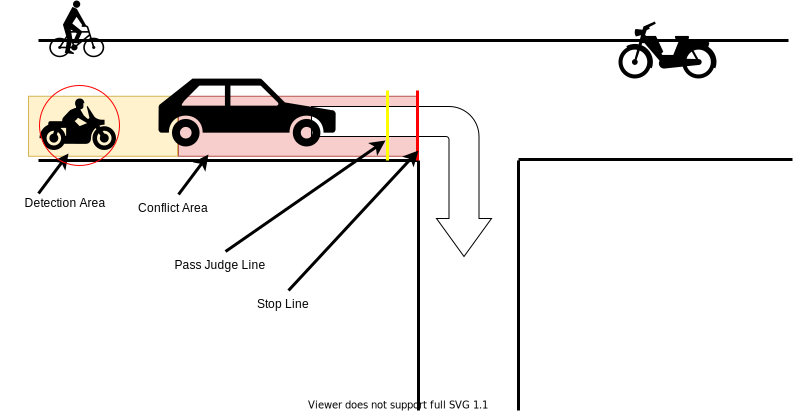
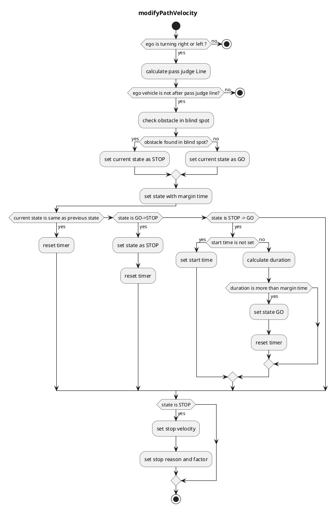

## Blind Spot

### Role

Blind spot check while turning right/left by a dynamic object information and planning a velocity of the start/stop.

### Activation Timing

This function is activated when the lane id of the target path has an intersection label (i.e. the `turn_direction` attribute is `left` or `right`).

### Inner-workings / Algorithms

Sets a stop line, a pass judge line, a detection area and conflict area based on a map information and a self position.

- Stop line : Automatically created based on crossing lane information.

- Pass judge line : A position to judge if stop or not to avoid a rapid brake.

- Detection area : Right/left side area of the self position.

- Conflict area : Right/left side area from the self position to the stop line.

Stop/Go state: When both conditions are met for any of each object, this module state is transited to the "stop" state and insert zero velocity to stop the vehicle.

- Object is on the detection area
- Object’s predicted path is on the conflict area

In order to avoid a rapid stop, the “stop” judgement is not executed after the judgment line is passed.

Once a "stop" is judged, it will not transit to the "go" state until the "go" judgment continues for a certain period in order to prevent chattering of the state (e.g. 2 seconds).

### Module Parameters

| Parameter                       | Type   | Description                                                                 |
| ------------------------------- | ------ | --------------------------------------------------------------------------- |
| `stop_line_margin`              | double | [m] a margin that the vehicle tries to stop before stop_line                |
| `backward_length`               | double | [m] distance from closest path point to the edge of beginning point.        |
| `ignore_width_from_center_line` | double | [m] ignore threshold that vehicle behind is collide with ego vehicle or not |
| `max_future_movement_time`      | double | [s] maximum time for considering future movement of object                  |

### Flowchart

