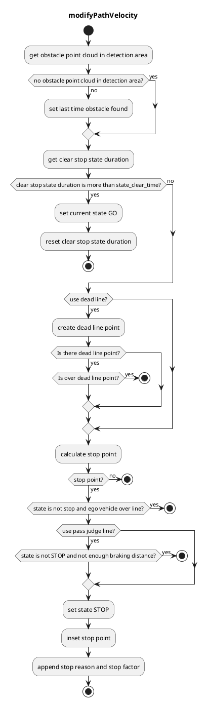
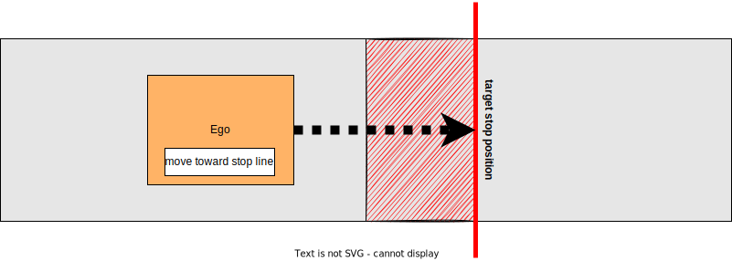
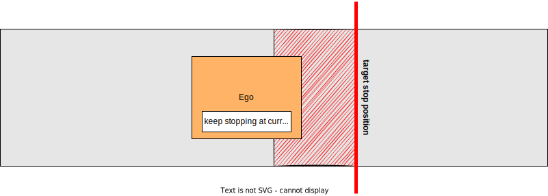

## Detection Area

### Role

If pointcloud is detected in a detection area defined on a map, the stop planning will be executed at the predetermined point.

### Activation Timing

This module is activated when there is a detection area on the target lane.

### Module Parameters

| Parameter                   | Type   | Description                                                                                        |
| --------------------------- | ------ | -------------------------------------------------------------------------------------------------- |
| `use_dead_line`             | bool   | [-] weather to use dead line or not                                                                |
| `use_pass_judge_line`       | bool   | [-] weather to use pass judge line or not                                                          |
| `state_clear_time`          | double | [s] when the vehicle is stopping for certain time without incoming obstacle, move to STOPPED state |
| `stop_margin`               | double | [m] a margin that the vehicle tries to stop before stop_line                                       |
| `dead_line_margin`          | double | [m] ignore threshold that vehicle behind is collide with ego vehicle or not                        |
| `hold_stop_margin_distance` | double | [m] parameter for restart prevention (See Algorithm section)                                       |

### Inner-workings / Algorithm

1. Gets a detection area and stop line from map information and confirms if there is pointcloud in the detection area
2. Inserts stop point l[m] in front of the stop line
3. Inserts a pass judge point to a point where the vehicle can stop with a max deceleration
4. Sets velocity as zero behind the stop line when the ego-vehicle is in front of the pass judge point
5. If the ego vehicle has passed the pass judge point already, it doesn’t stop and pass through.

#### Flowchart

#### Restart prevention

If it needs X meters (e.g. 0.5 meters) to stop once the vehicle starts moving due to the poor vehicle control performance, the vehicle goes over the stopping position that should be strictly observed when the vehicle starts to moving in order to approach the near stop point (e.g. 0.3 meters away).

This module has parameter `hold_stop_margin_distance` in order to prevent from these redundant restart. If the vehicle is stopped within `hold_stop_margin_distance` meters from stop point of the module (\_front_to_stop_line < hold_stop_margin_distance), the module judges that the vehicle has already stopped for the module's stop point and plans to keep stopping current position even if the vehicle is stopped due to other factors.

<figure markdown>
  {width=1000}
  <figcaption>parameters</figcaption>
</figure>

<figure markdown>
  {width=1000}
  <figcaption>outside the hold_stop_margin_distance</figcaption>
</figure>

<figure markdown>
  {width=1000}
  <figcaption>inside the hold_stop_margin_distance</figcaption>
</figure>
