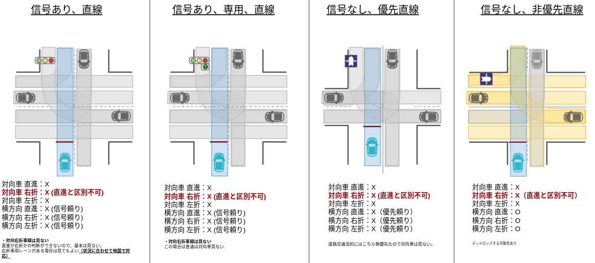
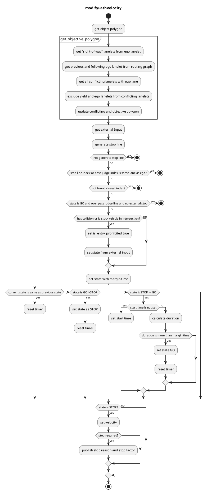
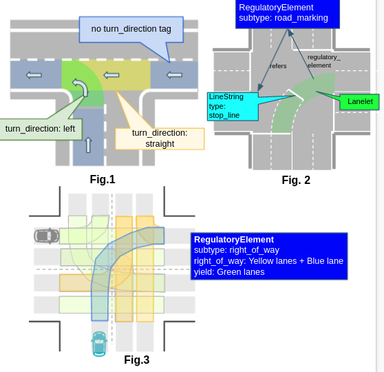

## Intersection

### Role

Judgement whether a vehicle can go into an intersection or not by a dynamic object information, and planning a velocity of the low-down/stop.
This module is designed for rule-based intersection velocity decision that is easy for developers to design its behavior. It generates proper velocity for intersection scene.

In addition, the external users / modules (e.g. remote operation) to can intervene the STOP/GO decision for the vehicle behavior. The override interface is expected to be used, for example, for remote intervention in emergency situations or gathering information on operator decisions during development.

### Activation Timing

This function is activated when the attention lane conflicts with the ego vehicle's lane.

### Limitations

This module allows developers to design vehicle velocity in intersection module using specific rules. This module is affected by object detection and prediction accuracy considering as stuck vehicle in this intersection module.

### Inner-workings / Algorithms

#### How To Select Attention Target Objects

Objects that satisfy all of the following conditions are considered as target objects (possible collision objects):

- The type of object type is **car**, **truck**, **bus** or **motorbike**. (Bicycle, pedestrian, animal, unknown are not.)
- The center of gravity of object is **located within a certain distance** from the attention lane (threshold = `detection_area_margin`) .
  - (Optional condition) The center of gravity is in the **intersection area**.
    - To deal with objects that is in the area not covered by the lanelets in the intersection.
- The posture of object is **the same direction as the attention lane** (threshold = `detection_area_angle_threshold`).
  - The orientation of the target is recalculated in this module according to the `orientation_reliable` and the sign of the velocity of the target.
- Not being **in the neighboring lanes of the ego vehicle**.
  - neighboring lanes include the ego lane of the vehicle and the adjacent lanes of it with turn_direction as the ego lane.

#### How to Define Attention Lanes

Target objects are limited by lanelets to prevent unexpected behavior. A lane that satisfies the following conditions is defined as an "Attention Lane" and used to define the target object.

- The lane crosses with the driving lane of the ego-vehicle
- The lane has high priority for the driving lane of the ego-vehicle (priority tags are needed to be configured in Lanelet-map according to the situation).

See the following figures to know how to create an attention area and its rationale.

Note: the case `traffic light, turn right only` is not currently implemented.

#### Collision Check and Crossing Judgement

The following process is performed for the attention targets to determine whether the ego vehicle can cross the intersection safely. If it is judged that the ego vehicle cannot pass through the intersection with enough margin, it will insert the stopping speed on the stop line of the intersection.

1. calculate the passing time and the time that the ego vehicle is in the intersection. This time is set as $t_s$ ~ $t_e$
2. extract the predicted path of the target object whose confidence is greater than `min_predicted_path_confidence`.
3. detect collision between the extracted predicted path and ego's predicted path in the following process.
   1. obtain the passing area of the ego vehicle $A_{ego}$ in $t_s$ ~ $t_e$.
   2. calculate the passing area of the target object $A_{target}$ at $t_s$ - `collision_start_margin_time` ~ $t_e$ + `collision_end_margin_time` for each predicted path (\*1).
   3. check if $A_{ego}$ and $A_{target}$ regions are overlapped (has collision).
4. when a collision is detected, the module inserts a stop velocity in front of the intersection. Note that there is a time margin for the stop release (\*2).
5. If ego is over the `pass_judge_line`, collision checking is not processed to avoid sudden braking. However if ego velocity is lower than the threshold `keep_detection_vel_thr` then this module continues collision checking.

(\*1) The parameters `collision_start_margin_time` and `collision_end_margin_time` can be interpreted as follows:

- If the ego vehicle passes through the intersection earlier than the target object, the collision is detected if the time difference between the two is less than `collision_start_margin_time`.
- If the ego vehicle passes through the intersection later than the target object, the collision is detected if the time difference between the two is less than `collision_end_margin_time`.

(\*2) If the collision is detected, the state transits to "stop" immediately. On the other hand, the collision judgment must be clear for a certain period (default : 2.0[s]) to transit from "stop" to "go" to prevent to prevent chattering of decisions.

#### Stop Line Automatic Generation

The driving lane is complemented at a certain intervals (default : 20 [cm]), and the line which is a margin distance (default : 100cm) in front of the attention lane is defined as a stop line. (Also the length of the vehicle is considered and the stop point is set at the base_link point in front of the stop lane.)

#### Pass Judge Line

To avoid a rapid braking, in case that a deceleration more than a threshold (default : 0.5[G]) is needed, the ego vehicle doesn’t stop. In order to judge this condition, pass judge line is set a certain distance (default : 0.5 \* v_current^2 / a_max) in front of the stop line.
To prevent a chattering, once the ego vehicle passes this line, “stop” decision in the intersection won’t be done any more.
To prevent going over the pass judge line before the traffic light stop line, the distance between stop line and pass judge line become 0m in case that there is a stop line between the ego vehicle and an intersection stop line.

#### Stuck Vehicle Detection

If there is any object in a certain distance (default : 5[m]) from the end point of the intersection lane on the driving lane and the object velocity is less than a threshold (default 3.0[km/h]), the object is regarded as a stuck vehicle. If the stuck vehicle exists, the ego vehicle cannot enter the intersection.

As a related case, if the object in front of the ego vehicle is turning the same direction, this module predicts the stopping point that the object will reach at a certain deceleration (default: -1.0[m/s^2]). If the predicted position is in stuck vehicle detection area AND the position which `vehicle length` [m] behind the predicted position is in detection area, the ego vehicle will also stop.

### Module Parameters

| Parameter                                     | Type   | Description                                                                                    |
| --------------------------------------------- | ------ | ---------------------------------------------------------------------------------------------- |
| `intersection/state_transit_margin_time`      | double | [m] time margin to change state                                                                |
| `intersection/path_expand_width`              | bool   | [m] path area to see with expansion                                                            |
| `intersection/stop_line_margin`               | double | [m] margin before stop line                                                                    |
| `intersection/stuck_vehicle_detect_dist`      | double | [m] this should be the length between cars when they are stopped.                              |
| `intersection/stuck_vehicle_ignore_dist`      | double | [m] obstacle stop max distance(5.0[m]) + stuck vehicle size / 2.0[m])                          |
| `intersection/stuck_vehicle_vel_thr`          | double | [m/s] velocity below 3[km/h] is ignored by default                                             |
| `intersection/intersection_velocity`          | double | [m/s] velocity to pass intersection. 10[km/h] is by default                                    |
| `intersection/intersection_max_accel`         | double | [m/s^2] acceleration in intersection                                                           |
| `intersection/detection_area_margin`          | double | [m] range for expanding detection area                                                         |
| `intersection/detection_area_length`          | double | [m] range for lidar detection 200[m] is by default                                             |
| `intersection/detection_area_angle_threshold` | double | [rad] threshold of angle difference between the detection object and lane                      |
| `intersection/min_predicted_path_confidence`  | double | [-] minimum confidence value of predicted path to use for collision detection                  |
| `merge_from_private_road/stop_duration_sec`   | double | [s] duration to stop                                                                           |
| `assumed_front_car_decel: 1.0`                | double | [m/s^2] deceleration of front car used to check if it could stop in the stuck area at the exit |
| `keep_detection_vel_threshold`                | double | [m/s] the threshold for ego vehicle for keeping detection after passing `pass_judge_line`      |

### How To Tune Parameters

- The time to change state form `Stop` to `GO` is too long.
  - Change `state_transit_margin_time` to lower value. Be careful if this margin is too small then vehicle is going to change state many times and cause chattering.
- The distance to stuck vehicle is too long.
  - Change `stuck_vehicle_detect_dist` to lower value. Note this module consider obstacle stop max distance as detection distance.
- The speed in intersection is too slow
- Change `intersection_velocity` to higher value.

### Flowchart

NOTE current state is treated as `STOP` if `is_entry_prohibited` = `true` else `GO`

### Known Limits

- This module generate intersection stop line and ignoring lanelet automatically form lanelet map , however if you want to set intersection stop line and ignoring lanelet manually you need to tag `right_of_way` and `yield` to all conflicting lanes properly.

---

### How to Set Lanelet Map fot Intersection

#### Set a turn_direction tag (Fig. 1)

IntersectionModule will be activated by this tag. If this tag is not set, ego-vehicle don’t recognize the lane as an intersection. Even if it’s a straight lane, this tag is mandatory if it is located within intersection.

Set a value in `turn_direction` tag to light up turn signals.

Values of `turn_direction` must be one of “straight”(no turn signal), “right” or “left”. Autoware will light up respective turn signals 30[m] before entering the specified lane. You may also set optional tag “turn_signal_distance” to modify the distance to start lighting up turn signals.

Lanes within intersections must be defined as a single Lanelet. For example, blue lane in Fig.3 cannot be split into 2 Lanelets.

#### Explicitly describe a stop position [RoadMarking] (Optional) (Fig. 2)

As a default, IntersectionModule estimates a stop position by the crossing point of driving lane and attention lane. But there are some cases like Fig.2 in which we would like to set a stop position explicitly. When a `stop_line` is defined as a `RoadMarking` item in the intersection lane, it overwrites the stop position. (Not only creating `stop_line`, but also defining as a `RoadMaking` item are needed.)

### Exclusion setting of attention lanes [RightOfWay] (Fig.3)

By default, IntersectionModule treats all lanes crossing with the registered lane as attention targets (yellow and green lanelets). But in some cases (e.g. when driving lane is priority lane or traffic light is green for the driving lane), we want to ignore some of the yield lanes. By setting `RightOfWay` of the `RegulatoryElement` item, we can define lanes to be ignored. Register ignored lanes as “yield” and register the attention lanes and driving lane as “right_of_way” lanelets in `RightOfWay` RegulatoryElement (For an intersection with traffic lights, we need to create items for each lane in the intersection. Please note that it needs a lot of man-hours.)
