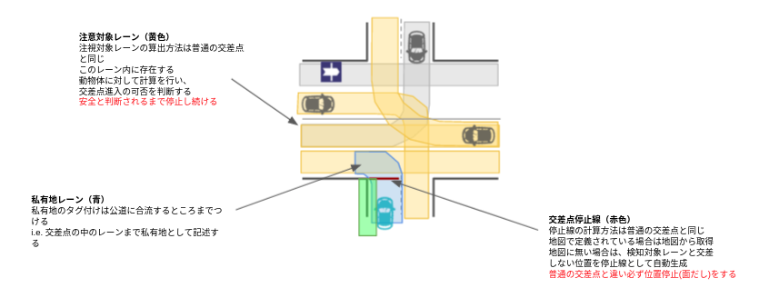

## Merge From Private

### Role

When an ego vehicle enters a public road from a private road (e.g. a parking lot), it needs to face and stop before entering the public road to make sure it is safe.

This module is activated when there is an intersection at the private area from which the vehicle enters the public road. The stop line is generated both when the goal is in the intersection lane and when the path goes beyond the intersection lane. The basic behavior is the same as the intersection module, but the ego vehicle must stop once at the stop line.

### Activation Timing

This module is activated when the following conditions are met:

- ego-lane has a `private` tag
- ego-lane has a conflict with other no-private lanelets

### Module Parameters

| Parameter                                   | Type   | Description                     |
| ------------------------------------------- | ------ | ------------------------------- |
| `merge_from_private_road/stop_duration_sec` | double | [m] time margin to change state |

### Known Issue

If ego vehicle go over the stop line for a certain distance, then ego vehicle will not transit from STOP.
