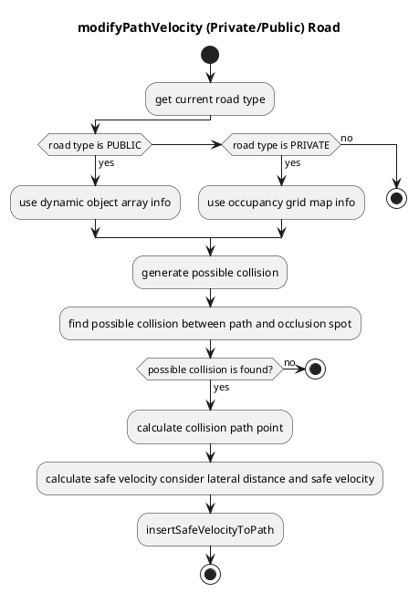

### Occlusion Spot

#### Role

This module plans safe velocity to slow down before reaching collision point that hidden object is darting out from `occlusion spot` where driver can't see clearly because of obstacles.

#### Occlusion Spot Private

This module only works in private road and use occupancy grid map to detect occlusion spots.

#### Occlusion Spot Public

This module only works in public road and use dynamic objects to detect occlusion spots.

Considering all occupancy grid cells inside focus range requires a lot of computation cost, so this module ignores to search farther occlusion spot which is longitudinally or laterally slice once occlusion spot is found.

##### Definition

This module insert safe velocity at collision point and show virtual wall at intersection below.

#### Module Parameters

| Parameter            | Type   | Description                                                               |
| -------------------- | ------ | ------------------------------------------------------------------------- |
| `pedestrian_vel`     | double | [m/s] maximum velocity assumed pedestrian coming out from occlusion point |
| `safety_time_buffer` | double | [m/s] time buffer for the system delay                                    |

| Parameter /threshold    | Type   | Description                                               |
| ----------------------- | ------ | --------------------------------------------------------- |
| `detection_area_length` | double | [m] the length of path to consider occlusion spot         |
| `stuck_vehicle_vel`     | double | [m/s] velocity below this value is assumed to stop        |
| `lateral_distance`      | double | [m] maximum lateral distance to consider hidden collision |

| Parameter /(public or private)\_road | Type   | Description                                                          |
| ------------------------------------ | ------ | -------------------------------------------------------------------- |
| `min_velocity`                       | double | [m/s] minimum velocity to ignore occlusion spot                      |
| `ebs_decel`                          | double | [m/s^2] maximum deceleration to assume for emergency braking system. |
| `pbs_decel`                          | double | [m/s^2] deceleration to assume for predictive braking system         |

| Parameter /sidewalk       | Type   | Description                                                     |
| ------------------------- | ------ | --------------------------------------------------------------- |
| `min_occlusion_spot_size` | double | [m] the length of path to consider occlusion spot               |
| `focus_range`             | double | [m] buffer around the ego path used to build the sidewalk area. |

| Parameter /grid  | Type   | Description                                                     |
| ---------------- | ------ | --------------------------------------------------------------- |
| `free_space_max` | double | [-] maximum value of a free space cell in the occupancy grid    |
| `occupied_min`   | double | [-] buffer around the ego path used to build the sidewalk area. |

#### Flowchart

