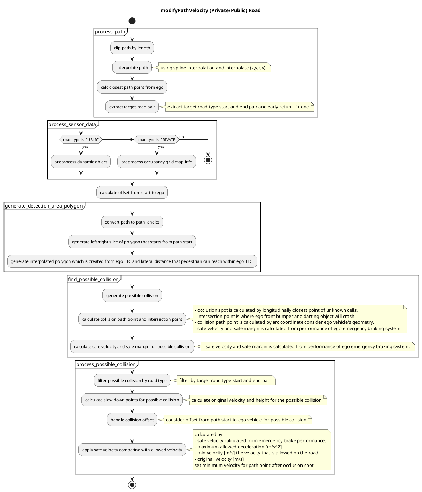
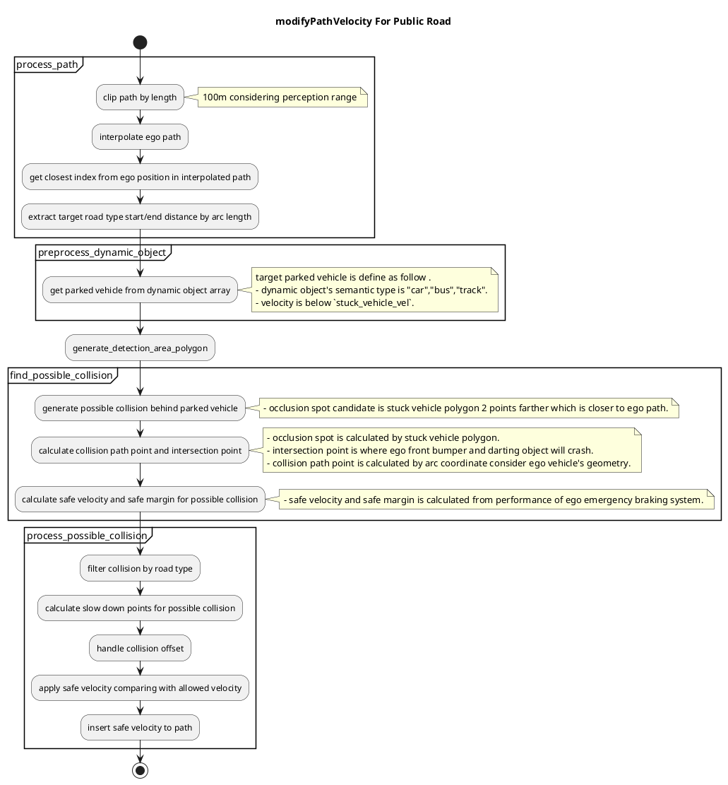
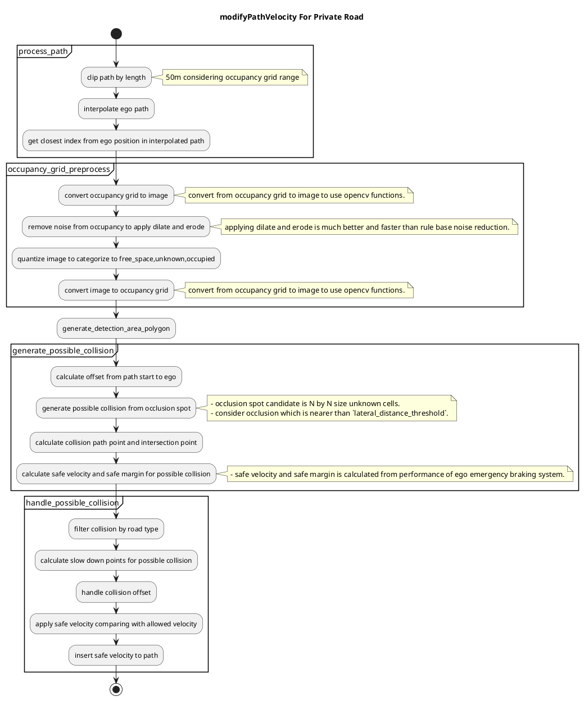

## Occlusion Spot

### Role

This module plans safe velocity to slow down before reaching collision point that hidden object is darting out from `occlusion spot` where driver can't see clearly because of obstacles.

### Activation Timing

This module is activated when the ego-lane has a private/public attribute.

### Limitation

To solve the excessive deceleration due to false positive of the perception, the logic of collision spot is switched according to the road type (public/private). This point has not been discussed in detail and needs to be improved (see the description below).

### Inner-workings / Algorithms

#### Logics Working In Private/Public Load

Deceleration for the occlusion spot works on **different logic** depending on whether the driving road is **public or private**.

There are several types of occlusions, such as "occlusions generated by parked vehicles" and "occlusions caused by obstructions". In situations such as driving on **private roads**, where people jump out of the way frequently, all possible occlusion spots must be taken into account. Therefore, on private roads, the deceleration plan considers all occlusion spots calculated from the **occupancy grid**. On the other hand, while driving at high speeds, it is not reasonable to take into account all occlusion spots (e.g., jumping out from behind a guardrail). Therefore, on **public roads**, the target of the deceleration calculation is currently limited to only the occlusion spots generated by vehicles parked on the road shoulder, which uses the **dynamic object** information.

Note that this decision logic is still under development and needs to be improved.

#### Occlusion Spot Public

This module inserts safe velocity at the collision point estimated from the associated occlusion spot under assumption that the pedestrian possibly coming out of the occlusion spot.

This module consider 3 policies that are very important for risk predicting system for occlusion spot.

1. "Passable" without deceleration (Not implemented yet)
   If ego vehicle speed is high enough to pass the occlusion spot and expected to have no collision with any objects coming out of the occlusion spot, then it's possible for ego vehicle to pass the spot without deceleration.

2. "Predictable" with enough distance to occlusion
   If ego vehicle has enough distance to the occlusion spot, then ego vehicle is going to slow down to the speed that is slow enough to stop before collision with full brake.
   If ego vehicle pass the possible collision point, then ego vehicle is going to drive normally.

3. "Unavoidable" without enough distance to occlusion spot
   This module assumes the occlusion spot is detected stably far from the ego vehicle. Therefore this module can not guarantee the safety behavior for the occlusion spot detected suddenly in front of the ego vehicle. In this case, slow velocity that does not cause the strong deceleration is only applied.

#### Occlusion Spot Private

This module considers any occlusion spot around ego path computed from the occupancy grid.

#### Occlusion Spot Common

##### The Concept of Safe Velocity

Safe velocity is calculated from the below parameters of ego emergency braking system and time to collision.

- jerk limit[m/s^3]
- deceleration limit[m/s2]
- delay response time[s]
- time to collision of pedestrian[s]
  with these parameters we can briefly define safe motion before occlusion spot for ideal environment.
  

##### Safe Behavior After Passing Safe Margin Point

This module defines safe margin to consider ego distance to stop and collision path point geometrically.
While ego is cruising from safe margin to collision path point, ego vehicle keeps the same velocity as occlusion spot safe velocity.

##### Detection area polygon

Occlusion spot computation: searching occlusion spots for all cells in the occupancy_grid inside "max lateral distance" requires a lot of computational cost, so this module use only one most notable occlusion spot for each partition. (currently offset is from baselink to front for safety)
The maximum length of detection area depends on ego current vehicle velocity and acceleration.

#### Module Parameters

| Parameter        | Type   | Description                                                               |
| ---------------- | ------ | ------------------------------------------------------------------------- |
| `pedestrian_vel` | double | [m/s] maximum velocity assumed pedestrian coming out from occlusion point |

| Parameter /threshold    | Type   | Description                                               |
| ----------------------- | ------ | --------------------------------------------------------- |
| `detection_area_length` | double | [m] the length of path to consider occlusion spot         |
| `stuck_vehicle_vel`     | double | [m/s] velocity below this value is assumed to stop        |
| `lateral_distance`      | double | [m] maximum lateral distance to consider hidden collision |

| Parameter /motion     | Type   | Description                                                  |
| --------------------- | ------ | ------------------------------------------------------------ |
| `safety_ratio`        | double | [-] safety ratio for jerk and acceleration                   |
| `max_slow_down_accel` | double | [m/s^2] deceleration to assume for predictive braking system |
| `v_min`               | double | [m/s] minimum velocity not to stop                           |
| `delay_time`          | double | [m/s] time buffer for the system delay                       |
| `safe_margin`         | double | [m] maximum error to stop with emergency braking system.     |

| Parameter /detection_area | Type   | Description                                                           |
| ------------------------- | ------ | --------------------------------------------------------------------- |
| `min_occlusion_spot_size` | double | [m] the length of path to consider occlusion spot                     |
| `slice_length`            | double | [m] the distance of divided detection area                            |
| `max_lateral_distance`    | double | [m] buffer around the ego path used to build the detection_area area. |

| Parameter /grid  | Type   | Description                                                           |
| ---------------- | ------ | --------------------------------------------------------------------- |
| `free_space_max` | double | [-] maximum value of a free space cell in the occupancy grid          |
| `occupied_min`   | double | [-] buffer around the ego path used to build the detection_area area. |

#### Flowchart

##### Rough overview of the whole process

##### Detail process for public road

##### Detail process for private road

